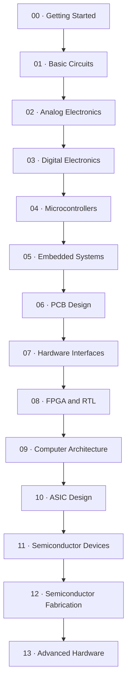

<h1 align="center">🧭 Hardware Atlas</h1>

<em>A practical, ascending path from your first circuit to custom silicon.</em>

  
  
  
  
  
  
  

---

Hardware Atlas is a project-first roadmap for learning hardware by **building, measuring, and debugging real things** not by reading fourteen chapters before touching a breadboard. Every lesson tells you what to buy, what to build, what to measure, and what's likely to go wrong, in that order.

> 💡 **Philosophy in one line:** predict it with math, build it, measure it, and compare the two. If $V = IR$ doesn't match what your multimeter says, the disagreement is the lesson, not the failure.

This is **not a rigid curriculum**. Treat it like [awesome-electronics](https://github.com/kitspace/awesome-electronics): a curated map to dip into, skip what you already know, jump to what interests you, and come back for the rest later.

## 📑 Table of contents

- [🗺️ The roadmap](#️-the-roadmap)
- [📚 All 31 lessons](#-all-31-lessons)
- [🧰 Practical guides](#-practical-guides)
- [⚡ Find something quickly](#-find-something-quickly)
- [🧪 Projects beyond the roadmap](#-projects-beyond-the-roadmap)
- [🎓 Opportunities](#-opportunities)
- [🎓 GATE 2027 alongside the roadmap](#-gate-2027-alongside-the-roadmap)
- [🇮🇳 Sourcing hardware in India](#-sourcing-hardware-in-india)
- [🤝 Contributing](#-contributing)
- [📄 License](#-license)

## How to use this repository

1. Find your current level below.
2. Read the lesson page **before** buying anything; it lists parts, tools, tests, and likely mistakes.
3. Build the smallest version. Measure it. Write down what you actually observed.
4. Follow the lesson's **What to build next** link. Don't skip the measurement step just because the LED lit up.

The `lessons/` directory holds the detailed build pages. `resources/` covers sourcing, tools, safety, simulation, and help. `projects/` documents the format for contributed, non-roadmap builds. `opportunities/` is the maintained index of hardware-adjacent jobs and programs, refreshed automatically by a scheduled GitHub Action.

## 🗺️ The roadmap

This is the **suggested** order, not a locked gate. Each lesson page states its own prerequisites — if you already have them, skip straight to the interesting part.

| Level | Focus | Start here |
|---|---|---|
| 00 | Getting Started | Breadboard layout, multimeter basics, first measurements |
| 01 | Basic Circuits | Resistors, switches, transistors, RC circuits |
| 02 | Analog Electronics | Sensors, amplifiers, op-amps, filters |
| 03 | Digital Electronics | Logic, state, timers, counters |
| 04 | Microcontrollers | GPIO, ADC, PWM, serial devices |
| 05 | Embedded Systems | Sensors, protocols, RTOS, custom peripherals |
| 06 | PCB Design | Schematic to prototype |
| 07 | Hardware Interfaces | Reliable buses and links |
| 08 | FPGA and RTL | Synchronous logic and verification |
| 09 | Computer Architecture | Datapaths, memory, CPUs |
| 10 | ASIC Design | RTL to silicon flow |
| 11 | Semiconductor Devices | Device physics and models |
| 12 | Semiconductor Fabrication | Process flow and yield |
| 13 | Advanced Hardware | Reproduction and open research |

### Which lessons live at which level

| Level | Lessons | Notes |
|---|---|---|
| 00 · Getting Started | none | Breadboard map, multimeter practice, first safe circuit |
| 01 · Basic Circuits | 01–05 | LEDs, dividers, switches, RC circuits |
| 02 · Analog Electronics | 06–09 | Sensors, amplifiers, filters |
| 03 · Digital Electronics | 10–11 | Planned: 555 timer oscillator, simple digital clock |
| 04 · Microcontrollers | 12–15 | GPIO, logging, serial, PWM |
| 05 · Embedded Systems | 16–18 | Planned: custom peripheral, bootloader exercise |
| 06 · PCB Design | 19–20 | Schematic capture to routed two-layer board |
| 07 · Hardware Interfaces | 21–22 | Logic analyzer decode, CAN bus node |
| 08 · FPGA and RTL | 23–25 | RTL, UART FSM, cocotb testbench |
| 09 · Computer Architecture | 26–28 | RISC-V core, memory-mapped GPIO, Zephyr native-sim |
| 10 · ASIC Design | 29–31 | Yosys synthesis, OpenLane flow, Magic DRC/LVS |
| 11 · Semiconductor Devices | none yet | Theory and simulation driven |
| 12 · Semiconductor Fabrication | none yet | Process models and simulation only |
| 13 · Advanced Hardware | none yet | Reproduce research, open hardware |

## 📚 All 31 lessons

Grouped by category for quick scanning. Ordering shows progression, not a prerequisite chain.

### Foundations

| # | Lesson | Path |
|---|---|---|
| 01 | LED Circuit | [`lessons/01-led-circuit/`](lessons/01-led-circuit/README.md) |
| 02 | Voltage Divider | [`lessons/02-voltage-divider/`](lessons/02-voltage-divider/README.md) |
| 03 | Button and LED | [`lessons/03-button-and-led/`](lessons/03-button-and-led/README.md) |
| 04 | Transistor Switch | [`lessons/04-transistor-switch/`](lessons/04-transistor-switch/README.md) |
| 05 | RC Circuit | [`lessons/05-rc-circuit/`](lessons/05-rc-circuit/README.md) |

### Analog

| # | Lesson | Path |
|---|---|---|
| 06 | Light Sensor | [`lessons/06-light-sensor/`](lessons/06-light-sensor/README.md) |
| 07 | Transistor Amplifier | [`lessons/07-transistor-amplifier/`](lessons/07-transistor-amplifier/README.md) |
| 08 | Op-Amp Signal Conditioner | [`lessons/08-op-amp-conditioner/`](lessons/08-op-amp-conditioner/README.md) |
| 09 | Active Filter | [`lessons/09-active-filter/`](lessons/09-active-filter/README.md) |

### Digital

| # | Lesson | Path |
|---|---|---|
| 10 | Logic Gates | [`lessons/10-logic-gates/`](lessons/10-logic-gates/README.md) |
| 11 | Flip-Flop Counter | [`lessons/11-flip-flop-counter/`](lessons/11-flip-flop-counter/README.md) |
| 23 | Combinational Arithmetic RTL | [`lessons/23-combinational-arithmetic-rtl/`](lessons/23-combinational-arithmetic-rtl/README.md) |
| 24 | UART RX FSM | [`lessons/24-uart-rx-fsm/`](lessons/24-uart-rx-fsm/README.md) |

### Microcontrollers and embedded

| # | Lesson | Path |
|---|---|---|
| 12 | GPIO Device | [`lessons/12-gpio-device/`](lessons/12-gpio-device/README.md) |
| 13 | Temperature Logger | [`lessons/13-temperature-logger/`](lessons/13-temperature-logger/README.md) |
| 14 | UART I2C Device | [`lessons/14-uart-i2c-device/`](lessons/14-uart-i2c-device/README.md) |
| 15 | PWM Motor Controller | [`lessons/15-pwm-motor-controller/`](lessons/15-pwm-motor-controller/README.md) |
| 16 | STM32 Peripheral | [`lessons/16-stm32-peripheral/`](lessons/16-stm32-peripheral/README.md) |
| 17 | ESP32 Connected Sensor | [`lessons/17-esp32-connected-sensor/`](lessons/17-esp32-connected-sensor/README.md) |
| 18 | RTOS Sensor Logger | [`lessons/18-rtos-sensor-logger/`](lessons/18-rtos-sensor-logger/README.md) |
| 28 | Zephyr Native-Sim Peripheral | [`lessons/28-zephyr-native-sim-peripheral/`](lessons/28-zephyr-native-sim-peripheral/README.md) |

### PCB and hardware

| # | Lesson | Path |
|---|---|---|
| 19 | KiCad Schematic Capture | [`lessons/19-kicad-schematic-capture/`](lessons/19-kicad-schematic-capture/README.md) |
| 20 | Two-Layer PCB Routing | [`lessons/20-two-layer-pcb-routing/`](lessons/20-two-layer-pcb-routing/README.md) |

### Communication and debug

| # | Lesson | Path |
|---|---|---|
| 21 | Logic Analyzer Decode | [`lessons/21-logic-analyzer-decode/`](lessons/21-logic-analyzer-decode/README.md) |
| 22 | CAN Bus Node | [`lessons/22-can-bus-node/`](lessons/22-can-bus-node/README.md) |

### RTL and verification

| # | Lesson | Path |
|---|---|---|
| 25 | cocotb Python Testbench | [`lessons/25-cocotb-python-testbench/`](lessons/25-cocotb-python-testbench/README.md) |
| 29 | Yosys RTL Synthesis | [`lessons/29-yosys-rtl-synthesis/`](lessons/29-yosys-rtl-synthesis/README.md) |

### Computer architecture

| # | Lesson | Path |
|---|---|---|
| 26 | RISC-V Single-Cycle Datapath | [`lessons/26-riscv-single-cycle-datapath/`](lessons/26-riscv-single-cycle-datapath/README.md) |
| 27 | Memory-Mapped GPIO Peripheral | [`lessons/27-memory-mapped-gpio-peripheral/`](lessons/27-memory-mapped-gpio-peripheral/README.md) |

### Open silicon

| # | Lesson | Path |
|---|---|---|
| 30 | OpenLane Sky130 Flow | [`lessons/30-openlane-sky130-flow/`](lessons/30-openlane-sky130-flow/README.md) |
| 31 | Magic DRC/LVS Verification | [`lessons/31-magic-drc-lvs-verification/`](lessons/31-magic-drc-lvs-verification/README.md) |

## 🧰 Practical guides

| Guide | Use it for |
|---|---|
| [Components](resources/components.md) | Buy parts as projects require them — not a warehouse upfront |
| [Tools](resources/tools.md) | A deliberately ascending workbench, budget to pro |
| [Power and batteries](resources/power-and-batteries.md) | Wiring and cell safety before you plug anything in |
| [Simulation](resources/simulation.md) | Test a complicated idea before ordering hardware |
| [Getting hardware in India](resources/india.md) | Distributors, Delhi NCR sourcing, inspection, returns |
| [Where to get help](resources/help.md) | Choose a community by problem type |
| [GATE alongside the roadmap](resources/gate.md) | Strengthen exam prep with project work, not the other way around |

## ⚡ Find something quickly

| I want to... | Open |
|---|---|
| Start from zero | [Level 00 · Getting Started](#the-roadmap) |
| Learn basic circuits | [Level 01 · Basic Circuits](#the-roadmap) |
| Learn analog electronics | [Level 02 · Analog Electronics](#the-roadmap) |
| Learn digital logic | [Level 03 · Digital Electronics](#the-roadmap) |
| Program a microcontroller | [Level 04 · Microcontrollers](#the-roadmap) |
| Build dependable firmware | [Level 05 · Embedded Systems](#the-roadmap) |
| Design a PCB | [Level 06 · PCB Design](#the-roadmap) |
| Connect devices reliably | [Level 07 · Hardware Interfaces](#the-roadmap) |
| Learn FPGA and RTL | [Level 08 · FPGA and RTL](#the-roadmap) |
| Design a CPU | [Level 09 · Computer Architecture](#the-roadmap) |
| Design an ASIC | [Level 10 · ASIC Design](#the-roadmap) |
| Understand semiconductor devices | [Level 11 · Semiconductor Devices](#the-roadmap) |
| Learn how chips are fabricated | [Level 12 · Semiconductor Fabrication](#the-roadmap) |
| Do research beyond the roadmap | [Level 13 · Advanced Hardware](#the-roadmap) |
| Choose a development board | [Components](resources/components.md) → Level 04 |
| Buy parts in India | [Getting hardware in India](resources/india.md) |
| Choose tools | [Tools](resources/tools.md) |
| Check a circuit before building | [Simulation](resources/simulation.md) |
| Find hardware jobs and programs | [Opportunities](opportunities/README.md) |
| Ask for help | [Where to get help](resources/help.md) |
| Study GATE alongside projects | [GATE guide](resources/gate.md) |
| Add a new project | [Projects](projects/README.md) and [Contributing](CONTRIBUTING.md) |

## 🧪 Projects beyond the roadmap

The 31 lessons above are reference points, not the ceiling. The [`projects/`](projects/README.md) directory documents how to structure and submit a project that doesn't fit the numbered roadmap: a modification, an extension, a teardown, a measurement study, or something built from scratch.

→ [Read the Projects hub](projects/README.md)

## 🎓 Opportunities

Live positions and programs that put the roadmap's skills to work: jobs, internships, hackathons, scholarships, research programs, fellowships, and open source programs tagged with the areas this repo teaches. Open the Apply link to apply on the organization's own page.

<!-- BEGIN_OPPORTUNITIES -->
#### 💼 Jobs (474)

| Role | Organization | Location | Areas | Apply |
|---|---|---|---|---|
| Senior Software Engineer - Control Syst… | Atom Computing | Boulder, CO or Austin, TX | Embedded, FPGA, Hardware | [Apply](https://jobs.lever.co/atomcomputing/34f2f0d8-c8ea-4795-bd0b-143abd13b747) |
| IT & Security Manager | Efficient Computer | Austin, TX, Pittsburgh, PA, San Jose, CA | Hardware, Computer Architecture | [Apply](https://job-boards.greenhouse.io/efficientcomputer/jobs/4393858009) |
| Lead RTL Design Engineer | Efficient Computer | Austin, TX, Pittsburgh, PA, San Jose, CA | Embedded, RTL, ASIC | [Apply](https://job-boards.greenhouse.io/efficientcomputer/jobs/4236891009) |
| Lead STA Engineer | Efficient Computer | San Jose, CA OR Pittsburgh, PA OR Austi… | RTL, ASIC, Electronics | [Apply](https://job-boards.greenhouse.io/efficientcomputer/jobs/4140431009) |
| Physical Design - CAD Lead | Efficient Computer | San Jose, CA OR Pittsburgh, PA OR Austi… | RTL, ASIC, Electronics | [Apply](https://job-boards.greenhouse.io/efficientcomputer/jobs/4140439009) |
| Physical Design - SOC Top Lead | Efficient Computer | San Jose, CA OR Pittsburgh, PA OR Austi… | RTL, ASIC, Electronics | [Apply](https://job-boards.greenhouse.io/efficientcomputer/jobs/4343792009) |
| Senior Digital Verification Engineer | Efficient Computer | San Jose, CA OR Pittsburgh, PA OR Austi… | Embedded, RTL, ASIC | [Apply](https://job-boards.greenhouse.io/efficientcomputer/jobs/4391770009) |
| Senior Product Manager - Software | Efficient Computer | San Jose, CA OR Pittsburgh, PA OR Austi… | Embedded, Semiconductor, Hardware | [Apply](https://job-boards.greenhouse.io/efficientcomputer/jobs/4254539009) |
| Analog IC Design Engineer, High-Speed | Lightmatter | Mountain View, CA | RTL, ASIC, VLSI | [Apply](https://boards.greenhouse.io/lightmatter/jobs/4418732008?gh_jid=4418732008) |
| Analog IC Design Engineer, Tech Lead | Lightmatter | Mountain View, CA; Toronto, ON | RTL, ASIC, VLSI | [Apply](https://boards.greenhouse.io/lightmatter/jobs/4815874008?gh_jid=4815874008) |
| Chip Firmware Validation Engineer | Lightmatter | Mountain View, CA | Embedded, ASIC, Electronics | [Apply](https://boards.greenhouse.io/lightmatter/jobs/5372084008?gh_jid=5372084008) |
| Electrical Design Engineer | Lightmatter | Mountain View, CA | RTL, ASIC, Electronics | [Apply](https://boards.greenhouse.io/lightmatter/jobs/5379870008?gh_jid=5379870008) |
| Electro-Optic Link Hardware Engineer | Lightmatter | Boston, MA; Mountain View, CA | RTL, ASIC, Semiconductor | [Apply](https://boards.greenhouse.io/lightmatter/jobs/5408332008?gh_jid=5408332008) |
| Hardware Systems Technical Lead | Lightmatter | Mountain View, CA | Embedded, RTL, ASIC | [Apply](https://boards.greenhouse.io/lightmatter/jobs/5263818008?gh_jid=5263818008) |
| Lead Package Assembly Integrator | Lightmatter | Mountain View, CA | ASIC, VLSI, Semiconductor | [Apply](https://boards.greenhouse.io/lightmatter/jobs/5378121008?gh_jid=5378121008) |
| Mechanical Design Engineer | Lightmatter | Mountain View, CA | ASIC, Semiconductor, Electronics | [Apply](https://boards.greenhouse.io/lightmatter/jobs/5208190008?gh_jid=5208190008) |
| Package Layout Engineer | Lightmatter | Mountain View, CA | RTL, ASIC, Semiconductor | [Apply](https://boards.greenhouse.io/lightmatter/jobs/5382115008?gh_jid=5382115008) |
| Packaging Architect | Lightmatter | Mountain View, CA | ASIC, VLSI, Semiconductor | [Apply](https://boards.greenhouse.io/lightmatter/jobs/5393055008?gh_jid=5393055008) |
| Photonics Hardware Validation Engineer | Lightmatter | Mountain View, CA | ASIC, Semiconductor, Electronics | [Apply](https://boards.greenhouse.io/lightmatter/jobs/5303113008?gh_jid=5303113008) |
| Power Integrity Engineer | Lightmatter | Mountain View, CA | ASIC, Electronics, Hardware | [Apply](https://boards.greenhouse.io/lightmatter/jobs/5382130008?gh_jid=5382130008) |
| Principal Field Application Engineer | Lightmatter | Mountain View, CA | ASIC, Semiconductor, Electronics | [Apply](https://boards.greenhouse.io/lightmatter/jobs/5386629008?gh_jid=5386629008) |
| Principal Hardware Systems Technical Le… | Lightmatter | Mountain View, CA | Embedded, RTL, ASIC | [Apply](https://boards.greenhouse.io/lightmatter/jobs/5420076008?gh_jid=5420076008) |
| Signal Integrity Engineer | Lightmatter | Mountain View, CA | ASIC, Electronics, Hardware | [Apply](https://boards.greenhouse.io/lightmatter/jobs/5382139008?gh_jid=5382139008) |
| Sr. Staff Physical Design Engineer | Lightmatter | Mountain View, CA | RTL, ASIC, Semiconductor | [Apply](https://boards.greenhouse.io/lightmatter/jobs/5057578008?gh_jid=5057578008) |
| Sr. Staff Physical Design Timing Engine… | Lightmatter | Mountain View, CA | RTL, ASIC, Semiconductor | [Apply](https://boards.greenhouse.io/lightmatter/jobs/4971294008?gh_jid=4971294008) |
| Staff / Sr. Staff Photonics Test Engine… | Lightmatter | Mountain View, CA | ASIC, Semiconductor, Electronics | [Apply](https://boards.greenhouse.io/lightmatter/jobs/5124847008?gh_jid=5124847008) |
| Staff /Sr Staff Laser Module & Systems… | Lightmatter | Mountain View, CA | RTL, ASIC, Semiconductor | [Apply](https://boards.greenhouse.io/lightmatter/jobs/5394690008?gh_jid=5394690008) |
| Staff Embedded Software Engineer | Lightmatter | Boston, MA; Mountain View, CA | Embedded, ASIC, Electronics | [Apply](https://boards.greenhouse.io/lightmatter/jobs/5216367008?gh_jid=5216367008) |
| Staff High-Speed I/O Test Engineer | Lightmatter | Mountain View, CA | ASIC, Semiconductor, Electronics | [Apply](https://boards.greenhouse.io/lightmatter/jobs/5351725008?gh_jid=5351725008) |
| Staff Photonics Design and Layout Engin… | Lightmatter | Boston, MA; Mountain View, CA | RTL, ASIC, VLSI | [Apply](https://boards.greenhouse.io/lightmatter/jobs/5374689008?gh_jid=5374689008) |
| Staff/Sr Staff Electrical Design Engine… | Lightmatter | Mountain View, CA | ASIC, Semiconductor, Electronics | [Apply](https://boards.greenhouse.io/lightmatter/jobs/5286529008?gh_jid=5286529008) |
| Staff/Sr Staff Electro-Optic Link Codes… | Lightmatter | Boston, MA; Mountain View, CA; Toronto,… | RTL, ASIC, Semiconductor | [Apply](https://boards.greenhouse.io/lightmatter/jobs/5398173008?gh_jid=5398173008) |
| System Mechanical Design Engineer | Lightmatter | Mountain View, CA | ASIC, Semiconductor, Electronics | [Apply](https://boards.greenhouse.io/lightmatter/jobs/5367287008?gh_jid=5367287008) |
| Machine Learning Engineer | Sensmore | Berlin Office | Embedded, Hardware, Robotics | [Apply](https://jobs.ashbyhq.com/sensmore/9c0a3ec1-6e79-4b8d-bcec-f685dd4e2090) |
| Robotics Engineer | Sensmore | Berlin Office | Robotics, Edge AI, Automotive | [Apply](https://jobs.ashbyhq.com/sensmore/1ef6f028-67e7-4789-8f14-897b21307cb2) |
| Robotics Engineer - Vision Language Act… | Sensmore | Berlin / Potsdam | Robotics, Automotive | [Apply](https://jobs.ashbyhq.com/sensmore/d7efe7c4-d6b2-47fa-b3c2-4b62984968cc) |
| Director, Aerostructures X-BAT | Shield AI | Seattle, Washington | Robotics | [Apply](https://jobs.lever.co/shieldai/df6dcf11-b405-4df0-ad74-b0bfc752270d) |
| Director, Mission Systems | Shield AI | Washington, DC | Hardware | [Apply](https://jobs.lever.co/shieldai/86435780-023c-4e55-9e82-86f97157aeac) |
| Electrical Engineer I (SEA) (R5046) | Shield AI | Seattle, Washington | EDA | [Apply](https://jobs.lever.co/shieldai/37fa20c1-57dc-4aa1-9515-ecc87f22f31b) |
| Engineer I, Electrical Integration & Te… | Shield AI | Seattle, Washington | Electronics, Hardware, Robotics | [Apply](https://jobs.lever.co/shieldai/49d0cfc6-952f-42b6-ad6c-630597a1780a) |
| Engineer II, Mechanical Test (R4935) | Shield AI | Seattle, Washington | Automotive | [Apply](https://jobs.lever.co/shieldai/1d56e321-727e-4d28-a99c-99c4aec117eb) |
| Engineer II, Structural Analysis (R4952) | Shield AI | Seattle, Washington | Robotics | [Apply](https://jobs.lever.co/shieldai/2158dfae-2453-4278-87de-141500e87ee1) |
| Engineer II, Structural Analysis (R5166) | Shield AI | Seattle, Washington | Robotics | [Apply](https://jobs.lever.co/shieldai/f56dc368-862d-46fe-afe5-899f225547b5) |
| Engineer II, Thermal Design and Analysi… | Shield AI | Seattle, Washington | Electronics | [Apply](https://jobs.lever.co/shieldai/61a20f23-41ca-4cdc-8ee1-419516c56d9b) |
| Field Marketing Manager, India | Shield AI | New Delhi | Computer Architecture | [Apply](https://jobs.lever.co/shieldai/28136dd4-edd8-4da6-a6a1-7ce139654c96) |
| Ground System Software Engineer (R4787) | Shield AI | Seattle, Washington | Robotics, Automotive | [Apply](https://jobs.lever.co/shieldai/fe7531e1-c25e-4e4a-9661-19e3a2ab8e69) |
| Hardware Reliability Lab Engineer II (R… | Shield AI | Seattle, Washington | RTL, Hardware | [Apply](https://jobs.lever.co/shieldai/55e14c5c-ee01-4c42-afc1-3583cf5e93d9) |
| Lead GTM Finance Analyst (R5361) | Shield AI | Washington, DC | Computer Architecture | [Apply](https://jobs.lever.co/shieldai/14e8255e-71ee-4918-bcaf-aad5994fbec4) |
| Lead Mechanical Engineer, Hardware Test… | Shield AI | Seattle, Washington | Semiconductor, Hardware | [Apply](https://jobs.lever.co/shieldai/5a5b5be3-73ed-45a1-b21b-915c0a522ac7) |
| Lead Program Finance Analyst (R5625) | Shield AI | Washington, DC | EDA | [Apply](https://jobs.lever.co/shieldai/bd8a469f-78ae-4a87-a1a8-e4c5c5b12e85) |
| Manager, Propulsion (Engine) (R5086) | Shield AI | Seattle, Washington | Hardware, Automotive | [Apply](https://jobs.lever.co/shieldai/79945606-9d3f-4b46-905b-8cfd362fae3f) |
| Manager, Propulsion (Fuel System) (R508… | Shield AI | Seattle, Washington | Automotive | [Apply](https://jobs.lever.co/shieldai/4eace932-a330-48ea-af58-8b4d6cbed953) |
| Manager, Propulsion (Systems & Componen… | Shield AI | Seattle, Washington | Hardware, Automotive | [Apply](https://jobs.lever.co/shieldai/baa26dc6-33b2-4678-8101-edaada14b880) |
| Manager, Propulsion (Test) (R5089) | Shield AI | Seattle, Washington | Hardware, Automotive | [Apply](https://jobs.lever.co/shieldai/b7059120-c128-4442-9a61-fb6fdecb057e) |
| Mission Systems Software Engineer (R588… | Shield AI | Seattle, Washington | Hardware | [Apply](https://jobs.lever.co/shieldai/a6f44fdc-093f-4db6-9f88-5181ec75f895) |
| Mission Systems Software Engineer - Blu… | Shield AI | Seattle, Washington | Hardware | [Apply](https://jobs.lever.co/shieldai/8ab0ecee-89be-4670-bcc0-055b8afbf254) |
| Power Electronics - Electrical Engineer… | Shield AI | Seattle, Washington | Electronics, EDA, Edge AI | [Apply](https://jobs.lever.co/shieldai/0af53b2b-e1ba-4e73-9e94-a4a689cabab9) |
| Power Electronics - Electrical Engineer… | Shield AI | Seattle, Washington | Electronics, Edge AI, Power Electronics | [Apply](https://jobs.lever.co/shieldai/622ee448-5ab3-4b2e-b20b-1fff995cbc45) |
| Power Electronics - Principal Electrica… | Shield AI | Seattle, Washington | Electronics, Edge AI, Power Electronics | [Apply](https://jobs.lever.co/shieldai/819a0502-f705-4f02-8784-ddfb1ca2b289) |
| Power Electronics - Thermal Engineer I… | Shield AI | Seattle, Washington | Electronics, Power Electronics | [Apply](https://jobs.lever.co/shieldai/f6bbec19-f1c6-44ce-9af5-132b25b6e83a) |
| Power Electronics - Thermal Engineer Se… | Shield AI | Seattle, Washington | Electronics, EDA, Power Electronics | [Apply](https://jobs.lever.co/shieldai/12f75166-fed5-4cc1-863d-c172e8852fb4) |
| Power System - High Voltage Test Specia… | Shield AI | Seattle, Washington | RTL, Power Electronics | [Apply](https://jobs.lever.co/shieldai/c03bc781-786f-4bac-9884-4328b98e2534) |
| Principal Aerostructures Design Enginee… | Shield AI | Seattle, Washington | Hardware | [Apply](https://jobs.lever.co/shieldai/4bc0d612-d68b-43ce-8bb2-19e07d0577c7) |
| Principal Engineer, Fluid & Thermal Sys… | Shield AI | Seattle, Washington | Robotics | [Apply](https://jobs.lever.co/shieldai/3dddb78e-4ade-48e3-95d3-84a160dc421d) |
| Senior Component Engineer | Shield AI | Seattle, Washington | Edge AI | [Apply](https://jobs.lever.co/shieldai/a64042bd-5490-4ef7-9e93-38e1b120b1d3) |
| Senior Electrical Engineer, Hardware Te… | Shield AI | Seattle, Washington | Electronics, Hardware, Robotics | [Apply](https://jobs.lever.co/shieldai/79b8fc20-9321-4858-b68a-bb78f4eb4327) |
| Senior Electrical Engineer, Test Equipm… | Shield AI | Seattle, Washington | Electronics, Hardware, Robotics | [Apply](https://jobs.lever.co/shieldai/cda131b5-3cfb-4d59-8d4b-bfd2f8c9661d) |
| Senior Engineer, Air Vehicle Fluid Syst… | Shield AI | Seattle, Washington | Robotics, Automotive | [Apply](https://jobs.lever.co/shieldai/425c064c-7585-462f-973d-66d685d1ab17) |
| Senior Engineer, Air Vehicle Fluid Syst… | Shield AI | Seattle, Washington | Robotics, Automotive | [Apply](https://jobs.lever.co/shieldai/952faf2d-4730-4d8d-9c1c-6f914ecd1eef) |
| Senior Engineer, Architecture and Infra… | Shield AI | Seattle, Washington | Electronics, Hardware, Robotics | [Apply](https://jobs.lever.co/shieldai/2b247600-44e1-42c9-8c07-a92852f9932e) |
| Senior Engineer, Avionics Thermal Engin… | Shield AI | Seattle, Washington | Electronics | [Apply](https://jobs.lever.co/shieldai/f3214031-7801-46d8-ab08-5e26d40ce5cc) |
| Senior Engineer, Software - Autonomous… | Shield AI | Washington, DC | Hardware | [Apply](https://jobs.lever.co/shieldai/3daaf9c5-164e-4a8e-abc9-b475a38522c3) |
| Senior Lab Technician (R5317) | Shield AI | Seattle, Washington | Semiconductor, Hardware | [Apply](https://jobs.lever.co/shieldai/f1a761df-feeb-4024-b70b-c13d6a6bbfcf) |
| Senior Manager, Avionics Mechanical Eng… | Shield AI | Seattle, Washington | Automotive | [Apply](https://jobs.lever.co/shieldai/6e5d59f1-cd4a-451b-be66-5db9af34df44) |
| Senior Manager, Mechanical Engineering… | Shield AI | Seattle, Washington | Automotive | [Apply](https://jobs.lever.co/shieldai/8c9f2dfa-45e1-441b-8e58-c603f99c5d38) |
| Senior Manager, Mechanisms Engineering… | Shield AI | Seattle, Washington | Automotive | [Apply](https://jobs.lever.co/shieldai/e2937327-d2de-44b5-8975-a3612ef2dfbe) |
| Senior Manager, Perception (R5914) | Shield AI | Washington, DC | Hardware, Robotics, Automotive | [Apply](https://jobs.lever.co/shieldai/501e3703-1a63-4773-b961-6029e5fb71d6) |
| Senior Propulsion Design Engineer (R464… | Shield AI | Seattle, Washington | Hardware, Robotics | [Apply](https://jobs.lever.co/shieldai/183856ee-0477-4038-8068-123a993fb717) |
| Senior Propulsion Technician (R4638) | Shield AI | Seattle, Washington | Robotics | [Apply](https://jobs.lever.co/shieldai/9aeaf414-6a45-4294-a2f0-2d62eaafc9a4) |
| Senior Propulsion Test Engineer (R4640) | Shield AI | Seattle, Washington | Robotics | [Apply](https://jobs.lever.co/shieldai/00e419e1-cd8b-47c3-9c82-40b07d51bf87) |
| Senior Site Infrastructure Engineer (R5… | Shield AI | Seattle, Washington | Hardware | [Apply](https://jobs.lever.co/shieldai/2ec57f9e-fde9-4e70-8cb5-e21eeb15abfb) |
| Senior Software Engineer, Autonomous Pi… | Shield AI | Washington, DC | Hardware, Automotive | [Apply](https://jobs.lever.co/shieldai/84623e5a-e496-4431-bc15-9bb92a080bc4) |
| Senior Software Engineer, Perception (R… | Shield AI | Washington, DC | Computer Architecture, Edge AI | [Apply](https://jobs.lever.co/shieldai/3587ad7b-e57a-4dea-8e14-db52d1808f40) |
| Senior Staff BD Account Executive, Hive… | Shield AI | Washington, DC | Computer Architecture | [Apply](https://jobs.lever.co/shieldai/f14b7309-0674-4f18-8754-86d783049fed) |
| Senior Staff Engineer, Advanced Manufac… | Shield AI | Seattle, Washington | Hardware, EDA | [Apply](https://jobs.lever.co/shieldai/fb943ed0-366b-4330-bde4-4a1e0989e7d1) |
| Senior Staff Engineer, Communications S… | Shield AI | Seattle, Washington | Edge AI | [Apply](https://jobs.lever.co/shieldai/1a2aa3ca-7742-4da0-bc9a-a804a70c8e7a) |
| Senior Staff Engineer, Electrical (R511… | Shield AI | Seattle, Washington | Hardware | [Apply](https://jobs.lever.co/shieldai/e1b78ed6-0a52-49e1-9014-735873dab5a5) |
| Senior Staff Engineer, Electromechanica… | Shield AI | Seattle, Washington | Edge AI | [Apply](https://jobs.lever.co/shieldai/a71ef068-f820-4d86-aec3-956a7982c3b2) |
| Senior Staff Engineer, Mechanical Test… | Shield AI | Seattle, Washington | Hardware | [Apply](https://jobs.lever.co/shieldai/e949e412-bf17-416d-a460-291d20a2c599) |
| Senior Staff Engineer, Mission Architec… | Shield AI | Washington, DC | RTL | [Apply](https://jobs.lever.co/shieldai/f7a74d2f-09c3-4f0a-88a8-bce7bcd97263) |
| Senior Staff Engineer, PCB Design (R575… | Shield AI | Seattle, Washington | Electronics, Hardware | [Apply](https://jobs.lever.co/shieldai/bcfc1625-84df-47a6-8f65-bed69b14418e) |
| Senior Staff Engineer, Software - Auton… | Shield AI | Washington, DC | Hardware | [Apply](https://jobs.lever.co/shieldai/25011392-094f-482c-b007-f307fb8c4f9f) |
| Senior Staff Engineer, Structural Analy… | Shield AI | Seattle, Washington | Robotics, EDA | [Apply](https://jobs.lever.co/shieldai/29d5b3ec-2401-4b2c-9571-5fa6fecb6c0c) |
| Senior Staff Engineer, Structures - Lau… | Shield AI | Seattle, Washington | Automotive | [Apply](https://jobs.lever.co/shieldai/17a5ac9a-3f4c-45c0-91ef-e552afc247a7) |
| Senior Staff Lab Manager (R5090) | Shield AI | Seattle, Washington | Hardware | [Apply](https://jobs.lever.co/shieldai/abb35952-fefb-4893-9241-1bae2303070c) |
| Senior Staff Network Engineer (R4843) | Shield AI | Seattle, Washington | Hardware | [Apply](https://jobs.lever.co/shieldai/b63b3f50-9b7b-42c0-8a9d-f3ba4ed1f099) |
| Sr Manager, Aerostructures Design,  X-B… | Shield AI | Seattle, Washington | Robotics | [Apply](https://jobs.lever.co/shieldai/fbf3de07-810f-4e45-a2b6-4a14eeaa189b) |
| Sr. Staff Thermal Engineer - Aircraft A… | Shield AI | Seattle, Washington | EDA | [Apply](https://jobs.lever.co/shieldai/eef811a9-5e6d-44af-9ee2-f4259de7aeee) |
| Staff Engineer, Advanced Manufacturing… | Shield AI | Seattle, Washington | Hardware, EDA | [Apply](https://jobs.lever.co/shieldai/ca801fe2-4615-4e66-8da2-e325031a316c) |
| Staff Engineer, Autonomy Factory Pipeli… | Shield AI | Washington, DC | EDA, Computer Architecture | [Apply](https://jobs.lever.co/shieldai/d10a2b58-3b67-4423-be05-578040a88342) |
| Staff Engineer, Composite Advance Manuf… | Shield AI | Seattle, Washington | Hardware, EDA | [Apply](https://jobs.lever.co/shieldai/2e2f8207-6ff1-41f8-8745-5623b8799651) |
| Staff Engineer, Cybersecurity Platform… | Shield AI | Seattle, Washington | Hardware | [Apply](https://jobs.lever.co/shieldai/a0d0acf8-5c01-43d0-9bb7-3a0433280302) |
| Staff Engineer, Electrical Integration… | Shield AI | Seattle, Washington | Electronics, Hardware, Robotics | [Apply](https://jobs.lever.co/shieldai/77b463a8-a2bb-423e-952b-c9e63b45b0fa) |
| Staff Engineer, Electrical System Advan… | Shield AI | Seattle, Washington | Hardware | [Apply](https://jobs.lever.co/shieldai/3ec09bbc-6f52-4adc-b79d-61935a72c098) |
| Staff Engineer, Electromechanical Syste… | Shield AI | Seattle, Washington | Robotics | [Apply](https://jobs.lever.co/shieldai/7a1c5185-18de-4b2c-a666-61fa3d3d549e) |
| Staff Engineer, FPGA Design (R5347) | Shield AI | Seattle, Washington | Embedded, FPGA, Hardware | [Apply](https://jobs.lever.co/shieldai/0a7b582c-2b0d-4157-bca8-5c6c66d1d6e4) |
| Staff Engineer, GenAI Tooling & DevEx (… | Shield AI | Washington, DC | Robotics | [Apply](https://jobs.lever.co/shieldai/e74514eb-0abd-4bae-b794-6ad1f9c339b2) |
| Staff Engineer, Ground Vehicle Advance… | Shield AI | Seattle, Washington | Automotive | [Apply](https://jobs.lever.co/shieldai/cdd12416-2a98-4b69-9392-5436df39e832) |
| Staff Engineer, Industrial | Shield AI | Seattle, Washington | Hardware | [Apply](https://jobs.lever.co/shieldai/3fe0919c-fea9-4eb9-b109-e5c152a6b686) |
| Staff Engineer, Integration Advance Man… | Shield AI | Seattle, Washington | Automotive | [Apply](https://jobs.lever.co/shieldai/7ac5b188-a61f-4fc3-9f9c-a52df613fb78) |
| Staff Engineer, Landing Gear Systems (R… | Shield AI | Seattle, Washington | Hardware, Automotive | [Apply](https://jobs.lever.co/shieldai/6a9bcabc-0a1d-4744-85da-43189485c817) |
| Staff Engineer, Manufacturing | Shield AI | Seattle, Washington | Hardware, EDA | [Apply](https://jobs.lever.co/shieldai/b59b2083-4f75-4e61-8bea-b62f1b5da9f0) |
| Staff Engineer, Mechanical - Harness De… | Shield AI | Seattle, Washington | Robotics | [Apply](https://jobs.lever.co/shieldai/abbca258-77dc-4429-87fd-37e6f0b5adf8) |
| Staff Engineer, Mechanical Test (R5475) | Shield AI | Seattle, Washington | Hardware | [Apply](https://jobs.lever.co/shieldai/a9bce6a3-7320-4b2f-a7b4-b93319e97611) |
| Staff Engineer, Propulsion Systems Adva… | Shield AI | Seattle, Washington | Hardware | [Apply](https://jobs.lever.co/shieldai/a7747154-cc00-48e4-b89d-663bbeb4ca47) |
| Staff Engineer, Quality (R4840) | Shield AI | Seattle, Washington | EDA | [Apply](https://jobs.lever.co/shieldai/5b35ee50-4357-42dc-87c8-d507ec6d30a5) |
| Staff Engineer, Reliability Test (R5532) | Shield AI | Seattle, Washington | Hardware, Automotive | [Apply](https://jobs.lever.co/shieldai/b455a69a-a2c7-4f24-aec1-46ca5f5ec0be) |
| Staff Engineer, Safety - X-BAT (R5844) | Shield AI | Seattle, Washington | RTL | [Apply](https://jobs.lever.co/shieldai/0be9a446-6ad7-4587-ae1b-54f1cd0a8d70) |
| Staff Engineer, Software - Autonomous A… | Shield AI | Washington, DC | Hardware | [Apply](https://jobs.lever.co/shieldai/6265ee65-8136-41b5-9279-97f9a4b1d2f6) |
| Staff Engineer, Thermal - Air Vehicle (… | Shield AI | Seattle, Washington | Automotive | [Apply](https://jobs.lever.co/shieldai/bbc92590-2f3e-467c-8ffc-c2efd0e8b98a) |
| Staff Engineer, Tool Design (R4967) | Shield AI | Seattle, Washington | Semiconductor | [Apply](https://jobs.lever.co/shieldai/e3467197-7f30-4a63-afad-51b7794fda2a) |
| Staff Engineer, XBAT DevOps (R4542) | Shield AI | Seattle, Washington | Computer Architecture | [Apply](https://jobs.lever.co/shieldai/2c4f19cf-7a9c-47b7-a16e-2066f17ea998) |
| Staff Engineering Specialist, Avionics… | Shield AI | Seattle, Washington | RTL | [Apply](https://jobs.lever.co/shieldai/a918e92a-3cc6-47df-bc74-4e2781d226d4) |
| Staff Field Solutions Engineer (R5522) | Shield AI | Washington, DC | Robotics | [Apply](https://jobs.lever.co/shieldai/a9afa909-29ae-4f20-a9cc-b0c3cd31e0e2) |
| Staff Field Solutions Engineer (R5523) | Shield AI | Washington, DC | Robotics | [Apply](https://jobs.lever.co/shieldai/8c616778-17fe-48ae-9ab8-548d92872dfb) |
| Staff Hardware Reliability Engineer (R5… | Shield AI | Seattle, Washington | RTL, Hardware | [Apply](https://jobs.lever.co/shieldai/88a4633a-d0b1-4025-b3ff-cb4c976fadc9) |
| Staff Loads Engineer (R4954) | Shield AI | Seattle, Washington | Automotive | [Apply](https://jobs.lever.co/shieldai/18347d18-9816-4085-b0da-5f2ff84687c1) |
| Staff Mechanical Engineer, Systems Inte… | Shield AI | Seattle, Washington | EDA | [Apply](https://jobs.lever.co/shieldai/c65332c3-5cd0-404d-97f9-e3a71895ed91) |
| Staff Software Engineer, Autonomous Pil… | Shield AI | Washington, DC | Hardware, Automotive | [Apply](https://jobs.lever.co/shieldai/9e5b2887-d40e-48ac-bfb3-f08bc9aa8829) |
| Staff Software Engineer, Perception (R5… | Shield AI | Washington, DC | EDA, Computer Architecture, Edge AI | [Apply](https://jobs.lever.co/shieldai/104a9e83-0848-49c7-9d82-64618bbb39cb) |
| Staff Supplier Development Engineer - P… | Shield AI | Seattle, Washington | Hardware | [Apply](https://jobs.lever.co/shieldai/e9f9e015-9f9c-4e38-9fd8-a4e573e0fab5) |
| Staff Technical Program Manager, Propul… | Shield AI | Seattle, Washington | Hardware, Automotive | [Apply](https://jobs.lever.co/shieldai/f6accb83-eb53-449d-802c-09171e216f8a) |
| Staff Technician, Air Vehicle Systems (… | Shield AI | Seattle, Washington | Semiconductor, Automotive | [Apply](https://jobs.lever.co/shieldai/3d6d5608-23f6-4a7c-81ff-f41aaf05eb27) |
| Strategic Sourcing Manager - Mechanical… | Shield AI | Seattle, Washington | Hardware | [Apply](https://jobs.lever.co/shieldai/7533928c-9ed8-4c22-bda4-ba450fd4ce9a) |
| Forward-Deployed Engineer, AI Fabric | Upscale AI | India - Bangalore | Semiconductor | [Apply](https://jobs.lever.co/upscale-ai/d86b9479-5716-4903-a2f4-ab3dd93ff8b3) |
| Principal Engineer - SONiC Manageabilit… | Upscale AI | India - Bangalore | Semiconductor | [Apply](https://jobs.lever.co/upscale-ai/749a5df9-9f1c-4590-b162-7531b5b8ed10) |
| Principal Engineer – Design Verification | Upscale AI | India - Bangalore | RTL, ASIC, Semiconductor | [Apply](https://jobs.lever.co/upscale-ai/33b1a9d4-483b-4f9b-b2cb-9e7bcd2994f6) |
| Principal Engineer – Physical Design | Upscale AI | India - Bangalore | ASIC, Semiconductor | [Apply](https://jobs.lever.co/upscale-ai/8160d67a-c69c-4326-9dff-cb16518e2f3a) |
| Principal Engineer_RTL Design | Upscale AI | India - Bangalore | ASIC, Semiconductor | [Apply](https://jobs.lever.co/upscale-ai/a26a36dd-47fa-47a5-992d-fef262c93756) |
| Principal Engineer_SDK, SAI & Platform… | Upscale AI | India - Bangalore | ASIC, Semiconductor, Electronics | [Apply](https://jobs.lever.co/upscale-ai/b49482aa-a281-414b-bffd-19d04476017e) |
| Senior Manager – Physical Design | Upscale AI | India - Bangalore | RTL, ASIC, VLSI | [Apply](https://jobs.lever.co/upscale-ai/d3366d3e-11e3-4c1a-b615-580d4a9b336b) |
| Senior Principal Engineer - Design Veri… | Upscale AI | India - Bangalore | RTL, ASIC, Semiconductor | [Apply](https://jobs.lever.co/upscale-ai/9149e72d-ee97-498a-a587-3546d293afb2) |
| Audio Systems Engineer, Robot Head | 1X Robotics | San Carlos, CA | Embedded, Electronics, Hardware | [Apply](https://jobs.ashbyhq.com/1x/fbe6dc39-da2e-4d64-a660-f9a38454a93e) |
| Camera Hardware Engineer, Robot Head | 1X Robotics | San Carlos, CA | Electronics, Hardware, Robotics | [Apply](https://jobs.ashbyhq.com/1x/99980e95-f006-46bf-9ecb-d37161291a92) |
| Chemical Engineer, Polymer Coatings | 1X Robotics | San Carlos, CA | RTL, Semiconductor, Hardware | [Apply](https://jobs.ashbyhq.com/1x/fba70e1c-0c7f-482c-97e5-1492df69ef0a) |
| Coatings and Materials Manufacturing En… | 1X Robotics | San Carlos, CA | Hardware, Robotics, Automotive | [Apply](https://jobs.ashbyhq.com/1x/0651ab56-3763-4e51-9bd8-35653ffad62c) |
| Device Management Engineer | 1X Robotics | San Carlos, CA | Hardware, Robotics | [Apply](https://jobs.ashbyhq.com/1x/89fd2de7-8ed7-44ab-86cb-bb8a9d18f410) |
| Electrical Engineer - Actuators and Dri… | 1X Robotics | San Carlos, CA | Embedded, ASIC, Electronics | [Apply](https://jobs.ashbyhq.com/1x/114faf79-0ab9-4810-86f4-3b41c3b1b15a) |
| Electrical Engineer, Hands | 1X Robotics | San Carlos, CA | Embedded, Electronics, Hardware | [Apply](https://jobs.ashbyhq.com/1x/14a3f92c-24ec-4722-8754-d0d1366c9ed7) |
| Electrical Harness Technician | 1X Robotics | San Carlos, CA | ASIC, Semiconductor, Electronics | [Apply](https://jobs.ashbyhq.com/1x/8699d2c0-fac6-45ce-a416-956ca4459034) |
| Engineering Technician | 1X Robotics | Hayward, CA | RTL, ASIC, Electronics | [Apply](https://jobs.ashbyhq.com/1x/70ac9c3a-c166-443c-a26b-4dac210d854f) |
| Facilities Technician | 1X Robotics | San Carlos, CA | ASIC, Hardware, Robotics | [Apply](https://jobs.ashbyhq.com/1x/361a49ab-0350-44c8-88a0-ea6a647d51b5) |
| Global Supply Manager, Motors & Magnets | 1X Robotics | San Carlos, CA | Electronics, Robotics, Automotive | [Apply](https://jobs.ashbyhq.com/1x/fe98f703-bceb-4477-acc3-da7124c3fb87) |
| Hardware Technician - Hands | 1X Robotics | San Carlos, CA | Embedded, Semiconductor, Electronics | [Apply](https://jobs.ashbyhq.com/1x/f439570d-2c83-4d14-9112-1b91972c398f) |
| Manufacturing Electrical Engineer, Hands | 1X Robotics | San Carlos, CA | Electronics, Hardware, Robotics | [Apply](https://jobs.ashbyhq.com/1x/2044dfc6-bf8c-4356-a75d-9579a2c92c64) |
| Manufacturing Electrical Engineer, Join… | 1X Robotics | Hayward, CA | Electronics, Hardware, Robotics | [Apply](https://jobs.ashbyhq.com/1x/178b0d2b-d9bd-4ed0-9e27-27ad4890649f) |
| Manufacturing Engineer | 1X Robotics | San Carlos, CA | Hardware, Robotics | [Apply](https://jobs.ashbyhq.com/1x/e883e6b4-e193-4fd8-ae4f-cdaeb66b29b3) |
| Manufacturing Engineer, Hands | 1X Robotics | San Carlos, CA | Hardware, Robotics | [Apply](https://jobs.ashbyhq.com/1x/e83e6f5b-0c56-4b50-ad2a-5d51a5f3219a) |
| Manufacturing Process Engineer, Hands | 1X Robotics | San Carlos, CA | Hardware, Robotics | [Apply](https://jobs.ashbyhq.com/1x/cfa7388e-0e79-447e-9359-e464ec11c5f8) |
| Mechanical Engineer | 1X Robotics | San Carlos, CA | Electronics, Hardware, Robotics | [Apply](https://jobs.ashbyhq.com/1x/3398e992-b02a-4d39-aabe-f4ac2bb6591d) |
| Mechanical Engineer - Actuators | 1X Robotics | San Carlos, CA | Embedded, RTL, Hardware | [Apply](https://jobs.ashbyhq.com/1x/fe801c98-3344-47d0-8b8f-3958fc453fc0) |
| Motor Test Technician | 1X Robotics | San Carlos, CA | Hardware, Robotics, Automotive | [Apply](https://jobs.ashbyhq.com/1x/1ff4c8fb-c6ce-4e5d-89e7-6d955aaa74e2) |
| NPI Engineering Technician | 1X Robotics | San Carlos, CA | RTL, ASIC, Electronics | [Apply](https://jobs.ashbyhq.com/1x/93402959-5e12-4eca-8db2-989ae469a322) |
| Principal Safety Engineer | 1X Robotics | San Carlos, CA | Hardware, Robotics | [Apply](https://jobs.ashbyhq.com/1x/8ae5f10b-2e8c-4225-8d89-df1476c23b2d) |
| Quality Engineer Manufacturing | 1X Robotics | Hayward, CA | Embedded, Hardware, Robotics | [Apply](https://jobs.ashbyhq.com/1x/1fc6f14f-2ecc-4ceb-a988-5d5f7ca041d1) |
| Quality Engineering Technician | 1X Robotics | San Carlos, CA | Electronics, Hardware, Robotics | [Apply](https://jobs.ashbyhq.com/1x/31aa80a2-f644-4022-9872-b43756aff224) |
| Quality Engineering Technician Polymer | 1X Robotics | San Carlos, CA | Semiconductor, Robotics | [Apply](https://jobs.ashbyhq.com/1x/b6743a34-6533-4e23-ad1a-ea98dd8dcd59) |
| Robot Assembly Technician | 1X Robotics | Hayward, CA | ASIC, Robotics | [Apply](https://jobs.ashbyhq.com/1x/d6f54e78-6ae0-47fd-bb2a-f93484d21a2c) |
| Robot Service Technician | 1X Robotics | San Carlos, CA | Embedded, Electronics, Hardware | [Apply](https://jobs.ashbyhq.com/1x/aea0150b-5690-422a-b43a-773c706305ff) |
| Senior Build Engineer, Automated Build… | 1X Robotics | San Carlos, CA | Embedded, Robotics, Computer Architecture | [Apply](https://jobs.ashbyhq.com/1x/06f50940-79db-4505-8bcd-ddc2b739fb81) |
| Senior Detection and Response Engineer | 1X Robotics | San Carlos, CA | Hardware, Robotics, Computer Architecture | [Apply](https://jobs.ashbyhq.com/1x/655ea851-ff54-4da3-a912-ff471c5a1907) |
| Senior Frontend Engineer | 1X Robotics | San Carlos, CA | Robotics | [Apply](https://jobs.ashbyhq.com/1x/3a11df7b-b5d6-4fc1-a8f9-a6c7d042b4d1) |
| Senior Harness Manufacturing Engineer | 1X Robotics | San Carlos, CA | Robotics, Automotive | [Apply](https://jobs.ashbyhq.com/1x/873f836f-a4b6-4ef8-9500-b960cb1198f9) |
| Senior Manager - Material Sciences | 1X Robotics | San Carlos, CA | Embedded, Electronics, Hardware | [Apply](https://jobs.ashbyhq.com/1x/c6e9c6b1-47e5-4203-abc1-49e108cefc17) |
| Senior Technical Recruiter - Mechanical | 1X Robotics | San Carlos, CA | Semiconductor, Hardware, Robotics | [Apply](https://jobs.ashbyhq.com/1x/fe2aaee8-a1d7-48a9-9344-fa593f56d7ac) |
| Senior Test Development Engineer | 1X Robotics | San Carlos, CA | Embedded, Electronics, Hardware | [Apply](https://jobs.ashbyhq.com/1x/1547c5c1-fbe3-4c0d-b6c4-4366c5c606c7) |
| Senior to Staff Gameplay Engineer | 1X Robotics | San Carlos, CA | Robotics | [Apply](https://jobs.ashbyhq.com/1x/59edfa1d-e1e0-468b-9995-9d863d08def1) |
| Senior to Staff Mechanical Engineer | 1X Robotics | San Carlos, CA | Embedded, Electronics, Hardware | [Apply](https://jobs.ashbyhq.com/1x/d6c59043-7a78-48ba-8f35-6d47b987a871) |
| Senior/Staff Loads & Dynamics Engineer | 1X Robotics | San Carlos, CA | Hardware, Robotics, Automotive | [Apply](https://jobs.ashbyhq.com/1x/fb9e6beb-e4b8-4b1a-bc0a-beab5b9f86b8) |
| Software Engineer - Core | 1X Robotics | San Carlos, CA | Embedded, Hardware, Robotics | [Apply](https://jobs.ashbyhq.com/1x/664d3be4-5805-4062-b191-aa9b80f914af) |
| Software Engineer - Robotic Controls | 1X Robotics | San Carlos, CA | Embedded, Hardware, Robotics | [Apply](https://jobs.ashbyhq.com/1x/a02d07dc-851d-4246-bc1d-1f50412015c0) |
| Software Engineer - Simulation | 1X Robotics | San Carlos, CA | Hardware, Robotics, Computer Architecture | [Apply](https://jobs.ashbyhq.com/1x/bd7452e9-1f5a-4e49-b468-2ad98c20e2c3) |
| Sourcing Manager- Facilities and Constr… | 1X Robotics | San Carlos, CA | Robotics, Automotive | [Apply](https://jobs.ashbyhq.com/1x/017c1181-959d-4a76-998b-c0d220b94a4f) |
| Sr Materials and Battery Compliance Eng… | 1X Robotics | San Carlos, CA | Hardware, Robotics | [Apply](https://jobs.ashbyhq.com/1x/cecfbda7-3180-49eb-8df0-d08348714e3a) |
| Staff Embedded Firmware Engineer - NEO | 1X Robotics | San Carlos, CA | Embedded, Electronics, Hardware | [Apply](https://jobs.ashbyhq.com/1x/ea9614dd-94e8-4a3a-a714-645957a298d0) |
| Staff Manufacturing Recruiter | 1X Robotics | San Carlos, CA | Semiconductor, Hardware, Robotics | [Apply](https://jobs.ashbyhq.com/1x/2aff9a16-cc9b-4674-b9c8-d6caab2fdceb) |
| Staff Mechanical Engineer, Robot Head | 1X Robotics | San Carlos, CA | Electronics, Hardware, Robotics | [Apply](https://jobs.ashbyhq.com/1x/fda0ba2e-d1eb-4a21-a666-7e7ee6e20763) |
| Test & Validation Engineer - Motors and… | 1X Robotics | San Carlos, CA | Embedded, Electronics, Hardware | [Apply](https://jobs.ashbyhq.com/1x/0eb854f8-97f7-43a0-8818-f138178586f8) |
| Test Engineer | 1X Robotics | Hayward, CA | Embedded, Electronics, Hardware | [Apply](https://jobs.ashbyhq.com/1x/1932c050-c00f-434a-85a4-3076ec613ac4) |
| Test Technician | 1X Robotics | San Carlos, CA | Hardware, Robotics, Automotive | [Apply](https://jobs.ashbyhq.com/1x/83b69d9f-d72c-4509-a438-19c0c16b672e) |
| Test Technician Battery | 1X Robotics | San Carlos, CA | Hardware, Robotics | [Apply](https://jobs.ashbyhq.com/1x/da83e82b-3338-464d-8be0-3acb89751eda) |
| Laser Engineer | Atom Computing | Boulder, CO | Hardware | [Apply](https://jobs.lever.co/atomcomputing/3600b9c7-b55a-4619-9ab0-17c4769a7e2b) |
| Optical Physicist | Atom Computing | Boulder, CO | Electronics | [Apply](https://jobs.lever.co/atomcomputing/c3d8aec8-c706-4247-92d0-59af739c90aa) |
| Platform Engineer | Atom Computing | Boulder, CO | Hardware | [Apply](https://jobs.lever.co/atomcomputing/5cdef020-5484-4360-8dcc-d145eccf9493) |
| Principal Hardware Engineer: High Speed… | Atom Computing | Boulder, CO | Hardware | [Apply](https://jobs.lever.co/atomcomputing/a3db33d7-2826-4ee0-98cd-f0e6d2d28740) |
| Principal Platform Engineer | Atom Computing | Boulder, CO | Hardware | [Apply](https://jobs.lever.co/atomcomputing/5ecc80bd-f670-4b1a-b74d-ea3cc99fe8f4) |
| Principal Quantum Engineer | Atom Computing | Boulder, CO | RTL | [Apply](https://jobs.lever.co/atomcomputing/96fa8da1-2ce9-45cb-93b0-623f7a4de297) |
| Principal Software Engineer | Atom Computing | Boulder, CO | Hardware | [Apply](https://jobs.lever.co/atomcomputing/f5351968-3b6b-45be-a977-50a2fee553e3) |
| Principal Software Engineer - Control S… | Atom Computing | Boulder, CO | Embedded, FPGA, Hardware | [Apply](https://jobs.lever.co/atomcomputing/41cc7c93-b291-4c2a-a69e-caf14390dd6b) |
| Principal Technical Program Manager | Atom Computing | Berkeley, CA | Hardware | [Apply](https://jobs.lever.co/atomcomputing/31c8917b-0346-4288-9349-96e41313eb6c) |
| Quantum Engineer | Atom Computing | Boulder, CO | RTL | [Apply](https://jobs.lever.co/atomcomputing/4b31b2fc-324e-420d-9a5f-509be2c19393) |
| Senior ASIC Design Engineer | Atom Computing | Boulder, CO | ASIC, Semiconductor, Hardware | [Apply](https://jobs.lever.co/atomcomputing/0d0c360c-7a80-4e6a-9866-01ce7ffc5490) |
| Senior Embedded Platform Engineer | Atom Computing | Boulder, Colorado | Embedded, Robotics | [Apply](https://jobs.lever.co/atomcomputing/051cb474-2247-4a27-8de0-bb30be605925) |
| Senior Quantum Engineer | Atom Computing | Boulder, CO | RTL | [Apply](https://jobs.lever.co/atomcomputing/b4443155-57fc-4adc-8840-4af007c1e1ee) |
| Senior Software Engineer | Atom Computing | Boulder, CO | Hardware | [Apply](https://jobs.lever.co/atomcomputing/f4f1fce0-86c3-4131-9d02-0d93c12dd1da) |
| Senior Systems Engineer | Atom Computing | Boulder, CO | Hardware | [Apply](https://jobs.lever.co/atomcomputing/3006329c-120d-40c6-8435-3190bee2d5ee) |
| Systems Engineer | Atom Computing | Boulder, CO | RTL | [Apply](https://jobs.lever.co/atomcomputing/22f24648-854d-4dad-b6bc-194969c7e8ac) |
| Director Technical Program Manager, Sof… | Collaborative Robotics | Santa Clara | Hardware, Robotics | [Apply](https://jobs.ashbyhq.com/cobot/b1b7962e-5a31-4b30-a6bb-04ffb8a466cc) |
| Robotics Assistant | Collaborative Robotics | Santa Clara | Hardware, Robotics | [Apply](https://jobs.ashbyhq.com/cobot/76f37dcd-57f6-4ed1-a487-83a9bb7749ab) |
| Robotics Assistant | Collaborative Robotics | Seattle | Robotics | [Apply](https://jobs.ashbyhq.com/cobot/80ce0222-0e42-4479-8e49-a484cc6126a5) |
| Senior Technical Program Manager, Softw… | Collaborative Robotics | Santa Clara | Hardware, Robotics | [Apply](https://jobs.ashbyhq.com/cobot/26165372-803f-432d-8183-81bcea4cb34b) |
| Staff Embedded Software Engineer, Robot… | Collaborative Robotics | Santa Clara | Embedded, RTL, Hardware | [Apply](https://jobs.ashbyhq.com/cobot/c84a7997-5705-490e-9271-10b40e821b82) |
| Staff Manufacturing Engineer, Productio… | Collaborative Robotics | Santa Clara | ASIC, Electronics, Hardware | [Apply](https://jobs.ashbyhq.com/cobot/c54fa946-dd6b-4f0a-8957-4370b7d62e25) |
| Staff Technical Program Manager, Softwa… | Collaborative Robotics | Santa Clara | Hardware, Robotics | [Apply](https://jobs.ashbyhq.com/cobot/c1062b4f-7832-450c-a2b2-4b0fd1b97ee1) |
| Wire Harness Mechanical Engineer | Collaborative Robotics | Santa Clara | Electronics, Hardware, Robotics | [Apply](https://jobs.ashbyhq.com/cobot/17afe7a0-f1ad-48d1-9ce3-fbdf25224bde) |
| Head of Software Engineering | E-Space | Saratoga, CA | Embedded, Automotive | [Apply](https://jobs.lever.co/espace/d738d193-799d-4b18-a1bf-e6ad9cabd96a) |
| Senior Embedded Software Engineer - Fli… | E-Space | Saratoga, CA | Embedded, Low-level Systems | [Apply](https://jobs.lever.co/espace/7980aa6b-8b0d-48b2-aff6-a3260bcb3109) |
| Embedded Hardware Engineer ( PCB) | Efficient Computer | San Jose, CA OR Pittsburgh, PA | Embedded, FPGA, RTL | [Apply](https://job-boards.greenhouse.io/efficientcomputer/jobs/4286610009) |
| Hardware Test Infrastructure Engineer | Efficient Computer | San Jose, CA | Embedded, FPGA, Hardware | [Apply](https://job-boards.greenhouse.io/efficientcomputer/jobs/4251212009) |
| Performance Library Engineer | Efficient Computer | San Jose, CA OR Pittsburgh, PA | Embedded, Semiconductor, Hardware | [Apply](https://job-boards.greenhouse.io/efficientcomputer/jobs/4303170009) |
| Senior Compiler Engineer | Efficient Computer | San Jose, CA OR Pittsburgh, PA OR San F… | Embedded, FPGA, RTL | [Apply](https://job-boards.greenhouse.io/efficientcomputer/jobs/4279713009) |
| Senior Embedded Engineer | Efficient Computer | San Jose, CA OR Pittsburgh, PA | Embedded, RTL, Semiconductor | [Apply](https://job-boards.greenhouse.io/efficientcomputer/jobs/4391747009) |
| Behavior and Motion Planning Engineer | Humble Robotics | San Francisco | Robotics | [Apply](https://jobs.lever.co/humble-robotics/2ec28360-6769-4f02-b320-2a26ceb92ab1) |
| Calibration and Localization Engineer | Humble Robotics | San Francisco | Robotics | [Apply](https://jobs.lever.co/humble-robotics/4b87e4bb-255c-4df6-89bb-0283f48b292c) |
| Data Engineer | Humble Robotics | San Francisco | Robotics | [Apply](https://jobs.lever.co/humble-robotics/f187c481-ece9-4ea5-8cce-3bcd96f7001e) |
| Electrical Engineer | Humble Robotics | San Francisco | Hardware, Robotics | [Apply](https://jobs.lever.co/humble-robotics/6f8240e8-fa00-4efa-9b22-7dd922d05cec) |
| Humble Robotics - Marketing Lead | Humble Robotics | San Francisco | Robotics | [Apply](https://jobs.lever.co/humble-robotics/a65ce4c7-408d-402b-ad94-107a08926e7d) |
| Infrastructure Engineer, Vehicle Platfo… | Humble Robotics | San Francisco | Robotics, Automotive | [Apply](https://jobs.lever.co/humble-robotics/6816035e-7741-426d-a4d0-e8354585354d) |
| Mechanical Engineer | Humble Robotics | San Francisco | Hardware, Robotics, Automotive | [Apply](https://jobs.lever.co/humble-robotics/d5dd58ed-fdb1-4018-92cc-2c8bd6709042) |
| ML Engineer, Foundation Models | Humble Robotics | San Francisco | Robotics | [Apply](https://jobs.lever.co/humble-robotics/35986102-b37f-411f-baf4-3e78f3b063e7) |
| ML Infra Engineer | Humble Robotics | San Francisco | Robotics | [Apply](https://jobs.lever.co/humble-robotics/d7e0537c-1576-4156-9e72-78ca218df6bc) |
| ML Software Engineer | Humble Robotics | San Francisco | Automotive | [Apply](https://jobs.lever.co/humble-robotics/3aeb08a7-2164-464d-b3da-e84fa4463808) |
| Onboard AV Software Engineer | Humble Robotics | San Francisco | Robotics | [Apply](https://jobs.lever.co/humble-robotics/23b79a70-0ace-49a7-baff-73ac884bfd9c) |
| Prototype Wire Harness Technician | Humble Robotics | San Francisco | Semiconductor, Hardware, Robotics | [Apply](https://jobs.lever.co/humble-robotics/d8e20b86-36f7-4bdd-a746-d9b6c7fda4a2) |
| Senior Embedded Engineer | Humble Robotics | San Francisco | Embedded, Hardware, Robotics | [Apply](https://jobs.lever.co/humble-robotics/af984303-2ef8-4d99-9cc0-f9312fc5bd67) |
| Senior Powertrain Engineer | Humble Robotics | San Francisco | Hardware, Robotics | [Apply](https://jobs.lever.co/humble-robotics/02c3c6fb-a3cd-4a9f-a1ec-b8a64be9b95a) |
| Senior Product Manager | Humble Robotics | San Francisco | Hardware | [Apply](https://jobs.lever.co/humble-robotics/ed52979b-f493-498d-a7fc-d1d6b10023cf) |
| Senior Sensor Engineer | Humble Robotics | San Francisco | Hardware, Robotics, Automotive | [Apply](https://jobs.lever.co/humble-robotics/9e0e26ac-1902-4fc1-8f62-49cb741a819f) |
| Senior/Staff Hardware Systems Engineer | Humble Robotics | San Francisco | Hardware, Robotics, Automotive | [Apply](https://jobs.lever.co/humble-robotics/fa30b90e-d652-4bc3-9835-34ad7ce5b886) |
| Senior/Staff Hardware Validation Engine… | Humble Robotics | San Francisco | RTL, Hardware, Robotics | [Apply](https://jobs.lever.co/humble-robotics/9aaadbdb-388a-4b6c-acab-d61af563c824) |
| Simulation Engineer | Humble Robotics | San Francisco | Robotics | [Apply](https://jobs.lever.co/humble-robotics/068bf880-f307-4da2-9e1a-6a07a30bb095) |
| Software Engineer, Autonomous Systems | Humble Robotics | San Francisco | Robotics | [Apply](https://jobs.lever.co/humble-robotics/910e6e24-e644-42d8-aa08-18e87d535cbd) |
| Supply Chain Manager | Humble Robotics | San Francisco | Hardware, Robotics | [Apply](https://jobs.lever.co/humble-robotics/27d7bcc7-1fee-4bd4-ab78-fc1bf9154b35) |
| Vehicle Systems Engineer | Humble Robotics | San Francisco | Hardware, Robotics, Automotive | [Apply](https://jobs.lever.co/humble-robotics/cbde53eb-892d-4c8b-aeb7-893e10ef5c5d) |
| Analog IC Design Engineer, High-Speed | Lightmatter | Toronto, ON | RTL, ASIC, VLSI | [Apply](https://boards.greenhouse.io/lightmatter/jobs/4418733008?gh_jid=4418733008) |
| Sr. Staff Physical Design Engineer | Lightmatter | Boston, MA | RTL, ASIC, Semiconductor | [Apply](https://boards.greenhouse.io/lightmatter/jobs/5370436008?gh_jid=5370436008) |
| Sr. Staff Physical Design Engineer | Lightmatter | Toronto, ON | RTL, ASIC, Semiconductor | [Apply](https://boards.greenhouse.io/lightmatter/jobs/5370437008?gh_jid=5370437008) |
| Sr. Staff Physical Design Timing Engine… | Lightmatter | Toronto, ON | RTL, ASIC, Semiconductor | [Apply](https://boards.greenhouse.io/lightmatter/jobs/4971293008?gh_jid=4971293008) |
| Sr. Staff Physical Design Timing Engine… | Lightmatter | Boston, MA | RTL, ASIC, Semiconductor | [Apply](https://boards.greenhouse.io/lightmatter/jobs/5099034008?gh_jid=5099034008) |
| Flight Analyst | Long Wall | Long Beach, California | Automotive | [Apply](https://jobs.lever.co/longwall/95998c9e-a4b8-4b4a-bdf3-431fa9a75964) |
| Fluid Components Engineer | Long Wall | Long Beach, California | Hardware | [Apply](https://jobs.lever.co/longwall/ff5441b7-2852-4c2b-b19f-f1b8a29801e3) |
| FPGA Design Engineer | Long Wall | Long Beach, California | FPGA | [Apply](https://jobs.lever.co/longwall/f9a5386d-550b-43b5-9997-c71cf5e72186) |
| Head of GNC | Long Wall | Long Beach, California | Automotive | [Apply](https://jobs.lever.co/longwall/e5ee29ae-71a4-46ce-9a92-391fbee4c632) |
| Head of Vehicle Engineering | Long Wall | Long Beach, California | Hardware, Automotive | [Apply](https://jobs.lever.co/longwall/f8c3235c-a2be-4363-9922-ab85942b2b12) |
| Lead Test Engineer | Long Wall | Long Beach, California | Hardware, EDA | [Apply](https://jobs.lever.co/longwall/479f3743-1cf1-47c5-9550-ef97f23c1d30) |
| Manager, Cost Accounting | Long Wall | Long Beach, California | Automotive | [Apply](https://jobs.lever.co/longwall/56a5d8f9-b9f1-4ed8-80d6-acaf243e960d) |
| Principal Power Electronics Engineer | Long Wall | Long Beach, California | Electronics, Power Electronics | [Apply](https://jobs.lever.co/longwall/fb9a82f9-5f34-4fd9-836c-d9d6e9787ead) |
| Sr. Avionics Development Technician | Long Wall | El Segundo, California | Hardware, Automotive | [Apply](https://jobs.lever.co/longwall/06a99c96-b047-446e-b342-2fce1b57a0ed) |
| Sr. Electronics Design Engineer | Long Wall | Long Beach, California | Electronics | [Apply](https://jobs.lever.co/longwall/9ca6014e-13f8-433b-aab1-1ef595e72a6d) |
| Sr. Hardware Development Engineer | Long Wall | Long Beach, California | Hardware | [Apply](https://jobs.lever.co/longwall/be039ee1-8e29-4880-9bf8-6ff3d937ec40) |
| Test & Operations Engineer | Long Wall | Long Beach, California | Hardware, Automotive | [Apply](https://jobs.lever.co/longwall/8123d49f-b31b-4121-93f1-4c6f4e55aacc) |
| Director, Design Verification | Samsung Semiconductor | San Jose, California, United States | RTL, ASIC, Semiconductor | [Apply](https://job-boards.greenhouse.io/samsungsemiconductor/jobs/7727395003) |
| Director, Memory Sales - SMB | Samsung Semiconductor | San Jose, California, United States | ASIC, Semiconductor, Edge AI | [Apply](https://job-boards.greenhouse.io/samsungsemiconductor/jobs/7746401003) |
| Manager, Learning & Development - Busin… | Samsung Semiconductor | San Jose, California, United States | ASIC, Semiconductor, Edge AI | [Apply](https://job-boards.greenhouse.io/samsungsemiconductor/jobs/7909225003) |
| Principal Engineer, RFIC | Samsung Semiconductor | San Jose, California, United States | RTL, ASIC, Semiconductor | [Apply](https://job-boards.greenhouse.io/samsungsemiconductor/jobs/7636381003) |
| Principal Engineer, Serdes Analog Design | Samsung Semiconductor | San Jose, California, United States | ASIC, Semiconductor, Electronics | [Apply](https://job-boards.greenhouse.io/samsungsemiconductor/jobs/7591821003) |
| Principal Engineer, SOC Design | Samsung Semiconductor | San Jose, California, United States | RTL, ASIC, Semiconductor | [Apply](https://job-boards.greenhouse.io/samsungsemiconductor/jobs/7984993003) |
| Principal Engineer, SOC Integration | Samsung Semiconductor | San Jose, California, United States | RTL, ASIC, Semiconductor | [Apply](https://job-boards.greenhouse.io/samsungsemiconductor/jobs/7813366003) |
| Product Marketing Manager | Samsung Semiconductor | San Jose, California, United States | ASIC, Semiconductor, Edge AI | [Apply](https://job-boards.greenhouse.io/samsungsemiconductor/jobs/7827071003) |
| Sales Specialist | Samsung Semiconductor | San Jose, California, United States | ASIC, Semiconductor, Edge AI | [Apply](https://job-boards.greenhouse.io/samsungsemiconductor/jobs/7978928003) |
| Senior Emulation Engineer | Samsung Semiconductor | San Jose, California, United States | Embedded, FPGA, RTL | [Apply](https://job-boards.greenhouse.io/samsungsemiconductor/jobs/7894223003) |
| Senior Engineer - Compiler | Samsung Semiconductor | San Jose, California, United States | ASIC, Semiconductor, Hardware | [Apply](https://job-boards.greenhouse.io/samsungsemiconductor/jobs/7981940003) |
| Senior Engineer, OPC (Optical Proximity… | Samsung Semiconductor | San Jose, California, United States | ASIC, Semiconductor, Edge AI | [Apply](https://job-boards.greenhouse.io/samsungsemiconductor/jobs/7987124003) |
| Senior HSIO Digital Design Engineer | Samsung Semiconductor | San Jose, California, United States | RTL, ASIC, Semiconductor | [Apply](https://job-boards.greenhouse.io/samsungsemiconductor/jobs/7822974003) |
| Senior Manager, Market Intelligence | Samsung Semiconductor | San Jose, California, United States | ASIC, Semiconductor, EDA | [Apply](https://job-boards.greenhouse.io/samsungsemiconductor/jobs/7777779003) |
| Senior Performance Engineer | Samsung Semiconductor | San Jose, California, United States | ASIC, Semiconductor, Hardware | [Apply](https://job-boards.greenhouse.io/samsungsemiconductor/jobs/7780284003) |
| Senior Physical Design Engineer | Samsung Semiconductor | San Jose, California, United States | RTL, ASIC, VLSI | [Apply](https://job-boards.greenhouse.io/samsungsemiconductor/jobs/7894226003) |
| Senior RTL Engineer, Memory Centric Com… | Samsung Semiconductor | San Jose, California, United States | RTL, ASIC, Semiconductor | [Apply](https://job-boards.greenhouse.io/samsungsemiconductor/jobs/7894229003) |
| Senior Staff Engineer, Design Verificat… | Samsung Semiconductor | San Jose, California, United States | FPGA, RTL, ASIC | [Apply](https://job-boards.greenhouse.io/samsungsemiconductor/jobs/7676392003) |
| Senior Staff Engineer, HPC & EDA Design… | Samsung Semiconductor | San Jose, California, United States | ASIC, Semiconductor, EDA | [Apply](https://job-boards.greenhouse.io/samsungsemiconductor/jobs/7824908003) |
| Sr Product Marketing Manager, DRAM | Samsung Semiconductor | San Jose, California, United States | ASIC, Semiconductor, Hardware | [Apply](https://job-boards.greenhouse.io/samsungsemiconductor/jobs/7982359003) |
| Staff Engineer, Compiler | Samsung Semiconductor | San Jose, California, United States | ASIC, Semiconductor, Hardware | [Apply](https://job-boards.greenhouse.io/samsungsemiconductor/jobs/7748804003) |
| Staff Engineer, Connectivity Software,… | Samsung Semiconductor | San Jose, California, United States | Embedded, ASIC, Semiconductor | [Apply](https://job-boards.greenhouse.io/samsungsemiconductor/jobs/7776472003) |
| Staff Engineer, Firmware Test | Samsung Semiconductor | San Jose, California, United States | Embedded, ASIC, Semiconductor | [Apply](https://job-boards.greenhouse.io/samsungsemiconductor/jobs/7982016003) |
| Staff Engineer, High-Speed I/O Analog-M… | Samsung Semiconductor | San Jose, California, United States | RTL, ASIC, Semiconductor | [Apply](https://job-boards.greenhouse.io/samsungsemiconductor/jobs/7815763003) |
| Staff Engineer, Memory Systems Architec… | Samsung Semiconductor | San Jose, California, United States | RTL, ASIC, Semiconductor | [Apply](https://job-boards.greenhouse.io/samsungsemiconductor/jobs/7664496003) |
| Staff Engineer, Packaging Mechanical Si… | Samsung Semiconductor | San Jose, California, United States | ASIC, Semiconductor, DSP | [Apply](https://job-boards.greenhouse.io/samsungsemiconductor/jobs/7803259003) |
| Staff Engineer, Serdes Analog Design | Samsung Semiconductor | San Jose, California, United States | ASIC, Semiconductor, Electronics | [Apply](https://job-boards.greenhouse.io/samsungsemiconductor/jobs/7563664003) |
| Staff Engineer, SRAM Circuit Design | Samsung Semiconductor | San Jose, California, United States | RTL, ASIC, Semiconductor | [Apply](https://job-boards.greenhouse.io/samsungsemiconductor/jobs/7784336003) |
| Staff Engineer, Workbench Platform | Samsung Semiconductor | San Jose, California, United States | ASIC, Semiconductor, Hardware | [Apply](https://job-boards.greenhouse.io/samsungsemiconductor/jobs/7796354003) |
| Staff Software Engineer, Simulator Deve… | Samsung Semiconductor | San Jose, California, United States | ASIC, Semiconductor, Computer Architecture | [Apply](https://job-boards.greenhouse.io/samsungsemiconductor/jobs/7784183003) |
| Electronics / Embedded Robotics Engineer | Sensmore | Potsdam Office | Embedded, Electronics, Hardware | [Apply](https://jobs.ashbyhq.com/sensmore/42e1a6dd-ae75-4e35-9ddd-f07c42a1f51d) |
| ML Ops / Data Engineer - Robotics | Sensmore | Potsdam Office | Embedded, Hardware, Robotics | [Apply](https://jobs.ashbyhq.com/sensmore/9186b8bd-96af-4f83-8e36-216479721a2d) |
| Robotics Engineer - AI | Sensmore | Potsdam Office | Robotics, Edge AI, Automotive | [Apply](https://jobs.ashbyhq.com/sensmore/cf4a5e3a-3783-4715-a462-eb95f613017d) |
| Robotics Hardware Engineer | Sensmore | Potsdam Office | Embedded, Electronics, Hardware | [Apply](https://jobs.ashbyhq.com/sensmore/17b23b62-4bf9-4c7d-b2f2-d53aaf2d9c54) |
| Robotics State Estimation Engineer | Sensmore | Potsdam Office | Electronics, Robotics, Computer Architecture | [Apply](https://jobs.ashbyhq.com/sensmore/6aba220b-6fe8-4822-91a8-def4793325fe) |
| Working Student - Mechatronics Assembly… | Sensmore | Potsdam Office | Embedded, ASIC, Electronics | [Apply](https://jobs.ashbyhq.com/sensmore/be4ff26b-0cb4-4a98-99b0-b68240908713) |
| Air Vehicle Lead, Chief Engineer | Shield AI | San Diego, California | Automotive | [Apply](https://jobs.lever.co/shieldai/66ab9907-83b7-4b5a-bf16-520d54d42fa7) |
| Autonomy Integration Engineer (R5245) | Shield AI | London | Hardware | [Apply](https://jobs.lever.co/shieldai/ec27312c-b829-42fb-9a1f-e5733b38b0c1) |
| Computer Vision Engineer (C++) (R4633) | Shield AI | Melbourne | Computer Architecture | [Apply](https://jobs.lever.co/shieldai/2cfe6692-a266-4d27-8832-ef652fa57ee4) |
| District Manager, LATAM | Shield AI | Mexico City | Computer Architecture | [Apply](https://jobs.lever.co/shieldai/86c9d0c5-08f6-4ca1-b463-5b54c10eeb44) |
| Electrical Engineer I (BOS) | Shield AI | Boston, MA | EDA | [Apply](https://jobs.lever.co/shieldai/c9321f8a-b367-4dcb-9308-bd64ae6bac1d) |
| Electrical Engineer I (SD) | Shield AI | San Diego, California | EDA | [Apply](https://jobs.lever.co/shieldai/1b229cdc-9a0b-4704-b39b-b3b4c6e3fa89) |
| Electrical Engineer, Hardware Test (R50… | Shield AI | Dallas, Texas | Electronics, Hardware, Robotics | [Apply](https://jobs.lever.co/shieldai/d07a1f9b-76eb-44ce-b0ef-5e478fd12f02) |
| Electrical Engineer, Test Equipment Des… | Shield AI | Dallas, Texas | Electronics, Hardware, Robotics | [Apply](https://jobs.lever.co/shieldai/e53fdc42-177f-4413-8464-0bafb1cc81a9) |
| Engineer II, Battery Test (R5954) | Shield AI | San Diego, California | RTL | [Apply](https://jobs.lever.co/shieldai/b7078f80-3ad8-45d8-8bc4-69a143cd1ed8) |
| Engineer II, Electrical (R5111) | Shield AI | Dallas, Texas | Embedded | [Apply](https://jobs.lever.co/shieldai/e136857b-1cd9-4fea-9ff5-ad7587ff1835) |
| Engineer II, Mechanical (R5310) | Shield AI | Dallas, Texas | Hardware | [Apply](https://jobs.lever.co/shieldai/794e65fd-e809-43b4-87c1-2cd82651cda7) |
| Engineering Manager, Air Vehicle Mechan… | Shield AI | San Diego, California | Robotics, EDA, Automotive | [Apply](https://jobs.lever.co/shieldai/c2acfb31-06ad-490b-b860-297806ea1add) |
| Engineering Specialist/Sr. Technician,… | Shield AI | Boston, MA | RTL, Electronics | [Apply](https://jobs.lever.co/shieldai/a65707de-fc21-4555-8817-f2dc37200831) |
| Lead Program Finance (R5875) | Shield AI | Dallas, Texas | EDA | [Apply](https://jobs.lever.co/shieldai/81e6b6aa-b8b8-4360-b33e-88afadfea9af) |
| Manager, Engineering - Software Integra… | Shield AI | San Diego, California | Embedded, Hardware, Robotics | [Apply](https://jobs.lever.co/shieldai/003b0edf-550d-4110-b246-38d628a46a94) |
| Manager, Software Test & Autonomation (… | Shield AI | San Diego, California | RTL, Hardware, Automotive | [Apply](https://jobs.lever.co/shieldai/d4dd7743-41c3-4d5f-9a6e-e305aebd8541) |
| Modeling & Simulation Engineer (R4869) | Shield AI | San Diego, California | Hardware | [Apply](https://jobs.lever.co/shieldai/52b8f7b5-3a88-4e78-8f22-a3edc3bf1e73) |
| Principal Engineer, Software (R5285) | Shield AI | United States | Hardware, Robotics, Computer Architecture | [Apply](https://jobs.lever.co/shieldai/22e914d8-488d-4f22-96a9-61dd4b15ea04) |
| Principal Engineer, Software Architect… | Shield AI | Dallas, Texas | Automotive | [Apply](https://jobs.lever.co/shieldai/c59d711d-4370-4d79-af73-5b54d7f19034) |
| Principal Fuel Systems Engineer - X-BAT… | Shield AI | Dallas, Texas | EDA, Automotive | [Apply](https://jobs.lever.co/shieldai/0036466f-7c47-42ac-9df4-3485ad0f75e2) |
| Principal Product Designer (R5250) | Shield AI | United States | Hardware, Robotics, Computer Architecture | [Apply](https://jobs.lever.co/shieldai/b98fe442-0cf9-4901-b1d7-8b2c9d82d878) |
| Principal State Estimation Engineer (R4… | Shield AI | Dallas, Texas | Robotics | [Apply](https://jobs.lever.co/shieldai/0c6acdd5-a39b-4ad3-84fa-b1a1f83409d3) |
| Principal Technical Product Manager (R5… | Shield AI | United States | Hardware, Robotics, Computer Architecture | [Apply](https://jobs.lever.co/shieldai/df29f189-21de-40b9-a485-4aef884df365) |
| Production Technician | Shield AI | Dallas, Texas | Semiconductor | [Apply](https://jobs.lever.co/shieldai/e3591199-dbe7-4036-9aaf-ac355714dc35) |
| Propulsion Engineer, Fleet Support (R50… | Shield AI | Dallas, Texas | Automotive | [Apply](https://jobs.lever.co/shieldai/6658e802-cab9-48bb-a039-c13732079d9c) |
| Senior Autonomy Integration Engineer | Shield AI | London | Hardware | [Apply](https://jobs.lever.co/shieldai/6d30ed20-fdae-42ae-a4b0-93a05c60cdba) |
| Senior Business Development Lead - Hive… | Shield AI | London | Robotics | [Apply](https://jobs.lever.co/shieldai/6fde829e-7482-4990-b7b2-fffacb52c88e) |
| Senior DevSecOps Engineer | Shield AI | London | Computer Architecture | [Apply](https://jobs.lever.co/shieldai/3fef9281-0eeb-43c3-8273-5586df5d1817) |
| Senior Electrical Engineer, Hardware Te… | Shield AI | Dallas, Texas | Electronics, Hardware, Robotics | [Apply](https://jobs.lever.co/shieldai/dbeedcfb-0420-4216-8529-9b02d43e29f4) |
| Senior Electrical Engineer, Test Equipm… | Shield AI | Dallas, Texas | Electronics, Hardware, Robotics | [Apply](https://jobs.lever.co/shieldai/9208872f-9af8-4a63-8afc-0d7a5e7dbca0) |
| Senior Engineer, Automated Test (R4461) | Shield AI | San Diego, California | RTL, Hardware, Robotics | [Apply](https://jobs.lever.co/shieldai/21d73732-e08b-415e-a6ec-b2763b6faaeb) |
| Senior Engineer, Electrical - Fleet Sup… | Shield AI | Dallas, Texas | Electronics, Hardware | [Apply](https://jobs.lever.co/shieldai/28887b02-847b-42f1-a24f-bfbb3392fe89) |
| Senior Engineer, Flight Test (R5371) | Shield AI | San Diego, California | Hardware, Robotics | [Apply](https://jobs.lever.co/shieldai/03e89bdf-2eb1-4058-8281-4cddc3d46049) |
| Senior Engineer, Material Review Board… | Shield AI | Dallas, Texas | Hardware | [Apply](https://jobs.lever.co/shieldai/81556c11-86c1-41f2-ad63-3b787a23a4ef) |
| Senior Engineer, Software Embedded Appl… | Shield AI | Dallas, Texas | Embedded, Hardware, Robotics | [Apply](https://jobs.lever.co/shieldai/10936087-44a4-47db-bddf-105436e872aa) |
| Senior Engineer, Software Integration E… | Shield AI | San Diego, California | Hardware, Automotive | [Apply](https://jobs.lever.co/shieldai/59bf1528-dc51-4086-9925-19f8fe955a96) |
| Senior Engineer, State Estimation (Hiri… | Shield AI | Dallas, Texas | Hardware, Robotics, Computer Architecture | [Apply](https://jobs.lever.co/shieldai/133ad6aa-d624-4fad-b1cc-1f8f42d0401f) |
| Senior Engineer, Structural Analysis (R… | Shield AI | United States | Robotics | [Apply](https://jobs.lever.co/shieldai/991fd24c-e076-45e4-a113-ffa6633df0d4) |
| Senior Engineer, VBAT Software Test Aut… | Shield AI | Dallas, Texas | Embedded, Edge AI | [Apply](https://jobs.lever.co/shieldai/d0635c93-bb07-4585-80d3-c53aaa2fdf6d) |
| Senior Executive Sourcer | Shield AI | Dallas, Texas | Hardware, Computer Architecture | [Apply](https://jobs.lever.co/shieldai/de2f1379-b396-4713-8238-e334aad49b56) |
| Senior Manager, Corporate Finance (R563… | Shield AI | San Mateo, California | Hardware | [Apply](https://jobs.lever.co/shieldai/87f42524-d0dc-4969-b98c-82bcfa5fed05) |
| Senior Manager, GNC (R5627) | Shield AI | Dallas, Texas | Embedded | [Apply](https://jobs.lever.co/shieldai/8017692b-13a7-4fd2-b0c3-e8008f2e4d29) |
| Senior Manager, Quality – Development P… | Shield AI | Dallas, Texas | Embedded | [Apply](https://jobs.lever.co/shieldai/4a54270b-ab95-4702-ac8e-64d07835ad0f) |
| Senior Manager, Strategic Finance (R556… | Shield AI | San Mateo, California | Hardware | [Apply](https://jobs.lever.co/shieldai/340f6b82-31c2-4382-8d18-e577491c394b) |
| Senior Software Engineer, Autonomous Pi… | Shield AI | San Mateo, California | Hardware | [Apply](https://jobs.lever.co/shieldai/30d135cd-3193-4add-97b0-b228df883ecf) |
| Senior Software Engineer, Hardware Test… | Shield AI | Dallas, Texas | Hardware, Automotive | [Apply](https://jobs.lever.co/shieldai/a6b11a01-e749-4b1a-90a4-828524ceb7a0) |
| Senior Software Test and Automation Eng… | Shield AI | San Diego, California | RTL, Hardware, Automotive | [Apply](https://jobs.lever.co/shieldai/498f7d45-a951-45ad-aa7f-3f54bf3dd2bb) |
| Senior Staff Engineer, Autonomous Syste… | Shield AI | San Diego, California | Hardware, Robotics | [Apply](https://jobs.lever.co/shieldai/86c6e595-54b8-4e04-a50e-5676118ce77e) |
| Senior Staff Engineer, Discrete Plannin… | Shield AI | San Diego, California | EDA | [Apply](https://jobs.lever.co/shieldai/041e8344-bf6c-4199-8568-4ccfbf5423ba) |
| Senior Staff Engineer, Systems Integrat… | Shield AI | San Diego, California | Computer Architecture | [Apply](https://jobs.lever.co/shieldai/4a63c673-bd68-4839-ba4b-b394bc6741e2) |
| Senior Staff Engineer, Test Director (R… | Shield AI | United States | RTL | [Apply](https://jobs.lever.co/shieldai/87f4734b-fff5-461b-a90a-6cc65c9bb972) |
| Senior Staff Lead Site Reliability Engi… | Shield AI | San Diego, California | EDA | [Apply](https://jobs.lever.co/shieldai/fea7a624-ed27-4d31-9c98-276b42372c54) |
| Senior Staff Talent Sourcer - G&A | Shield AI | Dallas, Texas | Computer Architecture | [Apply](https://jobs.lever.co/shieldai/6b190f15-b33e-40d7-99b3-e88881374a40) |
| Senior Staff Verification and Validatio… | Shield AI | Dallas, Texas | RTL | [Apply](https://jobs.lever.co/shieldai/6b372289-c8df-40ff-9d36-98926dc7fa8c) |
| Senior Supervisor, Engineering Technici… | Shield AI | Dallas, Texas | Electronics, Hardware, EDA | [Apply](https://jobs.lever.co/shieldai/c48fbf30-85a1-48a0-9c3f-253b5ce8609c) |
| Senior Systems Engineer - Autonomy & So… | Shield AI | London | RTL | [Apply](https://jobs.lever.co/shieldai/e6ca46cf-f820-480c-927f-da1ca7912e80) |
| Senior Technical Program Manager | Shield AI | Kyiv | Robotics, Automotive | [Apply](https://jobs.lever.co/shieldai/11876020-2e25-418c-990d-e27f9df7d456) |
| Senior Technical Program Manager | Shield AI | Lviv | Robotics, Automotive | [Apply](https://jobs.lever.co/shieldai/6b500b70-dca1-41aa-a283-ce36d0b02a65) |
| Senior V-BAT Air Vehicle Operator, Depl… | Shield AI | Dallas, Texas | EDA, Automotive | [Apply](https://jobs.lever.co/shieldai/52bfd55b-d539-4af1-b8bf-dbd2ccf12161) |
| Senior Vibrations Test Engineer (R5091) | Shield AI | Dallas, Texas | Hardware | [Apply](https://jobs.lever.co/shieldai/6b2673d1-a8e1-4c9b-a9c4-7e1098ae9536) |
| Sr Metrology Engineer (R4960) | Shield AI | Dallas, Texas | Hardware, Robotics | [Apply](https://jobs.lever.co/shieldai/eb301146-1229-4f63-b82b-dac764382c21) |
| Sr. Staff Lead Site Reliability Enginee… | Shield AI | San Mateo, California | EDA | [Apply](https://jobs.lever.co/shieldai/93e815f8-9eed-45e0-a7da-b6438c37b9c8) |
| Staff Engineer, Advanced Manufacturing… | Shield AI | Dallas, Texas | Hardware, EDA | [Apply](https://jobs.lever.co/shieldai/6e5e0b9b-ddbd-43c3-bf01-3d0d0f29109c) |
| Staff Engineer, Aircraft Configuration… | Shield AI | San Diego, California | Robotics, Computer Architecture, Edge AI | [Apply](https://jobs.lever.co/shieldai/f22dd41e-b4e7-4466-88f8-021e7de28087) |
| Staff Engineer, Autonomy Software Integ… | Shield AI | San Diego, California | Embedded, Robotics | [Apply](https://jobs.lever.co/shieldai/ed36d9df-a47e-4905-8e2b-aaee98182df8) |
| Staff Engineer, Data Analysis (R5290) | Shield AI | Dallas, Texas | Hardware, Computer Architecture | [Apply](https://jobs.lever.co/shieldai/2f1b420a-125f-4b25-bf1d-0e8605932480) |
| Staff Engineer, DevOps (5431) | Shield AI | United States | Computer Architecture | [Apply](https://jobs.lever.co/shieldai/1d77e789-a2be-414c-9a1f-f4bc284343ea) |
| Staff Engineer, Embedded Firmware (R563… | Shield AI | Dallas, Texas | Embedded, RTL, Hardware | [Apply](https://jobs.lever.co/shieldai/f2e79865-ddd8-47de-a9c5-6d1852bafafc) |
| Staff Engineer, Field Quality (R4958) | Shield AI | Dallas, Texas | Hardware, Robotics | [Apply](https://jobs.lever.co/shieldai/1644ff5a-51e4-4960-83ee-64415d5247bd) |
| Staff Engineer, Mechanical (R4887) | Shield AI | Dallas, Texas | Hardware | [Apply](https://jobs.lever.co/shieldai/36691848-fa43-4c4b-9152-736f539f323c) |
| Staff Engineer, Mechanical (R5482) | Shield AI | Dallas, Texas | Electronics, Hardware | [Apply](https://jobs.lever.co/shieldai/344fe8ce-6572-47e8-a98e-934d8c937bf7) |
| Staff Engineer, Power Electronics (R590… | Shield AI | Dallas, Texas | Electronics, Power Electronics | [Apply](https://jobs.lever.co/shieldai/0f1f7226-3366-4dad-8403-a216d92aa6b5) |
| Staff Engineer, Power System Battery Pa… | Shield AI | Dallas, Texas | Automotive | [Apply](https://jobs.lever.co/shieldai/6b63f120-fedc-4157-95cb-6eebe9854538) |
| Staff Engineer, Propulsion - Mechanical… | Shield AI | Dallas, Texas | Hardware | [Apply](https://jobs.lever.co/shieldai/86c4468a-827a-45e7-a672-830ff17acc42) |
| Staff Engineer, Quality (R5512) | Shield AI | Dallas, Texas | EDA | [Apply](https://jobs.lever.co/shieldai/664414ae-6aa0-4dc1-8e24-e89e7466428b) |
| Staff Engineer, Quality Assurance (R535… | Shield AI | Wichita Metro Area | Hardware | [Apply](https://jobs.lever.co/shieldai/7f7e2632-717e-4684-a7a5-058e94360d81) |
| Staff Engineer, Safety - X-BAT (R5312) | Shield AI | Dallas, Texas | RTL | [Apply](https://jobs.lever.co/shieldai/15791f6f-4d75-45a5-aa69-bee6733a41c9) |
| Staff Engineer, Safety-Critical Softwar… | Shield AI | San Diego, California | EDA | [Apply](https://jobs.lever.co/shieldai/1803c365-1f43-4445-b5e0-376f0b221ec6) |
| Staff Engineer, Software Test (R4784) | Shield AI | Dallas, Texas | RTL, Hardware | [Apply](https://jobs.lever.co/shieldai/1f0a4bfe-acd7-4ace-913e-42937e9b23e2) |
| Staff Engineer, Software, GCS - C++ (R5… | Shield AI | United States | EDA | [Apply](https://jobs.lever.co/shieldai/173aa386-c87c-4b7e-9a3f-eb99c7943fbc) |
| Staff Engineer, Structural Analysis (R4… | Shield AI | Dallas, Texas | Robotics | [Apply](https://jobs.lever.co/shieldai/ee7f7c27-9e53-4e20-a7fc-3a37ad35d47d) |
| Staff Engineer, Structural Test Stand D… | Shield AI | Dallas, Texas | Hardware | [Apply](https://jobs.lever.co/shieldai/49d637fc-8dfe-485f-910e-941a496b50d4) |
| Staff Engineer, Tool Design (R4967) | Shield AI | Dallas, Texas | Semiconductor | [Apply](https://jobs.lever.co/shieldai/6bccbc94-835c-46cc-94de-0eca27e532fa) |
| Staff Reliability and Maintainability E… | Shield AI | Dallas, Texas | Hardware | [Apply](https://jobs.lever.co/shieldai/942cf840-e5da-489d-9086-e1e8ae09821a) |
| Staff Software Engineer, GCS - Full Sta… | Shield AI | United States | EDA | [Apply](https://jobs.lever.co/shieldai/b6dcf09f-1fb2-4ac1-b2e6-9fab8acb4e79) |
| Staff Systems Engineer, Hivemind Enterp… | Shield AI | San Diego, California | Robotics, Computer Architecture | [Apply](https://jobs.lever.co/shieldai/466470a1-4a1a-4c49-8adc-90cd6358ea76) |
| Staff Technical Sourcer - Aircraft Engi… | Shield AI | Dallas, Texas | Computer Architecture | [Apply](https://jobs.lever.co/shieldai/36eee857-3f87-4b68-a25f-3a56d54f409b) |
| Strategic Sourcing Manager (R4766) | Shield AI | Dallas, Texas | Electronics, Hardware | [Apply](https://jobs.lever.co/shieldai/42de5714-9487-42a5-ba68-f68ebec43d78) |
| Supplier Development Engineer - Electro… | Shield AI | Dallas, Texas | Electronics, Hardware | [Apply](https://jobs.lever.co/shieldai/cf0f2076-a481-4b1a-8a37-39979abb98e6) |
| Technical Program Manager, Mission Auto… | Shield AI | Dallas, Texas | Embedded, Hardware | [Apply](https://jobs.lever.co/shieldai/000362bc-8cc0-4569-8b47-a3c463f67b2f) |
| Technical Writer (R5661) | Shield AI | Dallas, Texas | Embedded | [Apply](https://jobs.lever.co/shieldai/880305bc-3c32-4771-a144-92320b19a2fe) |
| Technician 4, Quality Engineering (R495… | Shield AI | Dallas, Texas | Hardware, Robotics | [Apply](https://jobs.lever.co/shieldai/8f00a36b-02b5-4800-b55b-2c9d29c6dd62) |
| V-BAT Air Vehicle Operator | Shield AI | Dallas, Texas | Automotive | [Apply](https://jobs.lever.co/shieldai/3286ffe2-a1e7-4393-9df6-2703d8b55967) |
| Electrical Engineer | Sunday Robotics | Redwood City, CA | Embedded, Electronics, Hardware | [Apply](https://jobs.ashbyhq.com/sunday/2fe17ac9-2fa6-4675-9961-c79d3205953f) |
| Embedded Software Engineer | Sunday Robotics | Redwood City, CA | Embedded, Electronics, Hardware | [Apply](https://jobs.ashbyhq.com/sunday/788d2c63-f5b7-447e-9d4d-7ab1a92e10f1) |
| Eval Ops Program Manager | Sunday Robotics | Redwood City, CA | Hardware, Robotics, Computer Architecture | [Apply](https://jobs.ashbyhq.com/sunday/d84ca1a7-e300-45e5-9b01-5013dc10d18d) |
| Firmware Engineer | Sunday Robotics | Redwood City, CA | Embedded, Electronics, Hardware | [Apply](https://jobs.ashbyhq.com/sunday/0fe711a6-fadf-4908-8f5c-243c5e22a03e) |
| Mechanical Engineer | Sunday Robotics | Redwood City, CA | ASIC, Hardware, Robotics | [Apply](https://jobs.ashbyhq.com/sunday/9ce13c41-9349-458c-b77f-30427c9f11c3) |
| Memory Developer (in-house) PM Shift | Sunday Robotics | Redwood City, CA | Hardware, Robotics | [Apply](https://jobs.ashbyhq.com/sunday/41d7bd17-a739-46a5-8d5f-e8c85daa541d) |
| ML Infrastructure Engineer | Sunday Robotics | Redwood City, CA | Robotics, Computer Architecture, Edge AI | [Apply](https://jobs.ashbyhq.com/sunday/71a0fc4c-f1fa-48c5-b7dc-11b5f0655f27) |
| R&D Engineering Technician | Sunday Robotics | Redwood City, CA | Embedded, ASIC, Semiconductor | [Apply](https://jobs.ashbyhq.com/sunday/ed7b6362-cf81-4a42-b8de-c7925127e2fb) |
| Robot Service Technician | Sunday Robotics | Redwood City, CA | Robotics | [Apply](https://jobs.ashbyhq.com/sunday/b287086a-a786-47c1-8805-d59bcbe80537) |
| Robotics Systems Engineer | Sunday Robotics | Redwood City, CA | Embedded, Electronics, Hardware | [Apply](https://jobs.ashbyhq.com/sunday/8de199cb-8d35-460c-8eea-77e2140b34a4) |
| SLAM Engineer | Sunday Robotics | Redwood City, CA | Hardware, Robotics, Computer Architecture | [Apply](https://jobs.ashbyhq.com/sunday/f3090c65-6030-4d5d-9ad2-cbb5503afe82) |
| Strategic Projects Lead | Sunday Robotics | Redwood City, CA | Hardware, Robotics | [Apply](https://jobs.ashbyhq.com/sunday/f18ecebf-f821-474f-be7c-3461ced8248f) |
| Systems Software Engineer | Sunday Robotics | Redwood City, CA | Hardware, Robotics, Computer Architecture | [Apply](https://jobs.ashbyhq.com/sunday/7aef58fa-2365-474e-966d-3026c66890c4) |
| ASIC Design - Principal Engineer | Upscale AI | US - Headquarters | RTL, ASIC, Semiconductor | [Apply](https://jobs.lever.co/upscale-ai/368adbba-0271-4692-8113-66f74409d312) |
| Design Verification Engineer | Upscale AI | US - Headquarters | RTL, ASIC, Semiconductor | [Apply](https://jobs.lever.co/upscale-ai/0d854ae0-1d8c-4261-ab23-8dc2b3d8b0e1) |
| Director, Orchestration | Upscale AI | US - Headquarters | Semiconductor | [Apply](https://jobs.lever.co/upscale-ai/dd1765bc-d88e-4a10-8a16-fb9b8d727853) |
| Engineering Program Manager | Upscale AI | US - Headquarters | ASIC, Semiconductor, Hardware | [Apply](https://jobs.lever.co/upscale-ai/9d694f05-409f-4c89-a4be-789a802ca3eb) |
| Forward-Deployed Engineer, AI Fabric | Upscale AI | US - Headquarters | Semiconductor | [Apply](https://jobs.lever.co/upscale-ai/f6cf96db-db00-4903-8a3f-be927055afdb) |
| Senior ASIC Modeling Software Engineer | Upscale AI | US - Headquarters | RTL, ASIC, Semiconductor | [Apply](https://jobs.lever.co/upscale-ai/4efcf740-79ac-45be-a587-4898b28302ec) |
| Senior Staff DevOps Engineer – Scaleup | Upscale AI | US - Headquarters | ASIC, Semiconductor, Computer Architecture | [Apply](https://jobs.lever.co/upscale-ai/8b9dc9b7-1031-4d69-8679-3eaa724b1f69) |
| Senior Staff Engineer - Platform | Upscale AI | US - Headquarters | Embedded, ASIC, Semiconductor | [Apply](https://jobs.lever.co/upscale-ai/f167f426-9373-4031-8fba-657543e2a7a5) |
| Senior Staff Engineer, Lab Operations | Upscale AI | US - Headquarters | Semiconductor, Hardware | [Apply](https://jobs.lever.co/upscale-ai/2554d2af-903a-4d32-a8af-d7d5e89c041d) |
| Senior Staff Engineer, Quality Assurance | Upscale AI | US - Headquarters | Semiconductor | [Apply](https://jobs.lever.co/upscale-ai/9d1dbac6-882d-4602-86b0-7634b9dc9bb1) |
| Signal Integrity Engineer I | Upscale AI | US - Headquarters | Semiconductor, Hardware | [Apply](https://jobs.lever.co/upscale-ai/33ce81c4-8eb7-4170-b7ec-0f86e209e7d8) |
| Signal Integrity Senior Engineer | Upscale AI | US - Headquarters | Semiconductor, Hardware | [Apply](https://jobs.lever.co/upscale-ai/8ef66006-75c8-4294-976e-fadc98af0bee) |
| Technical Support Principal Engineer –… | Upscale AI | US - Headquarters | Semiconductor | [Apply](https://jobs.lever.co/upscale-ai/e76c35a5-b57f-4653-a4ee-3ea65ce7e944) |
| Technical Support Senior Staff Engineer | Upscale AI | US - Headquarters | ASIC, Semiconductor, Computer Architecture | [Apply](https://jobs.lever.co/upscale-ai/f14348bc-09c4-4cac-bf0e-f6d1cc9426fa) |
| Business Operations Lead | Watney | San Francisco | Robotics | [Apply](https://jobs.ashbyhq.com/watney/ef80a47c-3def-4efd-8c48-3ffe17779397) |
| Engineering Program Manager - Robotics | Watney | San Francisco | Hardware, Robotics | [Apply](https://jobs.ashbyhq.com/watney/dee72b23-5f50-4f01-afd6-43910e2fb6d9) |
| Finance Manager | Watney | San Francisco | Hardware, Robotics | [Apply](https://jobs.ashbyhq.com/watney/da6c232e-6ced-4ebb-b362-28e6b865cb8f) |
| Growth Marketing Manager | Watney | San Francisco | Robotics | [Apply](https://jobs.ashbyhq.com/watney/d60979a9-ab7e-4484-8d22-6ba6b615d687) |
| Inventory Manager | Watney | San Francisco | Hardware, Robotics | [Apply](https://jobs.ashbyhq.com/watney/e7d8ab01-b74d-4a30-a5a2-ffc102727582) |
| Manufacturing Engineer | Watney | San Francisco | Hardware, Robotics | [Apply](https://jobs.ashbyhq.com/watney/5c623c92-4b22-4108-afa3-d429a2bd309b) |
| Program Manager, Teleoperations | Watney | San Francisco | Hardware, Robotics | [Apply](https://jobs.ashbyhq.com/watney/2fd3879c-4418-43ef-a8ca-831ab0ab948a) |
| Robotics Technician | Watney | San Francisco | ASIC, Electronics, Hardware | [Apply](https://jobs.ashbyhq.com/watney/149fb389-48a6-4231-b33f-d3f1b6dd072a) |
| Senior Controls Engineer | Watney | San Francisco | Electronics, Hardware, Robotics | [Apply](https://jobs.ashbyhq.com/watney/6f1dd768-3d12-4861-b76f-f0bea20f9ea7) |
| Senior Mechanical Engineer - Robotics | Watney | San Francisco | Hardware, Robotics, Automotive | [Apply](https://jobs.ashbyhq.com/watney/f21272c4-ae46-4542-9fdf-31b6b342709f) |
| Senior Recruiter | Watney | San Francisco | Robotics, Computer Architecture | [Apply](https://jobs.ashbyhq.com/watney/3ffbc8e1-5db5-4248-8ec6-79855e887333) |
| Software Engineer | Watney | San Francisco | Hardware, Robotics, Computer Architecture | [Apply](https://jobs.ashbyhq.com/watney/df868f89-e151-4872-b27c-0ef98e7313ce) |
| Software Engineer - Perception | Watney | San Francisco | Robotics, Computer Architecture | [Apply](https://jobs.ashbyhq.com/watney/2c20d971-43c9-4005-ba96-4759753260f6) |
| Staff Embedded Engineer - Rust | Watney | San Francisco | Embedded, Hardware, Robotics | [Apply](https://jobs.ashbyhq.com/watney/f48a36d7-3128-4729-ba05-7f70691b1eb5) |
| Staff Program Manager, Teleoperations | Watney | San Francisco | Hardware, Robotics | [Apply](https://jobs.ashbyhq.com/watney/0f939c50-c1bf-4737-a626-563c81007ec1) |
| Staff Software Engineer | Watney | San Francisco | Hardware, Robotics, Computer Architecture | [Apply](https://jobs.ashbyhq.com/watney/1a6879c8-acce-45bf-b9af-d28f4102d137) |
| Staff Software Engineer - ML Infrastruc… | Watney | San Francisco | Robotics, Computer Architecture, Edge AI | [Apply](https://jobs.ashbyhq.com/watney/1a576abc-e266-40c2-9d51-221db5b8b5b6) |
| Senior Software Engineer (Cloud) | zeroRISC | London, UK | Embedded, Semiconductor, Hardware | [Apply](https://jobs.lever.co/zerorisc/1a0faa47-f0ed-4a8b-b3d1-802956935d89) |
| Senior Software Engineer (Cloud) | zeroRISC | Boston, MA | Embedded, Semiconductor, Hardware | [Apply](https://jobs.lever.co/zerorisc/9ebd9a25-6d26-48b2-9a99-eeec56570e78) |
| SoC/ASIC Design Verification Engineer | zeroRISC | Boston, MA | RTL, ASIC, VLSI | [Apply](https://jobs.lever.co/zerorisc/b5c1cb4d-a365-4c51-8fd0-1e998801fd02) |
| Software Engineer (Cloud) | zeroRISC | London, UK | Embedded, Semiconductor, Hardware | [Apply](https://jobs.lever.co/zerorisc/ce57aa83-86bf-48d5-a64e-7eae0a81370e) |
| Software Engineer (Cloud) | zeroRISC | Boston, MA | Embedded, Semiconductor, Hardware | [Apply](https://jobs.lever.co/zerorisc/d9e8e7c3-454e-4403-9f3d-86c13e896016) |
| Creative Production Lead | Shield AI | Remote | Edge AI | [Apply](https://jobs.lever.co/shieldai/571caa29-8b8f-4a3c-aa4d-77b00fe45766) |
| Sr. Staff Electrical Engineer - BlueSky… | Shield AI | Remote | Hardware | [Apply](https://jobs.lever.co/shieldai/45ea9010-a429-4a28-b2d0-311af12a342e) |
| Sr. Staff Engineer, GNC - BlueSky (R579… | Shield AI | Remote | Electronics, Robotics, DSP | [Apply](https://jobs.lever.co/shieldai/b3bb2565-135f-4bb7-93b3-2599bab544dc) |
| Sr. Staff Mechanical Engineer - BlueSky… | Shield AI | Remote | Hardware | [Apply](https://jobs.lever.co/shieldai/1aa1c3ee-577a-419a-89fd-1f9815691858) |
| Staff Hardware Recruiter | Shield AI | Remote | Hardware, Computer Architecture | [Apply](https://jobs.lever.co/shieldai/7866a552-dd2f-4e81-89cd-67a52d1bbb39) |
| Senior Test Engineer | Upscale AI | Taiwan - Remote | Semiconductor | [Apply](https://jobs.lever.co/upscale-ai/3f12ccd0-a6ca-4bb2-983a-63ff8606fd99) |
| Senior Test Manager | Upscale AI | Taiwan - Remote | Semiconductor | [Apply](https://jobs.lever.co/upscale-ai/161069b7-ec2b-4bfd-811c-2d56a07ebd75) |
| Advanced Packaging Engineer | Volantis Semiconductor | Hybrid Remote/SF Bay Area/Austin/Boston | Semiconductor | [Apply](https://job-boards.greenhouse.io/volantissemiconductorinc/jobs/4329700009) |
| Analog/Mixed Signal Designer | Volantis Semiconductor | Hybrid Remote/SF Bay Area/Austin/Boston | ASIC, Electronics | [Apply](https://job-boards.greenhouse.io/volantissemiconductorinc/jobs/4336994009) |
| Architect- Memory Subsystem | Volantis Semiconductor | Hybrid Remote/SF Bay Area/Austin/Boston | Semiconductor, Edge AI | [Apply](https://job-boards.greenhouse.io/volantissemiconductorinc/jobs/4342719009) |
| Architect- Subsystem | Volantis Semiconductor | Hybrid Remote/SF Bay Area/Austin/Boston | RTL, Computer Architecture | [Apply](https://job-boards.greenhouse.io/volantissemiconductorinc/jobs/4342723009) |
| ASIC Design Engineer | Volantis Semiconductor | Hybrid Remote/SF Bay Area/Austin/Boston | ASIC, Semiconductor | [Apply](https://job-boards.greenhouse.io/volantissemiconductorinc/jobs/4354899009) |
| DFT Lead | Volantis Semiconductor | Hybrid Remote/SF Bay Area/Austin/Boston | ASIC, Semiconductor | [Apply](https://job-boards.greenhouse.io/volantissemiconductorinc/jobs/4357713009) |
| IO Module Engineer | Volantis Semiconductor | Hybrid Remote/SF Bay Area/Austin/Boston | Semiconductor | [Apply](https://job-boards.greenhouse.io/volantissemiconductorinc/jobs/4342710009) |
| Laser Design Engineer | Volantis Semiconductor | Hybrid Remote/SF Bay Area/Austin/Boston | Semiconductor, EDA | [Apply](https://job-boards.greenhouse.io/volantissemiconductorinc/jobs/4342587009) |
| Lead Architect | Volantis Semiconductor | Hybrid Remote/SF Bay Area/Austin/Boston | Edge AI | [Apply](https://job-boards.greenhouse.io/volantissemiconductorinc/jobs/4342653009) |
| Mechanical Design Engineer | Volantis Semiconductor | Hybrid Remote/SF Bay Area/Austin/Boston | Semiconductor | [Apply](https://job-boards.greenhouse.io/volantissemiconductorinc/jobs/4331551009) |
| Micro-Optics Engineer | Volantis Semiconductor | Hybrid Remote/SF Bay Area/Austin/Boston | Semiconductor, Electronics, Hardware | [Apply](https://job-boards.greenhouse.io/volantissemiconductorinc/jobs/4330137009) |
| Microarchitect | Volantis Semiconductor | Hybrid Remote/SF Bay Area/Austin/Boston | RTL, ASIC, Semiconductor | [Apply](https://job-boards.greenhouse.io/volantissemiconductorinc/jobs/4357843009) |
| Network Architect | Volantis Semiconductor | Hybrid Remote/SF Bay Area/Austin/Boston | Semiconductor | [Apply](https://job-boards.greenhouse.io/volantissemiconductorinc/jobs/4342713009) |
| NoC Architect (Network on Chip) | Volantis Semiconductor | Hybrid Remote/SF Bay Area/Austin/Boston | RTL | [Apply](https://job-boards.greenhouse.io/volantissemiconductorinc/jobs/4342725009) |
| Packaging Engineer- Bump Interconnect | Volantis Semiconductor | Hybrid Remote/SF Bay Area/Austin/Boston | Semiconductor | [Apply](https://job-boards.greenhouse.io/volantissemiconductorinc/jobs/4330170009) |
| Packaging Engineer- Materials | Volantis Semiconductor | Hybrid Remote/SF Bay Area/Austin/Boston | Semiconductor | [Apply](https://job-boards.greenhouse.io/volantissemiconductorinc/jobs/4330706009) |
| PCB Design Engineer | Volantis Semiconductor | Hybrid Remote/SF Bay Area/Austin/Boston | Hardware | [Apply](https://job-boards.greenhouse.io/volantissemiconductorinc/jobs/4337013009) |
| Photonics Packaging Engineer | Volantis Semiconductor | Hybrid Remote/SF Bay Area/Austin/Boston | Semiconductor, Electronics | [Apply](https://job-boards.greenhouse.io/volantissemiconductorinc/jobs/4331554009) |
| PHY/SERDES Lead | Volantis Semiconductor | Hybrid Remote/SF Bay Area/Austin/Boston | ASIC | [Apply](https://job-boards.greenhouse.io/volantissemiconductorinc/jobs/4336877009) |
| Physical Design Engineer | Volantis Semiconductor | Hybrid Remote/SF Bay Area/Austin/Boston | RTL, ASIC, Electronics | [Apply](https://job-boards.greenhouse.io/volantissemiconductorinc/jobs/4356436009) |
| PIC Design Engineer | Volantis Semiconductor | Hybrid Remote/SF Bay Area/Austin/Boston | ASIC, Semiconductor, Electronics | [Apply](https://job-boards.greenhouse.io/volantissemiconductorinc/jobs/4342450009) |
| Power Delivery System Engineer | Volantis Semiconductor | Hybrid Remote/SF Bay Area/Austin/Boston | Semiconductor, Hardware | [Apply](https://job-boards.greenhouse.io/volantissemiconductorinc/jobs/4331636009) |
| Power Integrity Engineer | Volantis Semiconductor | Hybrid Remote/SF Bay Area/Austin/Boston | ASIC, Semiconductor, Computer Architecture | [Apply](https://job-boards.greenhouse.io/volantissemiconductorinc/jobs/4331564009) |
| SoC Architect | Volantis Semiconductor | Hybrid Remote/SF Bay Area/Austin/Boston | ASIC, Semiconductor, Computer Architecture | [Apply](https://job-boards.greenhouse.io/volantissemiconductorinc/jobs/4356624009) |
| Thermal Design Engineer | Volantis Semiconductor | Hybrid Remote/SF Bay Area/Austin/Boston | Semiconductor | [Apply](https://job-boards.greenhouse.io/volantissemiconductorinc/jobs/4331552009) |
| Verification Engineer/Lead | Volantis Semiconductor | Hybrid Remote/SF Bay Area/Austin/Boston | RTL, ASIC, Semiconductor | [Apply](https://job-boards.greenhouse.io/volantissemiconductorinc/jobs/4357877009) |
| Wafer Architect | Volantis Semiconductor | Hybrid Remote/SF Bay Area/Austin/Boston | ASIC, Semiconductor, Hardware | [Apply](https://job-boards.greenhouse.io/volantissemiconductorinc/jobs/4342271009) |
| XPU Architect | Volantis Semiconductor | Hybrid Remote/SF Bay Area/Austin/Boston | ASIC, Semiconductor, Computer Architecture | [Apply](https://job-boards.greenhouse.io/volantissemiconductorinc/jobs/4337288009) |

#### 🎓 Internships (232)

| Role | Organization | Location | Areas | Apply |
|---|---|---|---|---|
| 5G Core REQUIRED - Senior Software Inte… | E-Space | Arlington, TX | Hardware | [Apply](https://jobs.lever.co/espace/6667b6d1-d1c4-4c8f-9a34-37766dcfab62) |
| Configuration Management Engineer | E-Space | Arlington, TX | Hardware | [Apply](https://jobs.lever.co/espace/0a34b209-cb3d-4dfc-b11f-296ee3e1e109) |
| Configuration Manager | E-Space | Arlington, TX | Hardware | [Apply](https://jobs.lever.co/espace/b5e73ad7-a2ce-4dd0-8784-fcc6f8bec8fa) |
| Help Desk Technician Intern | E-Space | Arlington, TX | ASIC, Hardware, EDA | [Apply](https://jobs.lever.co/espace/81f708aa-c418-4490-82e7-386f35879f31) |
| Maintenance Technician | E-Space | Arlington, TX | Semiconductor, Robotics | [Apply](https://jobs.lever.co/espace/cfbe6955-d763-4c0d-8964-addbb4d2c32e) |
| Manufacturing Technician | E-Space | Arlington, TX | Robotics | [Apply](https://jobs.lever.co/espace/bbcd221d-615a-4983-ab91-8ea18e0ffa51) |
| Principal RF Integration & Test Engineer | E-Space | Arlington, TX | RTL, Hardware | [Apply](https://jobs.lever.co/espace/9a1e33f5-c627-43a5-94a4-463947f63ab7) |
| PV Design Engineer | E-Space | Arlington, TX | Hardware | [Apply](https://jobs.lever.co/espace/a243d4bf-171b-4e2c-96b9-2a2cac89d919) |
| RF Product Development Lab Intern | E-Space | Arlington, TX | ASIC, Semiconductor, Hardware | [Apply](https://jobs.lever.co/espace/12e87c91-f00f-4aa4-a3cf-4280c3a1779d) |
| Senior Analyst, Deployable Structures | E-Space | Arlington, TX | Hardware | [Apply](https://jobs.lever.co/espace/c4adfa1e-40fe-4406-8049-c393151c2b35) |
| Senior Engineering Technician | E-Space | Arlington, TX | Hardware | [Apply](https://jobs.lever.co/espace/dceaa282-6820-4b36-bc60-ca23e6315c3a) |
| Senior Industrial Engineer | E-Space | Arlington, TX | Hardware | [Apply](https://jobs.lever.co/espace/2f358da9-d1bf-4cee-a4aa-4a807a206e55) |
| Senior Mechanical System Designer | E-Space | Arlington, TX | Hardware | [Apply](https://jobs.lever.co/espace/9ddad6c4-9972-45b7-8ac0-e53629444b5b) |
| Staff Industrial Project Engineer | E-Space | Arlington, TX | Hardware | [Apply](https://jobs.lever.co/espace/6f857280-5016-477d-9d4b-dd3a8cbe8e36) |
| Staff Mechanical System Designer | E-Space | Arlington, TX | Hardware | [Apply](https://jobs.lever.co/espace/7479898b-e0cb-4142-b534-c31ca4d25eec) |
| Thin Film Solar Sputter Engineer | E-Space | Arlington, TX | Semiconductor | [Apply](https://jobs.lever.co/espace/0ff6b8da-8606-4631-b320-7ab1c14f7d0d) |
| Thin Film Solar Sputter Operator/Techni… | E-Space | Arlington, TX | Semiconductor | [Apply](https://jobs.lever.co/espace/bea40d97-c464-48bb-8fc1-7f2f569983d7) |
| Wireless Test Engineer – 4G/5G PHY & St… | E-Space | Arlington, TX | RTL | [Apply](https://jobs.lever.co/espace/ad74e584-96e6-493f-ad40-adf34b1caa26) |
| Applications Engineer | Efficient Computer | San Jose, CA OR Pittsburgh, PA OR Austi… | Embedded, Hardware, Computer Architecture | [Apply](https://job-boards.greenhouse.io/efficientcomputer/jobs/4284052009) |
| Applications Engineer - Silicon IP | Efficient Computer | San Jose, CA OR Pittsburgh, PA OR Austi… | RTL, ASIC, Semiconductor | [Apply](https://job-boards.greenhouse.io/efficientcomputer/jobs/4385243009) |
| Computer Architect | Efficient Computer | Pittsburgh, PA, San Jose, CA, Austin, TX | Embedded, Semiconductor, Hardware | [Apply](https://job-boards.greenhouse.io/efficientcomputer/jobs/4376583009) |
| Hardware Technical Program Manager | Efficient Computer | San Jose, CA OR Pittsburgh, PA OR Austi… | Embedded, FPGA, RTL | [Apply](https://job-boards.greenhouse.io/efficientcomputer/jobs/4370905009) |
| Lead Digital Verification Engineer | Efficient Computer | San Jose, CA OR Pittsburgh, PA OR Austi… | Embedded, RTL, ASIC | [Apply](https://job-boards.greenhouse.io/efficientcomputer/jobs/4137172009) |
| Analog/Mixed Signal Architect | Lightmatter | Boston, MA; Mountain View, CA | RTL, ASIC, Semiconductor | [Apply](https://boards.greenhouse.io/lightmatter/jobs/5295125008?gh_jid=5295125008) |
| Digital Architect | Lightmatter | Boston, MA; Mountain View, CA | Embedded, RTL, ASIC | [Apply](https://boards.greenhouse.io/lightmatter/jobs/5324070008?gh_jid=5324070008) |
| Electro-Optic Systems Architect | Lightmatter | Boston, MA; Mountain View, CA | RTL, ASIC, Semiconductor | [Apply](https://boards.greenhouse.io/lightmatter/jobs/5324345008?gh_jid=5324345008) |
| Foundry Engineer | Lightmatter | Mountain View, CA | ASIC, Semiconductor, Electronics | [Apply](https://boards.greenhouse.io/lightmatter/jobs/5361608008?gh_jid=5361608008) |
| Mixed-Signal Validation Engineer | Lightmatter | Mountain View, CA | Embedded, RTL, ASIC | [Apply](https://boards.greenhouse.io/lightmatter/jobs/5386967008?gh_jid=5386967008) |
| Photonics Architect | Lightmatter | Boston, MA; Mountain View, CA | RTL, ASIC, Semiconductor | [Apply](https://boards.greenhouse.io/lightmatter/jobs/5324164008?gh_jid=5324164008) |
| Principal Digital (mixed-signal) Archit… | Lightmatter | Boston, MA; Mountain View, CA | Embedded, RTL, ASIC | [Apply](https://boards.greenhouse.io/lightmatter/jobs/5020803008?gh_jid=5020803008) |
| Reliability Engineer (Hardware) | Lightmatter | Mountain View, CA | ASIC, Semiconductor, Hardware | [Apply](https://boards.greenhouse.io/lightmatter/jobs/5373557008?gh_jid=5373557008) |
| Senior Account Manager | Lightmatter | Mountain View, CA | FPGA, ASIC, Semiconductor | [Apply](https://boards.greenhouse.io/lightmatter/jobs/5393601008?gh_jid=5393601008) |
| Senior Laser & SOA Characterization Eng… | Lightmatter | Mountain View, CA | ASIC, Semiconductor, Electronics | [Apply](https://boards.greenhouse.io/lightmatter/jobs/5287958008?gh_jid=5287958008) |
| Senior Photonics Design Automation Engi… | Lightmatter | Boston, MA; Mountain View, CA | RTL, ASIC, Semiconductor | [Apply](https://boards.greenhouse.io/lightmatter/jobs/5249470008?gh_jid=5249470008) |
| Sr Staff/Principal Laser Design Engineer | Lightmatter | Boston, MA; Mountain View, CA | ASIC, Semiconductor, Electronics | [Apply](https://boards.greenhouse.io/lightmatter/jobs/5407374008?gh_jid=5407374008) |
| Sr. Staff Photonics Systems Engineer | Lightmatter | Boston, MA; Mountain View, CA | Embedded, ASIC, Semiconductor | [Apply](https://boards.greenhouse.io/lightmatter/jobs/5010709008?gh_jid=5010709008) |
| Sr. Staff Thermo-Mechanical Engineer | Lightmatter | Mountain View, CA | ASIC, Semiconductor, Hardware | [Apply](https://boards.greenhouse.io/lightmatter/jobs/5378713008?gh_jid=5378713008) |
| Staff Photonics Design Engineer- Compac… | Lightmatter | Mountain View, CA | RTL, ASIC, Semiconductor | [Apply](https://boards.greenhouse.io/lightmatter/jobs/5073047008?gh_jid=5073047008) |
| Staff/Sr. Staff Design Verification | Lightmatter | Mountain View, CA | RTL, ASIC, VLSI | [Apply](https://boards.greenhouse.io/lightmatter/jobs/5026014008?gh_jid=5026014008) |
| Director Federal Government Relations | Samsung Semiconductor | Washington, District of Columbia, Unite… | ASIC, Semiconductor, Edge AI | [Apply](https://job-boards.greenhouse.io/samsungsemiconductor/jobs/7798192003) |
| Director, Foundry Sales and Business De… | Samsung Semiconductor | San Diego, California, United States (1… | ASIC, Semiconductor, Edge AI | [Apply](https://job-boards.greenhouse.io/samsungsemiconductor/jobs/7731489003) |
| Senior Manager, Memory Sales | Samsung Semiconductor | Washington | ASIC, Semiconductor, Edge AI | [Apply](https://job-boards.greenhouse.io/samsungsemiconductor/jobs/7747298003) |
| Technical Founder's Associate (Berlin,… | Sensmore | Berlin / Potsdam | Hardware, Robotics, Automotive | [Apply](https://jobs.ashbyhq.com/sensmore/6195ce2d-dcdd-43d2-8f48-5dc47755afd2) |
| Business Development Lead, Baltics (R52… | Shield AI | Tallinn | Computer Architecture | [Apply](https://jobs.lever.co/shieldai/d9263358-7d87-48d1-90af-cb455b340df3) |
| Electronics Failure Analysis Engineer (… | Shield AI | Seattle, Washington | Electronics, Hardware, Automotive | [Apply](https://jobs.lever.co/shieldai/ab671f1f-1f4e-4c2e-8561-87437767f3f5) |
| Engineer II, Hydraulics (R4936) | Shield AI | Seattle, Washington | Robotics | [Apply](https://jobs.lever.co/shieldai/7507c2f7-e2c4-4d3f-a55f-17f9c63140db) |
| Engineer II, Mechanical Design (R4922) | Shield AI | Seattle, Washington | Robotics, Automotive | [Apply](https://jobs.lever.co/shieldai/3550353a-f5db-49ab-b9fb-00f7bdb7b692) |
| Manager of Engineering - Autonomous Pil… | Shield AI | Washington, DC | Hardware, EDA, Automotive | [Apply](https://jobs.lever.co/shieldai/7288397f-6318-4d86-a4de-1f321ce3cc85) |
| Senior Engineer, Mechanisms (R4890) | Shield AI | Seattle, Washington | Robotics | [Apply](https://jobs.lever.co/shieldai/28332c5d-703f-42e8-bb9b-ceafb14fb765) |
| Senior Software Engineer, Autonomous Pi… | Shield AI | Washington, DC | Hardware, Automotive | [Apply](https://jobs.lever.co/shieldai/aec9e538-6071-47c5-9c9b-8aadc0bd3f7e) |
| Senior Software Engineer, Autonomous Pi… | Shield AI | Washington, DC | Hardware, Automotive | [Apply](https://jobs.lever.co/shieldai/52ea86e4-8495-4847-b26a-69c7e5b4c574) |
| Senior Software Engineer, Autonomy Appl… | Shield AI | New Delhi | Hardware, Edge AI | [Apply](https://jobs.lever.co/shieldai/c223a9c5-e3b3-4da1-b523-1b1045bdf296) |
| Senior Sourcing Specialist (R4734) | Shield AI | Seattle, Washington | Hardware | [Apply](https://jobs.lever.co/shieldai/cf9861ab-c6c3-4ad6-ac2c-6316f3dd0152) |
| Senior Staff Engineer, Software Autonom… | Shield AI | New Delhi | Hardware, EDA, Edge AI | [Apply](https://jobs.lever.co/shieldai/0a4c3e5c-3b63-4f16-a483-3a8247f78228) |
| Senior Staff Software Engineer, Autonom… | Shield AI | Washington, DC | Hardware, EDA, Automotive | [Apply](https://jobs.lever.co/shieldai/cd2da1f3-502e-44cd-9bea-38ffd09c4413) |
| Senior Staff Software Engineer, Autonom… | Shield AI | Washington, DC | Hardware, Automotive | [Apply](https://jobs.lever.co/shieldai/cfc41052-1dd6-47d7-b377-3e629a991d45) |
| Senior Staff Software Engineer, Autonom… | Shield AI | Washington, DC | Hardware, Automotive | [Apply](https://jobs.lever.co/shieldai/8b13cc38-809d-4aac-a778-a374a3d99167) |
| Senior Staff Software Engineer, Percept… | Shield AI | Washington, DC | Computer Architecture, Edge AI | [Apply](https://jobs.lever.co/shieldai/e8311cd4-6b45-473b-abba-c9cfdcac615e) |
| Senior Staff Technical Program Manager… | Shield AI | Washington, DC | Robotics | [Apply](https://jobs.lever.co/shieldai/1b426f99-613d-4d86-9a04-d94a26403389) |
| Staff Engineer, Mechanical & Actuated S… | Shield AI | Seattle, Washington | Robotics | [Apply](https://jobs.lever.co/shieldai/cbfd4516-8d31-46d7-826a-ff097c5aad58) |
| Staff Engineer, Structural Designer (R4… | Shield AI | Seattle, Washington | Robotics, Automotive | [Apply](https://jobs.lever.co/shieldai/2370b285-80b6-4603-95a9-abdf690750b7) |
| Staff Software Engineer, Autonomous Pil… | Shield AI | Washington, DC | Hardware, EDA, Automotive | [Apply](https://jobs.lever.co/shieldai/4cdda6f8-a132-431b-910e-8dfc1d1fec24) |
| Staff Software Engineer, Autonomous Pil… | Shield AI | Washington, DC | Hardware, Automotive | [Apply](https://jobs.lever.co/shieldai/2973db9d-8bd9-4f89-af10-a6c0a7fead77) |
| Staff Software Engineer, Autonomous Pil… | Shield AI | Washington, DC | Hardware, EDA | [Apply](https://jobs.lever.co/shieldai/cfceea3e-535a-4daa-b981-ae25746d285b) |
| Staff Software Engineer, Autonomy Appli… | Shield AI | New Delhi | Hardware, Edge AI | [Apply](https://jobs.lever.co/shieldai/20ba2fbb-f9b3-4408-ac5c-7809a8446ea3) |
| Territory Business Development Manager,… | Shield AI | Washington, DC | Computer Architecture | [Apply](https://jobs.lever.co/shieldai/a197979d-ed30-4da9-91b1-a578097522ad) |
| CNC Machine Park Internship | 1X Robotics | San Carlos, CA | ASIC, Hardware, Robotics | [Apply](https://jobs.ashbyhq.com/1x/e7b4aaf5-5c55-4e2f-abcd-5c250657bede) |
| Director of Product - Platform | 1X Robotics | San Carlos, CA | Hardware, Robotics, EDA | [Apply](https://jobs.ashbyhq.com/1x/3fd289bc-12ba-4b85-b9a4-a565acd515fd) |
| Internship - Manufacturing Engineering… | 1X Robotics | San Carlos, CA | ASIC, Hardware, Robotics | [Apply](https://jobs.ashbyhq.com/1x/7d93444c-01f5-485c-89ef-24164f30441d) |
| Mechanical Engineer | 1X Robotics | San Carlos, CA | Semiconductor, Hardware, Robotics | [Apply](https://jobs.ashbyhq.com/1x/4e0a981c-806f-47a6-bcee-b2711a42499f) |
| Mechanical Engineer - Prototyping | 1X Robotics | San Carlos, CA | Semiconductor, Hardware, Robotics | [Apply](https://jobs.ashbyhq.com/1x/2d502918-5b0f-4eeb-a86b-8802184c5f09) |
| Product Security Engineer | 1X Robotics | San Carlos, CA | Embedded, RTL, Electronics | [Apply](https://jobs.ashbyhq.com/1x/084c8153-d7c3-4a0c-92f3-597389ad8740) |
| Robot Assembly Technician, Hands | 1X Robotics | San Carlos, CA | Embedded, Electronics, Hardware | [Apply](https://jobs.ashbyhq.com/1x/20e83c98-46f4-4db9-8a9c-631ce9f527f6) |
| Robot Operations Manager PM | 1X Robotics | San Carlos, CA | Hardware, Robotics, EDA | [Apply](https://jobs.ashbyhq.com/1x/d718036a-530c-40cd-bfed-63ce8e64dc75) |
| Senior Build Engineer, CI/CD Efficiency | 1X Robotics | San Carlos, CA | Embedded, Robotics, Computer Architecture | [Apply](https://jobs.ashbyhq.com/1x/8de56770-ec14-4625-a9c4-ee23bffeef60) |
| Senior Sourcing Manager - Indirect | 1X Robotics | San Carlos, CA | Robotics, Automotive | [Apply](https://jobs.ashbyhq.com/1x/014f3e95-2266-4b34-bad7-e6e3ecb9c68a) |
| Senior Workplace Platforms Lead - IT an… | 1X Robotics | San Carlos, CA | Hardware, Robotics | [Apply](https://jobs.ashbyhq.com/1x/aaf72252-0e28-4fa5-8a25-ec1191208f5b) |
| Software Engineer - Backend | 1X Robotics | San Carlos, CA | Hardware, Robotics, EDA | [Apply](https://jobs.ashbyhq.com/1x/3ad18b50-52b3-4fc0-995f-19cea501a6bd) |
| Software Engineer - NEO Reliability | 1X Robotics | San Carlos, CA | Embedded, Hardware, Robotics | [Apply](https://jobs.ashbyhq.com/1x/12bd4be7-4b9d-4bae-8239-e1a9df11b19d) |
| Software Engineer - Product | 1X Robotics | San Carlos, CA | Hardware, Robotics | [Apply](https://jobs.ashbyhq.com/1x/f1f7a715-62a4-43da-a12c-762878dcb684) |
| Staff Engineer ERP Systems | 1X Robotics | Hayward, CA | Robotics, Computer Architecture | [Apply](https://jobs.ashbyhq.com/1x/f3733c1b-5df1-418b-abb5-c6e34546a864) |
| Staff Software Engineer - Applied AI | 1X Robotics | San Carlos, CA | Hardware, Robotics, Computer Architecture | [Apply](https://jobs.ashbyhq.com/1x/0ac33259-1b12-447c-95a3-d2d0c6b1a996) |
| Staff Tools Engineer, Simulation | 1X Robotics | San Carlos, CA | Hardware, Robotics, Computer Architecture | [Apply](https://jobs.ashbyhq.com/1x/a7e8ba31-8369-4b44-ae26-efd4a23f7118) |
| Supplier Development Engineer - Diecast… | 1X Robotics | San Carlos, CA | Semiconductor, Robotics, Automotive | [Apply](https://jobs.ashbyhq.com/1x/985b1bc5-afee-4ab6-b73e-ea867d83a6df) |
| Supplier Development Engineer- Motors a… | 1X Robotics | San Carlos, CA | Electronics, Robotics, Automotive | [Apply](https://jobs.ashbyhq.com/1x/edd41b07-52fa-43c6-a251-e92d07caedee) |
| Director, Manufacturing & Quality Opera… | Collaborative Robotics | Santa Clara | Hardware, Robotics, EDA | [Apply](https://jobs.ashbyhq.com/cobot/1324d495-cb6f-46c8-9d3e-5776953bbd41) |
| AI / Embedded ML Engineer | E-Space | Saratoga, CA | Embedded, Hardware | [Apply](https://jobs.lever.co/espace/bd11a952-26a0-40e9-8d2f-17b98f22f233) |
| Antenna Systems Integration Engineer | E-Space | Saratoga, CA | Electronics, Hardware | [Apply](https://jobs.lever.co/espace/5ee75ee2-f9ea-4248-a02f-70eb2b39d1ba) |
| ASIC Verification Engineer | E-Space | Saratoga, CA | RTL, ASIC, Electronics | [Apply](https://jobs.lever.co/espace/b6c77978-f5a6-4e35-b874-6c54ba5fb5b9) |
| Avionics Electrical Technician | E-Space | Saratoga, CA | Semiconductor, Hardware | [Apply](https://jobs.lever.co/espace/da7e4489-bf49-4238-96f4-36e8c0b4dfaa) |
| Avionics Engineering Lead | E-Space | Saratoga, CA | Embedded, FPGA, Hardware | [Apply](https://jobs.lever.co/espace/2f191539-fe2c-4e1a-8696-913a9d866353) |
| Avionics Test Engineer | E-Space | Saratoga, CA | Hardware | [Apply](https://jobs.lever.co/espace/d50928aa-51d3-4ad7-81fd-b6ecd201f4ba) |
| Chief Systems Engineer | E-Space | Saratoga, CA | RTL, Semiconductor, Hardware | [Apply](https://jobs.lever.co/espace/da675010-6576-4ed7-a692-deb8ad723ac4) |
| Chief Systems Engineer (CSE) | E-Space | Saratoga, CA | RTL, Semiconductor, Hardware | [Apply](https://jobs.lever.co/espace/327b5cc7-1500-479c-b317-a77a3a2273fe) |
| Comms Avionics Lead Engineer | E-Space | Saratoga, CA | Hardware | [Apply](https://jobs.lever.co/espace/7a7397bb-5f23-464f-bab3-2c54b0c33a8a) |
| Digital Design Engineer | E-Space | Saratoga, CA | FPGA, Hardware | [Apply](https://jobs.lever.co/espace/690e923d-a9cc-475d-b2fd-1dbdef759e27) |
| Electrical Engineering Lab Technician | E-Space | Saratoga, CA | Hardware | [Apply](https://jobs.lever.co/espace/735200b0-025a-43ce-b619-22e2274fc3ca) |
| Embedded Software Engineer | E-Space | Loughborough | Embedded | [Apply](https://jobs.lever.co/espace/72845e60-630e-476a-88fc-77186cb35b2e) |
| Environmental Test Engineer | E-Space | Saratoga, CA | Hardware | [Apply](https://jobs.lever.co/espace/d35822c7-2b5f-4ba6-9eda-69ba38225dca) |
| FPGA / VLSI Engineer | E-Space | Saratoga, CA | FPGA, RTL, ASIC | [Apply](https://jobs.lever.co/espace/141b4e0e-4d36-424c-ab44-1e32c3d691c0) |
| FPGA Design Engineer - Avionics | E-Space | Saratoga, CA | Embedded, FPGA, RTL | [Apply](https://jobs.lever.co/espace/24e31d94-691c-4466-9325-6188ab684435) |
| FPGA SoC Embedded Engineer (RTOS, Xilin… | E-Space | Saratoga, CA | Embedded, FPGA, Hardware | [Apply](https://jobs.lever.co/espace/eb0da06a-838b-461d-a2c8-02a260de5488) |
| FPGA Verification Engineer - Avionics | E-Space | Saratoga, CA | Embedded, FPGA, RTL | [Apply](https://jobs.lever.co/espace/fa670d27-1dc5-4b10-81a6-9fb183275144) |
| IoT Systems Integration Engineering Lead | E-Space | Saratoga, CA | Computer Architecture | [Apply](https://jobs.lever.co/espace/6c2871d7-349a-42ae-85b7-b76731a07e78) |
| Lead Embedded Systems Software Engineer | E-Space | Saratoga, CA | Embedded | [Apply](https://jobs.lever.co/espace/084ea50d-dcd1-4f34-b06b-55c3122d9dc6) |
| Linux Kernel Developer (Mid-to-Senior L… | E-Space | Saratoga, CA | Embedded, Hardware, Low-level Systems | [Apply](https://jobs.lever.co/espace/73ab166a-aa28-4eb1-95e7-ed83567b3d81) |
| Mechanical Engineer — Structural Dynami… | E-Space | Saratoga, CA | RTL, Hardware | [Apply](https://jobs.lever.co/espace/a3452ab5-9644-40f1-878f-4fa127e45ed9) |
| Mission Systems Engineer | E-Space | Saratoga, CA | RTL | [Apply](https://jobs.lever.co/espace/2c6f6a13-0133-4d6d-ae35-c6d2a848d618) |
| PCB Design Engineer – Altium / Schemati… | E-Space | Saratoga, CA | Electronics, Hardware | [Apply](https://jobs.lever.co/espace/a7f4e03f-339f-45d6-b4d3-7c03b38f7ac5) |
| PCB Layout Engineer - Avionics | E-Space | Saratoga, CA | Hardware | [Apply](https://jobs.lever.co/espace/2a64a79d-f8be-408d-841d-a89558017b7a) |
| Power Electronics Engineer | E-Space | Saratoga, CA | Electronics, Hardware, Power Electronics | [Apply](https://jobs.lever.co/espace/b69ebf86-d1d6-4631-9daf-d89dfbe90678) |
| Principal DV Engineer | E-Space | Saratoga, CA | RTL, ASIC | [Apply](https://jobs.lever.co/espace/9d99dbba-a307-461f-80cd-9c70d09bf252) |
| Principal Satellite Electrical Engineer… | E-Space | Saratoga, CA | Electronics, Hardware | [Apply](https://jobs.lever.co/espace/0e7312ce-2bda-4ded-ad52-355fa2067fbd) |
| Radar System Modeling Engineer | E-Space | Saratoga, CA | Hardware, DSP | [Apply](https://jobs.lever.co/espace/3ab7a850-c872-4e21-8819-78a18494511d) |
| Senior Antenna Design Engineer | E-Space | Saratoga, CA | Hardware | [Apply](https://jobs.lever.co/espace/aa48ff33-b997-47ee-b14d-9dfc93f3a73e) |
| Senior ASIC Design Engineer – Processor… | E-Space | Saratoga, CA | RTL, ASIC, Computer Architecture | [Apply](https://jobs.lever.co/espace/c304fe05-468c-4645-879e-013a1aac7dcb) |
| Senior Backend Software Engineer — IoT… | E-Space | Saratoga, CA | Embedded, Hardware, Computer Architecture | [Apply](https://jobs.lever.co/espace/95ebd638-2ff6-420f-915b-73332b146c5f) |
| Senior DFT Engineer | E-Space | Saratoga, CA | Semiconductor | [Apply](https://jobs.lever.co/espace/fc26ba8d-9f24-4adc-a1d1-e98263e7872c) |
| Senior Digital Hardware Design Engineer | E-Space | Loughborough | Hardware | [Apply](https://jobs.lever.co/espace/517ca131-3305-4bb3-89e2-496878509a18) |
| Senior DV Engineer | E-Space | Saratoga, CA | RTL, ASIC | [Apply](https://jobs.lever.co/espace/1663bc06-6ed1-401a-8075-22be1b2de91f) |
| Senior EM/IR Engineer | E-Space | Saratoga, CA | Electronics | [Apply](https://jobs.lever.co/espace/f3b54da1-bcf8-4d8a-8e32-5373284dc0b9) |
| Senior Mechanical Engineer | E-Space | Saratoga, CA | Hardware | [Apply](https://jobs.lever.co/espace/e2b23449-d127-4bc5-9f1e-c64fe98f192e) |
| Senior PCB Layout Engineer | E-Space | Saratoga, CA | Semiconductor, Electronics, Hardware | [Apply](https://jobs.lever.co/espace/eca27ed6-c887-48e7-a89d-5643141da1fc) |
| Senior Principal Radar Systems Engineer | E-Space | Saratoga, CA | Hardware, DSP | [Apply](https://jobs.lever.co/espace/739146e4-e5d4-4434-bc2d-759a959cd4af) |
| Senior Software Engineer, 5G Physical L… | E-Space | Duisburg, Germany | Hardware, DSP, Computer Architecture | [Apply](https://jobs.lever.co/espace/9ecc1b0b-6db3-41cc-92c3-03ebc1d660ec) |
| Senior Systems Engineer | E-Space | Saratoga, CA | Hardware, DSP | [Apply](https://jobs.lever.co/espace/0244aae6-d3bc-4a6b-b95d-b73179572c6a) |
| SoC Firmware Engineer | E-Space | Saratoga, CA | Embedded, Hardware | [Apply](https://jobs.lever.co/espace/7a717c56-f283-4d80-8805-3862421bb319) |
| SoC Platform Engineer | E-Space | Saratoga, CA | Embedded, RTL, Semiconductor | [Apply](https://jobs.lever.co/espace/c687b07c-2f4f-4ca2-8ea0-06ad313b9ae8) |
| SoC Power Architecture Engineer - Proce… | E-Space | Saratoga, CA | ASIC, Computer Architecture | [Apply](https://jobs.lever.co/espace/d14abf3b-5db4-49c3-b697-4806ca129cde) |
| Spacecraft Radiation Effects Engineer | E-Space | Saratoga, CA | Hardware | [Apply](https://jobs.lever.co/espace/b089c61f-633e-4363-a106-9460e9e26c91) |
| Sr. RF Front-End Engineer — Phased Arra… | E-Space | Saratoga, CA | Electronics, Hardware | [Apply](https://jobs.lever.co/espace/f8242e12-8eb3-4758-a419-97d904c9125a) |
| Staff Battery Electrical Engineer | E-Space | Saratoga, CA | Electronics, Hardware | [Apply](https://jobs.lever.co/espace/7e03e439-9a78-42d3-bb0b-10ddda9a84b0) |
| Staff DV Engineer | E-Space | Saratoga, CA | RTL, ASIC | [Apply](https://jobs.lever.co/espace/ae80a32a-a9ff-411a-a4b9-3f477ed0a7ae) |
| Staff Electrical Engineer – Test Systems | E-Space | Saratoga, CA | Electronics, Hardware | [Apply](https://jobs.lever.co/espace/c84ffaa7-721b-453a-b76a-7015349e7454) |
| Staff Electro-Mechanical Engineer - Bat… | E-Space | Saratoga, CA | Hardware | [Apply](https://jobs.lever.co/espace/e09cd115-1ce0-47f5-88e9-f28d1c294937) |
| Staff FPGA Engineer (DSP) | E-Space | Saratoga, CA | Embedded, FPGA, RTL | [Apply](https://jobs.lever.co/espace/8d94b5cb-ec87-42d2-9580-31291be6925d) |
| Staff Satellite Electrical Engineer – M… | E-Space | Saratoga, CA | Electronics, Hardware | [Apply](https://jobs.lever.co/espace/a7746526-7332-4ff9-b2de-7fa29fe07092) |
| Staff Satellite Electro-Mechanical Engi… | E-Space | Saratoga, CA | Hardware | [Apply](https://jobs.lever.co/espace/dff1bb20-4812-4275-b9e6-af0ac1997e7f) |
| Staff Satellite FPGA Engineer (Digital… | E-Space | Saratoga, CA | Embedded, FPGA, RTL | [Apply](https://jobs.lever.co/espace/10ba5911-62ee-42d1-9e36-3b2b58d05f17) |
| Staff Satellite RF Electrical Engineer | E-Space | Saratoga, CA | Electronics, Hardware | [Apply](https://jobs.lever.co/espace/92506c2a-c644-4bee-8d71-806406d122a4) |
| System Electrical Engineer | E-Space | Saratoga, CA | Electronics, Hardware | [Apply](https://jobs.lever.co/espace/f78fdc1a-dc3b-4bae-8dee-ec4577ccc54a) |
| Test Automation Engineer — 5G Core & De… | E-Space | Saratoga, CA | Hardware | [Apply](https://jobs.lever.co/espace/c30b4afe-f552-4043-9448-d43f101e1156) |
| VP of Manufacturing & Production | E-Space | Saratoga, CA | Hardware | [Apply](https://jobs.lever.co/espace/916442ad-994e-4456-85c8-005ddb673efe) |
| VP of Mission Assurance & Quality (MA&Q) | E-Space | Saratoga, CA | Hardware | [Apply](https://jobs.lever.co/espace/6b13b265-d019-41a0-b5f9-a9cb0f7fc513) |
| Engineering Manager - Architecture | Efficient Computer | San Jose, CA OR Pittsburgh, PA | Hardware, EDA, Computer Architecture | [Apply](https://job-boards.greenhouse.io/efficientcomputer/jobs/4327569009) |
| Test Engineer | Efficient Computer | San Jose, CA | Embedded, RTL, ASIC | [Apply](https://job-boards.greenhouse.io/efficientcomputer/jobs/4336433009) |
| Analog/Mixed Signal Architect | Lightmatter | Toronto, ON | RTL, ASIC, Semiconductor | [Apply](https://boards.greenhouse.io/lightmatter/jobs/5295127008?gh_jid=5295127008) |
| Digital Architect | Lightmatter | Toronto, ON | Embedded, RTL, ASIC | [Apply](https://boards.greenhouse.io/lightmatter/jobs/5324152008?gh_jid=5324152008) |
| Electro-Optic Systems Architect | Lightmatter | Toronto, ON | RTL, ASIC, Semiconductor | [Apply](https://boards.greenhouse.io/lightmatter/jobs/5324363008?gh_jid=5324363008) |
| Photonics Architect | Lightmatter | Toronto, ON | RTL, ASIC, Semiconductor | [Apply](https://boards.greenhouse.io/lightmatter/jobs/5324177008?gh_jid=5324177008) |
| Photonics Characterization Intern & New… | Lightmatter | Boston, MA | Embedded, ASIC, Semiconductor | [Apply](https://boards.greenhouse.io/lightmatter/jobs/5374627008?gh_jid=5374627008) |
| Principal Digital (mixed-signal) Archit… | Lightmatter | Toronto, ON | Embedded, RTL, ASIC | [Apply](https://boards.greenhouse.io/lightmatter/jobs/5146293008?gh_jid=5146293008) |
| Sr Staff/Principal Laser Design Engineer | Lightmatter | Toronto, ON | RTL, ASIC, Semiconductor | [Apply](https://boards.greenhouse.io/lightmatter/jobs/5407375008?gh_jid=5407375008) |
| Sr. Staff Photonics Systems Engineer | Lightmatter | Toronto, ON | Embedded, ASIC, Semiconductor | [Apply](https://boards.greenhouse.io/lightmatter/jobs/5204151008?gh_jid=5204151008) |
| Staff Photonics Design Engineer- Compac… | Lightmatter | Toronto, ON | RTL, ASIC, Semiconductor | [Apply](https://boards.greenhouse.io/lightmatter/jobs/5073087008?gh_jid=5073087008) |
| Staff Photonics Design Engineer- Compac… | Lightmatter | Boston, MA | RTL, ASIC, Semiconductor | [Apply](https://boards.greenhouse.io/lightmatter/jobs/5073077008?gh_jid=5073077008) |
| Staff/Sr. Staff Design Verification | Lightmatter | Boston, MA | RTL, ASIC, VLSI | [Apply](https://boards.greenhouse.io/lightmatter/jobs/5026019008?gh_jid=5026019008) |
| Staff/Sr. Staff Design Verification Eng… | Lightmatter | Toronto, ON | RTL, ASIC, VLSI | [Apply](https://boards.greenhouse.io/lightmatter/jobs/4973182008?gh_jid=4973182008) |
| Director, Foundry Customer Engineering | Samsung Semiconductor | San Jose, California, United States | ASIC, Semiconductor, Edge AI | [Apply](https://job-boards.greenhouse.io/samsungsemiconductor/jobs/7632040003) |
| Manager, DRAM Customer Quality | Samsung Semiconductor | San Jose, California, United States | ASIC, Semiconductor, Edge AI | [Apply](https://job-boards.greenhouse.io/samsungsemiconductor/jobs/7985741003) |
| Manager, People Analytics & Workforce I… | Samsung Semiconductor | San Jose, California, United States | ASIC, Semiconductor, Edge AI | [Apply](https://job-boards.greenhouse.io/samsungsemiconductor/jobs/7822448003) |
| Principal Engineer, Storage Product Sta… | Samsung Semiconductor | San Jose, California, United States | Embedded, ASIC, Semiconductor | [Apply](https://job-boards.greenhouse.io/samsungsemiconductor/jobs/7987129003) |
| Product Marketing Analyst, Automotive/P… | Samsung Semiconductor | San Jose, California, United States | ASIC, Semiconductor, Robotics | [Apply](https://job-boards.greenhouse.io/samsungsemiconductor/jobs/7983704003) |
| Senior Engineer - Test Development | Samsung Semiconductor | San Jose, California, United States | Embedded, ASIC, Semiconductor | [Apply](https://job-boards.greenhouse.io/samsungsemiconductor/jobs/7625838003) |
| Senior Engineer, DRAM Applications | Samsung Semiconductor | San Jose, California, United States | ASIC, Semiconductor, Electronics | [Apply](https://job-boards.greenhouse.io/samsungsemiconductor/jobs/7813252003) |
| Senior Engineer, Physical Design AI/ML | Samsung Semiconductor | San Jose, California, United States | RTL, ASIC, VLSI | [Apply](https://job-boards.greenhouse.io/samsungsemiconductor/jobs/7982190003) |
| Senior Manager, Foundry Customer Qualit… | Samsung Semiconductor | San Jose, California, United States | ASIC, Semiconductor, Edge AI | [Apply](https://job-boards.greenhouse.io/samsungsemiconductor/jobs/7796128003) |
| Senior Manager, Foundry Sales | Samsung Semiconductor | San Jose, California, United States | ASIC, Semiconductor, Edge AI | [Apply](https://job-boards.greenhouse.io/samsungsemiconductor/jobs/7983598003) |
| Senior Manager, Foundry Silicon Technol… | Samsung Semiconductor | San Jose, California, United States | ASIC, Semiconductor, Electronics | [Apply](https://job-boards.greenhouse.io/samsungsemiconductor/jobs/7807469003) |
| Senior Manager, Memory Sales | Samsung Semiconductor | San Jose, California, United States | ASIC, Semiconductor, Edge AI | [Apply](https://job-boards.greenhouse.io/samsungsemiconductor/jobs/7760514003) |
| Senior Manager, Sales & Business Develo… | Samsung Semiconductor | San Jose, California, United States | ASIC, Semiconductor, Edge AI | [Apply](https://job-boards.greenhouse.io/samsungsemiconductor/jobs/7984050003) |
| Senior RTL Engineer, IO Die and Interco… | Samsung Semiconductor | San Jose, California, United States | RTL, ASIC, Semiconductor | [Apply](https://job-boards.greenhouse.io/samsungsemiconductor/jobs/7887916003) |
| Senior Staff Engineer - AI Workloads &… | Samsung Semiconductor | San Jose, California, United States | Embedded, ASIC, Semiconductor | [Apply](https://job-boards.greenhouse.io/samsungsemiconductor/jobs/7978695003) |
| Senior Staff Engineer - Systems | Samsung Semiconductor | San Jose, California, United States | Embedded, FPGA, RTL | [Apply](https://job-boards.greenhouse.io/samsungsemiconductor/jobs/7734162003) |
| Senior Staff Engineer, Thermal Simulati… | Samsung Semiconductor | San Jose, California, United States | ASIC, Semiconductor, Electronics | [Apply](https://job-boards.greenhouse.io/samsungsemiconductor/jobs/7983618003) |
| Senior Tax Manager | Samsung Semiconductor | San Jose, California, United States | ASIC, Semiconductor, Edge AI | [Apply](https://job-boards.greenhouse.io/samsungsemiconductor/jobs/7980893003) |
| Sr. Director Accounting | Samsung Semiconductor | San Jose, California, United States | ASIC, Semiconductor, EDA | [Apply](https://job-boards.greenhouse.io/samsungsemiconductor/jobs/7758698003) |
| Sr. Manager, Foundry Sales Business Dev… | Samsung Semiconductor | San Jose, California, United States | ASIC, Semiconductor, Edge AI | [Apply](https://job-boards.greenhouse.io/samsungsemiconductor/jobs/7823335003) |
| Staff Engineer, DRAM | Samsung Semiconductor | San Jose, California, United States | RTL, ASIC, Semiconductor | [Apply](https://job-boards.greenhouse.io/samsungsemiconductor/jobs/7982156003) |
| Staff Engineer, PCIe PHY/Link Analysis | Samsung Semiconductor | San Jose, California, United States | Embedded, ASIC, Semiconductor | [Apply](https://job-boards.greenhouse.io/samsungsemiconductor/jobs/7904890003) |
| Staff Engineer, Storage Business Enable… | Samsung Semiconductor | San Jose, California, United States | Embedded, ASIC, Semiconductor | [Apply](https://job-boards.greenhouse.io/samsungsemiconductor/jobs/7984028003) |
| Staff Engineer, Storage Product Planning | Samsung Semiconductor | San Jose, California, United States | Embedded, ASIC, Semiconductor | [Apply](https://job-boards.greenhouse.io/samsungsemiconductor/jobs/7985001003) |
| Staff Engineer, Thermal | Samsung Semiconductor | San Jose, California, United States | ASIC, Semiconductor, Electronics | [Apply](https://job-boards.greenhouse.io/samsungsemiconductor/jobs/7784264003) |
| Staff Software Engineer AI/ML | Samsung Semiconductor | San Jose, California, United States | ASIC, Semiconductor, Hardware | [Apply](https://job-boards.greenhouse.io/samsungsemiconductor/jobs/7837355003) |
| Technical Account Manager, DRAM Busines… | Samsung Semiconductor | San Jose, California, United States | RTL, ASIC, Semiconductor | [Apply](https://job-boards.greenhouse.io/samsungsemiconductor/jobs/7984897003) |
| Technical Director, Large-Scale AI Mode… | Samsung Semiconductor | San Jose, California, United States | Embedded, ASIC, Semiconductor | [Apply](https://job-boards.greenhouse.io/samsungsemiconductor/jobs/7990741003) |
| Applications Engineer, Autonomy (open l… | Shield AI | San Diego, California | Robotics | [Apply](https://jobs.lever.co/shieldai/2394368a-67ff-441c-83c3-e998446327e7) |
| Applications Engineer, Autonomy (open l… | Shield AI | United States | Robotics | [Apply](https://jobs.lever.co/shieldai/8afc41da-27a5-4054-a3c7-87b3ceb6cf0a) |
| Business Development Lead, Central Euro… | Shield AI | Munich | Computer Architecture | [Apply](https://jobs.lever.co/shieldai/1382eb7c-f076-470f-9808-0e701f21d857) |
| Business Development Lead, Denmark (R55… | Shield AI | Copenhagen | Computer Architecture | [Apply](https://jobs.lever.co/shieldai/2d4d3eb1-3a86-46fc-a52a-23cbd2053fcc) |
| Business Development Lead, Netherlands… | Shield AI | Amsterdam | Computer Architecture | [Apply](https://jobs.lever.co/shieldai/45c240c6-3806-49a3-bb52-c6cc5d9f5376) |
| Business Development Manager – Romania… | Shield AI | Bucharest | Computer Architecture | [Apply](https://jobs.lever.co/shieldai/6d7fae42-8f38-40c4-af62-3086d341112d) |
| Change Management Lead, Finance Transfo… | Shield AI | San Mateo, California | Computer Architecture | [Apply](https://jobs.lever.co/shieldai/d245b056-7a67-4ea2-81d5-1356a0e76fad) |
| Drone Operator (R5145) | Shield AI | Kyiv | Robotics | [Apply](https://jobs.lever.co/shieldai/d1f893bc-6bbf-4709-af74-be04ecf24e00) |
| Electrical Engineering Spring Co-op (Ja… | Shield AI | Dallas, Texas | Hardware, EDA | [Apply](https://jobs.lever.co/shieldai/87d982f2-8b2b-4c73-9a19-71e461c7b724) |
| Head of Business Development, Japan (R3… | Shield AI | Tokyo | Computer Architecture | [Apply](https://jobs.lever.co/shieldai/6d6a32da-b985-45ea-adc2-1e67d4791f5a) |
| Head of Business Development, Middle Ea… | Shield AI | Abu Dhabi | Computer Architecture | [Apply](https://jobs.lever.co/shieldai/82d77ad7-8e95-4f86-b1f3-9d3a21b6ee1d) |
| Modelling and Simulation Lead (R4706) | Shield AI | Melbourne | RTL, Hardware, Computer Architecture | [Apply](https://jobs.lever.co/shieldai/2c42f55f-331d-44da-859d-16ec532df973) |
| Program Finance Lead (R5328) | Shield AI | London | Hardware | [Apply](https://jobs.lever.co/shieldai/d11ff7f6-08f3-4335-8dc8-900600740232) |
| Senior Business Development Lead - Ital… | Shield AI | Rome | Computer Architecture | [Apply](https://jobs.lever.co/shieldai/1bbb8b7a-4f23-474e-8b7a-442041f7f34c) |
| Senior Director of Business Development… | Shield AI | Tokyo | Hardware | [Apply](https://jobs.lever.co/shieldai/14f30de4-a7ee-4b86-bb27-d60f3aceb678) |
| Senior Engineer, Autonomy Software Inte… | Shield AI | Lviv | Hardware | [Apply](https://jobs.lever.co/shieldai/fe446245-61e6-47b2-a6cc-beffb0bdb999) |
| Senior Engineer, Autonomy Software Inte… | Shield AI | Kyiv | Hardware | [Apply](https://jobs.lever.co/shieldai/513eb618-2704-40e0-bbcd-5f946b60d1b2) |
| Senior Engineer, Computer Vision (C++)… | Shield AI | Melbourne | Robotics, Computer Architecture, Edge AI | [Apply](https://jobs.lever.co/shieldai/6ca0453e-fa4b-476e-af4f-58d8ecc9b249) |
| Senior Engineer, Engineering Tooling &… | Shield AI | Melbourne | Computer Architecture | [Apply](https://jobs.lever.co/shieldai/7a457f57-0cc9-46d6-82a5-ba2361bfb1c6) |
| Senior Engineer, Full-Stack Software (D… | Shield AI | Dallas, Texas | Semiconductor | [Apply](https://jobs.lever.co/shieldai/4a9a4b36-2eb4-4994-8827-58db794f9018) |
| Senior Recruiting Coordinator (R5646) | Shield AI | London | ASIC, EDA | [Apply](https://jobs.lever.co/shieldai/3c15127a-d868-42b0-8660-1be603c377c0) |
| Senior Staff Cybersecurity Engineer, Pl… | Shield AI | San Diego, California | Computer Architecture | [Apply](https://jobs.lever.co/shieldai/6504c787-5aff-41ad-9104-2d251bf9eb12) |
| Senior Staff Engineer, C++ Software - E… | Shield AI | Melbourne | Embedded, Hardware, Computer Architecture | [Apply](https://jobs.lever.co/shieldai/ebd0fc72-501b-48c3-969a-6864b8d3da43) |
| Senior Staff Engineer, Computer Vision… | Shield AI | Melbourne | Robotics, Computer Architecture | [Apply](https://jobs.lever.co/shieldai/4194504b-00d0-4ed3-9a47-d6205fdcd9fb) |
| Senior Staff Software Engineer, Autonom… | Shield AI | San Mateo, California | Hardware, EDA, Automotive | [Apply](https://jobs.lever.co/shieldai/bb87c070-f5bb-41ea-80e5-76e6f7f07a4e) |
| Senior Staff Technical Program Manager… | Shield AI | Melbourne | Robotics | [Apply](https://jobs.lever.co/shieldai/2dc37d83-e2b1-4417-950f-869bd61f7858) |
| Senior Talent Sourcer | Shield AI | Melbourne | Computer Architecture | [Apply](https://jobs.lever.co/shieldai/fc6f9e65-4928-4523-ab19-bf955465cd90) |
| Senior/Staff Engineer, C++ Software - E… | Shield AI | Melbourne | Embedded, Hardware, EDA | [Apply](https://jobs.lever.co/shieldai/7e80ee36-5e20-4a4b-ba65-87d43db66cd6) |
| Staff Engineer, Computer Vision (C++) (… | Shield AI | Melbourne | Robotics, Computer Architecture | [Apply](https://jobs.lever.co/shieldai/89fc4fec-1fa4-4d2a-b732-fd2138ab3036) |
| Staff Engineer, Quality Assurance (R579… | Shield AI | Melbourne | Hardware | [Apply](https://jobs.lever.co/shieldai/5da0e986-a159-4be9-b58c-b12368c7825a) |
| Staff Engineer, Software Test (R5836) | Shield AI | Melbourne | RTL, Hardware, Automotive | [Apply](https://jobs.lever.co/shieldai/ba67e3c1-b862-4703-8654-b3bcce162ee4) |
| Staff Software Engineer, Autonomous Pil… | Shield AI | San Mateo, California | Hardware, EDA, Automotive | [Apply](https://jobs.lever.co/shieldai/1b05ba43-1659-42d9-89c5-91e204da8d1f) |
| Staff Talent Sourcer - UK & EU | Shield AI | London | Hardware, Computer Architecture | [Apply](https://jobs.lever.co/shieldai/caad3e56-08d2-45d4-bd80-151d673cf122) |
| Summer 2027 - Advanced Manufacturing En… | Shield AI | Dallas, Texas | EDA | [Apply](https://jobs.lever.co/shieldai/c41c41a2-83d8-41a0-8a3b-ff8b84dc1c8a) |
| Summer 2027 - Electrical Engineering Co… | Shield AI | Dallas, Texas | Hardware, EDA | [Apply](https://jobs.lever.co/shieldai/8c6cfcee-c6da-4a73-9bdf-3ef098ff59e6) |
| Summer 2027 - Electrical Engineering In… | Shield AI | Dallas, Texas | EDA | [Apply](https://jobs.lever.co/shieldai/200a293f-71ce-4982-a100-ac4b500c4cf7) |
| Summer 2027 - Software Engineer Intern | Shield AI | San Diego, California | EDA | [Apply](https://jobs.lever.co/shieldai/8c850c75-081d-4d09-bebf-096379a93010) |
| UAS Operator & Flight Operations Techni… | Shield AI | Lviv | Hardware | [Apply](https://jobs.lever.co/shieldai/70f28ba1-aac2-4911-8253-fe86e1e0242a) |
| Global Supply Manager (any level) | Sunday Robotics | Redwood City, CA | Embedded, Semiconductor, Electronics | [Apply](https://jobs.ashbyhq.com/sunday/655fcb86-c6ff-40ae-b698-0c4bc3a2ae80) |
| Senior Staff DevOps Engineer – Orchestr… | Upscale AI | US - Headquarters | Semiconductor, Computer Architecture | [Apply](https://jobs.lever.co/upscale-ai/5fb93e9b-92d8-4c1e-a245-46bee552a411) |
| Operations Lead | Watney | San Francisco | Hardware, Robotics | [Apply](https://jobs.ashbyhq.com/watney/57d203d6-7893-4747-a922-f0156e87eac0) |
| Staff Embedded Engineer | Watney | San Francisco | Embedded, Semiconductor, Hardware | [Apply](https://jobs.ashbyhq.com/watney/1a8642f0-7c64-462c-8c17-0afafeedf3db) |
| Outreachy Internship | Outreachy | Remote | Embedded, FPGA, EDA | [Apply](https://www.outreachy.org/) |
| Territory Business Development Manager,… | Shield AI | Remote | Computer Architecture | [Apply](https://jobs.lever.co/shieldai/ef16315f-376b-4453-b804-42b0352c7f99) |
| Memory Developer (remote) | Sunday Robotics | Remote | Hardware, Robotics | [Apply](https://jobs.ashbyhq.com/sunday/f92adbe3-da24-4edd-8599-4f60dec7bd5f) |
| Packaging Engineer- Flip Chip | Volantis Semiconductor | Hybrid Remote/SF Bay Area/Austin/Boston | Semiconductor, Hardware | [Apply](https://job-boards.greenhouse.io/volantissemiconductorinc/jobs/4330980009) |

#### 🔬 Research programs (12)

| Role | Organization | Location | Areas | Apply |
|---|---|---|---|---|
| Machine Learning Systems Researcher | Lightmatter | Mountain View, CA | ASIC, Semiconductor, Hardware | [Apply](https://boards.greenhouse.io/lightmatter/jobs/4948275008?gh_jid=4948275008) |
| Principal Machine Learning Infrastructu… | Lightmatter | Mountain View, CA | ASIC, Semiconductor, Hardware | [Apply](https://boards.greenhouse.io/lightmatter/jobs/4893269008?gh_jid=4893269008) |
| PhD Research Internship – Robotics Engi… | Sensmore | Berlin / Potsdam | Robotics, Computer Architecture, Edge AI | [Apply](https://jobs.ashbyhq.com/sensmore/f10f3646-7a5b-43b5-a68e-d50e43c02af3) |
| AI Researcher | 1X Robotics | San Carlos, CA | Hardware, Robotics, Computer Architecture | [Apply](https://jobs.ashbyhq.com/1x/2d0f6eec-6e64-403f-baf7-330fe81b1473) |
| AI Researcher - Reinforcement Learning | 1X Robotics | San Carlos, CA | Hardware, Robotics, Computer Architecture | [Apply](https://jobs.ashbyhq.com/1x/a5ad1287-e0a0-471d-9a65-cc24c62b6664) |
| Biomechanics Researcher | 1X Robotics | San Carlos, CA | Hardware, Robotics | [Apply](https://jobs.ashbyhq.com/1x/39b89d0a-1ade-45fd-9c70-cbbceb7ce45d) |
| Open Call – Research Engineer / Scienti… | 1X Robotics | San Carlos, CA | Hardware, Robotics | [Apply](https://jobs.ashbyhq.com/1x/c1e085fa-16b5-4f5d-963b-52e20ee339a6) |
| Tactile Sensing Research Engineer | 1X Robotics | San Carlos, CA | Semiconductor, Electronics, Robotics | [Apply](https://jobs.ashbyhq.com/1x/e28952a1-8abc-489d-b213-a3011e5fe87d) |
| AI Research Engineer | Collaborative Robotics | Seattle | Robotics, Computer Architecture, Edge AI | [Apply](https://jobs.ashbyhq.com/cobot/2a56c4c6-1bad-4715-a11c-119bdcda839c) |
| Robot Data Collection Lead | Collaborative Robotics | Seattle | Hardware, Robotics, Computer Architecture | [Apply](https://jobs.ashbyhq.com/cobot/815c4d60-125b-4aae-afc3-8f23ba157b19) |
| Research Scientist | Samsung Semiconductor | Cambridge, Massachusetts, United States | ASIC, Semiconductor, Electronics | [Apply](https://job-boards.greenhouse.io/samsungsemiconductor/jobs/7983641003) |
| Machine Learning Research Engineer/Scie… | Sunday Robotics | Redwood City, CA | Hardware, Robotics, Computer Architecture | [Apply](https://jobs.ashbyhq.com/sunday/38ac9ff8-2d68-40a8-9733-1709dd34023d) |

#### 🧑‍💻 Fellowships (1)

| Role | Organization | Location | Areas | Apply |
|---|---|---|---|---|
| ISCOS RISC-V International Fellowship | RISC-V International | Remote | Computer Architecture, RTL, ASIC | [Apply](https://riscv.org/) |

#### 🌐 Open source programs (1)

| Role | Organization | Location | Areas | Apply |
|---|---|---|---|---|
| Google Summer of Code | Google / Open Source Communities | Remote | Embedded, Hardware, FPGA | [Apply](https://summerofcode.withgoogle.com/) |
<!-- END_OPPORTUNITIES -->

The list refreshes automatically every few days. Full dataset: [`opportunities/data/opportunities.json`](opportunities/data/opportunities.json). More about the index: [`opportunities/README.md`](opportunities/README.md).

## 🎓 GATE 2027 alongside the roadmap

If you're also preparing for GATE, [`resources/gate.md`](resources/gate.md) has a curated set of resources mapped to the same subjects this roadmap already touches digital electronics, electronic devices, computer organization, and signals and systems — so exam prep and hands-on building reinforce each other instead of competing for time.

## 🇮🇳 Sourcing hardware in India

[`resources/india.md`](resources/india.md) covers distributors (Element14, Mouser, DigiKey, Robu, and others), Delhi NCR offline markets along with some other metropolitan cities, component inspection for counterfeits, and return/replacement expectations.

## 🤝 Contributing

Read [CONTRIBUTING.md](CONTRIBUTING.md) before adding a project or resource. Please also follow the [Code of Conduct](CODE_OF_CONDUCT.md).

Good contributions are reviewed for technical clarity, reproducibility, useful documentation, reasonable sourcing, correct attribution, safe construction, and genuine educational value. A thoughtful breadboard experiment is just as welcome as an advanced PCB.

## 📄 License

Hardware Atlas is available under the [MIT License](LICENSE).

---

⭐ Star this repo if it helped you build something real.
