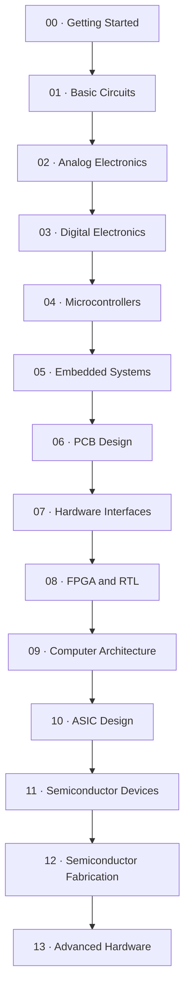

<h1 align="center">🧭 Hardware Atlas</h1>

<em>A practical, ascending path from your first circuit to custom silicon.</em>

  
  
  
  
  
  
  

---

Hardware Atlas is a project-first roadmap for learning hardware by **building, measuring, and debugging real things**, not by reading fourteen chapters before touching a breadboard. Every lesson tells you what to buy, what to build, what to measure, and what's likely to go wrong, in that order.

> 💡 **Philosophy in one line:** predict it with math, build it, measure it, and compare the two. If $V = IR$ doesn't match what your multimeter says, the disagreement is the lesson, not the failure.

This is **not a rigid curriculum**. Treat it like [awesome-electronics](https://github.com/kitspace/awesome-electronics): a curated map to dip into, skip what you already know, jump to what interests you, and come back for the rest later.

## 📑 Table of contents

- [🛠️ How to use this repository](#-how-to-use-this-repository)
- [🗺️ The roadmap](#-the-roadmap)
- [📚 All 31 lessons](#-all-31-lessons)
- [🧰 Practical guides](#-practical-guides)
- [⚡ Find something quickly](#-find-something-quickly)
- [🧪 Projects beyond the roadmap](#-projects-beyond-the-roadmap)
- [🎓 Opportunities](#-opportunities)
- [🎓 GATE 2027 alongside the roadmap](#-gate-2027-alongside-the-roadmap)
- [🇮🇳 Sourcing hardware in India](#-sourcing-hardware-in-india)
- [🤝 Contributing](#-contributing)
- [📄 License](#-license)

## 🛠️ How to use this repository

1. Find your current level below.
2. Read the lesson page **before** buying anything; it lists parts, tools, tests, and likely mistakes.
3. Build the smallest version. Measure it. Write down what you actually observed.
4. Follow the lesson's **What to build next** link. Don't skip the measurement step just because the LED lit up.

The `lessons/` directory holds the detailed build pages. `resources/` covers sourcing, tools, safety, simulation, and help. `projects/` documents the format for contributed, non-roadmap builds. `opportunities/` is the maintained index of hardware-adjacent jobs and programs, refreshed automatically by a scheduled GitHub Action.

## 🗺️ The roadmap

This is the **suggested** order, not a locked gate. Each lesson page states its own prerequisites. If you already have them, skip straight to the interesting part.

| Level | Focus | Start here |
|---|---|---|
| 00 | Getting Started | Breadboard layout, multimeter basics, first measurements |
| 01 | Basic Circuits | Resistors, switches, transistors, RC circuits |
| 02 | Analog Electronics | Sensors, amplifiers, op-amps, filters |
| 03 | Digital Electronics | Logic, state, timers, counters |
| 04 | Microcontrollers | GPIO, ADC, PWM, serial devices |
| 05 | Embedded Systems | Sensors, protocols, RTOS, custom peripherals |
| 06 | PCB Design | Schematic to prototype |
| 07 | Hardware Interfaces | Reliable buses and links |
| 08 | FPGA and RTL | Synchronous logic and verification |
| 09 | Computer Architecture | Datapaths, memory, CPUs |
| 10 | ASIC Design | RTL to silicon flow |
| 11 | Semiconductor Devices | Device physics and models |
| 12 | Semiconductor Fabrication | Process flow and yield |
| 13 | Advanced Hardware | Reproduction and open research |

### Which lessons live at which level

| Level | Lessons | Notes |
|---|---|---|
| 00 · Getting Started | none | Breadboard map, multimeter practice, first safe circuit |
| 01 · Basic Circuits | 01–05 | LEDs, dividers, switches, RC circuits |
| 02 · Analog Electronics | 06–09 | Sensors, amplifiers, filters |
| 03 · Digital Electronics | 10–11 | Planned: 555 timer oscillator, simple digital clock |
| 04 · Microcontrollers | 12–15 | GPIO, logging, serial, PWM |
| 05 · Embedded Systems | 16–18 | Planned: custom peripheral, bootloader exercise |
| 06 · PCB Design | 19–20 | Schematic capture to routed two-layer board |
| 07 · Hardware Interfaces | 21–22 | Logic analyzer decode, CAN bus node |
| 08 · FPGA and RTL | 23–25 | RTL, UART FSM, cocotb testbench |
| 09 · Computer Architecture | 26–28 | RISC-V core, memory-mapped GPIO, Zephyr native-sim |
| 10 · ASIC Design | 29–31 | Yosys synthesis, OpenLane flow, Magic DRC/LVS |
| 11 · Semiconductor Devices | none yet | Theory and simulation driven |
| 12 · Semiconductor Fabrication | none yet | Process models and simulation only |
| 13 · Advanced Hardware | none yet | Reproduce research, open hardware |

## 📚 All 31 lessons

Grouped by category for quick scanning. Ordering shows progression, not a prerequisite chain.

### Foundations

| # | Lesson | Path |
|---|---|---|
| 01 | LED Circuit | [`lessons/01-led-circuit/`](lessons/01-led-circuit/README.md) |
| 02 | Voltage Divider | [`lessons/02-voltage-divider/`](lessons/02-voltage-divider/README.md) |
| 03 | Button and LED | [`lessons/03-button-and-led/`](lessons/03-button-and-led/README.md) |
| 04 | Transistor Switch | [`lessons/04-transistor-switch/`](lessons/04-transistor-switch/README.md) |
| 05 | RC Circuit | [`lessons/05-rc-circuit/`](lessons/05-rc-circuit/README.md) |

### Analog

| # | Lesson | Path |
|---|---|---|
| 06 | Light Sensor | [`lessons/06-light-sensor/`](lessons/06-light-sensor/README.md) |
| 07 | Transistor Amplifier | [`lessons/07-transistor-amplifier/`](lessons/07-transistor-amplifier/README.md) |
| 08 | Op-Amp Signal Conditioner | [`lessons/08-op-amp-conditioner/`](lessons/08-op-amp-conditioner/README.md) |
| 09 | Active Filter | [`lessons/09-active-filter/`](lessons/09-active-filter/README.md) |

### Digital

| # | Lesson | Path |
|---|---|---|
| 10 | Logic Gates | [`lessons/10-logic-gates/`](lessons/10-logic-gates/README.md) |
| 11 | Flip-Flop Counter | [`lessons/11-flip-flop-counter/`](lessons/11-flip-flop-counter/README.md) |
| 23 | Combinational Arithmetic RTL | [`lessons/23-combinational-arithmetic-rtl/`](lessons/23-combinational-arithmetic-rtl/README.md) |
| 24 | UART RX FSM | [`lessons/24-uart-rx-fsm/`](lessons/24-uart-rx-fsm/README.md) |

### Microcontrollers and embedded

| # | Lesson | Path |
|---|---|---|
| 12 | GPIO Device | [`lessons/12-gpio-device/`](lessons/12-gpio-device/README.md) |
| 13 | Temperature Logger | [`lessons/13-temperature-logger/`](lessons/13-temperature-logger/README.md) |
| 14 | UART I2C Device | [`lessons/14-uart-i2c-device/`](lessons/14-uart-i2c-device/README.md) |
| 15 | PWM Motor Controller | [`lessons/15-pwm-motor-controller/`](lessons/15-pwm-motor-controller/README.md) |
| 16 | STM32 Peripheral | [`lessons/16-stm32-peripheral/`](lessons/16-stm32-peripheral/README.md) |
| 17 | ESP32 Connected Sensor | [`lessons/17-esp32-connected-sensor/`](lessons/17-esp32-connected-sensor/README.md) |
| 18 | RTOS Sensor Logger | [`lessons/18-rtos-sensor-logger/`](lessons/18-rtos-sensor-logger/README.md) |
| 28 | Zephyr Native-Sim Peripheral | [`lessons/28-zephyr-native-sim-peripheral/`](lessons/28-zephyr-native-sim-peripheral/README.md) |

### PCB and hardware

| # | Lesson | Path |
|---|---|---|
| 19 | KiCad Schematic Capture | [`lessons/19-kicad-schematic-capture/`](lessons/19-kicad-schematic-capture/README.md) |
| 20 | Two-Layer PCB Routing | [`lessons/20-two-layer-pcb-routing/`](lessons/20-two-layer-pcb-routing/README.md) |

### Communication and debug

| # | Lesson | Path |
|---|---|---|
| 21 | Logic Analyzer Decode | [`lessons/21-logic-analyzer-decode/`](lessons/21-logic-analyzer-decode/README.md) |
| 22 | CAN Bus Node | [`lessons/22-can-bus-node/`](lessons/22-can-bus-node/README.md) |

### RTL and verification

| # | Lesson | Path |
|---|---|---|
| 25 | cocotb Python Testbench | [`lessons/25-cocotb-python-testbench/`](lessons/25-cocotb-python-testbench/README.md) |
| 29 | Yosys RTL Synthesis | [`lessons/29-yosys-rtl-synthesis/`](lessons/29-yosys-rtl-synthesis/README.md) |

### Computer architecture

| # | Lesson | Path |
|---|---|---|
| 26 | RISC-V Single-Cycle Datapath | [`lessons/26-riscv-single-cycle-datapath/`](lessons/26-riscv-single-cycle-datapath/README.md) |
| 27 | Memory-Mapped GPIO Peripheral | [`lessons/27-memory-mapped-gpio-peripheral/`](lessons/27-memory-mapped-gpio-peripheral/README.md) |

### Open silicon

| # | Lesson | Path |
|---|---|---|
| 30 | OpenLane Sky130 Flow | [`lessons/30-openlane-sky130-flow/`](lessons/30-openlane-sky130-flow/README.md) |
| 31 | Magic DRC/LVS Verification | [`lessons/31-magic-drc-lvs-verification/`](lessons/31-magic-drc-lvs-verification/README.md) |

## 🧰 Practical guides

| Guide | Use it for |
|---|---|
| [Components](resources/components.md) | Buy parts as projects require them, not a stockpile upfront |
| [Tools](resources/tools.md) | A deliberately ascending workbench, budget to pro |
| [Power and batteries](resources/power-and-batteries.md) | Wiring and cell safety before you plug anything in |
| [Simulation](resources/simulation.md) | Test a complicated idea before ordering hardware |
| [Getting hardware in India](resources/india.md) | Distributors, Delhi NCR sourcing, inspection, returns |
| [Where to get help](resources/help.md) | Choose a community by problem type |
| [GATE alongside the roadmap](resources/gate.md) | Strengthen exam prep with project work, not the other way around |

## ⚡ Find something quickly

| I want to... | Open |
|---|---|
| Start from zero | [Level 00 · Getting Started](#level-00) |
| Learn basic circuits | [Level 01 · Basic Circuits](#level-01) |
| Learn analog electronics | [Level 02 · Analog Electronics](#level-02) |
| Learn digital logic | [Level 03 · Digital Electronics](#level-03) |
| Program a microcontroller | [Level 04 · Microcontrollers](#level-04) |
| Build dependable firmware | [Level 05 · Embedded Systems](#level-05) |
| Design a PCB | [Level 06 · PCB Design](#level-06) |
| Connect devices reliably | [Level 07 · Hardware Interfaces](#level-07) |
| Learn FPGA and RTL | [Level 08 · FPGA and RTL](#level-08) |
| Design a CPU | [Level 09 · Computer Architecture](#level-09) |
| Design an ASIC | [Level 10 · ASIC Design](#level-10) |
| Understand semiconductor devices | [Level 11 · Semiconductor Devices](#level-11) |
| Learn how chips are fabricated | [Level 12 · Semiconductor Fabrication](#level-12) |
| Do research beyond the roadmap | [Level 13 · Advanced Hardware](#level-13) |
| Choose a development board | [Components](resources/components.md) → Level 04 |
| Buy parts in India | [Getting hardware in India](resources/india.md) |
| Choose tools | [Tools](resources/tools.md) |
| Check a circuit before building | [Simulation](resources/simulation.md) |
| Find hardware jobs and programs | [Opportunities](opportunities/README.md) |
| Ask for help | [Where to get help](resources/help.md) |
| Study GATE alongside projects | [GATE guide](resources/gate.md) |
| Add a new project | [Projects](projects/README.md) and [Contributing](CONTRIBUTING.md) |

## 🧪 Projects beyond the roadmap

The 31 lessons above are reference points, not the ceiling. The [`projects/`](projects/README.md) directory documents how to structure and submit a project that doesn't fit the numbered roadmap: a modification, an extension, a teardown, a measurement study, or something built from scratch.

→ [Read the Projects hub](projects/README.md)

## 🎓 Opportunities

Live positions and programs that put the roadmap's skills to work: jobs, internships, hackathons, scholarships, research programs, fellowships, and open source programs tagged with the areas this repo teaches. Open the Apply link to apply on the organization's own page.

<!-- BEGIN_OPPORTUNITIES -->
#### 💼 Jobs (118)

| Role | Organization | Location | Areas | Apply |
|---|---|---|---|---|
| Senior Embedded Software Engineer - Ban… | Aeva | Bangalore | Embedded | [Apply](https://jobs.lever.co/aeva/511bda52-6282-46a0-a06c-79785669e6e0) |
| Staff LiDAR Algorithms Engineer | Aeva | Bangalore | Embedded, Semiconductor, Electronics | [Apply](https://jobs.lever.co/aeva/1084b26f-5c62-4ba5-8e0d-c1888471959c) |
| Staff Sensor Validation & Characterisat… | Aeva | Bangalore | Embedded, Semiconductor, Electronics | [Apply](https://jobs.lever.co/aeva/5acdc4b3-2e27-4a2c-ac4d-da348e54f9c6) |
| Staff Software Infrastructure Test Arch… | Aeva | Bangalore | Embedded, Semiconductor, Electronics | [Apply](https://jobs.lever.co/aeva/79bcb49b-b8c7-43ea-bcb9-8594487392b0) |
| Staff Systems Engineer | Aeva | Bangalore | RTL, Semiconductor, Electronics | [Apply](https://jobs.lever.co/aeva/8790a37d-6981-4742-b145-2070893db532) |
| Thermal Engineer | Aeva | Bangalore | Semiconductor, Electronics, Hardware | [Apply](https://jobs.lever.co/aeva/c0e7c150-45ff-4286-9b0e-214c89c2cffc) |
| Senior Embedded Software Developer(RTOS) | Alif Semiconductor | Bangalore, India | Embedded, Semiconductor | [Apply](https://jobs.lever.co/alifsemi/f0d842ee-66ce-42a7-ac48-c409498bd713) |
| Software Engineer - RTOS | Alif Semiconductor | Bangalore, India | Embedded, Semiconductor, Computer Architecture | [Apply](https://jobs.lever.co/alifsemi/1f921624-cee6-43b6-9374-8c871ab2abf2) |
| Electrical Integration Engineer | Applied Intuition | Bangalore | RTL, Semiconductor, Hardware | [Apply](https://jobs.ashbyhq.com/applied/2ffcb384-3729-450c-8363-25818c76f2c7) |
| Firmware Engineer | Applied Intuition | Bangalore | Embedded, Semiconductor, Electronics | [Apply](https://jobs.ashbyhq.com/applied/4cee3e2f-3fec-42fd-a700-d570798d815a) |
| Cloud Quality Engineer | Cerebras Systems | Bengaluru, IND | Hardware, Edge AI | [Apply](https://jobs.ashbyhq.com/cerebras/224566db-c2c9-4b81-9534-a9917ea1aaa6) |
| Manufacturing Bring-up Engineer L2 | Cerebras Systems | Bengaluru, IND | ASIC, Hardware, Computer Architecture | [Apply](https://jobs.ashbyhq.com/cerebras/92939082-317e-41ac-aa98-29dcf9eb5422) |
| ML Systems Performance Engineer | Cerebras Systems | Bengaluru, IND | Semiconductor, Hardware, Computer Architecture | [Apply](https://jobs.ashbyhq.com/cerebras/474768a4-7e4f-43c9-a9d3-f23dfe6be406) |
| Physical Design Engineer (Bengaluru) | Cerebras Systems | Bengaluru, IND | RTL, ASIC, Semiconductor | [Apply](https://jobs.ashbyhq.com/cerebras/d418c1b5-1968-452b-89d0-4d3fa566265e) |
| Senior Engineer: Post Silicon - Bring Up | Cerebras Systems | Bengaluru, IND | RTL, ASIC, VLSI | [Apply](https://jobs.ashbyhq.com/cerebras/6d966c0a-d587-4a16-bf57-cfb4b4eb7eef) |
| Backend Engineer | Coram AI | Bangalore | Computer Architecture | [Apply](https://jobs.ashbyhq.com/coram-ai/4689a957-bf88-4eea-9b32-004025bf4544) |
| Core Engineer - C++ | Coram AI | Bangalore | Computer Architecture | [Apply](https://jobs.ashbyhq.com/coram-ai/41539d29-f1e7-462c-8236-10336a9909b3) |
| Demand Generation Manager | Coram AI | Bangalore | Computer Architecture | [Apply](https://jobs.ashbyhq.com/coram-ai/5376f055-8c7f-4e53-94dd-b25aac46a782) |
| Frontend Engineer | Coram AI | Bangalore | EDA, Computer Architecture | [Apply](https://jobs.ashbyhq.com/coram-ai/042f309a-4896-4f5c-8db3-57e03f69dd00) |
| Performance Marketing Manager | Coram AI | Bangalore | Computer Architecture | [Apply](https://jobs.ashbyhq.com/coram-ai/6b35ab23-8d54-4ece-a467-eb04ca80da25) |
| Product Designer | Coram AI | Bangalore | Hardware, Computer Architecture | [Apply](https://jobs.ashbyhq.com/coram-ai/9083de2f-1806-4f79-bbb1-b2b6248f1b17) |
| Product Marketing Manager | Coram AI | Bangalore | Computer Architecture | [Apply](https://jobs.ashbyhq.com/coram-ai/64d15d95-322a-471a-aa6e-62e2e1c1aa2c) |
| Sales Development Representative | Coram AI | Bangalore | Computer Architecture | [Apply](https://jobs.ashbyhq.com/coram-ai/4f0dc654-1aba-4601-a81b-f999ed97803a) |
| Senior Deal Desk Analyst | Coram AI | Bangalore | Computer Architecture | [Apply](https://jobs.ashbyhq.com/coram-ai/03515c70-61fc-4115-8dc6-c63941498ebf) |
| Senior Electrical Engineer | Coram AI | Bangalore | Embedded, Electronics, Hardware | [Apply](https://jobs.ashbyhq.com/coram-ai/68c04bbf-e2b1-446c-88c8-a4c1651be748) |
| Digital Design Engineers - 7 openings | Kandou | Hyderabad | RTL, ASIC, VLSI | [Apply](https://jobs.ashbyhq.com/kandou-ai/50d61732-cadb-4b78-a2ff-2b0d3a4af4e7) |
| Digital Verification Engineers - 7 open… | Kandou | Bangalore or Hyderabad | FPGA, RTL, ASIC | [Apply](https://jobs.ashbyhq.com/kandou-ai/64d6caaa-ef23-4d42-bde6-fa94cacd777d) |
| Embedded Software Engineer | Kandou | Hyderabad | Embedded, FPGA, ASIC | [Apply](https://jobs.ashbyhq.com/kandou-ai/82dc7aca-d174-42f4-be8d-bdf97c90d33e) |
| Firmware Architect | Kandou | Hyderabad | Embedded, ASIC, Semiconductor | [Apply](https://jobs.ashbyhq.com/kandou-ai/4adeeabb-935b-4a70-b175-352d46c10f75) |
| Firmware Engineer Bare Metal | Kandou | Hyderabad | Embedded, RTL, Semiconductor | [Apply](https://jobs.ashbyhq.com/kandou-ai/d1a8773d-8fc4-4b25-8093-bb631e04796f) |
| Firmware Engineer Lead | Kandou | Pune | Embedded, Semiconductor, Hardware | [Apply](https://jobs.ashbyhq.com/kandou-ai/e39b026f-f102-4a59-a030-1219eedbca3b) |
| Lab Technician | Kandou | Hyderabad | FPGA, Semiconductor, Electronics | [Apply](https://jobs.ashbyhq.com/kandou-ai/2da70bb2-9358-46b0-93b0-3235456ab7ad) |
| Linux Software Engineer | Kandou | Pune | Embedded, Semiconductor, Electronics | [Apply](https://jobs.ashbyhq.com/kandou-ai/cd7f6501-e439-486f-a754-2ea7d0cf040b) |
| Silicon Validation Director/Manager | Kandou | Hyderabad | Embedded, FPGA, RTL | [Apply](https://jobs.ashbyhq.com/kandou-ai/838868ab-c6d3-4959-904c-e391aa270263) |
| Software Engineer (Firmware) Lead | Kandou | Hyderabad | Embedded, RTL, Semiconductor | [Apply](https://jobs.ashbyhq.com/kandou-ai/b13c2bbb-d97d-4d61-8936-f95160d4ccb2) |
| Software Engineer - 2 openings | Kandou | Hyderabad | Embedded, RTL, Semiconductor | [Apply](https://jobs.ashbyhq.com/kandou-ai/78f57489-f972-4d5e-a964-8fd72bed21b8) |
| Staff Engineer – Embedded SoC Firmware… | Kandou | Pune | Embedded, ASIC, Semiconductor | [Apply](https://jobs.ashbyhq.com/kandou-ai/d0bd9ea3-8823-47ba-b65e-ec940b7a4261) |
| System Firmware Lead (AI Memory Fabrics… | Kandou | Pune | Embedded, ASIC, Semiconductor | [Apply](https://jobs.ashbyhq.com/kandou-ai/35668839-756d-46f6-b091-425ca14a3e61) |
| Embedded System Engineer | LAT Aerospace | Bangalore | Embedded, RTL, Electronics | [Apply](https://jobs.ashbyhq.com/lat/1705fceb-7a02-43b6-9762-2481b842ceb1) |
| Manufacturing Engineer | LAT Aerospace | Bangalore | Semiconductor, Hardware, Robotics | [Apply](https://jobs.ashbyhq.com/lat/61338ae8-f402-4cc1-a01c-6c4669d78659) |
| Materials & Process Engineer | LAT Aerospace | Bangalore | Hardware, Edge AI | [Apply](https://jobs.ashbyhq.com/lat/f94bad0d-dcd2-4f75-a329-b1ff1d6c6a25) |
| Mechanical Design Engineer | LAT Aerospace | Bangalore | Hardware, Robotics | [Apply](https://jobs.ashbyhq.com/lat/921320dd-b9a5-4ce9-b9a8-f8d4ef05ca93) |
| PCB Design Engineer | LAT Aerospace | Bangalore | Embedded, Semiconductor, Electronics | [Apply](https://jobs.ashbyhq.com/lat/59241fea-95fb-4d96-b897-2366ff6c67ad) |
| Power Electronics Engineer | LAT Aerospace | Bangalore | Embedded, Semiconductor, Electronics | [Apply](https://jobs.ashbyhq.com/lat/81c74382-50fb-4762-bd0a-0b890ea232ae) |
| RF Digital Signal Processing Engineer | LAT Aerospace | Bangalore | Embedded, FPGA, Electronics | [Apply](https://jobs.ashbyhq.com/lat/a5d251a2-0846-4322-9750-890cc4270d8c) |
| RF System Design Engineer | LAT Aerospace | Bangalore | RTL, Semiconductor, Electronics | [Apply](https://jobs.ashbyhq.com/lat/eddb79af-2f4c-4250-a0ef-a5f496118c1e) |
| Rotordynamics Engineer | LAT Aerospace | Bangalore | Hardware | [Apply](https://jobs.ashbyhq.com/lat/a4e556df-b416-481f-9c15-faa1ae14046c) |
| Structural Design & Analysis Engineer | LAT Aerospace | Bangalore | Hardware, Robotics, DSP | [Apply](https://jobs.ashbyhq.com/lat/33e18cfa-cad8-4b8e-8f50-03bcad93108e) |
| Hardware Test Engineer | Lumilens | Bengaluru, India | Semiconductor, Electronics, Hardware | [Apply](https://jobs.ashbyhq.com/lumilens/8c2bb962-56ae-4a3b-bc91-2ef11187eef7) |
| IT Specialist | Lumilens | Bengaluru, India | ASIC, Hardware | [Apply](https://jobs.ashbyhq.com/lumilens/d98bfbe3-237d-4254-9968-f54ad6ff0b1b) |
| Modelling Lead (SystemC / Virtual-Platf… | Lumilens | Bengaluru, India | Embedded, RTL, Semiconductor | [Apply](https://jobs.ashbyhq.com/lumilens/33571f85-7e75-4646-80a0-16592bb6ce32) |
| Power Integrity Engineer | Lumilens | Bengaluru, India | Embedded, Semiconductor, Electronics | [Apply](https://jobs.ashbyhq.com/lumilens/dd6bfb9e-43fe-4093-82c6-c4ed1384c55b) |
| Principal Mechanical Engineer | Lumilens | Bengaluru, India | Semiconductor, Hardware, DSP | [Apply](https://jobs.ashbyhq.com/lumilens/74fa6578-aa5f-43fc-b69e-a699bdf6e91e) |
| RTL Design Lead/IC Front-End Architect/… | Lumilens | Bengaluru, India | RTL, Semiconductor, EDA | [Apply](https://jobs.ashbyhq.com/lumilens/7aa98243-a799-4d2c-8c05-300726cc7170) |
| Senior Embedded Firmware Engineer | Lumilens | Bengaluru, India | Embedded, Semiconductor, Electronics | [Apply](https://jobs.ashbyhq.com/lumilens/c463e5ab-69de-40c1-b4bd-7c133a0ed9fd) |
| Senior Program Manager | Lumilens | Bengaluru, India | Semiconductor, Hardware | [Apply](https://jobs.ashbyhq.com/lumilens/b8d9ad06-67cb-4bb0-a8d4-cbe5838964fa) |
| Senior Signal Integrity Engineer | Lumilens | Bengaluru, India | ASIC, Semiconductor, Electronics | [Apply](https://jobs.ashbyhq.com/lumilens/e9285a8f-df83-4680-96be-9aa566d18f94) |
| Senior Software Test Automation Engineer | Lumilens | Bengaluru, India | Semiconductor, Electronics, Hardware | [Apply](https://jobs.ashbyhq.com/lumilens/268af14e-e0c6-429b-a088-7cff6923d639) |
| Signal Integrity Engineer-1.6 OSFP Boar… | Lumilens | Bengaluru, India | Embedded, ASIC, Semiconductor | [Apply](https://jobs.ashbyhq.com/lumilens/7798d00c-e4e3-48d6-a43e-065d41bc1c5e) |
| Sr. Manager/Director FP&A | Lumilens | Bengaluru, India | Semiconductor, Hardware, EDA | [Apply](https://jobs.ashbyhq.com/lumilens/c9be49be-29d7-4227-916b-9f52ba761577) |
| Thermal Engineer | Lumilens | Bengaluru, India | ASIC, Electronics | [Apply](https://jobs.ashbyhq.com/lumilens/265f9e9e-d409-48fa-9fe7-061161353ef6) |
| Verification Lead (Lead DV) | Lumilens | Bengaluru, India | Embedded, FPGA, RTL | [Apply](https://jobs.ashbyhq.com/lumilens/b6a08465-22c2-4df7-833f-db4d751568c0) |
| Field Marketing Manager, India | Shield AI | New Delhi | Computer Architecture | [Apply](https://jobs.lever.co/shieldai/28136dd4-edd8-4da6-a6a1-7ce139654c96) |
| Device - Software Engineer (Firmware) | SPAN | Bengaluru | Embedded, RTL, Electronics | [Apply](https://jobs.ashbyhq.com/span/fed58386-54fd-4e5f-ab22-9dc142d0bf8b) |
| Salesforce Developer | SPAN | Bengaluru | Computer Architecture, Automotive | [Apply](https://jobs.ashbyhq.com/span/345a4fb1-58a4-4d3a-abc8-9cdedf45de54) |
| Staff Mobile Developer | SPAN | Bengaluru | Embedded, Hardware | [Apply](https://jobs.ashbyhq.com/span/782524bb-f9f1-4296-b7fb-1737f12d069f) |
| Forward-Deployed Engineer, AI Fabric | Upscale AI | India - Bangalore | Semiconductor | [Apply](https://jobs.lever.co/upscale-ai/d86b9479-5716-4903-a2f4-ab3dd93ff8b3) |
| Principal Engineer - SONiC Manageabilit… | Upscale AI | India - Bangalore | Semiconductor | [Apply](https://jobs.lever.co/upscale-ai/749a5df9-9f1c-4590-b162-7531b5b8ed10) |
| Principal Engineer – Design Verification | Upscale AI | India - Bangalore | RTL, ASIC, Semiconductor | [Apply](https://jobs.lever.co/upscale-ai/33b1a9d4-483b-4f9b-b2cb-9e7bcd2994f6) |
| Principal Engineer – Physical Design | Upscale AI | India - Bangalore | ASIC, Semiconductor | [Apply](https://jobs.lever.co/upscale-ai/8160d67a-c69c-4326-9dff-cb16518e2f3a) |
| Principal Engineer_RTL Design | Upscale AI | India - Bangalore | ASIC, Semiconductor | [Apply](https://jobs.lever.co/upscale-ai/a26a36dd-47fa-47a5-992d-fef262c93756) |
| Principal Engineer_SDK, SAI & Platform… | Upscale AI | India - Bangalore | ASIC, Semiconductor, Electronics | [Apply](https://jobs.lever.co/upscale-ai/b49482aa-a281-414b-bffd-19d04476017e) |
| Senior Manager – Physical Design | Upscale AI | India - Bangalore | RTL, ASIC, VLSI | [Apply](https://jobs.lever.co/upscale-ai/d3366d3e-11e3-4c1a-b615-580d4a9b336b) |
| Senior Principal Engineer - Design Veri… | Upscale AI | India - Bangalore | RTL, ASIC, Semiconductor | [Apply](https://jobs.lever.co/upscale-ai/9149e72d-ee97-498a-a587-3546d293afb2) |
| Business Development Manager (Defense)… | Aeva | Remote | Semiconductor, Electronics, Robotics | [Apply](https://jobs.lever.co/aeva/f6a659ec-b0d4-4f70-8259-582765ef5773) |
| Recruiting Systems Specialist [3 Month… | Applied Intuition | California Remote | Semiconductor, Computer Architecture, Automotive | [Apply](https://jobs.ashbyhq.com/applied/86d46272-2aab-4a76-b315-fd39aa406192) |
| Network Security Engineer (Remote) | Cerebras Systems | Remote (US) | Electronics, Hardware, Edge AI | [Apply](https://jobs.ashbyhq.com/cerebras/84a9df6b-fe96-4711-8106-971d829b6dc2) |
| PCB Layout Engineering Lead | Cerebras Systems | Remote (US) | ASIC, Semiconductor, Electronics | [Apply](https://jobs.ashbyhq.com/cerebras/e616412a-6412-4f0d-93b9-47644d3e99fa) |
| Brand and Design Lead | Coram AI | US Remote | Computer Architecture | [Apply](https://jobs.ashbyhq.com/coram-ai/a00ae52e-a91b-4495-a237-97dda5d91ace) |
| Creative Production Lead | Shield AI | Remote | Edge AI | [Apply](https://jobs.lever.co/shieldai/571caa29-8b8f-4a3c-aa4d-77b00fe45766) |
| Sr. Staff Electrical Engineer - BlueSky… | Shield AI | Remote | Hardware | [Apply](https://jobs.lever.co/shieldai/45ea9010-a429-4a28-b2d0-311af12a342e) |
| Sr. Staff Engineer, GNC - BlueSky (R579… | Shield AI | Remote | Electronics, Robotics, DSP | [Apply](https://jobs.lever.co/shieldai/b3bb2565-135f-4bb7-93b3-2599bab544dc) |
| Sr. Staff Mechanical Engineer - BlueSky… | Shield AI | Remote | Hardware | [Apply](https://jobs.lever.co/shieldai/1aa1c3ee-577a-419a-89fd-1f9815691858) |
| Sr. Software Engineer, Security | SPAN | Remote | Automotive | [Apply](https://jobs.ashbyhq.com/span/c74a8257-4237-4aea-ad1e-0261c1d627d7) |
| Territory Sales Manager - Mid-Atlantic | SPAN | Remote | Electronics, Computer Architecture, Automotive | [Apply](https://jobs.ashbyhq.com/span/f52378e2-ea02-4f4f-abe2-61aee3ede355) |
| Territory Sales Manager - Northeast | SPAN | Remote | Electronics, Computer Architecture, Automotive | [Apply](https://jobs.ashbyhq.com/span/22556b7a-7cc2-4362-b99c-6a1d523e1b8c) |
| Territory Sales Manager - PNW | SPAN | Remote | Electronics, Computer Architecture, Automotive | [Apply](https://jobs.ashbyhq.com/span/7b79ea46-b9ce-4060-b2dc-92ad89a356a3) |
| Territory Sales Manager - Southern CA | SPAN | Remote | Electronics, Computer Architecture, Automotive | [Apply](https://jobs.ashbyhq.com/span/e57c2d9b-73be-4723-8cf4-40ab724acdbc) |
| Senior Test Engineer | Upscale AI | Taiwan - Remote | Semiconductor | [Apply](https://jobs.lever.co/upscale-ai/3f12ccd0-a6ca-4bb2-983a-63ff8606fd99) |
| Senior Test Manager | Upscale AI | Taiwan - Remote | Semiconductor | [Apply](https://jobs.lever.co/upscale-ai/161069b7-ec2b-4bfd-811c-2d56a07ebd75) |
| Advanced Packaging Engineer | Volantis Semiconductor | Hybrid Remote/SF Bay Area/Austin/Boston | Semiconductor | [Apply](https://job-boards.greenhouse.io/volantissemiconductorinc/jobs/4329700009) |
| Analog/Mixed Signal Designer | Volantis Semiconductor | Hybrid Remote/SF Bay Area/Austin/Boston | ASIC, Electronics | [Apply](https://job-boards.greenhouse.io/volantissemiconductorinc/jobs/4336994009) |
| Architect- Memory Subsystem | Volantis Semiconductor | Hybrid Remote/SF Bay Area/Austin/Boston | Semiconductor, Edge AI | [Apply](https://job-boards.greenhouse.io/volantissemiconductorinc/jobs/4342719009) |
| Architect- Subsystem | Volantis Semiconductor | Hybrid Remote/SF Bay Area/Austin/Boston | RTL, Computer Architecture | [Apply](https://job-boards.greenhouse.io/volantissemiconductorinc/jobs/4342723009) |
| ASIC Design Engineer | Volantis Semiconductor | Hybrid Remote/SF Bay Area/Austin/Boston | ASIC, Semiconductor | [Apply](https://job-boards.greenhouse.io/volantissemiconductorinc/jobs/4354899009) |
| DFT Lead | Volantis Semiconductor | Hybrid Remote/SF Bay Area/Austin/Boston | ASIC, Semiconductor | [Apply](https://job-boards.greenhouse.io/volantissemiconductorinc/jobs/4357713009) |
| IO Module Engineer | Volantis Semiconductor | Hybrid Remote/SF Bay Area/Austin/Boston | Semiconductor | [Apply](https://job-boards.greenhouse.io/volantissemiconductorinc/jobs/4342710009) |
| Laser Design Engineer | Volantis Semiconductor | Hybrid Remote/SF Bay Area/Austin/Boston | Semiconductor, EDA | [Apply](https://job-boards.greenhouse.io/volantissemiconductorinc/jobs/4342587009) |
| Lead Architect | Volantis Semiconductor | Hybrid Remote/SF Bay Area/Austin/Boston | Edge AI | [Apply](https://job-boards.greenhouse.io/volantissemiconductorinc/jobs/4342653009) |
| Mechanical Design Engineer | Volantis Semiconductor | Hybrid Remote/SF Bay Area/Austin/Boston | Semiconductor | [Apply](https://job-boards.greenhouse.io/volantissemiconductorinc/jobs/4331551009) |
| Micro-Optics Engineer | Volantis Semiconductor | Hybrid Remote/SF Bay Area/Austin/Boston | Semiconductor, Electronics, Hardware | [Apply](https://job-boards.greenhouse.io/volantissemiconductorinc/jobs/4330137009) |
| Microarchitect | Volantis Semiconductor | Hybrid Remote/SF Bay Area/Austin/Boston | RTL, ASIC, Semiconductor | [Apply](https://job-boards.greenhouse.io/volantissemiconductorinc/jobs/4357843009) |
| Network Architect | Volantis Semiconductor | Hybrid Remote/SF Bay Area/Austin/Boston | Semiconductor | [Apply](https://job-boards.greenhouse.io/volantissemiconductorinc/jobs/4342713009) |
| NoC Architect (Network on Chip) | Volantis Semiconductor | Hybrid Remote/SF Bay Area/Austin/Boston | RTL | [Apply](https://job-boards.greenhouse.io/volantissemiconductorinc/jobs/4342725009) |
| Packaging Engineer- Bump Interconnect | Volantis Semiconductor | Hybrid Remote/SF Bay Area/Austin/Boston | Semiconductor | [Apply](https://job-boards.greenhouse.io/volantissemiconductorinc/jobs/4330170009) |
| Packaging Engineer- Materials | Volantis Semiconductor | Hybrid Remote/SF Bay Area/Austin/Boston | Semiconductor | [Apply](https://job-boards.greenhouse.io/volantissemiconductorinc/jobs/4330706009) |
| PCB Design Engineer | Volantis Semiconductor | Hybrid Remote/SF Bay Area/Austin/Boston | Hardware | [Apply](https://job-boards.greenhouse.io/volantissemiconductorinc/jobs/4337013009) |
| Photonics Packaging Engineer | Volantis Semiconductor | Hybrid Remote/SF Bay Area/Austin/Boston | Semiconductor, Electronics | [Apply](https://job-boards.greenhouse.io/volantissemiconductorinc/jobs/4331554009) |
| PHY/SERDES Lead | Volantis Semiconductor | Hybrid Remote/SF Bay Area/Austin/Boston | ASIC | [Apply](https://job-boards.greenhouse.io/volantissemiconductorinc/jobs/4336877009) |
| Physical Design Engineer | Volantis Semiconductor | Hybrid Remote/SF Bay Area/Austin/Boston | RTL, ASIC, Electronics | [Apply](https://job-boards.greenhouse.io/volantissemiconductorinc/jobs/4356436009) |
| PIC Design Engineer | Volantis Semiconductor | Hybrid Remote/SF Bay Area/Austin/Boston | ASIC, Semiconductor, Electronics | [Apply](https://job-boards.greenhouse.io/volantissemiconductorinc/jobs/4342450009) |
| Power Delivery System Engineer | Volantis Semiconductor | Hybrid Remote/SF Bay Area/Austin/Boston | Semiconductor, Hardware | [Apply](https://job-boards.greenhouse.io/volantissemiconductorinc/jobs/4331636009) |
| Power Integrity Engineer | Volantis Semiconductor | Hybrid Remote/SF Bay Area/Austin/Boston | ASIC, Semiconductor, Computer Architecture | [Apply](https://job-boards.greenhouse.io/volantissemiconductorinc/jobs/4331564009) |
| SoC Architect | Volantis Semiconductor | Hybrid Remote/SF Bay Area/Austin/Boston | ASIC, Semiconductor, Computer Architecture | [Apply](https://job-boards.greenhouse.io/volantissemiconductorinc/jobs/4356624009) |
| Thermal Design Engineer | Volantis Semiconductor | Hybrid Remote/SF Bay Area/Austin/Boston | Semiconductor | [Apply](https://job-boards.greenhouse.io/volantissemiconductorinc/jobs/4331552009) |
| Verification Engineer/Lead | Volantis Semiconductor | Hybrid Remote/SF Bay Area/Austin/Boston | RTL, ASIC, Semiconductor | [Apply](https://job-boards.greenhouse.io/volantissemiconductorinc/jobs/4357877009) |
| Wafer Architect | Volantis Semiconductor | Hybrid Remote/SF Bay Area/Austin/Boston | ASIC, Semiconductor, Hardware | [Apply](https://job-boards.greenhouse.io/volantissemiconductorinc/jobs/4342271009) |
| XPU Architect | Volantis Semiconductor | Hybrid Remote/SF Bay Area/Austin/Boston | ASIC, Semiconductor, Computer Architecture | [Apply](https://job-boards.greenhouse.io/volantissemiconductorinc/jobs/4337288009) |

#### 🎓 Internships (26)

| Role | Organization | Location | Areas | Apply |
|---|---|---|---|---|
| Member of Technical Staff - Design Veri… | Architect | Bangalore, India | FPGA, RTL, ASIC | [Apply](https://jobs.ashbyhq.com/architect/a4fff40f-3b58-4642-8e51-7bdc6edb69f9) |
| Global People Operations Lead | Coram AI | Bangalore | Computer Architecture | [Apply](https://jobs.ashbyhq.com/coram-ai/ae04aa0f-1048-4dfd-a246-ee27e5391183) |
| Physical Design Engineers - 2 openings | Kandou | Hyderabad | RTL, ASIC, Semiconductor | [Apply](https://jobs.ashbyhq.com/kandou-ai/3451d8b6-a5d6-477a-a27e-0a02ecf95fc2) |
| Senior SI/PI Engineer, India (Hyderabad… | Kandou | Hyderabad | Semiconductor, Electronics, Hardware | [Apply](https://jobs.ashbyhq.com/kandou-ai/77b25bd5-99ac-4ebd-a43f-374db96412ee) |
| Software Engineer (Firmware) | Kandou | Hyderabad | Embedded, ASIC, Electronics | [Apply](https://jobs.ashbyhq.com/kandou-ai/0b95e17d-d529-4b23-80c9-55c00649a7a5) |
| Software Engineer - Firmware | Kandou | Hyderabad | Embedded, RTL, ASIC | [Apply](https://jobs.ashbyhq.com/kandou-ai/bd384d94-b635-439d-9bee-323b417ac23a) |
| Aerodynamics Engineer | LAT Aerospace | Bangalore | Hardware, Robotics, DSP | [Apply](https://jobs.ashbyhq.com/lat/cf5b4798-4067-4cd9-8f87-2aa3be19cc6d) |
| Epoxy Engineer | Lumilens | Bengaluru, India | Semiconductor, Electronics, EDA | [Apply](https://jobs.ashbyhq.com/lumilens/c94b628f-dce0-4ff5-a418-798395817ff9) |
| Mechanical Product Engineer | Lumilens | Bengaluru, India | Semiconductor, Electronics, Hardware | [Apply](https://jobs.ashbyhq.com/lumilens/330cb457-baef-4378-adad-258233f669e8) |
| Senior Compliance Engineer | Lumilens | Bengaluru, India | Hardware | [Apply](https://jobs.ashbyhq.com/lumilens/0c302651-f5b0-495c-bac3-5332cd730ddf) |
| Senior Director, Hardware Engineering | Lumilens | Bengaluru, India | Embedded, Semiconductor, Electronics | [Apply](https://jobs.ashbyhq.com/lumilens/b732a547-6303-464b-9fec-b721e1cd6f4e) |
| Senior Director, Manufacturing Operatio… | Lumilens | Bengaluru, India | Semiconductor, Electronics, EDA | [Apply](https://jobs.ashbyhq.com/lumilens/382f2a17-d042-4bdb-aa57-70c7375f5b94) |
| Senior Director, Manufacturing Software… | Lumilens | Bengaluru, India | ASIC, Semiconductor, Hardware | [Apply](https://jobs.ashbyhq.com/lumilens/3823bb3d-c762-40c9-8804-a557b5c243bf) |
| Senior Software Engineer, Autonomy Appl… | Shield AI | New Delhi | Hardware, Edge AI | [Apply](https://jobs.lever.co/shieldai/c223a9c5-e3b3-4da1-b523-1b1045bdf296) |
| Senior Staff Engineer, Software Autonom… | Shield AI | New Delhi | Hardware, EDA, Edge AI | [Apply](https://jobs.lever.co/shieldai/0a4c3e5c-3b63-4f16-a483-3a8247f78228) |
| Device- Senior/Staff Software Engineer… | SPAN | Bengaluru | Embedded, RTL, Electronics | [Apply](https://jobs.ashbyhq.com/span/aa9dfa4c-dbe9-4608-b914-10baf9ac38a7) |
| Enterprise Security Architect | SPAN | Bengaluru | Hardware, Automotive | [Apply](https://jobs.ashbyhq.com/span/173b7b48-61fe-412e-8a18-2e498cef0a41) |
| Mobile Developer | SPAN | Bengaluru | Embedded, Hardware, Automotive | [Apply](https://jobs.ashbyhq.com/span/6c578fa2-0c81-4814-a531-d2e2af999419) |
| QA Engineer | SPAN | Bengaluru | Embedded, Hardware, EDA | [Apply](https://jobs.ashbyhq.com/span/54713b31-a4cb-47a7-952f-f13f6418b9bf) |
| Senior Staff Software Engineer | SPAN | Bengaluru | EDA, Automotive | [Apply](https://jobs.ashbyhq.com/span/d4354ae1-3ab2-4027-9911-2969bf77e197) |
| Senior Staff Systems Engineer | SPAN | Bengaluru | Embedded, Hardware, EDA | [Apply](https://jobs.ashbyhq.com/span/1b29b693-c5b0-48b8-bac5-b0fbdf356b87) |
| Systems Integration Engineer | SPAN | Bengaluru | Embedded, RTL, Electronics | [Apply](https://jobs.ashbyhq.com/span/8fcf0095-cb47-4093-80c7-984cabdaa5dd) |
| Test Architect | SPAN | Bengaluru | Embedded, Electronics, Hardware | [Apply](https://jobs.ashbyhq.com/span/52fddd51-484e-4cd8-b4e4-c428ea5d61bd) |
| Outreachy Internship | Outreachy | Remote | Embedded, FPGA, EDA | [Apply](https://www.outreachy.org/) |
| Memory Developer (remote) | Sunday Robotics | Remote | Hardware, Robotics | [Apply](https://jobs.ashbyhq.com/sunday/f92adbe3-da24-4edd-8599-4f60dec7bd5f) |
| Packaging Engineer- Flip Chip | Volantis Semiconductor | Hybrid Remote/SF Bay Area/Austin/Boston | Semiconductor, Hardware | [Apply](https://job-boards.greenhouse.io/volantissemiconductorinc/jobs/4330980009) |

#### 🧑‍💻 Fellowships (1)

| Role | Organization | Location | Areas | Apply |
|---|---|---|---|---|
| ISCOS RISC-V International Fellowship | RISC-V International | Remote | Computer Architecture, RTL, ASIC | [Apply](https://riscv.org/) |

#### 🌐 Open source programs (6)

| Role | Organization | Location | Areas | Apply |
|---|---|---|---|---|
| Manager kernel software | Cerebras Systems | Bengaluru, IND | FPGA, Hardware, EDA | [Apply](https://jobs.ashbyhq.com/cerebras/1c63f451-b4d1-44e4-a31a-8c0cd3045222) |
| Release Qualification Team Lead | Cerebras Systems | Bengaluru, IND | Hardware, EDA, Edge AI | [Apply](https://jobs.ashbyhq.com/cerebras/084b4552-7d3a-491b-87ff-92e195aa2ef2) |
| Senior Software Development Engineer in… | Cerebras Systems | Bengaluru, IND | ASIC, Semiconductor, Hardware | [Apply](https://jobs.ashbyhq.com/cerebras/ba24de32-d882-4e27-b398-90e6356297c5) |
| Tech Lead Manager, Developer Productivi… | Cerebras Systems | Bengaluru, IND | Hardware, EDA, Computer Architecture | [Apply](https://jobs.ashbyhq.com/cerebras/e4bc1ea1-5401-4a3a-af22-21be3378aa4a) |
| Staff Kernel Optimzation Engineer | Cerebras Systems | Remote | FPGA, Hardware, Computer Architecture | [Apply](https://jobs.ashbyhq.com/cerebras/270407eb-1452-4a36-8f8c-7d64263eaa0a) |
| Google Summer of Code | Google / Open Source Communities | Remote | Embedded, Hardware, FPGA | [Apply](https://summerofcode.withgoogle.com/) |
<!-- END_OPPORTUNITIES -->

The list refreshes automatically on a twice-weekly schedule. Full dataset: [`opportunities/data/opportunities.json`](opportunities/data/opportunities.json). More about the index: [`opportunities/README.md`](opportunities/README.md).

## 🎓 GATE 2027 alongside the roadmap

If you're also preparing for GATE, [`resources/gate.md`](resources/gate.md) has a curated set of resources mapped to the same subjects this roadmap already touches: digital electronics, electronic devices, computer organization, and signals and systems, so exam prep and hands-on building reinforce each other instead of competing for time.

## 🇮🇳 Sourcing hardware in India

[`resources/india.md`](resources/india.md) covers distributors (Element14, Mouser, DigiKey, Robu, and others), Delhi NCR offline markets along with some other metropolitan cities, component inspection for counterfeits, and return/replacement expectations.

## 🤝 Contributing

Read [CONTRIBUTING.md](CONTRIBUTING.md) before adding a project or resource. Please also follow the [Code of Conduct](CODE_OF_CONDUCT.md).

Good contributions are reviewed for technical clarity, reproducibility, useful documentation, reasonable sourcing, correct attribution, safe construction, and genuine educational value. A thoughtful breadboard experiment is just as welcome as an advanced PCB.

## 📄 License

Hardware Atlas is available under the [MIT License](LICENSE).

⭐ Star this repo if it helped you build something real.
