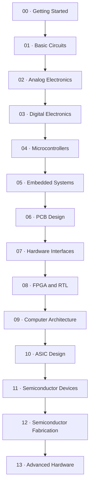

<h1 align="center">🧭 Hardware Atlas</h1>

<em>A practical, ascending path from your first circuit to custom silicon.</em>

  
  
  
  
  
  

⭐ <strong>If this repository helps you build something, star it.</strong> Stars are how the next person searching "learn hardware from scratch" finds this instead of a dead forum thread.

---

Hardware Atlas is a project-first roadmap for learning hardware by **building, measuring, and debugging real things** not by reading fourteen chapters before touching a breadboard. Every lesson tells you what to buy, what to build, what to measure, and what's likely to go wrong, in that order.

> 💡 **Philosophy in one line:** predict it with math, build it, measure it, and compare the two. If $V = IR$ doesn't match what your multimeter says, the disagreement is the lesson, not the failure.

This is **not a rigid curriculum**. Treat it like [awesome-electronics](https://github.com/kitspace/awesome-electronics): a curated map you dip into, not a checklist you're graded on. Skip what you already know. Jump to what interests you. Come back for the rest later.

## 📑 Table of contents

- [🗺️ The roadmap](#️-the-roadmap)
- [🔍 All 14 levels, in detail](#-all-14-levels-in-detail)
- [📚 All 31 lessons](#-all-31-lessons)
- [🧰 Practical guides](#-practical-guides)
- [⚡ Find something quickly](#-find-something-quickly)
- [🧪 Projects beyond the roadmap](#-projects-beyond-the-roadmap)
- [🎓 GATE 2027 alongside the roadmap](#-gate-2027-alongside-the-roadmap)
- [🇮🇳 Sourcing hardware in India](#-sourcing-hardware-in-india)
- [🤝 Contributing](#-contributing)
- [📄 License](#-license)

## How to use this repository

1. Find your current level below.
2. Read the lesson page **before** buying anything it lists parts, tools, tests, and likely mistakes.
3. Build the smallest version. Measure it. Write down what you actually observed.
4. Follow the lesson's **What to build next** link. Don't skip the measurement step just because the LED lit up.

The `lessons/` directory holds the detailed build pages. The `resources/` directory covers sourcing, tools, safety, simulation, and help. The `projects/` directory documents the format for contributed, non-roadmap builds.

## 🗺️ The roadmap

This is the **suggested** order, not a locked gate. Each lesson page states its own prerequisites — if you already have them, skip straight to the interesting part.

| Level | Focus | Start here |
|---|---|---|
| 00 | Getting Started | Breadboard layout, multimeter basics, first measurements |
| 01 | Basic Circuits | Resistors, switches, transistors, RC circuits |
| 02 | Analog Electronics | Sensors, amplifiers, op-amps, filters |
| 03 | Digital Electronics | Logic, state, timers, counters |
| 04 | Microcontrollers | GPIO, ADC, PWM, serial devices |
| 05 | Embedded Systems | Sensors, protocols, RTOS, custom peripherals |
| 06 | PCB Design | Schematic to prototype |
| 07 | Hardware Interfaces | Reliable buses and links |
| 08 | FPGA and RTL | Synchronous logic and verification |
| 09 | Computer Architecture | Datapaths, memory, CPUs |
| 10 | ASIC Design | RTL to silicon flow |
| 11 | Semiconductor Devices | Device physics and models |
| 12 | Semiconductor Fabrication | Process flow and yield |
| 13 | Advanced Hardware | Reproduction and open research |

## 🔍 All 14 levels, in detail

<strong>Level 00 · Getting Started</strong> — click to expand

 

Learn how breadboards are actually wired internally, use a multimeter safely, build the first LED circuit, and take real voltage/current measurements. You're ready to move on when you can draw a simple circuit, identify its return path, and explain a measurement out loud.

1. **Breadboard map** — identify connected rows, power rails, the centre gap, and broken rails.
2. **Multimeter practice** — measure a battery, check continuity with power removed, measure resistance out of circuit, measure voltage across a powered circuit.
3. **LED circuit** — build and measure the first safe circuit. → [`lessons/01-led-circuit/`](lessons/01-led-circuit/README.md)
4. **Basic voltage and current measurements** — extend the LED circuit and voltage divider while learning correct meter placement.

<strong>Level 01 · Basic Circuits</strong> — click to expand

 

Ohm's law, polarity, switching, charge, discharge, and time constants — the vocabulary everything else is built on.

| # | Lesson | Main idea |
|---|---|---|
| 01 | [LED circuit](lessons/01-led-circuit/README.md) | Ohm's law, polarity, current limiting |
| 02 | [Voltage divider](lessons/02-voltage-divider/README.md) | Measured node voltage and loading |
| 03 | [Button and LED](lessons/03-button-and-led/README.md) | Switches and defined logic states |
| 04 | [Transistor switch](lessons/04-transistor-switch/README.md) | Low-side switching |
| 05 | [RC circuit](lessons/05-rc-circuit/README.md) | Charge, discharge, time constants |

<strong>Level 02 · Analog Electronics</strong> — click to expand

 

Bias, gain, loading, clipping, noise, and bandwidth — where ideal models start showing their limits.

| # | Lesson | Main idea |
|---|---|---|
| 06 | [Light sensor](lessons/06-light-sensor/README.md) | Turning light into a measurable voltage |
| 07 | [Transistor amplifier](lessons/07-transistor-amplifier/README.md) | Bias, gain, clipping |
| 08 | [Op-amp signal conditioner](lessons/08-op-amp-conditioner/README.md) | Feedback and supply limits |
| 09 | [Active filter](lessons/09-active-filter/README.md) | Cutoff frequency and measured response |

<strong>Level 03 · Digital Electronics</strong> — click to expand

 

Truth tables, reset behaviour, timing, defined logic levels, and switch bounce, before any of it hides inside a microcontroller.

| # | Lesson | Main idea | Status |
|---|---|---|---|
| 10 | [Logic gates](lessons/10-logic-gates/README.md) | 74HC logic, truth tables, pull resistors | ✅ |
| 11 | [Flip-flop and counter](lessons/11-flip-flop-counter/README.md) | State, clocks, reset, bounce | ✅ |
| — | 555 timer oscillator | Generate a clock, measure frequency and duty cycle | 🚧 planned |
| — | Simple digital clock | Clock + counters + decoding + display, no MCU shortcuts | 🚧 planned |

<strong>Level 04 · Microcontrollers</strong> — click to expand

 

Arduino, ESP32, and Pico boards as practical platforms before bare-MCU design. Verify with serial logs, sensor comparisons, and current measurements.

| # | Lesson | Main idea |
|---|---|---|
| 12 | [GPIO device](lessons/12-gpio-device/README.md) | Firmware inputs, outputs, debouncing |
| 13 | [Temperature logger](lessons/13-temperature-logger/README.md) | Sampling and recorded measurements |
| 14 | [UART and I2C device](lessons/14-uart-i2c-device/README.md) | Serial protocols and error handling |
| 15 | [PWM motor controller](lessons/15-pwm-motor-controller/README.md) | Drivers, current, motor noise |

<strong>Level 05 · Embedded Systems</strong> — click to expand

 

Moving from working demos to dependable firmware: STM32, ESP32, RTOS tasks, custom peripherals, bootloaders.

| # | Lesson | Main idea | Status |
|---|---|---|---|
| 16 | [STM32 peripheral project](lessons/16-stm32-peripheral/README.md) | Timers, ADC, UART, debugging | ✅ |
| 17 | [ESP32 connected sensor](lessons/17-esp32-connected-sensor/README.md) | Networking and failure paths | ✅ |
| 18 | [RTOS sensor logger](lessons/18-rtos-sensor-logger/README.md) | Tasks, queues, timing, recovery | ✅ |
| — | Custom peripheral | Register-based device over I2C/SPI/UART, both ends of the protocol | 🚧 planned |
| — | Bootloader exercise | Image validation, versioning, a recoverable update path | 🚧 planned |

<strong>Level 06 · PCB Design</strong> — click to expand

 

Converting a tested breadboard circuit into a schematic and a real two-layer PCB: footprints, design rules, decoupling, return paths, Gerbers, and revision control.

| # | Lesson | Main idea |
|---|---|---|
| 19 | [KiCad schematic capture](lessons/19-kicad-schematic-capture/README.md) | Design the regulated microcontroller schematic |
| 20 | [Two-layer PCB routing](lessons/20-two-layer-pcb-routing/README.md) | Route, run DRC, generate Gerbers |

<strong>Level 07 · Hardware Interfaces</strong> — click to expand

 

Framing, addressing, timing, termination, pull-ups, error handling, and recovery. Verify with a logic analyzer, not vibes.

| # | Lesson | Main idea |
|---|---|---|
| 21 | [Logic analyzer decode](lessons/21-logic-analyzer-decode/README.md) | Debug SPI or I2C timing and data |
| 22 | [CAN bus node](lessons/22-can-bus-node/README.md) | Build a terminated CAN link and inspect errors |

<strong>Level 08 · FPGA and RTL</strong> — click to expand

 

Synchronous RTL for counters, UART receivers, and memory-mapped peripherals. Verified with simulation, assertions, and synthesis reports, not just "it compiled."

| # | Lesson | Main idea |
|---|---|---|
| 23 | [Combinational arithmetic RTL](lessons/23-combinational-arithmetic-rtl/README.md) | Build and simulate a synthesizable ALU |
| 24 | [UART RX FSM](lessons/24-uart-rx-fsm/README.md) | Synchronize and receive asynchronous serial data |
| 25 | [cocotb Python testbench](lessons/25-cocotb-python-testbench/README.md) | Automate RTL verification |

<strong>Level 09 · Computer Architecture</strong> — click to expand

 

From an ALU and register file toward a CPU, memory system, and simulated peripheral. Verify with reference models and waveforms, not assumptions.

| # | Lesson | Main idea |
|---|---|---|
| 26 | [RISC-V single-cycle datapath](lessons/26-riscv-single-cycle-datapath/README.md) | Implement and trace a small RV32I core |
| 27 | [Memory-mapped GPIO peripheral](lessons/27-memory-mapped-gpio-peripheral/README.md) | Connect RTL registers to a C driver |
| 28 | [Zephyr native-sim peripheral](lessons/28-zephyr-native-sim-peripheral/README.md) | Test a simulated peripheral and driver on the host |

<strong>Level 10 · ASIC Design</strong> — click to expand

 

Synthesizable RTL through gates, standard-cell layout, and an open shuttle flow. Verification and documented limitations come **before** anything gets taped out.

| # | Lesson | Main idea |
|---|---|---|
| 29 | [Yosys RTL synthesis](lessons/29-yosys-rtl-synthesis/README.md) | Map RTL to gates and inspect area |
| 30 | [OpenLane Sky130 flow](lessons/30-openlane-sky130-flow/README.md) | Run an open RTL-to-GDSII flow |
| 31 | [Magic DRC and LVS verification](lessons/31-magic-drc-lvs-verification/README.md) | Verify layout rules and connectivity |

<strong>Level 11 · Semiconductor Devices</strong> — click to expand

 

Diode, BJT, and MOSFET behaviour through controlled measurements, small-signal models, SPICE, and temperature variation. Stay within device ratings and record uncertainty for every experiment — this is where $E = h\nu$ stops being a formula from a textbook and starts being the reason your LED emits a specific color.

*No dedicated lesson files yet — this level is theory and simulation-driven. See [Simulation](resources/simulation.md).*

<strong>Level 12 · Semiconductor Fabrication</strong> — click to expand

 

Wafer preparation, oxidation, deposition, lithography, etch, implantation, metallisation, packaging, and yield through process models and simulation.

> ⚠️ **This level is not a home chemistry project.** Study it through models, simulators, and supervised teaching facilities only.

<strong>Level 13 · Advanced Hardware</strong> click to expand

 

Choose a research question, reproduce a paper's result, investigate open hardware, quantify uncertainty, and publish enough source, data, and limitations for someone else to check your work independently.

**Next:** choose a deeper branch, revisit a project that didn't work the first time, or [contribute a verified lesson](#-contributing) back to Hardware Atlas.

## 📚 All 31 lessons

Grouped by category for quick scanning. Ordering shows progression, not a prerequisite chain.

### Foundations

| # | Lesson | Path |
|---|---|---|
| 01 | LED Circuit | [`lessons/01-led-circuit/`](lessons/01-led-circuit/README.md) |
| 02 | Voltage Divider | [`lessons/02-voltage-divider/`](lessons/02-voltage-divider/README.md) |
| 03 | Button and LED | [`lessons/03-button-and-led/`](lessons/03-button-and-led/README.md) |
| 04 | Transistor Switch | [`lessons/04-transistor-switch/`](lessons/04-transistor-switch/README.md) |
| 05 | RC Circuit | [`lessons/05-rc-circuit/`](lessons/05-rc-circuit/README.md) |

### Analog

| # | Lesson | Path |
|---|---|---|
| 06 | Light Sensor | [`lessons/06-light-sensor/`](lessons/06-light-sensor/README.md) |
| 07 | Transistor Amplifier | [`lessons/07-transistor-amplifier/`](lessons/07-transistor-amplifier/README.md) |
| 08 | Op-Amp Signal Conditioner | [`lessons/08-op-amp-conditioner/`](lessons/08-op-amp-conditioner/README.md) |
| 09 | Active Filter | [`lessons/09-active-filter/`](lessons/09-active-filter/README.md) |

### Digital

| # | Lesson | Path |
|---|---|---|
| 10 | Logic Gates | [`lessons/10-logic-gates/`](lessons/10-logic-gates/README.md) |
| 11 | Flip-Flop Counter | [`lessons/11-flip-flop-counter/`](lessons/11-flip-flop-counter/README.md) |
| 23 | Combinational Arithmetic RTL | [`lessons/23-combinational-arithmetic-rtl/`](lessons/23-combinational-arithmetic-rtl/README.md) |
| 24 | UART RX FSM | [`lessons/24-uart-rx-fsm/`](lessons/24-uart-rx-fsm/README.md) |

### Microcontrollers and embedded

| # | Lesson | Path |
|---|---|---|
| 12 | GPIO Device | [`lessons/12-gpio-device/`](lessons/12-gpio-device/README.md) |
| 13 | Temperature Logger | [`lessons/13-temperature-logger/`](lessons/13-temperature-logger/README.md) |
| 14 | UART I2C Device | [`lessons/14-uart-i2c-device/`](lessons/14-uart-i2c-device/README.md) |
| 15 | PWM Motor Controller | [`lessons/15-pwm-motor-controller/`](lessons/15-pwm-motor-controller/README.md) |
| 16 | STM32 Peripheral | [`lessons/16-stm32-peripheral/`](lessons/16-stm32-peripheral/README.md) |
| 17 | ESP32 Connected Sensor | [`lessons/17-esp32-connected-sensor/`](lessons/17-esp32-connected-sensor/README.md) |
| 18 | RTOS Sensor Logger | [`lessons/18-rtos-sensor-logger/`](lessons/18-rtos-sensor-logger/README.md) |
| 28 | Zephyr Native-Sim Peripheral | [`lessons/28-zephyr-native-sim-peripheral/`](lessons/28-zephyr-native-sim-peripheral/README.md) |

### PCB and hardware

| # | Lesson | Path |
|---|---|---|
| 19 | KiCad Schematic Capture | [`lessons/19-kicad-schematic-capture/`](lessons/19-kicad-schematic-capture/README.md) |
| 20 | Two-Layer PCB Routing | [`lessons/20-two-layer-pcb-routing/`](lessons/20-two-layer-pcb-routing/README.md) |

### Communication and debug

| # | Lesson | Path |
|---|---|---|
| 21 | Logic Analyzer Decode | [`lessons/21-logic-analyzer-decode/`](lessons/21-logic-analyzer-decode/README.md) |
| 22 | CAN Bus Node | [`lessons/22-can-bus-node/`](lessons/22-can-bus-node/README.md) |

### RTL and verification

| # | Lesson | Path |
|---|---|---|
| 25 | cocotb Python Testbench | [`lessons/25-cocotb-python-testbench/`](lessons/25-cocotb-python-testbench/README.md) |
| 29 | Yosys RTL Synthesis | [`lessons/29-yosys-rtl-synthesis/`](lessons/29-yosys-rtl-synthesis/README.md) |

### Computer architecture

| # | Lesson | Path |
|---|---|---|
| 26 | RISC-V Single-Cycle Datapath | [`lessons/26-riscv-single-cycle-datapath/`](lessons/26-riscv-single-cycle-datapath/README.md) |
| 27 | Memory-Mapped GPIO Peripheral | [`lessons/27-memory-mapped-gpio-peripheral/`](lessons/27-memory-mapped-gpio-peripheral/README.md) |

### Open silicon

| # | Lesson | Path |
|---|---|---|
| 30 | OpenLane Sky130 Flow | [`lessons/30-openlane-sky130-flow/`](lessons/30-openlane-sky130-flow/README.md) |
| 31 | Magic DRC/LVS Verification | [`lessons/31-magic-drc-lvs-verification/`](lessons/31-magic-drc-lvs-verification/README.md) |

## 🧰 Practical guides

| Guide | Use it for |
|---|---|
| [Components](resources/components.md) | Buy parts as projects require them — not a warehouse upfront |
| [Tools](resources/tools.md) | A deliberately ascending workbench, budget to pro |
| [Power and batteries](resources/power-and-batteries.md) | Wiring and cell safety before you plug anything in |
| [Simulation](resources/simulation.md) | Test a complicated idea before ordering hardware |
| [Getting hardware in India](resources/india.md) | Distributors, Delhi NCR sourcing, inspection, returns |
| [Where to get help](resources/help.md) | Choose a community by problem type |
| [GATE alongside the roadmap](resources/gate.md) | Strengthen exam prep with project work, not the other way around |

## ⚡ Find something quickly

| I want to... | Open |
|---|---|
| Start from zero | [Level 00](#level-00--getting-started) |
| Learn basic circuits | [Level 01](#level-01--basic-circuits) |
| Learn analog electronics | [Level 02](#level-02--analog-electronics) |
| Learn digital logic | [Level 03](#level-03--digital-electronics) |
| Choose a development board | [Components](resources/components.md) → Level 04 |
| Buy parts in India | [Getting hardware in India](resources/india.md) |
| Choose tools | [Tools](resources/tools.md) |
| Check a circuit before building | [Simulation](resources/simulation.md) |
| Ask for help | [Where to get help](resources/help.md) |
| Study GATE alongside projects | [GATE guide](resources/gate.md) |
| Add a new project | [Projects](projects/README.md) and [Contributing](CONTRIBUTING.md) |

## 🧪 Projects beyond the roadmap

The 31 lessons above are reference points, not the ceiling. The [`projects/`](projects/README.md) directory documents how to structure and submit a project that doesn't fit the numbered roadmap: a modification, an extension, a teardown, a measurement study, or something built from scratch.

→ [Read the Projects hub](projects/README.md)

## 🎓 GATE 2027 alongside the roadmap

If you're also preparing for GATE, [`resources/gate.md`](resources/gate.md) has a curated set of resources mapped to the same subjects this roadmap already touches digital electronics, electronic devices, computer organization, and signals and systems — so exam prep and hands-on building reinforce each other instead of competing for time.

## 🇮🇳 Sourcing hardware in India

[`resources/india.md`](resources/india.md) covers distributors (Element14, Mouser, DigiKey, Robu, and others), Delhi NCR offline markets, component inspection for counterfeits, and return/replacement expectations. An `india.yml` companion is available for structured lookups once you've read the prose version.

## 🤝 Contributing

Read [CONTRIBUTING.md](CONTRIBUTING.md) before adding a project or resource. Please also follow the [Code of Conduct](CODE_OF_CONDUCT.md).

Good contributions are reviewed for technical clarity, reproducibility, useful documentation, reasonable sourcing, correct attribution, safe construction, and genuine educational value. A thoughtful breadboard experiment is just as welcome as an advanced PCB.

## 📄 License

Hardware Atlas is available under the [MIT License](LICENSE).

---

  Keep Learning!!! 
  ⭐ <strong>Star this repo</strong> if it helped you build something real.

