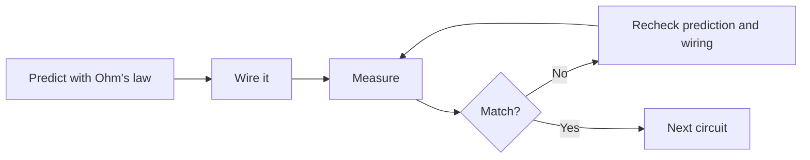

# Domain 00 -- Getting Started

Breadboard layout, multimeter basics, and the first real measurement. If you have never put a part into a board or held a probe, this is where to start. If you already have, skip it.

> [!NOTE]
> Nothing here is a gate. The point of the domain is that your first measurement is boring and safe, so the next one can be interesting. Its levels are the two exercises below; numbered lessons begin in [Domain 01](../01-basic-circuits/README.md).

## Prerequisites

No electronics background required. You only need a breadboard, a power source, and a multimeter. If you can already get a stable LED current reading without looking the board up, jump straight to [Domain 01](../01-basic-circuits/README.md).

## Core concepts

- How a breadboard is actually wired internally: rows, rails, the centre gap, broken rails
- Multimeter placement: voltage in parallel, current in series, resistance with power off
- Building the first LED circuit and taking real numbers from it
- Ohm's law as a check against what the meter says

## Exercises

| # | Exercise | What it builds |
|---|---|---|
| -- | Breadboard map | Identify connected rows, power rails, centre gap, broken rails |
| -- | Multimeter practice | Battery voltage, continuity, resistance, live readings |

The breadboard map and multimeter practice are exercises, not full lesson files. They are part of [Domain 00 in the root README](../../README.md#domain-00) and are short on purpose.

## The loop

## Common mistakes

- Measuring current in parallel instead of series, and finding the meter's fuse
- Checking resistance across a live circuit
- Forgetting the two power rails on one row are not connected
- Trusting a number that contradicts Ohm's law instead of re-checking the leads

## Resources

- [Tools](../../resources/tools.md) for choosing a multimeter or breadboard.
- [Components](../../resources/components.md) for understanding parts before buying them.
- [Opportunities](../../opportunities/README.md) for jobs and programs tagged to entry-level hardware work.

## Where to go from here

- [Domain 01](../01-basic-circuits/README.md) when you want resistors, switches, and time constants.
- Jump straight to any domain that interests you; the roadmap is a map, not a route.