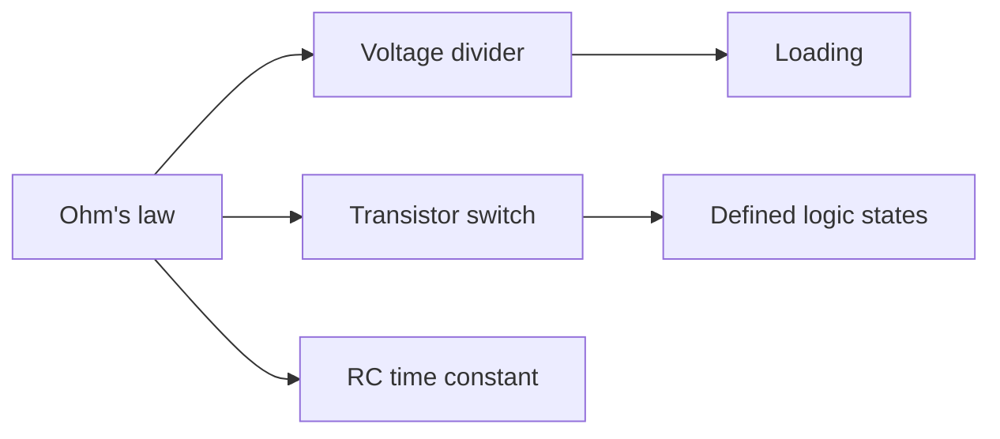

# Domain 01 -- Basic Circuits

Ohm's law, polarity, switches, charge and discharge, and time constants: the vocabulary every other domain reuses.

## Prerequisites

Work through [Domain 00](../00-getting-started/README.md) if wiring a breadboard or reading a multimeter is new. If you can already predict the current through a resistor from the drop across it, this domain goes fast. Read the level you are missing and move on.

## Core concepts

- Ohm's law as a working tool, not a formula to memorise
- Kirchhoff's laws as the accounting rules behind every divider and node you measure
- Voltage dividers, and why a load changes the number you measure
- Pull-up and pull-down resistors for defined logic states
- A BJT as a low-side switch, with the base resistor sized on purpose
- RC charge and discharge, and the tau = RC relation

Your two resistors in the divider lesson are the first live example of Kirchhoff's current law. Superposition, Thevenin, and Norton theorems are the same ideas pushed further; AICTE's *Network Theory* (EC06) teaches them formally, and they become mandatory once you start diagnosing real circuits in Domain 02.

## Levels

| Level | Name | Lessons | What it covers |
|---|---|---|---|
| 01 | [Ohm's law and dividers](levels/01-ohms-law-and-dividers/README.md) | 01–02 | The first safe build, and what a load does to a divider |
| 02 | [Switching](levels/02-switching/README.md) | 03–04 | Buttons, pull-ups, and low-side transistor switching |
| 03 | [Time constants](levels/03-time-constants/README.md) | 05 | RC charge and discharge, and the ~63% rule

## How the pieces connect

## Common mistakes

- Measuring a divider with a meter that loads it harder than the circuit you are testing
- Leaving a button input floating with no pull-up
- Sizing the base resistor right up against the absolute maximum, or skipping it entirely
- Reading tau as the time to fully charge instead of ~63%

## Resources

- [Simulation](../../resources/simulation.md) to check a circuit before you build it.
- [Tools](../../resources/tools.md) for the meter and power source you will use here.
- [Opportunities](../../opportunities/README.md) for entry-level hardware roles built on these fundamentals.

## Where to go from here

- [Domain 02](../02-analog-electronics/README.md) for sensors, amplifiers, and filters.
- [Domain 03](../03-digital-electronics/README.md) if digital logic pulls harder.
- Back to [Domain 00](../00-getting-started/README.md) to retrace any measurement habit you skipped.