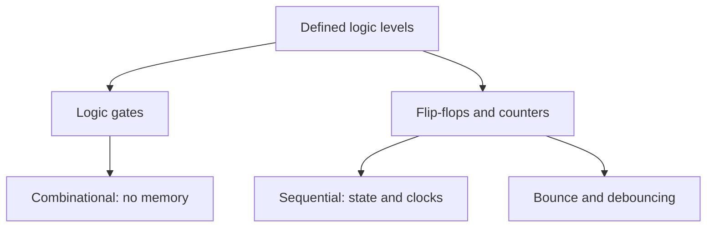

# Domain 03 -- Digital Electronics

Truth tables, reset behaviour, timing, defined logic levels, and switch bounce. All of this before it hides inside a microcontroller and you stop thinking about it.

## Prerequisites

[Domain 01](../01-basic-circuits/README.md) is enough to start; [Domain 02](../02-analog-electronics/README.md) helps once you care about noise margins. If you can explain why a floating input is a bad idea and what a flip-flop remembers, you can skip ahead and only read the level you need.

## Core concepts

- 74HC logic families and the voltages they call high and low
- Combinational logic: gates, truth tables, where the current actually flows
- Boolean algebra and K-maps as the way to simplify what you build
- Sequential logic: flip-flops, clocks, reset, and what remembers
- Switch bounce, and the debouncing that nobody believes is necessary until it isn't

AICTE's *Digital System Design* (EC03) builds on these four bullets with the combinational building blocks you will meet again in RTL: comparators, multiplexers, encoders and decoders, adders and barrel shifters, and the ALU. [Lesson 23](../../lessons/23-combinational-arithmetic-rtl/README.md) in [Domain 08](../08-fpga-and-rtl/README.md) turns exactly that list into Verilog. The syllabus also covers logic family specifications — noise margin, propagation delay, fan-in and fan-out, tristate outputs — which is the vocabulary for the shared buses in [Domain 07](../07-hardware-interfaces/README.md). None of that replaces a 555 and a handful of counters on a breadboard first.

## Levels

| Level | Name | Lessons | What it covers |
|---|---|---|---|
| 01 | [Logic and state](levels/01-logic-and-state/README.md) | 10–11 | Gates, truth tables, flip-flops, reset, bounce |

## Combinational and sequential

## Common mistakes

- Floating inputs, which are not "off" so much as "at whatever charge they happen to hold"
- Forgetting a reset state exists, and then wondering why the counter starts somewhere odd
- Ignoring bounce because the LED seemed fine, until a real counter mis-counts
- Assuming all logic families tolerate the same input voltages

## Resources

- [Simulation](../../resources/simulation.md) if you want to see a counter race before you wire it.
- [Tools](../../resources/tools.md) once tick-reading a clock becomes a reason to own an oscilloscope.
- [Opportunities](../../opportunities/README.md) for digital design and verification roles further down the roadmap.
- [HDLBits](https://hdlbits.01xz.net/wiki/Main_Page) converts the same logic into Verilog practice for the jump to Domain 08.

## Where to go from here

- [Domain 04](../04-microcontrollers/README.md) applies the same ideas in firmware, where the bounce is now someone else's problem to solve in software.
- [Domain 08](../08-fpga-and-rtl/README.md) if you want to keep designing logic directly.
- Back to [Domain 02](../02-analog-electronics/README.md) for the analog edges that feeding a logic chip cleanly depends on.