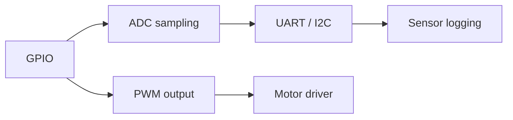

# Domain 04 -- Microcontrollers

Arduino, ESP32, and Pico boards as practical platforms before you go bare-metal. Verify with serial logs, sensor comparisons, and current measurements, not just a blinking LED.

## Prerequisites

[Domain 03](../03-digital-electronics/README.md) teaches the logic levels and pull-ups this domain assumes. If you only want PWM motor control, you do not need to build the temperature logger first — each lesson here is self-contained.

## Core concepts

- GPIO as firmware: inputs, outputs, and why the pull-up is still your problem
- ADC sampling: resolution, reference, and noise on the reading
- UART and I2C as things you can see on pins, not just library calls
- PWM for motor speed, and the current and back-EMF that come with it
- Timers and interrupts, the two peripherals [Domain 05](../05-embedded-systems/README.md) quietly depends on

AICTE's *Microcontrollers* (EC12) is broader than this domain: memory interfacing, instruction sets, DMA, and the 8085/8051-to-ARM arc. This roadmap deliberately skips the legacy microprocessors and starts you on the boards you can actually buy. Interrupts are the piece of that syllabus worth reaching for here — every sensor you log in Domain 05 will be received from an interrupt, and none of the library calls will say so.

## Levels

| Level | Name | Lessons | What it covers |
|---|---|---|---|
| 01 | [GPIO and measurement](levels/01-gpio-and-measurement/README.md) | 12–13 | Firmware inputs and outputs, sampling, logging |
| 02 | [Serial and motor control](levels/02-serial-and-motor-control/README.md) | 14–15 | UART/I2C protocols, PWM drivers, current |

## How the peripherals fit

## Common mistakes

- Sinking too much current from a GPIO pin and letting the magic smoke out
- Forgetting a common ground between the board and whatever you wired it to
- Believing the serial log report over a meter reading of the actual pin
- Ignoring back-EMF across a motor and wondering why the board resets

## Resources

- [Components](../../resources/components.md) for choosing a development board.
- [Wokwi](https://wokwi.com/) lets you sketch and simulate firmware before you own the hardware.
- [Opportunities](../../opportunities/README.md) for embedded and firmware roles that start exactly here.

## Where to go from here

- [Domain 05](../05-embedded-systems/README.md) when you want firmware that has to keep working when things fail.
- [Domain 06](../06-pcb-design/README.md) to move a prototype off the breadboard.
- Back to [Domain 03](../03-digital-electronics/README.md) when a floating input reappears as a dashboard bug.