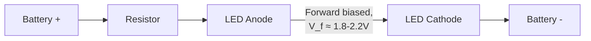

# 01-LED Circuit

A single LED lit up safely by a battery, using a resistor to protect it. This is the smallest complete circuit in electronics, and it teaches you the four ideas everything else is built on: voltage, current, resistance, and Ohm's law.

- **Difficulty:** Absolute beginner
- **Prerequisites:** None
- **Approximate time:** 15 to 30 minutes
- **What you'll build:** An LED and resistor on a breadboard, powered by a battery, wired correctly the first time instead of by trial and error

## Why build this?

Every circuit in this repository, from a voltage divider to an RTOS sensor logger, assumes you already understand what happens when current meets resistance. This project is where that understanding stops being abstract. You will pick a resistor value using a formula instead of a guess, and then verify with a multimeter that the formula was right.

This also sets up [Lesson 2: Voltage Divider](../02-voltage-divider/README.md) directly. Once you understand what a single resistor does to current, the next question is what two resistors in series do to voltage.

## What you'll learn

- What voltage, current, and resistance actually mean, as things you can predict with a formula, not just words on a datasheet.
- Ohm's law (`V = I x R`) and how to use it to pick a resistor value.
- Why an LED needs a current-limiting resistor in series, and what happens if you skip it.
- LED polarity: why it only lights one way, and how to tell anode from cathode by looking at it.
- How to read a resistor's value from its color bands.
- Basic breadboard wiring: how the rows and rails are connected internally.

## What you need

| Item | Type | Quantity | Purpose |
|---|---|---:|---|
| LED (5mm, any color) | Component | 1 | Red or green have the lowest forward voltage and are the most forgiving to start with |
| Resistor, 220Ω–330Ω | Component | 1 | Limits current through the LED; 330Ω is the standard safe default for a 9V or 2xAA supply |
| Breadboard | Tool | 1 | Solderless prototyping surface |
| Jumper wires | Tool | 2–3 | Connections between battery, resistor, and LED |
| 9V battery + snap connector, or 2xAA holder (3V) | Component | 1 | Power source |
| Multimeter | Tool (optional) | 1 | Used in the Verify section; not required to complete the build |

## Before you build

An LED is a diode: current can only flow through it in one direction, from the anode (positive leg, usually longer) to the cathode (negative leg, usually shorter, next to a flat edge on the plastic body).

An LED has a forward voltage (V_f), the voltage it "uses up" once it's conducting. A typical red LED has V_f around 1.8–2.2V. This is not adjustable; it's a property of the semiconductor junction inside the part.

Connect an LED directly across a battery with nothing else in the circuit, and it will try to draw far more current than it's rated for, because its resistance drops sharply once it starts conducting. That extra current becomes heat, and the LED burns out, sometimes instantly. This is why every LED circuit needs a series resistor to limit current to a safe value, typically 10–20 mA for a standard 5mm LED.

The resistor value comes directly from Ohm's law. The supply voltage splits between the resistor and the LED. What's left over for the resistor is:

$$V_{resistor} = V_{supply} - V_f$$

And from Ohm's law, the resistor needed for a target current `I` is:

$$R = \frac{V_{resistor}}{I} = \frac{V_{supply} - V_f}{I}$$

For a 9V battery, a red LED (V_f ≈ 2V), and a target current of 15mA (0.015A):

$$R = \frac{9 - 2}{0.015} = 467\ \Omega$$

330Ω is a common standard value that gives slightly more current than this (brighter, still safe), which is why most kits include it and it's the usual recommendation.

## How it works

| Component | Role |
|---|---|
| Battery | Supplies the total voltage the circuit has to work with |
| Resistor | Drops the excess voltage above the LED's forward voltage and limits current to a safe value |
| LED | Converts current into light once forward biased past its V_f; blocks current entirely in reverse |

The mermaid diagram above shows the circuit-level view: current flows in one loop, and the LED only conducts once forward biased. At the semiconductor level, forward bias means the p-n junction inside the LED is letting both electrons and holes cross and recombine, releasing that energy as light:

*Figure 9, "LED p-n junction at forward bias," from Schirripa Spagnolo, G.; Leccese, F.; Leccisi, M. "LED as Transmitter and Receiver of Light: A Simple Tool to Demonstration Photoelectric Effect." Crystals 2019, 9(10), 531. https://doi.org/10.3390/cryst9100531. Licensed under CC BY.*

The resistor and LED are in series, so the same current flows through both, and their voltage drops add up to the supply voltage. This is the whole circuit: nothing is hidden, which is exactly why it's the right first project.

## Build it

1. Insert the LED into the breadboard so its two legs sit in **different** rows. Placing both legs in the same row shorts the LED.
2. Insert the resistor so one end shares a row with the LED's anode (longer leg), and the other end is free.
3. Connect a jumper wire from the resistor's free end to the battery's positive terminal (via the breadboard's positive rail if you're using it).
4. Connect a jumper wire from the LED's cathode (shorter leg, flat-edge side) to the battery's negative terminal or ground rail.
5. Connect the battery. The LED should light immediately.
6. If it doesn't light, don't assume it's broken. Flip the LED around first; it's the single most common mistake at this stage.

## Verify it

If you have a multimeter:

- Measure the voltage across the LED alone (probe its two legs). It should read close to its rated forward voltage (≈1.8–2.2V for red).
- Measure the voltage across the resistor alone. It should be roughly `V_supply - V_LED`.
- Using the resistor's measured voltage and its labeled value, calculate current with Ohm's law (`I = V/R`) and compare it to the target you calculated above.
- Swap in a different resistor value (say, 1kΩ instead of 330Ω) and observe that the LED gets noticeably dimmer. This is you directly seeing current control brightness.

If you don't have a multimeter yet, at minimum observe: the LED lights when correctly oriented, and does not light (but is undamaged) when reversed, since the diode simply blocks current in that direction.

## What should you see?

With a 330Ω resistor and a 9V supply, expect roughly 20mA through a red LED and a steady, comfortably bright glow, not a flicker or a dim glow. The LED should light the instant the battery is connected, with no delay and no warmup.

## Troubleshooting

| Symptom | Possible cause | What to check |
|---|---|---|
| LED does not light at all | Reversed polarity | Flip the LED; check that the longer leg (anode) faces the resistor/positive side |
| LED does not light at all | Broken breadboard connection | Reseat every leg and jumper wire fully; a leg that looks inserted may not be making contact |
| LED lights very briefly then goes dark or dims permanently | No resistor, or a resistor value far too low | Confirm a resistor is actually in the current path, not just sitting nearby on the board |
| LED both legs in the same row | Short circuit | Move one leg to a different row; verify with the multimeter's continuity mode if unsure |
| LED is dim but not off | Resistor value too high for the intended brightness | Recalculate using the formula above and try a lower value within the safe range |

Debug in this order: confirm power is actually reaching the breadboard rail first, then check continuity through the resistor and LED leg by leg, then check orientation, and only then start swapping component values.

## Common mistakes

- **LED inserted backwards.** It won't be damaged, it just won't light. Flip it.
- **No resistor at all.** The LED may briefly light very brightly, then dim permanently or fail outright. Never skip the resistor, even "just to test."
- **Both LED legs in the same breadboard row.** This shorts the LED and prevents current from ever reaching it properly.
- **Resistor value far too low** (say, 10Ω instead of 330Ω) still lets through too much current, especially with a 9V supply. When in doubt, start with a slightly higher resistor value; you can always go lower if it's too dim.
- **Loose breadboard connections.** LEDs and resistor legs that aren't pushed in fully create an intermittent circuit that looks like a bad component but isn't.

## Think about it

- What happens to the LED's brightness if you double the resistor value?
- Why does a green LED often behave slightly differently from a red LED at the same resistor value?
- What would happen if you removed the resistor entirely, even for one second?
- Why is the resistor's position in the series loop (before or after the LED) irrelevant to how the circuit behaves?
- How would you measure the current through the LED without breaking the circuit open to insert the meter in series?

## Experiment with it

- Change the resistor value across a few steps (1kΩ, 470Ω, 330Ω, 220Ω) and record brightness and measured current at each.
- Swap the red LED for a blue or white one and recalculate the resistor value for its higher forward voltage (typically 3.0–3.4V).
- Compare a 9V supply against a 2xAA (3V) supply using the same LED and recalculate the resistor value for each.
- Build the same circuit in simulation first, then compare simulated current against what you actually measure on the breadboard.

## Simulation

Before wiring this on a physical breadboard, it's worth simulating it to sanity-check your resistor calculation.

**ESP32-LED+resistor** by [infernall8](https://wokwi.com/makers/infernall8) on Wokwi: [https://wokwi.com/projects/376566491477694465](https://wokwi.com/projects/376566491477694465)

Compare the simulated current through the resistor against the value you calculated by hand in "Before you build," and again against what you measure on real hardware once it's built. Small differences are expected (tolerance, real V_f variation); large differences mean something in the wiring or component choice is wrong.

## Recommended viewing

### Breadboarding an easy LED circuit.

A short, direct demonstration of exactly this circuit being built on a breadboard with a schematic shown alongside it, useful for seeing the physical layout translate from the schematic in real time.

[Watch on YouTube](https://www.youtube.com/watch?v=JIj1c3qkUDE)

## Further reading

- **Tutorial:** [SparkFun, Light-Emitting Diodes (LEDs)](https://learn.sparkfun.com/tutorials/light-emitting-diodes-leds) — the core reference for how an LED works and why forward voltage matters here.
- **Tutorial:** [SparkFun, Resistors](https://learn.sparkfun.com/tutorials/resistors) — how to read color codes and pick a value, which is exactly what this lesson asks you to do by hand.
- **Reference:** [SparkFun, Diodes](https://learn.sparkfun.com/tutorials/diodes) — the general theory an LED is a specific case of.
- **Reference:** [DigiKey resistor color code calculator](https://www.digikey.com/en/resources/conversion-calculators/conversion-calculator-resistor-color-code) — quick lookup so you don't have to memorize the color code chart yet.
- **Simulation:** [Falstad circuit simulator](https://www.falstad.com/circuit/) — test resistor values on a virtual LED circuit before building, with live current animation.
- **Application note / paper:** Schirripa Spagnolo, G.; Leccese, F.; Leccisi, M. ["LED as Transmitter and Receiver of Light: A Simple Tool to Demonstration Photoelectric Effect."](https://doi.org/10.3390/cryst9100531) *Crystals* 2019, 9(10), 531 — the source of the p-n junction figure above; useful if you want to go past "the resistor limits current" into what's actually happening inside the junction.

## Hardware Atlas resources

### Components
If you want to understand resistors, LEDs, or diodes at a deeper level than this lesson covers: [Explore Components](../resources/components.md)

### Tools
For choosing a first multimeter or understanding what it's actually measuring: [See Tools](../resources/tools.md)

### Simulation
For more simulators beyond Wokwi and Falstad: [See Simulation](../resources/simulation.md)

### Help
If the LED still won't light after working through Troubleshooting: [See Hardware Help](../resources/help.md)

## Sourcing

Every part in this lesson is cheap, common, and available from almost any electronics supplier or hobby kit. For India-specific sourcing, including where to buy resistor/LED assortments locally: [See India Resources](../resources/india.md)

## Going deeper

This circuit looks trivial, but the resistor-as-current-limiter idea it teaches shows up everywhere: pull-up and pull-down resistors on GPIO pins, current-sense resistors in power circuits, base resistors on transistor switches, and gate resistors on MOSFETs. The math doesn't get more complicated later, the parts around it do.

## Where this fits in Hardware Atlas

Move to [Lesson 2: Voltage Divider](../02-voltage-divider/README.md). You already understand Ohm's law and a single resistor's effect on current; the next step is what happens with two resistors in series, and how that lets you create any voltage you want from a fixed supply.
