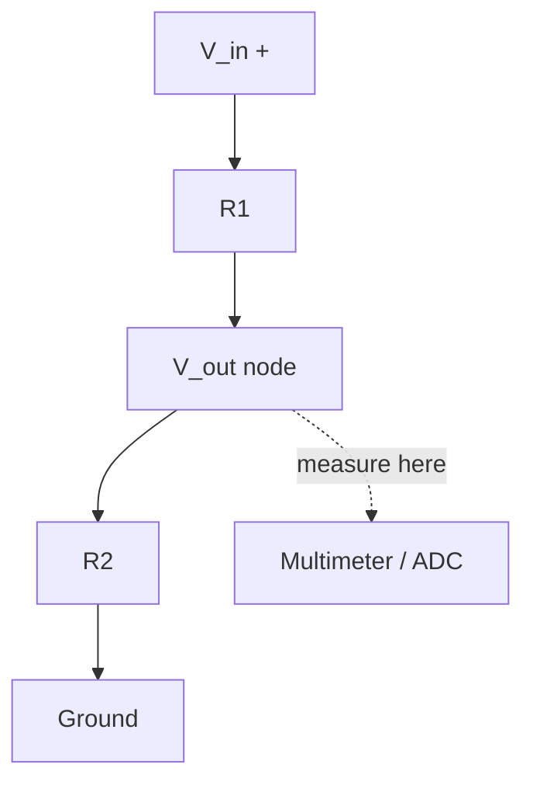

# 02-Voltage Divider

Two resistors in series, sharing a supply voltage between them. This is the simplest way to turn one fixed voltage into any smaller voltage you want, and it's the circuit hiding inside almost every analog sensor interface you'll ever build.

- **Difficulty:** Absolute beginner
- **Prerequisites:** [Lesson 1: LED Circuit](../01-led-circuit/README.md)
- **Approximate time:** 15 to 30 minutes
- **What you'll build:** Two resistors on a breadboard that split a battery voltage into a smaller, predictable output voltage, measured with a multimeter

## Why build this?

Lesson 1 taught you what a single resistor does to current. This lesson asks a different question: what do two resistors in series do to voltage? The answer is the voltage divider, and it shows up everywhere from reading a potentiometer to scaling a sensor's output down to a range a microcontroller's ADC can safely read (you'll use this directly in [Lesson 6: Light Sensor](../06-light-sensor/README.md)).

Nothing here draws current the way an LED does. This is a pure "watch the numbers on a multimeter match the formula" lesson, and that's the point: it builds trust in Ohm's law before you start combining it with active components.

## What you'll learn

- Why voltage divides in proportion to resistance when two resistors share a series current.
- The voltage divider formula and how to use it to hit a target output voltage.
- The difference between an unloaded divider and one feeding a real load, and why that matters.
- How to measure voltage at a node versus across a component.
- Why a divider is a poor choice for supplying real power, but a great choice for a signal.

## What you need

| Item | Type | Quantity | Purpose |
|---|---|---:|---|
| Resistor, 10kΩ | Component | 2 | One pair for the basic 50/50 divider |
| Resistor, 1kΩ and 10kΩ | Component | 1 each | Second pair to build an unequal, more useful ratio |
| Breadboard | Tool | 1 | Solderless prototyping surface |
| Jumper wires | Tool | 2–3 | Connections between battery and resistors |
| 9V battery + snap connector, or 2xAA holder | Component | 1 | Power source |
| Multimeter | Tool | 1 | Required this time — this lesson is measurement-driven |

## Before you build

Take two resistors, R1 and R2, and wire them in series across a supply voltage `V_in`. Because they're in series, the same current `I` flows through both. Ohm's law gives the voltage across each:

$$V_{R1} = I \times R1 \qquad V_{R2} = I \times R2$$

The output you actually use is measured at the **midpoint**, the junction between R1 and R2, relative to ground. That output is:

$$V_{out} = V_{in} \times \frac{R2}{R1 + R2}$$

Notice what this formula says: the output depends only on the *ratio* of R1 to R2, not their absolute values. A 1kΩ/1kΩ divider and a 100kΩ/100kΩ divider both produce exactly half of `V_in`. The absolute values only matter for how much current the divider draws — smaller resistors draw more current and waste more power as heat; larger resistors draw less current but become more sensitive to whatever you connect to the output (see "loading" below).

For a 9V supply with R1 = R2 = 10kΩ:

$$V_{out} = 9 \times \frac{10k}{10k + 10k} = 4.5V$$

**Loading matters.** The formula above assumes nothing is drawing current from the output node except R2. If you connect a load (like a sensor input or another resistor) to `V_out`, that load effectively goes in parallel with R2, changing the ratio and pulling `V_out` down from what the formula predicts. A microcontroller's ADC pin draws negligible current and barely loads a divider; a motor or LED would load it heavily and should never be powered directly from one.

## How it works

| Component | Role |
|---|---|
| R1 | Drops the portion of the supply voltage above the desired output |
| R2 | Drops the remaining voltage; the junction between R1 and R2 is your output |
| Multimeter / ADC | Reads the voltage at the midpoint without materially disturbing the divider |

Current flows from `V_in`, through R1, through R2, to ground, in one uninterrupted loop. The voltage at the midpoint is simply whatever's "left over" after R1 has taken its share — which is exactly R2's share, in proportion to its resistance relative to the total.

## Build it

1. Insert R1 into the breadboard with one end in a free row.
2. Insert R2 so one end shares a row with R1's other end (this shared row is your `V_out` node) and the other end is in a separate free row.
3. Jumper from R1's free end to the battery's positive terminal.
4. Jumper from R2's free end to the battery's negative terminal / ground rail.
5. Connect the battery.
6. Probe the midpoint row (where R1 and R2 meet) with your multimeter's red lead, and ground with the black lead.

## Verify it

- With R1 = R2 = 10kΩ and a 9V supply, expect `V_out ≈ 4.5V`.
- Swap R2 for 1kΩ (keep R1 at 10kΩ) and recalculate: `V_out = 9 × 1k/11k ≈ 0.82V`. Measure it — it should be close.
- Swap R1 for 1kΩ instead (keep R2 at 10kΩ): `V_out = 9 × 10k/11k ≈ 8.18V`. Notice the divider is now biased toward the *high* end.
- Touch a third resistor (say, another 1kΩ) from the output node to ground, in parallel with R2, and watch `V_out` measurably drop from what the unloaded formula predicted. This is loading, happening in real time.

## What should you see?

A steady DC voltage at the midpoint that matches the formula within your resistors' tolerance (typically ±5%). No flicker, no drift once the battery is connected — this is a static circuit.

## Troubleshooting

| Symptom | Possible cause | What to check |
|---|---|---|
| Reads 0V at the midpoint | Meter probing the wrong row, or R2 shorted to ground before the midpoint | Re-trace which row is genuinely between R1 and R2 |
| Reads full supply voltage at the midpoint | R2 not actually connected, so no current path to ground | Check R2's legs are seated in the correct rows |
| Reading is close but not exact | Resistor tolerance (most are ±5%) | Use the multimeter's resistance mode to measure actual R1/R2 values and recompute |
| Reading drifts when you touch the board | Loose breadboard contact, not a real signal change | Reseat every leg fully |

## Common mistakes

- **Measuring across a resistor instead of at the midpoint to ground.** These are different quantities — always measure `V_out` relative to ground unless you specifically want the drop across one resistor.
- **Assuming a divider can power a component.** It can supply a *signal* voltage to a high-impedance input (like an ADC), not real current to a motor or bright LED.
- **Forgetting resistor tolerance.** A "10kΩ" resistor might actually be 9.5–10.5kΩ; don't expect lab-perfect numbers from ±5% parts.

## Think about it

- If you needed exactly 3.3V from a 9V supply, what ratio of R1 to R2 would you pick?
- Why does making both resistors larger (say, 100kΩ and 100kΩ instead of 10kΩ and 10kΩ) reduce the divider's power consumption without changing `V_out`?
- What happens to `V_out` as the load resistance connected to the output approaches the same value as R2?
- Why is a potentiometer just a voltage divider where R1 and R2 change in opposite directions as you turn the knob?

## Experiment with it

- Replace R2 with a potentiometer and sweep it while watching `V_out` change continuously.
- Build a 3.3V-from-9V divider and confirm the actual resistor ratio you'd need, then verify with real parts.
- Load the output with progressively smaller resistors and graph how far `V_out` deviates from the ideal formula.

## Simulation

Build this circuit in a free simulator before or after the physical build to sanity-check your numbers with live voltage readouts at each node.

- [Falstad circuit simulator](https://www.falstad.com/circuit/)
- [Wokwi](https://wokwi.com)

## Further reading

- [Wikipedia: Voltage divider](https://en.wikipedia.org/wiki/Voltage_divider) — the general theory, including the loaded-divider case.
- [DigiKey resistor color code calculator](https://www.digikey.com/en/resources/conversion-calculators/conversion-calculator-resistor-color-code) — for identifying the resistors you have on hand.

## Hardware Atlas resources

### Components
For a deeper look at resistors and how tolerance and power rating are chosen: [Explore Components](../../resources/components.md)

### Tools
For getting the most out of your multimeter beyond simple voltage readings: [See Tools](../../resources/tools.md)

### Help
If your measured values don't match the formula after checking the table above: [See Hardware Help](../../resources/help.md)

## Sourcing

Resistors in this range are sold in assortment packs and are the cheapest component in any kit. For India-specific sourcing: [See India Resources](../../resources/india.md)

## Going deeper

The voltage divider is the mental model behind potentiometers, thermistor-based temperature sensing, and reading any resistive sensor with a microcontroller ADC. Every "resistive sensor" project in this repository is a voltage divider with one fixed resistor and one variable one.

## Where this fits in Hardware Atlas

Move to [Lesson 3: Button and LED](../03-button-and-led/README.md). You now understand how voltage splits across series resistors; next you'll use a mechanical switch to control current on demand instead of leaving the circuit permanently closed.
