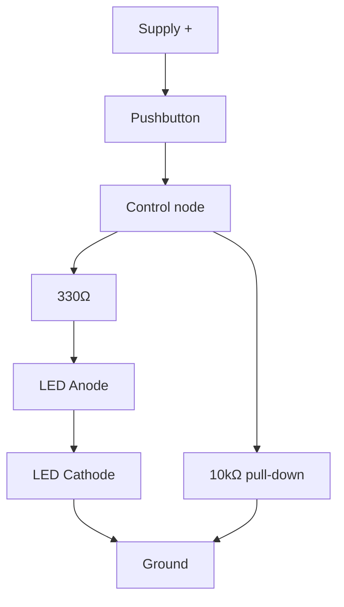

# 03-Button and LED

A pushbutton controlling an LED through nothing but wires and a resistor — no microcontroller yet. This lesson introduces the pull-up/pull-down resistor, the single most common source of confusion for anyone new to digital inputs.

- **Difficulty:** Absolute beginner
- **Prerequisites:** [Lesson 1: LED Circuit](../01-led-circuit/README.md)
- **Approximate time:** 20 to 30 minutes
- **What you'll build:** A momentary pushbutton that lights an LED only while pressed, plus a variant using a pull-down resistor

## Why build this?

Every microcontroller project you'll build later in this repository reads a button through a pull-up or pull-down resistor. Lesson 1 gave you an "always on" circuit; this lesson gives you a circuit with a state that changes based on user input. Understanding this purely with wires, before a single line of code is involved, makes the same concept trivial once you meet `digitalRead()` in [Lesson 12: GPIO Device](../12-gpio-device/README.md).

## What you'll learn

- Why a switch alone isn't enough — floating inputs and why they matter.
- How a pull-down resistor defines a default "off" state.
- How a 4-pin tactile pushbutton is wired internally (two pairs of legs, connected in pairs).
- Basic mechanical switch bounce, and why it matters more in code than in a simple LED circuit.

## What you need

| Item | Type | Quantity | Purpose |
|---|---|---:|---|
| LED (5mm) | Component | 1 | Visual output |
| Resistor, 330Ω | Component | 1 | Current-limits the LED |
| Resistor, 10kΩ | Component | 1 | Pull-down resistor for the button |
| Tactile pushbutton (4-pin) | Component | 1 | Momentary switch |
| Breadboard | Tool | 1 | Solderless prototyping surface |
| Jumper wires | Tool | 4–5 | Connections |
| 9V battery + snap connector, or 2xAA holder | Component | 1 | Power source |

## Before you build

A 4-pin tactile pushbutton has two internal pairs: pins on the same side are always connected to each other; pressing the button connects both pairs together. Straddling the button across the breadboard's central gap, with legs on opposite sides, is the standard orientation — check continuity with a multimeter if you're unsure which pins pair up.

The key problem this lesson solves: if you wire a switch so that pressing it simply *connects* a pin to power, what happens when it's *not* pressed? Nothing — that pin is "floating," electrically connected to nothing, and it will pick up random noise from nearby wires and its own capacitance. In a simple LED circuit this can show up as a faint, inconsistent glow when the button is released. In a microcontroller circuit it's worse: a floating digital input reads randomly as high or low.

A **pull-down resistor** fixes this by giving the pin a defined path to ground when the button isn't pressed:

- Button not pressed: the LED's control node is pulled to ground through the 10kΩ resistor. Defined "off."
- Button pressed: the button connects the node directly to the supply, overpowering the pull-down resistor (which limits how much current is "wasted" through it) and driving the node high. Defined "on."

The pull-down resistor value (10kΩ here) is a compromise: large enough that it doesn't waste much current when the button is pressed, small enough that it reliably pulls the node to ground when it isn't.

## How it works

| Component | Role |
|---|---|
| Pushbutton | Connects the control node to the supply only while physically pressed |
| Pull-down resistor (10kΩ) | Holds the control node at a defined 0V when the button is released |
| 330Ω resistor + LED | Same current-limited LED circuit from Lesson 1, now switched instead of always-on |

While the button is unpressed, the pull-down resistor and the LED branch form a path from the control node to ground with no source of current, so the node sits at 0V and the LED is off. Pressing the button connects the node to the supply; current now flows through the LED branch, and a much smaller amount "leaks" through the pull-down resistor to ground, which is why it needs to be a relatively high value.

## Build it

1. Place the pushbutton straddling the breadboard's center gap.
2. Wire one pin (top-left, say) to the battery's positive terminal.
3. Wire the diagonally opposite pin (bottom-right) to a free row — this is your control node.
4. From the control node, wire the 10kΩ resistor to the ground rail.
5. From the control node, wire the 330Ω resistor to the LED's anode; wire the LED's cathode to ground.
6. Connect the battery. The LED should be off.
7. Press the button. The LED should light only while held down.

## Verify it

- With a multimeter on the control node, confirm it reads ~0V unpressed and close to supply voltage while pressed.
- Try removing the pull-down resistor entirely and observe the LED flicker or glow faintly when unpressed — this is the floating-input problem made visible.
- Swap the 10kΩ pull-down for a 1kΩ and notice the circuit still works, but more current is now wasted through it while pressed (measure current draw at the battery if you have an ammeter-capable meter).

## What should you see?

The LED off with the button at rest, snapping on the instant the button is pressed and off the instant it's released, with no flicker in either state.

## Troubleshooting

| Symptom | Possible cause | What to check |
|---|---|---|
| LED stays on regardless of button state | Wrong pushbutton pins used (an always-connected pair) | Verify pin pairing with continuity mode before wiring |
| LED flickers when button is released | Missing or disconnected pull-down resistor | Confirm the 10kΩ resistor bridges the control node to ground |
| LED never lights, even pressed | Button not actually bridging the gap, or LED reversed | Check button orientation across the center gap; check LED polarity |
| LED very dim when pressed | Pull-down resistor value too low, stealing too much current | Increase pull-down value toward 10kΩ |

## Common mistakes

- **Wiring both pushbutton connections to the same internally-connected pair.** The button will appear to do nothing because that pair is always shorted.
- **Skipping the pull-down "because it works without it."** It may appear to work on the bench and fail intermittently once wires are longer or near other electronics.
- **Confusing pull-down with pull-up.** A pull-up ties the node to the supply by default and the button pulls it to ground instead — logically inverted, equally valid, and the standard choice on many microcontroller boards with internal pull-ups.

## Think about it

- How would you rewire this as a pull-*up* circuit instead, so the LED is on by default and turns off when pressed?
- Why does the pull-down resistor's value matter for current waste but not for the logic level itself?
- What would happen with no resistor at all between the button and the supply, straight to the control node, if that node were also tied directly to ground with a wire?
- Why do microcontrollers almost always offer an internal pull-up/pull-down option instead of requiring an external resistor?

## Experiment with it

- Rebuild as a pull-up circuit and verify the LED's default state flips.
- Add a second button and a second LED, each with its own pull-down, to build two independent switched circuits on one breadboard.
- Measure the control node voltage with a multimeter while slowly pressing the button partway, and notice how mechanical contact bounce can be seen as a jumpy reading right at the moment of contact.

## Simulation

- [Falstad circuit simulator](https://www.falstad.com/circuit/)
- [Wokwi](https://wokwi.com)

## Further reading

- [Wikipedia: Pull-up resistor](https://en.wikipedia.org/wiki/Pull-up_resistor) — covers both pull-up and pull-down configurations.
- [Wikipedia: Switch bounce](https://en.wikipedia.org/wiki/Switch#Contact_bounce) — the mechanical effect that becomes important once you read this circuit in code.

## Hardware Atlas resources

### Components
For more on switches, tactile buttons, and how their internal contacts are arranged: [Explore Components](../resources/components.md)

### Help
If the button circuit behaves unpredictably after working through Troubleshooting: [See Hardware Help](../resources/help.md)

## Sourcing

Tactile pushbuttons are sold in every basic component kit and cost only a few cents each. For India-specific sourcing: [See India Resources](../resources/india.md)

## Going deeper

Pull-up and pull-down resistors reappear on every digital input pin you'll ever wire: rotary encoders, limit switches, reed switches, and every GPIO pin on a microcontroller board. The 10kΩ default you used here is the same default value you'll reach for in nearly all of them.

## Where this fits in Hardware Atlas

Move to [Lesson 4: Transistor Switch](../04-transistor-switch/README.md). You've switched an LED with a mechanical button; next you'll switch it with a transistor instead, controlled by a small current — the basis of every circuit where a microcontroller needs to control something bigger than itself.