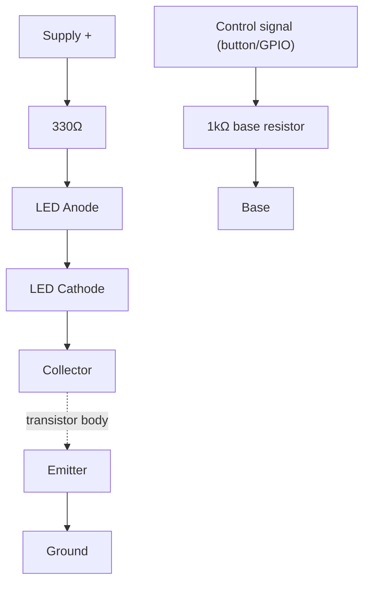
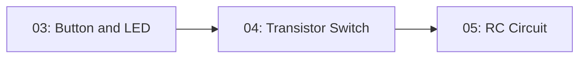

# 04-Transistor Switch

Using a small current to control a larger one, with a bipolar transistor standing in for a mechanical switch. This is the circuit that lets a 20mA microcontroller pin turn on a motor, relay, or a bank of LEDs that draw far more current than the pin can safely supply itself.

- **Difficulty:** Beginner
- **Prerequisites:** [Lesson 3: Button and LED](../03-button-and-led/README.md)
- **Approximate time:** 30 to 45 minutes
- **What you'll build:** An NPN transistor switching an LED on and off in response to a button, then swapped so the button is replaced by a low-current control signal

## Why build this?

You've switched an LED with a physical button. But a microcontroller pin can't be pressed by hand, and it can only supply a small, limited current. A transistor used as a switch is how a weak signal (a few milliamps from a GPIO pin) controls a much larger current (a motor, a relay coil, a strip of LEDs) without the small signal ever touching the big current directly. This is the circuit underneath [Lesson 15: PWM Motor Controller](../15-pwm-motor-controller/README.md).

## What you'll learn

- The three terminals of an NPN BJT — base, collector, emitter — and what each does.
- The difference between using a transistor as a switch (fully on or fully off) versus as an amplifier (the subject of [Lesson 7](../07-transistor-amplifier/README.md)).
- How to calculate a base resistor so the transistor saturates fully without wasting current.
- Why "saturation" is the goal for a clean digital switch.

## What you need

| Item | Type | Quantity | Purpose |
|---|---|---:|---|
| NPN transistor (2N2222 or BC547) | Component | 1 | Acts as the switch |
| LED (5mm) | Component | 1 | The switched load |
| Resistor, 330Ω | Component | 1 | Current-limits the LED, same as Lesson 1 |
| Resistor, 1kΩ | Component | 1 | Base resistor, limits current into the transistor's base |
| Tactile pushbutton | Component | 1 | Provides the control signal |
| Breadboard | Tool | 1 | Solderless prototyping surface |
| Jumper wires | Tool | 5–6 | Connections |
| 9V battery + snap connector | Component | 1 | Power source |
| Multimeter | Tool (optional) | 1 | For checking base-emitter voltage |

## Before you build

A bipolar NPN transistor has three legs: **base**, **collector**, and **emitter**. For a common part like the 2N2222 or BC547 in TO-92 package, check the datasheet pinout — it varies by part, and guessing wrong is the most common mistake in this lesson.

As a switch, the transistor has two states:

- **Cutoff (off):** no current flows into the base, so no current flows from collector to emitter. The load (the LED) is off.
- **Saturation (on):** enough current flows into the base that the transistor is fully "open," and current flows freely from collector to emitter, limited only by the load's own resistance (here, the 330Ω resistor and the LED).

To turn the transistor fully on, the base needs roughly 0.6–0.7V above the emitter (the base-emitter junction behaves like a diode) and enough current to drive it into saturation. The base resistor sets that current:

$$I_{base} = \frac{V_{control} - 0.7}{R_{base}}$$

For reliable saturation, you want the base current to be comfortably more than the load current divided by the transistor's current gain (hFE, typically 100–300 for small-signal transistors):

$$I_{base} \geq \frac{I_{collector}}{h_{FE}}$$

With a 9V control signal, a 1kΩ base resistor, and a typical hFE around 150:

$$I_{base} = \frac{9 - 0.7}{1000} \approx 8.3mA$$

That's far more than the roughly 20mA/150 ≈ 0.13mA minimum needed, which is deliberate — driving the base harder than the bare minimum guarantees full saturation even with a lower-gain transistor.

## How it works

| Component | Role |
|---|---|
| Transistor | Acts as a current-controlled switch between collector and emitter |
| Base resistor (1kΩ) | Limits current into the base so it isn't damaged by the control signal |
| 330Ω resistor + LED | The switched load, identical to Lesson 1's circuit, now placed on the collector side |

The LED's current no longer flows through the button or control source at all — it flows entirely through the collector-emitter path, sourced from the main supply. The control signal only has to supply the small base current; the transistor does the work of switching the larger current.

## Build it

1. Identify your transistor's pinout from its datasheet before placing it — do not guess.
2. Insert the transistor into the breadboard so each leg is in its own row.
3. Wire the collector to the LED's cathode (the LED's anode connects through the 330Ω resistor to the supply, same as Lesson 1).
4. Wire the emitter to ground.
5. Wire the base through the 1kΩ resistor to the pushbutton's output (the button's other side goes to the supply).
6. Connect the battery. The LED should be off with the button unpressed.
7. Press the button. The LED should light.

## Verify it

- Measure the voltage between base and emitter while the button is pressed; it should sit close to 0.6–0.7V, characteristic of a forward-biased silicon junction.
- Measure the voltage across collector and emitter while on; it should be very low (well under 0.5V) — this is what "saturation" looks like on a meter.
- Try increasing the base resistor to 10kΩ and confirm the LED still lights (base current is still enough) but dims if pushed to an extreme value like 100kΩ, where the transistor can no longer fully saturate.

## What should you see?

The LED off with the button released, and lighting at the same brightness as Lesson 1's direct circuit when pressed — the transistor, when saturated, drops so little voltage that it barely affects the LED's brightness.

## Troubleshooting

| Symptom | Possible cause | What to check |
|---|---|---|
| LED never lights | Wrong pinout (base/collector/emitter swapped) | Re-check the datasheet pinout for your exact part |
| LED stays dimly lit at all times | Base resistor missing or too low, transistor partially on | Confirm the base resistor is in the current path |
| LED lights but very dim when "on" | Transistor not reaching saturation | Lower the base resistor value or check your control voltage |
| Transistor gets warm | Load current too high for the part, or transistor not fully saturated (dissipating power) | Check the transistor's maximum collector current rating |

## Common mistakes

- **Reversing collector and emitter.** Many small transistors will technically conduct backwards but with much worse performance — always follow the datasheet, don't assume symmetry.
- **Skipping the base resistor.** The base-emitter junction is a diode with very low resistance once forward-biased; without a resistor, a control source can push damaging current through it.
- **Confusing this with the transistor amplifier circuit.** Here you deliberately drive the transistor into hard saturation (fully on/off); an amplifier deliberately keeps it in the linear region between those extremes.

## Think about it

- Why does a transistor switch let you control a load with a supply *voltage* completely different from the control signal's voltage?
- What happens to the LED if you make the base resistor small enough to exceed the transistor's maximum base current rating?
- Why is a flyback diode necessary when the load is an inductor (like a motor or relay coil) but not needed for an LED?
- How would you use a PNP transistor instead to build a "high-side" switch?

## Experiment with it

- Replace the pushbutton with a jumper wire manually touched to the supply, simulating a GPIO pin's output.
- Swap the LED for a small DC motor (with a flyback diode across it) and observe the same switching behavior with a different load.
- Measure the transistor's actual current gain by comparing base current and collector current at a known operating point, and compare it to the datasheet's typical hFE.

## Simulation

- [Falstad circuit simulator](https://www.falstad.com/circuit/)
- [Wokwi](https://wokwi.com)

## Further reading

- [Wikipedia: Bipolar junction transistor](https://en.wikipedia.org/wiki/Bipolar_junction_transistor) — covers both switching and amplifying operation in detail.
- [Wikipedia: Transistor–transistor logic](https://en.wikipedia.org/wiki/Transistor%E2%80%93transistor_logic) — for how this switching behavior scales up into digital logic families, relevant to [Lesson 10](../10-logic-gates/README.md).

## Hardware Atlas resources

### Components
For transistor packages, pinouts, and how to read a transistor datasheet: [Explore Components](../resources/components.md)

### Help
If the transistor won't switch cleanly after working through Troubleshooting: [See Hardware Help](../resources/help.md)

## Sourcing

2N2222 and BC547 transistors are inexpensive and stocked by nearly every electronics supplier. For India-specific sourcing: [See India Resources](../resources/india.md)

## Going deeper

This is the exact mechanism a microcontroller uses to drive anything bigger than itself — motors, relays, solenoids, high-power LED strips. Every motor driver IC and every relay module you'll ever use is, at its core, a more refined version of this circuit.

## Where this fits in Hardware Atlas

Move to [Lesson 5: RC Circuit](../05-rc-circuit/README.md). You now know how to switch current with a transistor instantly; next you'll see what happens when a capacitor is added and current is no longer instant, but gradual.