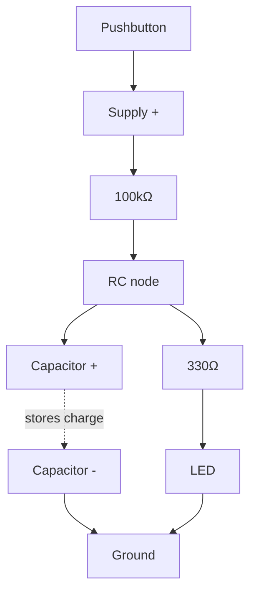

# 05-RC Circuit

A resistor and capacitor in series, charging and discharging over time instead of switching instantly. This is where "instant" stops being true and time becomes a variable you can calculate and control.

- **Difficulty:** Beginner
- **Prerequisites:** [Lesson 2: Voltage Divider](../02-voltage-divider/README.md)
- **Approximate time:** 30 to 45 minutes
- **What you'll build:** An RC network that fades an LED on and off instead of switching it sharply, with the fade timing measured and matched to a formula

## Why build this?

Every debounce circuit, timing circuit, and analog filter in this repository depends on the RC time constant. So does the active filter in [Lesson 9](../09-active-filter/README.md). This lesson isolates that one idea — a capacitor resists sudden changes in voltage — so you can see it directly, timing it with a stopwatch or an oscilloscope before it gets folded into a more complex circuit.

## What you'll learn

- What a capacitor actually stores, and why it resists instantaneous voltage change.
- The RC time constant (`τ = R × C`) and what it physically means.
- The charge and discharge equations and how to predict voltage at any point in time.
- Why 5τ is treated as "fully charged" or "fully discharged" in practice.

## What you need

| Item | Type | Quantity | Purpose |
|---|---|---:|---|
| LED (5mm) | Component | 1 | Visual indicator of the charging voltage |
| Resistor, 330Ω | Component | 1 | Current-limits the LED |
| Resistor, 100kΩ | Component | 1 | Sets a slow, human-visible time constant |
| Electrolytic capacitor, 470µF or 1000µF | Component | 1 | Stores charge; mind polarity |
| Tactile pushbutton | Component | 1 | Triggers the charge cycle |
| Breadboard | Tool | 1 | Solderless prototyping surface |
| Jumper wires | Tool | 5–6 | Connections |
| 9V battery + snap connector | Component | 1 | Power source |
| Multimeter | Tool (optional) | 1 | For timing the voltage rise directly |
| Stopwatch (phone is fine) | Tool | 1 | For timing the visible fade |

## Before you build

A capacitor stores charge on two conductive plates separated by an insulator. Voltage across a capacitor cannot change instantaneously, because doing so would require infinite current — instead, it charges and discharges along a predictable curve.

When a capacitor charges through a resistor from a voltage source, the voltage across it over time follows:

$$V(t) = V_{supply} \times (1 - e^{-t/\tau})$$

where `τ = R × C` is the **time constant**, in seconds when R is in ohms and C is in farads. After one time constant, the capacitor has reached about 63% of the supply voltage. After five time constants (5τ), it's considered fully charged (over 99%).

Discharging follows the mirror-image curve:

$$V(t) = V_{initial} \times e^{-t/\tau}$$

For R = 100kΩ and C = 470µF:

$$\tau = 100{,}000 \times 0.000470 = 47\ seconds$$

That's slow enough to watch an LED fade in real time without any instrumentation — which is exactly why this lesson uses values far larger than a "real" timing circuit would, where τ is often microseconds to milliseconds.

**Polarity matters.** Electrolytic capacitors are polarized: one leg (marked with a stripe, usually the shorter leg) is negative and must connect toward ground, never toward the higher voltage. Reversing it can cause the capacitor to fail, sometimes violently.

## How it works

| Component | Role |
|---|---|
| Resistor (100kΩ) | Limits the rate of charge into the capacitor, setting τ together with C |
| Capacitor (470µF) | Stores charge, smoothing the voltage transition instead of an instant jump |
| LED + 330Ω | Visualizes the rising/falling voltage at the RC node as changing brightness |

When the button connects the supply, current flows through the resistor into the capacitor, charging it gradually. The LED, tapped from the same node, brightens gradually as the voltage there rises — not instantly, because the resistor limits how fast charge can accumulate.

## Build it

1. Insert the capacitor with its negative leg (marked, shorter) toward the ground rail.
2. Wire the 100kΩ resistor from the button's output to the capacitor's positive leg — this junction is your RC node.
3. Wire the 330Ω resistor from the RC node to the LED's anode; wire the LED's cathode to ground.
4. Wire the button's other side to the battery's positive terminal.
5. Connect the battery. With the button unpressed, the LED should be off and the capacitor discharged.
6. Press and hold the button. Watch the LED gradually brighten over several seconds rather than snapping on.
7. Release the button and watch it gradually dim as the capacitor discharges back through the LED/resistor path.

## Verify it

- Time how long it takes the LED to reach its brightest point after pressing — it should roughly match 5τ (about 4 minutes with the values above, though it will visually look "done" well before then since LED brightness isn't linear with voltage).
- With a multimeter across the capacitor, note the voltage at t = τ seconds after pressing; it should read close to 63% of your supply voltage.
- Swap the capacitor for a smaller one (100µF) and confirm the fade happens noticeably faster, in proportion to the smaller τ.

## What should you see?

A visibly gradual brightening when the button is pressed and a gradual dimming when released — never an instant snap in either direction, unlike every previous lesson in this repository.

## Troubleshooting

| Symptom | Possible cause | What to check |
|---|---|---|
| LED switches instantly, no fade | Wrong resistor value in the RC path (too small), or capacitor not actually in the charge path | Confirm the 100kΝ resistor is between the button and the capacitor, not bypassed |
| LED never lights, even after a long press | Capacitor installed backwards, possibly damaged | Replace the capacitor, checking polarity carefully this time |
| LED stays lit after release, never dims | Capacitor not discharging through the LED path | Check the LED/330Ω branch is actually connected to the RC node, not a separate node |
| Capacitor feels warm or bulges | Reversed polarity or voltage exceeding its rating | Disconnect immediately and replace with a correctly rated, correctly oriented capacitor |

## Common mistakes

- **Reversing capacitor polarity.** Unlike resistors and most other passives, this one has a right and wrong way round, and getting it wrong can damage the part.
- **Expecting an instant response.** The entire point of this circuit is that it isn't instant — if your LED snaps on immediately, something is bypassing the RC network.
- **Using too small a capacitor to see the effect.** At everyday small values (1µF and below) the fade may complete faster than you can perceive; the large values here are chosen specifically to make τ visible.

## Think about it

- Why does the capacitor charge to 63% (not 50%) after exactly one time constant?
- If you doubled both R and C, what would happen to τ, and would the final voltage change?
- Why is 5τ treated as "done" rather than waiting for a mathematically exact 100%, which the exponential curve never actually reaches?
- How could this exact circuit be used to debounce a mechanical switch instead of fading an LED?

## Experiment with it

- Graph LED brightness (or measured voltage) against time at several points and compare the shape to the exponential charging curve.
- Try three different capacitor values (100µF, 470µF, 1000µF) with the same resistor and compare the fade times.
- Replace the resistor with a potentiometer and adjust the fade speed live while the circuit is charging.

## Simulation

- [Falstad circuit simulator](https://www.falstad.com/circuit/) — has excellent live animation for RC charging curves.
- [Wokwi](https://wokwi.com)

## Further reading

- [Wikipedia: RC circuit](https://en.wikipedia.org/wiki/RC_circuit) — full derivation of the charge/discharge equations.
- [Wikipedia: Capacitor](https://en.wikipedia.org/wiki/Capacitor) — general theory of how charge is stored.

## Hardware Atlas resources

### Components
For capacitor types (electrolytic, ceramic, tantalum) and when to use each: [Explore Components](../resources/components.md)

### Help
If the timing doesn't roughly match the formula after working through Troubleshooting: [See Hardware Help](../resources/help.md)

## Sourcing

Electrolytic capacitors in this range are inexpensive and included in most starter kits. For India-specific sourcing: [See India Resources](../resources/india.md)

## Going deeper

The RC time constant reappears as switch debounce delays, low-pass filter cutoffs ([Lesson 9](../09-active-filter/README.md)), power supply smoothing, and the timing behind classic 555-timer circuits. Once you can predict τ, you can predict the behavior of a huge fraction of analog circuits without simulating them.

## Where this fits in Hardware Atlas

Move to [Lesson 6: Light Sensor](../06-light-sensor/README.md). You've seen a fixed resistor set a fixed time constant; next, you'll use a resistor that changes with light level instead, turning the voltage divider from Lesson 2 into a working sensor.