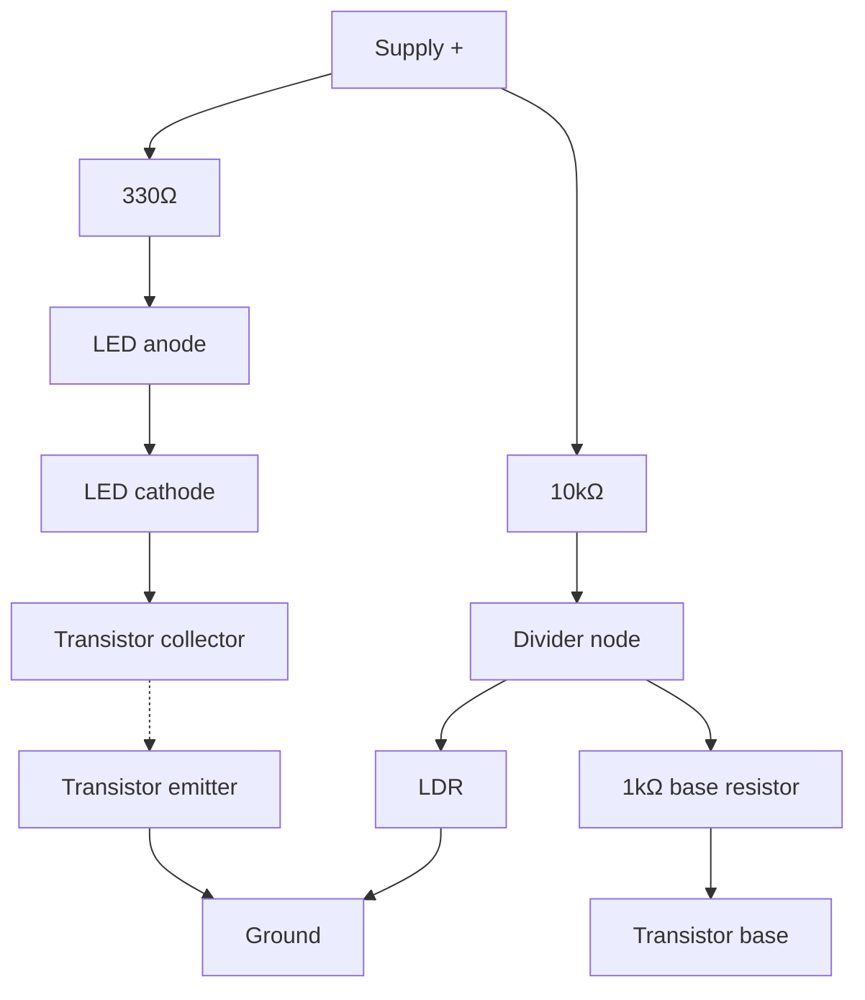

# 06-Light Sensor

A photoresistor (LDR) in a voltage divider, turning ambient light into a voltage you can measure — and, combined with a transistor, into a switch that reacts to darkness on its own.

- **Difficulty:** Beginner
- **Prerequisites:** [Lesson 2: Voltage Divider](../02-voltage-divider/README.md), [Lesson 4: Transistor Switch](../04-transistor-switch/README.md)
- **Approximate time:** 30 to 45 minutes
- **What you'll build:** An LDR voltage divider whose output you measure directly, then a light-activated LED circuit that turns on automatically in the dark

## Why build this?

This lesson is where two earlier lessons combine into something that reacts to the world. The voltage divider from Lesson 2 becomes useful the moment one of its resistors is a sensor instead of a fixed value; the transistor switch from Lesson 4 becomes a "reads the world and acts" circuit rather than one triggered by a human finger. This exact pattern — resistive sensor, divider, comparator or transistor, action — recurs with different sensors (thermistors, flex sensors, force sensors) throughout hobby electronics.

## What you'll learn

- How a photoresistor's resistance changes with light, and roughly by how much.
- How to place an LDR in a divider so its output rises (or falls) with light, and why the orientation matters.
- How to use a transistor as a simple threshold switch driven by an analog voltage rather than a digital signal.
- Why this circuit has no precise, adjustable threshold, and what you'd add to get one.

## What you need

| Item | Type | Quantity | Purpose |
|---|---|---:|---|
| Photoresistor (LDR, e.g. GL5528) | Component | 1 | Light-dependent resistor |
| Resistor, 10kΩ | Component | 1 | Fixed half of the voltage divider |
| Resistor, 330Ω | Component | 1 | Current-limits the indicator LED |
| Resistor, 1kΩ | Component | 1 | Base resistor for the transistor |
| NPN transistor (2N2222 or BC547) | Component | 1 | Switches the LED based on the divider's output |
| LED (5mm) | Component | 1 | Lights when it's dark |
| Breadboard | Tool | 1 | Solderless prototyping surface |
| Jumper wires | Tool | 6–7 | Connections |
| 9V battery + snap connector | Component | 1 | Power source |
| Multimeter | Tool | 1 | For measuring the divider's output under different light |
| Flashlight or phone light | Tool | 1 | Provides a controllable bright light source for testing |

## Before you build

A photoresistor's resistance drops as light falling on it increases — a typical LDR might measure around 1kΩ in bright light and rise to hundreds of kilohms in darkness. This is a large, nonlinear range, which makes an LDR excellent for simple threshold detection and poor for precise light-level measurement.

Placing the LDR as R1 (the top resistor, from supply) and a fixed 10kΩ as R2 (to ground) in the Lesson 2 divider formula:

$$V_{out} = V_{supply} \times \frac{R2}{R_{LDR} + R2}$$

In bright light, `R_LDR` is small, so `V_out` is close to the full supply voltage. In darkness, `R_LDR` grows large, and `V_out` drops toward 0V. This orientation — LDR on top, fixed resistor on bottom — makes `V_out` rise with light. Swapping the two positions inverts that relationship.

To turn this into a dark-activated switch, feed `V_out` into the base of a transistor (through a base resistor, as in Lesson 4) — but wired so the transistor turns **on** when the divider's voltage is **low** (i.e., when it's dark). The straightforward way to do this with a single NPN transistor is to put the LDR on the *bottom* this time, so the base voltage rises in darkness and falls in bright light, driving the transistor on as ambient light drops.

## How it works

| Component | Role |
|---|---|
| LDR + 10kΩ | Forms a divider whose midpoint voltage falls as light increases (LDR on the bottom this time) |
| Base resistor (1kΩ) | Feeds the divider's output into the transistor's base, limiting base current |
| Transistor | Switches on when the base voltage is high enough — i.e., when it's dark |
| LED + 330Ω | The switched load, same current-limited LED circuit as Lesson 1 and 4 |

In bright light, the LDR's low resistance pulls the divider node close to ground, starving the transistor's base and keeping the LED off. As light falls, the LDR's resistance rises, the divider node's voltage rises with it, and once it crosses roughly 0.6–0.7V the transistor begins conducting and the LED lights.

## Build it

1. Build the LDR/10kΩ divider from Lesson 2, with the LDR positioned as described above (bottom of the divider, to ground).
2. Wire the divider's midpoint through the 1kΩ base resistor to the transistor's base.
3. Wire the transistor's emitter to ground.
4. Build the LED + 330Ω branch from the supply to the transistor's collector, as in Lesson 4.
5. Connect the battery in normal room light. The LED should be off (or dim).
6. Cover the LDR with your hand or shade it. The LED should light.

## Verify it

- Measure the divider's midpoint voltage in bright light versus covered — it should rise noticeably as light drops.
- Note roughly what voltage triggers the LED on (where the transistor starts conducting); it should be close to 0.6–0.7V.
- Swap the fixed 10kΩ resistor for a 1kΩ or 100kΩ and observe how the light level needed to trigger the LED shifts — this is you manually adjusting sensitivity.

## What should you see?

The LED off under normal room lighting, turning on smoothly as you shade the LDR, and off again once light returns — no microcontroller, no code, purely analog thresholding.

## Troubleshooting

| Symptom | Possible cause | What to check |
|---|---|---|
| LED is always on, regardless of light | LDR and fixed resistor swapped, or LDR shorted | Confirm divider orientation matches the diagram |
| LED never turns on, even in darkness | Base resistor value too high, or LDR not actually a large enough resistance range in darkness | Try a lower base resistor value, or test the LDR's resistance range directly with a multimeter |
| LED flickers near the threshold | Normal analog behavior — no hysteresis in this simple circuit | Expected; a comparator with hysteresis would fix this, covered conceptually in [Lesson 8](../08-op-amp-conditioner/README.md) |
| LED barely dims/brightens with light changes | Fixed resistor value poorly matched to the LDR's actual range | Measure the LDR's resistance at your test light levels and choose a fixed resistor closer to that midpoint |

## Common mistakes

- **Assuming the LDR behaves linearly.** It doesn't; its resistance-to-light relationship is closer to logarithmic, which is fine for a threshold switch but not for precise measurement.
- **Picking a fixed resistor without first measuring the LDR's actual range with a multimeter.** Datasheet values are typical, not guaranteed — the best fixed resistor value is close to the LDR's resistance at your desired trigger point.
- **Expecting a sharp on/off transition.** Without added hysteresis, the circuit will flicker right at the threshold, since it's a continuous voltage crossing a fixed level.

## Think about it

- How would you rewire this circuit so it turns the LED on in bright light instead of darkness?
- Why does swapping the LDR and fixed resistor's positions in the divider invert the whole circuit's behavior?
- What role does the 10kΩ resistor's exact value play in setting the light level at which the LED triggers?
- How could a second transistor or a dedicated comparator IC add hysteresis to stop the flicker at the threshold?

## Experiment with it

- Replace the fixed 10kΩ resistor with a potentiometer to make the trigger threshold manually adjustable.
- Feed the divider's output into a microcontroller's ADC pin instead of a transistor, and log actual light readings over time — a direct preview of [Lesson 13](../13-temperature-logger/README.md), which does the same thing with a temperature sensor.
- Compare the LDR's response time to a sudden light change against how quickly your eyes perceive it.

## Simulation

- [Falstad circuit simulator](https://www.falstad.com/circuit/)
- [Wokwi](https://wokwi.com)

## Further reading

- [Wikipedia: Photoresistor](https://en.wikipedia.org/wiki/Photoresistor) — resistance-versus-light characteristics and typical materials.
- [Wikipedia: Voltage divider](https://en.wikipedia.org/wiki/Voltage_divider) — revisit this alongside a variable resistance element.

## Hardware Atlas resources

### Components
For LDRs, phototransistors, and other light sensors, and how they compare: [Explore Components](../resources/components.md)

### Help
If your circuit's trigger point seems unpredictable after working through Troubleshooting: [See Hardware Help](../resources/help.md)

## Sourcing

GL5528-type LDRs are common, cheap, and included in most sensor kits. For India-specific sourcing: [See India Resources](../resources/india.md)

## Going deeper

This resistive-sensor-into-a-divider pattern is identical for thermistors (temperature), flex sensors (bend), force-sensitive resistors (pressure), and soil moisture sensors — swap the LDR for any of them and the rest of the circuit doesn't change. [Lesson 13's](../13-temperature-logger/README.md) temperature sensor uses the same underlying idea, read digitally instead of through a transistor.

## Where this fits in Hardware Atlas

Move to [Lesson 7: Transistor Amplifier](../07-transistor-amplifier/README.md). You've used a transistor purely as an on/off switch; next you'll bias it into its linear region instead, so it amplifies a small signal rather than just gating it.