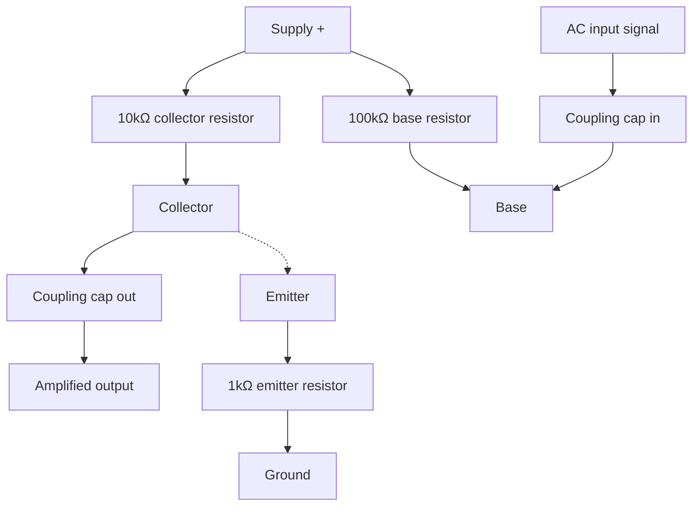

# 07-Transistor Amplifier

A common-emitter amplifier: the same NPN transistor from Lesson 4, biased into its linear region instead of driven fully on or off, so it makes a small AC signal bigger instead of just switching a load.

- **Difficulty:** Intermediate
- **Prerequisites:** [Lesson 4: Transistor Switch](../04-transistor-switch/README.md), [Lesson 5: RC Circuit](../05-rc-circuit/README.md)
- **Approximate time:** 45 to 60 minutes
- **What you'll build:** A common-emitter transistor amplifier with a biased operating point, tested by measuring gain on a small input signal

## Why build this?

Every circuit so far has treated the transistor as a switch: fully on or fully off. That's only one of its two jobs. Biased correctly, the same part becomes an amplifier — a small change in base voltage produces a much larger change in collector voltage. This is the foundation of every analog audio circuit, every sensor preamp, and it sets up why op-amps ([Lesson 8](../08-op-amp-conditioner/README.md)) exist: they package this same idea into a much more predictable, general-purpose building block.

## What you'll learn

- The difference between a transistor's switching region and its linear (active) region.
- DC biasing: setting a quiescent operating point so the signal has room to swing both up and down.
- Voltage gain in a common-emitter stage, and the resistor ratio that sets it.
- Why AC coupling capacitors are used to inject a signal without disturbing the DC bias point.

## What you need

| Item | Type | Quantity | Purpose |
|---|---|---:|---|
| NPN transistor (2N2222 or BC547) | Component | 1 | The amplifying element |
| Resistor, 100kΩ | Component | 1 | Base bias resistor, sets the quiescent point |
| Resistor, 10kΩ | Component | 1 | Collector resistor, converts collector current into an output voltage swing |
| Resistor, 1kΩ | Component | 1 | Emitter resistor, stabilizes the bias point against temperature and part variation |
| Ceramic capacitor, 1–10µF (or electrolytic) | Component | 2 | AC-couples the input signal in and the output signal out |
| Breadboard | Tool | 1 | Solderless prototyping surface |
| Jumper wires | Tool | 6–8 | Connections |
| 9V battery + snap connector | Component | 1 | Power source |
| Multimeter | Tool | 1 | For checking the DC bias point |
| Small audio source (phone headphone output) or function generator | Tool | 1 | Provides a small AC test signal |
| Oscilloscope (optional) | Tool | 1 | For directly viewing input versus amplified output |

## Before you build

For a transistor to amplify rather than switch, it needs a **quiescent operating point (Q-point)**: a stable DC collector voltage sitting roughly halfway between the supply and ground, with no signal applied. This gives the output room to swing both higher and lower when a signal is added, without clipping against either rail.

A simple common-emitter stage uses three resistors:

- **Base bias resistor (R_B, 100kΩ):** sets the base current, and through the transistor's gain, the collector current and Q-point.
- **Collector resistor (R_C, 10kΩ):** converts collector current changes into voltage changes — this is where the actual voltage gain comes from.
- **Emitter resistor (R_E, 1kΩ):** stabilizes the bias against transistor-to-transistor variation and temperature drift, at some cost to gain.

The voltage gain of this stage, ignoring the transistor's own internal resistance, is approximately:

$$A_v \approx -\frac{R_C}{R_E} = -\frac{10k}{1k} = -10$$

The negative sign matters: a common-emitter stage inverts the signal — as the input rises, the output falls, and vice versa. A gain of 10 means a 100mV input swing becomes roughly a 1V output swing, inverted.

The two capacitors are there to **AC couple** the signal: they let the changing audio/test signal through while blocking DC, so the signal source doesn't disturb the carefully-set bias point, and the bias point doesn't damage or offset the signal source.

## How it works

| Component | Role |
|---|---|
| R_B (100kΩ) | Sets the DC base current and therefore the Q-point |
| R_C (10kΩ) | Converts changing collector current into a larger voltage swing at the output |
| R_E (1kΩ) | Stabilizes the bias point; sets the gain together with R_C |
| Input/output capacitors | Pass the AC signal through while isolating the DC bias on each side |

With no input signal, the circuit sits at a stable DC voltage at the collector, roughly mid-supply. When a small AC signal is coupled into the base, it modulates the base current slightly, which modulates the (much larger) collector current, which — through R_C — produces a much larger voltage swing at the collector. The output coupling capacitor passes that swing on while blocking the DC bias voltage itself.

## Build it

1. Wire R_B (100kΩ) from the supply to the transistor's base.
2. Wire R_C (10kΩ) from the supply to the transistor's collector.
3. Wire R_E (1kΩ) from the transistor's emitter to ground.
4. Wire one coupling capacitor from your signal source, through to the base (in series with, not replacing, R_B's connection).
5. Wire the second coupling capacitor from the collector to your output measurement point (multimeter, oscilloscope, or speaker with a series resistor).
6. Connect the battery and, before applying any signal, measure the DC voltage at the collector — this is your Q-point.
7. Apply a small AC signal at the input and observe the output.

## Verify it

- With no signal applied, the collector should sit close to half the supply voltage (around 4–5V on a 9V supply) if the resistor values are well matched to this transistor's gain — this may need slight adjustment of R_B in practice, since hFE varies part to part.
- Apply a known small AC input (e.g. 50–100mV from a headphone output) and compare the output amplitude; it should be roughly 10x larger and inverted in phase if viewed on a scope.
- Increase the input signal until the output visibly flattens ("clips") at the top or bottom — this shows the limit of the linear region you biased the transistor into.

## What should you see?

A stable, un-clipped DC voltage at the collector with no input, and a larger, inverted, but recognizably similar-shaped AC signal at the output once a small input is applied.

## Troubleshooting

| Symptom | Possible cause | What to check |
|---|---|---|
| Collector voltage sits near 0V or near supply, not mid-range | Q-point badly off, R_B value doesn't suit this particular transistor's gain | Try increasing or decreasing R_B and re-measuring the DC collector voltage |
| No visible amplification | Coupling capacitor missing, wrong orientation, or blocking the AC signal entirely | Check capacitor values are not too small for your test frequency, and that it's genuinely inline |
| Output is a flat, clipped square-ish wave even with a small input | Q-point too close to one rail, no room to swing | Re-bias closer to mid-supply, or reduce R_C |
| Output matches input exactly (no gain, no inversion) | Signal bypassing the transistor stage entirely, possibly through a wiring fault | Trace the signal path and confirm it genuinely passes through the collector node |

## Common mistakes

- **Skipping the DC bias check before applying a signal.** An amplifier that isn't correctly biased will clip or produce no usable gain, and this is invisible until you check the resting collector voltage.
- **Forgetting the emitter resistor "steals" some gain.** Removing R_E entirely increases gain but makes the bias point wildly sensitive to transistor variation and temperature — a bad trade for a first build.
- **Confusing this circuit's goal with Lesson 4's.** Here, saturation and cutoff are failure modes to avoid, not the goal.

## Think about it

- Why does increasing R_C increase voltage gain, while increasing R_E decreases it?
- What physically happens inside the transistor when the output "clips"?
- Why is the output signal inverted relative to the input in a common-emitter stage?
- How would adding a capacitor in parallel with R_E ("bypassing" it) affect the gain, and why?

## Experiment with it

- Try R_C values of 4.7kΩ, 10kΓ, and 22kΩ and measure how gain changes while watching for clipping.
- Bypass R_E with a large capacitor in parallel and measure how much gain increases.
- Feed music from a phone through the amplifier into a small speaker (with a suitable series resistor to protect it) and listen to the amplified, inverted signal.

## Simulation

- [Falstad circuit simulator](https://www.falstad.com/circuit/) — has a built-in common-emitter amplifier example worth comparing against.
- [Wokwi](https://wokwi.com)

## Further reading

- [Wikipedia: Common emitter](https://en.wikipedia.org/wiki/Common_emitter) — full derivation of gain and biasing for this exact topology.
- [Wikipedia: Bipolar junction transistor](https://en.wikipedia.org/wiki/Bipolar_junction_transistor) — for the underlying active-region physics.

## Hardware Atlas resources

### Components
For transistor characteristics like hFE variation and why datasheets give ranges, not single numbers: [Explore Components](../resources/components.md)

### Tools
For using an oscilloscope to actually see the input and output waveforms side by side: [See Tools](../resources/tools.md)

### Help
If your Q-point won't sit near mid-supply after working through Troubleshooting: [See Hardware Help](../resources/help.md)

## Sourcing

The same transistors from Lesson 4 work here; no new components beyond a couple of coupling capacitors. For India-specific sourcing: [See India Resources](../resources/india.md)

## Going deeper

Discrete transistor amplifiers like this one are largely superseded in practice by op-amps, which give predictable gain without per-transistor bias tuning — that's exactly the problem [Lesson 8](../08-op-amp-conditioner/README.md) solves. Understanding this circuit first is what makes an op-amp's internals feel like an old friend rather than a black box.

## Where this fits in Hardware Atlas

Move to [Lesson 8: Op-Amp Conditioner](../08-op-amp-conditioner/README.md). You've built gain from a single biased transistor; next you'll get the same job done with an op-amp IC, with far less fuss over biasing and far more predictable gain.