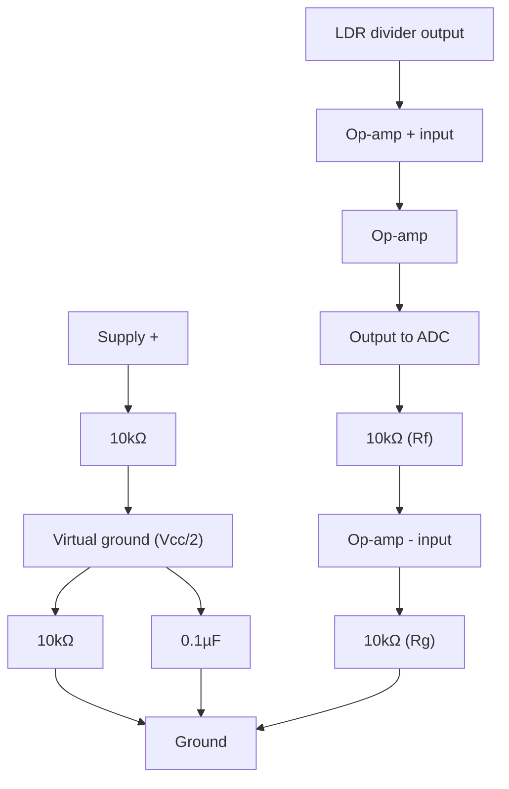

# 08-Op-Amp Signal Conditioner

A non-inverting op-amp amplifier built with an LM358, scaling a small sensor voltage up to a range a microcontroller's ADC can use — with gain set entirely by two resistors and none of the per-transistor bias tuning from Lesson 7.

- **Difficulty:** Intermediate
- **Prerequisites:** [Lesson 7: Transistor Amplifier](../07-transistor-amplifier/README.md), [Lesson 2: Voltage Divider](../02-voltage-divider/README.md)
- **Approximate time:** 45 to 60 minutes
- **What you'll build:** A non-inverting op-amp amplifier that boosts a low-voltage sensor signal (from the LDR divider in Lesson 6) to a larger, ADC-friendly range

## Why build this?

Many real sensors put out a signal that's too small, too noisy, or centered on the wrong voltage for a microcontroller's ADC to read well. An op-amp fixes this with two resistors and no fiddly biasing — a sharp contrast to Lesson 7's transistor amplifier, where gain and bias point were tangled together and sensitive to the specific part. This "signal conditioning" step is what makes the difference between a sensor reading that's noisy and imprecise and one that uses the ADC's full resolution. It's also the direct ancestor of the active filter in [Lesson 9](../09-active-filter/README.md), which is the same op-amp with one resistor replaced by a capacitor.

## What you'll learn

- What an op-amp is at a black-box level: a very-high-gain differential amplifier with two inputs and one output.
- The "virtual short" concept that makes op-amp circuit analysis so much simpler than transistor analysis.
- The non-inverting amplifier configuration and its gain formula.
- Why op-amps need a dual supply or a "virtual ground" trick to handle signals that don't swing negative.

## What you need

| Item | Type | Quantity | Purpose |
|---|---|---:|---|
| Op-amp IC (LM358, dual op-amp) | Component | 1 | The amplifying element |
| Resistor, 10kΩ | Component | 2 | Sets the feedback gain ratio (R_f and R_g) |
| Resistor, 10kΩ | Component | 2 | Forms a virtual-ground divider at half-supply |
| Capacitor, 0.1µF ceramic | Component | 1 | Decouples the virtual ground reference from noise |
| LDR voltage divider from Lesson 6 | Sub-circuit | 1 | Provides the small input signal to condition |
| Breadboard | Tool | 1 | Solderless prototyping surface |
| Jumper wires | Tool | 8–10 | Connections |
| 9V battery + snap connector | Component | 1 | Power source |
| Multimeter | Tool | 1 | For checking gain against the formula |

## Before you build

An op-amp is, for circuit-design purposes, a component with two inputs (non-inverting `+` and inverting `-`) and one output, which tries to drive its output to whatever voltage makes the two inputs equal — as long as it has a feedback path back to the inverting input. This is the **virtual short** assumption: with negative feedback in place, the two input pins can be treated as sitting at the same voltage, even though no current actually flows between them.

In the **non-inverting** configuration, the input signal connects directly to the `+` input, and a resistor divider (R_f from output to `-`, R_g from `-` to ground) sets the gain:

$$V_{out} = V_{in} \times \left(1 + \frac{R_f}{R_g}\right)$$

With R_f = R_g = 10kΩ:

$$V_{out} = V_{in} \times (1 + 1) = V_{in} \times 2$$

**The single-supply problem.** Most op-amps are happiest with a dual supply (a positive and negative rail), but this repository sticks to single 9V batteries. The common workaround is a **virtual ground**: a resistor divider from the supply to ground, buffered with a decoupling capacitor, creating a stable reference at half the supply voltage. Signals are then referenced to this midpoint instead of true ground, so the op-amp's output can swing both above and below it without needing a negative supply rail.

## How it works

| Component | Role |
|---|---|
| Virtual ground divider | Creates a stable half-supply reference so single-supply signals have room to swing both ways |
| Op-amp | Drives its output until the `-` input matches the `+` input, amplifying whatever's needed to get there |
| R_f, R_g | Set the closed-loop gain via the non-inverting formula |

The sensor's small voltage swing at the `+` input is compared against the feedback network's voltage at the `-` input. Because the op-amp drives its output to force those two equal, and the feedback network only feeds back a fraction (`R_g / (R_f + R_g)`) of the output, the output has to swing further than the input by exactly the gain factor to make the equation balance.

## Build it

1. Build the virtual ground divider: two 10kΩ resistors in series from supply to ground, with the 0.1µF capacitor from the midpoint to ground.
2. Insert the op-amp IC, noting pin 1 orientation from its datasheet (LM358 is an 8-pin DIP; check which pins are `+`, `-`, output, V+, and ground/V-).
3. Wire the LDR divider's output (from Lesson 6) to the op-amp's `+` input.
4. Wire R_f from the op-amp's output back to its `-` input.
5. Wire R_g from the `-` input to the virtual ground node (not true ground, since the input signal is also referenced to virtual ground in a full single-supply design — for this simplified build, referencing R_g to true ground is acceptable if your sensor signal already sits well above 0V).
6. Wire the op-amp's V+ pin to the supply and its V- pin (or ground pin, depending on part) to ground.
7. Measure the output with a multimeter while varying light on the LDR.

## Verify it

- Compare the op-amp's output swing to the LDR divider's raw output swing (measured directly, bypassing the op-amp) — it should be roughly double, matching the gain formula.
- Confirm the virtual ground node sits close to half the supply voltage with a multimeter.
- Try R_f = 22kΩ with R_g = 10kΩ and recalculate expected gain (`1 + 22k/10k = 3.2`); verify the measured output scales accordingly.

## What should you see?

An output voltage that swings roughly twice as much as the raw sensor signal for the same change in light, centered sensibly within the supply range rather than pinned near one rail.

## Troubleshooting

| Symptom | Possible cause | What to check |
|---|---|---|
| Output stuck near one supply rail | Op-amp saturated — gain too high for the given input swing, or wrong pin connections | Recheck the datasheet pinout; try a lower gain (smaller R_f/R_g ratio) |
| No amplification, output matches input | Feedback resistor missing or miswired, so no closed loop exists | Confirm R_f genuinely connects output back to the `-` input |
| Output noisy or unstable | Missing decoupling capacitor on the virtual ground node | Add or check the 0.1µF capacitor at the virtual ground reference |
| IC gets warm | Output shorted, or wrong supply pins | Double check V+ and ground/V- pins against the datasheet before reapplying power |

## Common mistakes

- **Getting the op-amp's pinout wrong.** Unlike a 3-legged transistor, an 8-pin DIP has multiple easy-to-swap connections; always check the datasheet, not intuition.
- **Forgetting the feedback resistor entirely.** Without R_f closing the loop, the op-amp isn't a controlled amplifier anymore — it's running at its raw, enormous open-loop gain and will simply slam to one rail.
- **Ignoring the single-supply limitation.** Op-amps not designed for single-supply operation (rail-to-rail) may not swing their output all the way to 0V or the full supply voltage — the LM358 is chosen here specifically because it tolerates single-supply use well.

## Think about it

- Why does the virtual short assumption not require any current to actually flow between the `+` and `-` inputs?
- What would happen to the gain if R_g were removed entirely (infinite resistance)?
- Why is a non-inverting configuration a more natural fit than an inverting one when conditioning a sensor signal that should preserve its sign?
- How does an op-amp's near-infinite open-loop gain, combined with negative feedback, produce a precisely predictable closed-loop gain?

## Experiment with it

- Swap R_f and R_g values across a few ratios and confirm gain tracks the formula each time.
- Feed the amplified output into a microcontroller's ADC pin and compare reading resolution/noise against feeding the raw LDR divider signal directly.
- Try an inverting configuration instead (input through R_g to the `-` pin, `+` pin tied to virtual ground) and observe the output signal's sign flip relative to the input.

## Simulation

- [Falstad circuit simulator](https://www.falstad.com/circuit/) — includes op-amp models with virtual-short behavior visible in the live simulation.
- [Wokwi](https://wokwi.com)

## Further reading

- [Wikipedia: Operational amplifier](https://en.wikipedia.org/wiki/Operational_amplifier) — covers ideal op-amp assumptions and both inverting/non-inverting configurations.
- [Wikipedia: Negative feedback amplifier](https://en.wikipedia.org/wiki/Negative_feedback_amplifier) — the general principle that makes op-amp gain so predictable.

## Hardware Atlas resources

### Components
For choosing between op-amp variants (single-supply, rail-to-rail, precision) beyond the LM358: [Explore Components](../resources/components.md)

### Help
If your op-amp output won't move off one rail after working through Troubleshooting: [See Hardware Help](../resources/help.md)

## Sourcing

LM358 dual op-amps are extremely common and inexpensive, often included in analog sensor kits. For India-specific sourcing: [See India Resources](../resources/india.md)

## Going deeper

Op-amp signal conditioning is standard practice ahead of any ADC reading a weak or noisy sensor: thermocouples, strain gauges, microphone preamps, and current-sense circuits all use a variant of this exact non-inverting stage. [Lesson 9's](../09-active-filter/README.md) active filter is this same circuit with a capacitor added to the feedback path.

## Where this fits in Hardware Atlas

Move to [Lesson 9: Active Filter](../09-active-filter/README.md). You've used an op-amp to scale a signal's amplitude; next you'll use one to scale a signal's amplitude differently depending on its *frequency*, filtering out noise instead of just amplifying everything equally.