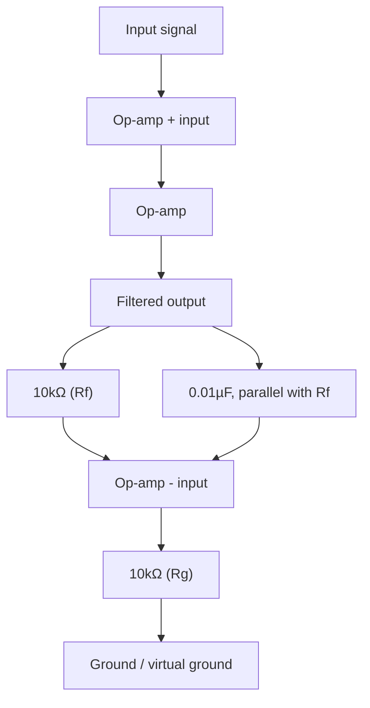
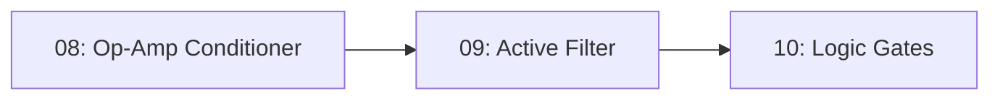

# 09-Active Low-Pass Filter

An op-amp active filter that removes high-frequency noise from a signal, built by replacing one resistor in Lesson 8's amplifier with a capacitor — combining the RC time constant from Lesson 5 with the op-amp gain from Lesson 8.

- **Difficulty:** Intermediate
- **Prerequisites:** [Lesson 5: RC Circuit](../05-rc-circuit/README.md), [Lesson 8: Op-Amp Conditioner](../08-op-amp-conditioner/README.md)
- **Approximate time:** 45 to 60 minutes
- **What you'll build:** A single-op-amp active low-pass filter, tested by sweeping an input signal's frequency and measuring where the output starts to roll off

## Why build this?

A resistor divider in Lesson 2 was frequency-blind: it treats a DC signal and a 1MHz signal identically. This lesson introduces the idea that filtering — treating different frequencies differently — is just an RC network's time-dependent behavior (Lesson 5), applied deliberately and then given gain by an op-amp (Lesson 8) so the filter doesn't also weaken the signal you want to keep. This is the standard way to clean up a noisy sensor reading before it reaches an ADC, and the same building block scales up to audio crossovers and communications filters.

## What you'll learn

- The difference between a passive RC filter (Lesson 5's circuit, used differently) and an active filter with gain.
- The cutoff frequency formula and how it relates to the RC time constant.
- Why "low-pass" means passing low frequencies and attenuating high ones, and how that shows up as an actual measurement.
- How to sweep a signal generator's frequency and read a basic frequency response by hand.

## What you need

| Item | Type | Quantity | Purpose |
|---|---|---:|---|
| Op-amp IC (LM358) | Component | 1 | The amplifying element, same part as Lesson 8 |
| Resistor, 10kΩ | Component | 2 | Sets DC gain (R_f, R_g), same as Lesson 8's amplifier |
| Capacitor, 0.01µF ceramic | Component | 1 | Placed in parallel with R_f to roll off gain at high frequency |
| Virtual ground divider (2x 10kΩ + 0.1µF) | Sub-circuit | 1 | Same single-supply reference from Lesson 8 |
| Breadboard | Tool | 1 | Solderless prototyping surface |
| Jumper wires | Tool | 8–10 | Connections |
| 9V battery + snap connector | Component | 1 | Power source |
| Function generator or phone tone-generator app | Tool | 1 | Provides a variable-frequency test signal |
| Oscilloscope (or multimeter with AC voltage mode) | Tool | 1 | For measuring output amplitude at different frequencies |

## Before you build

Start from Lesson 8's non-inverting amplifier. Its gain, `1 + R_f/R_g`, was constant regardless of frequency because R_f is a plain resistor — resistors don't care about frequency. A capacitor does: its impedance falls as frequency rises.

$$Z_C = \frac{1}{2\pi f C}$$

Placing a capacitor **in parallel with R_f** means that at low frequencies, the capacitor's impedance is very high (it looks almost like an open circuit), so the feedback path behaves just like Lesson 8's plain resistor and gain stays at `1 + R_f/R_g`. As frequency rises, the capacitor's impedance drops, effectively shrinking the feedback resistance and reducing gain — the filter attenuates high frequencies more than low ones.

The frequency at which gain has dropped to about 70.7% (−3dB) of its low-frequency value is the **cutoff frequency**:

$$f_c = \frac{1}{2\pi R_f C}$$

With R_f = 10kΩ and C = 0.01µF:

$$f_c = \frac{1}{2\pi \times 10{,}000 \times 0.00000001} \approx 1{,}592\ Hz$$

Below roughly 1.6kHz, the signal passes through with the same gain as Lesson 8's amplifier. Above it, gain falls off, roughly halving (−6dB) with each doubling of frequency beyond the cutoff.

## How it works

| Component | Role |
|---|---|
| R_f + C_f (parallel) | Sets DC/low-frequency gain like a plain resistor, but its combined impedance shrinks as frequency rises, reducing gain |
| R_g | Sets the gain ratio together with R_f, same as Lesson 8 |
| Op-amp | Drives the output to whatever voltage keeps the virtual short satisfied, now with a frequency-dependent feedback impedance |

At low frequencies the capacitor is nearly invisible to the circuit, and it behaves exactly like Lesson 8's amplifier. As frequency climbs, the capacitor increasingly "shorts out" part of R_f's effect, lowering the effective feedback resistance and therefore the gain — smoothly rolling off high-frequency content while leaving low-frequency content largely untouched.

## Build it

1. Build the virtual ground divider and op-amp wiring exactly as in Lesson 8.
2. Wire R_f (10kΩ) from the output to the `-` input, as before.
3. Wire the 0.01µF capacitor in parallel with R_f, also from output to `-` input.
4. Wire R_g (10kΩ) from the `-` input to ground/virtual ground, as before.
5. Feed a test signal into the `+` input.
6. Connect the battery and begin sweeping the input signal's frequency while watching the output amplitude.

## Verify it

- At a low test frequency (say 100Hz), measure output amplitude and confirm it roughly matches Lesson 8's plain-resistor gain of 2x.
- Sweep upward toward and past the calculated cutoff (~1.6kHz) and note the output amplitude visibly shrinking.
- At a high frequency well above cutoff (say 20kHz), confirm the output is noticeably smaller relative to the input than it was at 100Hz — this is the filter doing its job.

## What should you see?

A flat, gain-of-2 response at low frequencies that gradually rolls off as frequency increases past roughly 1.6kHz, with no sharp cutoff — a smooth, gradual attenuation typical of a simple single-pole filter.

## Troubleshooting

| Symptom | Possible cause | What to check |
|---|---|---|
| No rolloff observed at any frequency tested | Capacitor value too small for your test frequency range, or not actually in parallel with R_f | Recheck the capacitor is bridging the same two nodes as R_f |
| Gain rolls off even at very low frequencies | Capacitor value too large, cutoff frequency lower than intended | Recalculate `f_c` with your actual capacitor value and adjust expectations or component choice |
| Output distorted or clipped at low frequency | Same saturation issue as Lesson 8 — check bias, not the filter | Revisit Lesson 8's troubleshooting for DC bias issues |
| Can't observe any change without an oscilloscope | Multimeter's AC mode may not respond well at higher test frequencies | Try lower frequencies first, or borrow/simulate a scope for the higher range |

## Common mistakes

- **Expecting a sharp brick-wall cutoff.** A single-capacitor active filter like this rolls off gradually (about 6dB per octave), not sharply — sharper filters need more stages.
- **Confusing this with a passive RC filter.** The gain here can still be greater than 1 at low frequencies because the op-amp is providing amplification alongside the filtering; a passive RC filter can only ever attenuate.
- **Testing only at one frequency.** The entire point of a filter is its behavior *across* frequencies — a single measurement can't confirm a filter is working correctly.

## Think about it

- Why does adding a capacitor in parallel with R_f reduce gain at high frequency instead of increasing it?
- What would happen to the cutoff frequency if you doubled the capacitor value?
- How would you modify this circuit to build a high-pass filter instead of a low-pass one?
- Why does a filter's rolloff happen gradually rather than instantly at the calculated cutoff frequency?

## Experiment with it

- Try capacitor values of 0.001µF, 0.01µF, and 0.1µF and measure how the cutoff frequency shifts with each.
- Feed the noisy LDR sensor circuit from Lesson 6 through this filter and observe whether flicker/noise in the reading is visibly smoothed.
- Combine this low-pass stage with a second RC high-pass stage to build a crude band-pass filter.

## Simulation

- [Falstad circuit simulator](https://www.falstad.com/circuit/) — supports frequency sweep visualization for exactly this kind of filter.
- [Wokwi](https://wokwi.com)

## Further reading

- [Wikipedia: Low-pass filter](https://en.wikipedia.org/wiki/Low-pass_filter) — covers both passive and active implementations.
- [Wikipedia: Active filter](https://en.wikipedia.org/wiki/Active_filter) — the general category this circuit belongs to.

## Hardware Atlas resources

### Components
For capacitor selection at filter-relevant frequencies (ceramic vs film vs electrolytic behavior): [Explore Components](../../resources/components.md)

### Tools
For using a function generator or oscilloscope to sweep and observe a frequency response directly: [See Tools](../../resources/tools.md)

### Help
If you can't observe any rolloff after working through Troubleshooting: [See Hardware Help](../../resources/help.md)

## Sourcing

Small ceramic capacitors in this range are inexpensive and included in most component assortments. For India-specific sourcing: [See India Resources](../../resources/india.md)

## Going deeper

This single-pole active filter is the building block behind anti-aliasing filters ahead of ADCs, audio tone controls, and noise rejection on sensor front-ends. From here, the discrete-component analog track of this repository gives way to digital logic, starting with [Lesson 10](../10-logic-gates/README.md).

## Where this fits in Hardware Atlas

Move to [Lesson 10: Logic Gates](../10-logic-gates/README.md). You've spent nine lessons on circuits where voltage is a continuous quantity; next you'll switch to circuits where voltage means exactly one of two things — high or low — and see how logic itself is built from wires and transistors.