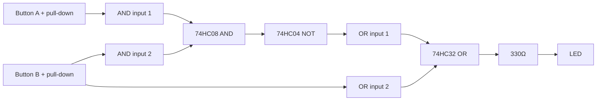

# 10-Logic Gates

AND, OR, and NOT gates built from real ICs, wired to switches and an LED so you can watch a truth table become physical current flow instead of a table in a textbook.

- **Difficulty:** Intermediate
- **Prerequisites:** [Lesson 3: Button and LED](../03-button-and-led/README.md), [Lesson 4: Transistor Switch](../04-transistor-switch/README.md)
- **Approximate time:** 45 to 60 minutes
- **What you'll build:** A small breadboard circuit combining a 74HC08 (AND), 74HC32 (OR), and 74HC04 (NOT) gate to light an LED under different input combinations

## Why build this?

Everything from Lesson 1 through Lesson 9 treated voltage as continuous — a range of values with formulas connecting them. Digital logic throws that away deliberately: a voltage is either "high" or "low," full stop, and everything interesting happens in how those two states combine. This lesson is the bridge between "a transistor switches current" (Lesson 4) and "a microcontroller runs code" (Lesson 12) — logic gates are what you get when you wire several transistor switches together to implement Boolean logic, before a CPU exists to do it for you in software.

## What you'll learn

- What "high" and "low" mean electrically in the 74HC (CMOS) logic family, and why unused inputs can't be left floating.
- How AND, OR, and NOT gates behave, both as a truth table and as a physical circuit.
- How to combine gates to build a more complex condition (e.g., "LED on only if button A is pressed AND button B is not").
- Why real logic ICs need decoupling capacitors and correct power pin connections to behave predictably.

## What you need

| Item | Type | Quantity | Purpose |
|---|---|---:|---|
| 74HC08 (quad 2-input AND gate) | Component | 1 | Provides AND logic |
| 74HC32 (quad 2-input OR gate) | Component | 1 | Provides OR logic |
| 74HC04 (hex inverter / NOT gate) | Component | 1 | Provides NOT logic |
| Tactile pushbuttons | Component | 2 | Provide the two logic inputs |
| Resistor, 10kΩ | Component | 2 | Pull-down resistors for each button, same role as Lesson 3 |
| Resistor, 330Ω | Component | 1 | Current-limits the output LED |
| LED (5mm) | Component | 1 | Visualizes the gate's output |
| Ceramic capacitor, 0.1µF | Component | 2–3 | Decoupling, one near each IC's power pins |
| Breadboard | Tool | 1 | Solderless prototyping surface |
| Jumper wires | Tool | 10–12 | Connections |
| 5V supply (4x AA, or regulated 5V source) | Component | 1 | 74HC-series logic prefers a 5V supply, not 9V |

## Before you build

The 74HC logic family runs on a 2V–6V supply and treats voltage near the supply rail as logic **high (1)** and voltage near ground as logic **low (0)**. Unlike the analog circuits earlier in this repository, there's no meaningful "in between" — the gate's internal circuitry snaps its interpretation to one or the other, with only a narrow, unreliable transition band.

An **AND gate** outputs high only if *all* its inputs are high:

| A | B | A AND B |
|---|---|---|
| 0 | 0 | 0 |
| 0 | 1 | 0 |
| 1 | 0 | 0 |
| 1 | 1 | 1 |

An **OR gate** outputs high if *any* input is high:

| A | B | A OR B |
|---|---|---|
| 0 | 0 | 0 |
| 0 | 1 | 1 |
| 1 | 0 | 1 |
| 1 | 1 | 1 |

A **NOT gate (inverter)** simply flips its single input:

| A | NOT A |
|---|---|
| 0 | 1 |
| 1 | 0 |

These are implemented internally with combinations of transistors switching each other on and off — the same fundamental mechanism as Lesson 4, just packaged and standardized so you don't have to bias each one by hand.

**Floating inputs are not allowed.** An unconnected CMOS gate input can drift to whatever voltage is picked up from nearby noise, and worse, can cause the gate to draw excessive current or oscillate. Every input pin on every gate you use must be tied definitively high or low, even ones you're not actively using for this experiment.

## How it works

| Component | Role |
|---|---|
| 74HC08 (AND) | Combines both button inputs; only outputs high if both are pressed |
| 74HC04 (NOT) | Inverts the AND gate's output, so it's high whenever the AND condition is *not* met |
| 74HC32 (OR) | Combines the inverted AND output with button B directly, driving the LED under the combined condition |
| Pull-down resistors | Give each button input a defined low state when unpressed, same role as Lesson 3 |

This particular arrangement (`NOT(A AND B) OR B`) is chosen because it's simple enough to trace by hand on a truth table and complex enough to show that gates chained together build genuinely new logical behavior, not just individual gate behavior in isolation.

## Build it

1. Insert each IC into the breadboard straddling the center gap, noting pin 1 (usually marked with a notch or dot) from the datasheet.
2. Wire each IC's power pin to the 5V supply and ground pin to ground; add a 0.1µF decoupling capacitor directly across each IC's power and ground pins.
3. Wire Button A and Button B each through a 10kΩ pull-down resistor into their own breadboard row, same pattern as Lesson 3.
4. Wire both button outputs into the two inputs of one AND gate on the 74HC08.
5. Wire the AND gate's output into one input of an inverter on the 74HC04.
6. Wire the inverter's output into one input of an OR gate on the 74HC32; wire Button B's output into the OR gate's second input.
7. Wire the OR gate's output through the 330Ω resistor to the LED, and the LED's cathode to ground.
8. Power the circuit and test all four combinations of Button A and Button B against the truth table you derive by hand.

## Verify it

- Write out the full truth table for `NOT(A AND B) OR B` yourself before testing, then confirm the LED's behavior matches it for all four input combinations.
- Measure the voltage at each gate's output pin with a multimeter while holding a given button combination, confirming it reads close to 5V (high) or close to 0V (low), never in between.
- Temporarily disconnect one gate input's pull-down (leaving it floating) and observe unpredictable or unstable LED behavior — this demonstrates why floating inputs are avoided.

## What should you see?

An LED that lights or stays dark in exact, repeatable agreement with the truth table for every combination of the two buttons, with no ambiguous intermediate states.

## Troubleshooting

| Symptom | Possible cause | What to check |
|---|---|---|
| LED behaves inconsistently for the same button combination | A gate input is floating (not tied high or low) | Trace every input pin on every gate and confirm each is definitively connected |
| LED never responds to button changes | IC power/ground pins swapped or miswired | Recheck pinout against the datasheet before reapplying power |
| One gate seems to always output high or low | Wrong gate section used on a multi-gate IC (e.g. all four AND gates on a 74HC08 are independent) | Confirm you're wired to the same gate section consistently, not mixing sections |
| ICs run warm | Power/ground reversed, or output pin shorted | Disconnect immediately and recheck wiring against the datasheet |

## Common mistakes

- **Leaving any gate input unconnected "because it's not used in this test."** Every input pin on every gate section in use must be tied high or low, even those not part of the immediate logic path.
- **Powering 74HC-series logic from a 9V battery directly.** These parts are rated for a 2–6V supply; 9V can damage them. Use a 5V source or a voltage regulator.
- **Mixing up which of the four independent gate sections on an IC you're using.** Each 74HC08 has four separate AND gates sharing one power pin; wiring inputs to one section and reading the output of another does nothing useful.

## Think about it

- How would you build the same `NOT(A AND B) OR B` function using only NAND gates (a well-known result: any logic function can be built from NAND alone)?
- Why do CMOS logic inputs misbehave when left floating, when a simple wire "not connected to anything" seems harmless?
- What physically distinguishes a "high" from a "low" inside a CMOS gate, at the transistor level?
- How does chaining gates together let you build arbitrarily complex logic from only three basic gate types?

## Experiment with it

- Build a different logic function (e.g. XOR, using AND, OR, and NOT gates combined) and verify its truth table by hand and by testing.
- Replace one button with the light-sensor transistor output from Lesson 6, combining an analog threshold with digital logic.
- Explore a 74HC00 (NAND) datasheet and try rebuilding the AND function using only NAND gates, to see the "NAND is universal" idea directly.

## Simulation

- [Falstad circuit simulator](https://www.falstad.com/circuit/) — has logic gate elements with live high/low visualization.
- [Wokwi](https://wokwi.com)

## Further reading

- [Wikipedia: Logic gate](https://en.wikipedia.org/wiki/Logic_gate) — covers all standard gate types and their truth tables.
- [Wikipedia: CMOS](https://en.wikipedia.org/wiki/CMOS) — the transistor-level implementation behind the 74HC family.
- [Wikipedia: NAND logic](https://en.wikipedia.org/wiki/NAND_logic) — the "NAND is universal" result referenced above.

## Hardware Atlas resources

### Components
For the 74HC/74HCT/74LS logic families and how to choose between them: [Explore Components](../../resources/components.md)

### Help
If a gate's output doesn't match its truth table after working through Troubleshooting: [See Hardware Help](../../resources/help.md)

## Sourcing

74HC-series logic ICs are inexpensive and widely available individually or in assortment packs. For India-specific sourcing: [See India Resources](../../resources/india.md)

## Going deeper

Every digital circuit in this repository from here on, including the microcontroller-based ones, is built from combinations of exactly these gate types at the silicon level — a microcontroller is, at its core, millions of these same gates arranged to execute instructions instead of a handful arranged for one fixed function.

## Where this fits in Hardware Atlas

Move to [Lesson 11: Flip-Flop Counter](../11-flip-flop-counter/README.md). You've built logic that responds instantly to its inputs; next you'll build logic with **memory** — a circuit whose output depends not just on its current inputs, but on what happened before.