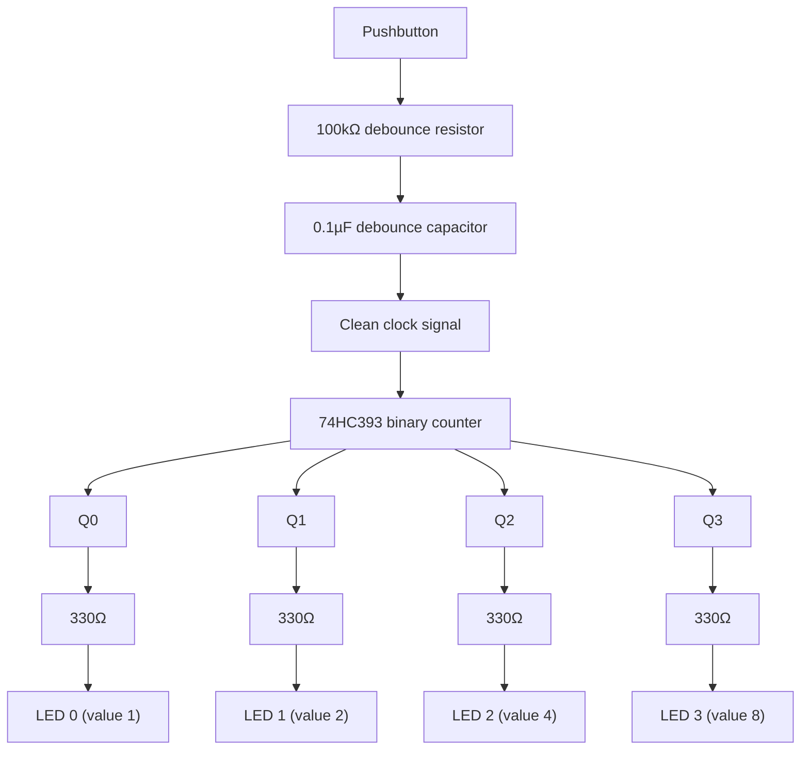

# 11-Flip-Flop Counter

A 4-bit binary counter built from a 74HC393 (or a 4017 decade counter as an alternative), driven by a manual clock pulse, with four LEDs showing the count in binary. This is the first circuit in this repository with memory.

- **Difficulty:** Intermediate
- **Prerequisites:** [Lesson 10: Logic Gates](../10-logic-gates/README.md)
- **Approximate time:** 45 to 60 minutes
- **What you'll build:** A binary counter that increments on each button press (debounced with the RC idea from Lesson 5), displayed on four LEDs

## Why build this?

Every gate in Lesson 10 was **combinational**: its output depended only on its current inputs, with no memory of the past. A flip-flop breaks that rule — it's a circuit that holds a state, and only changes that state at a specific moment (a clock edge), remembering it afterward regardless of what the inputs do next. This is the building block behind every register, counter, and memory cell in every digital system, including the microcontroller you'll meet in [Lesson 12](../12-gpio-device/README.md), which is built from millions of flip-flops.

## What you'll learn

- What a flip-flop is and why "edge-triggered" matters — a flip-flop only looks at its input at the instant the clock changes, not continuously.
- How chaining flip-flops together (each one clocked by the previous one's output) produces a binary counter.
- Why mechanical switch bounce, mentioned briefly in Lesson 3, becomes a real problem once you're clocking a circuit with memory.
- How to read a 4-bit binary count directly off four LEDs.

## What you need

| Item | Type | Quantity | Purpose |
|---|---|---:|---|
| 74HC393 (dual 4-bit binary counter) | Component | 1 | Provides four chained flip-flops as a ready-made binary counter |
| Tactile pushbutton | Component | 1 | Manual clock input |
| Resistor, 10kΩ | Component | 1 | Pull-down for the clock button |
| Resistor, 100kΩ | Component | 1 | Debounce RC network resistor, same role as Lesson 5 |
| Capacitor, 0.1µF | Component | 1 | Debounce RC network capacitor |
| Resistor, 330Ω | Component | 4 | Current-limits each output LED |
| LED (5mm) | Component | 4 | Displays the 4-bit binary count |
| Breadboard | Tool | 1 | Solderless prototyping surface |
| Jumper wires | Tool | 12–14 | Connections |
| 5V supply | Component | 1 | Same requirement as Lesson 10's logic family |

## Before you build

A **D-type flip-flop** has a data input, a clock input, and an output that only updates to match the data input at the instant the clock transitions (typically on the rising edge). Between clock edges, the output holds steady regardless of what the data input does — this is the "memory" part.

A **binary counter** chains flip-flops so that each one's output toggles, and each toggle becomes the clock for the *next* flip-flop in the chain. The result: the first output toggles every clock pulse, the second toggles every 2 pulses, the third every 4, and the fourth every 8 — exactly matching the bit pattern of binary counting:

| Pulse # | LED3 | LED2 | LED1 | LED0 | Decimal |
|---|---|---|---|---|---|
| 0 | 0 | 0 | 0 | 0 | 0 |
| 1 | 0 | 0 | 0 | 1 | 1 |
| 2 | 0 | 0 | 1 | 0 | 2 |
| 3 | 0 | 0 | 1 | 1 | 3 |
| ... | | | | | ... |
| 15 | 1 | 1 | 1 | 1 | 15 |

A 74HC393 packages two independent 4-bit counters like this into a single IC, so you don't have to wire individual flip-flops by hand.

**Switch bounce is now a real problem.** In Lesson 3, a button controlling a plain LED could bounce (make and break contact several times within milliseconds) with no visible consequence. Here, every bounce is a separate clock pulse, and the counter will jump by more than 1 per press unless the bounce is filtered out. The RC network from Lesson 5, feeding into a Schmitt-trigger inverter or the counter's own clock input threshold, smooths the button's rough transition into a single clean edge.

## How it works

| Component | Role |
|---|---|
| Debounce RC network | Smooths the button's mechanical bounce into one clean edge, same time-constant idea as Lesson 5 |
| 74HC393 | Contains four internally-chained flip-flops, incrementing its 4-bit output by one on each clean clock edge |
| Four LEDs | Display the binary count directly, each weighted by its bit's place value (1, 2, 4, 8) |

Each press produces one clean rising edge at the counter's clock input. Internally, the first flip-flop toggles every edge; its output becomes the clock for the second flip-flop, which toggles half as often; and so on down the chain — the same doubling pattern that defines binary place value.

## Build it

1. Wire the pushbutton, 10kΩ pull-down, and the 100kΩ/0.1µF debounce network between the button and the counter's clock input, in that order.
2. Insert the 74HC393, wire its power and ground pins, and add a 0.1µF decoupling capacitor across them.
3. Wire the counter's reset pin to ground (active-low reset held inactive) or to a separate reset button if you want to test resetting the count manually.
4. Wire each of the four output pins (Q0–Q3) through its own 330Ω resistor to its own LED, then to ground.
5. Power the circuit. All four LEDs should start off (count = 0).
6. Press the button repeatedly and watch the LEDs count up in binary, wrapping back to all-off after 15.

## Verify it

- Count presses out loud and confirm the LED pattern matches the binary value at each step, using the table above as reference.
- Temporarily remove the debounce capacitor and observe the count occasionally jumping by more than one per press — this is bounce, made visible.
- Measure the clock signal directly with a multimeter or scope before and after the debounce network to see the difference between a noisy mechanical transition and a clean one.

## What should you see?

A steady, one-count-per-press increment in clean binary on the four LEDs, wrapping from 1111 back to 0000 after the sixteenth press, with no double-counts once debounced.

## Troubleshooting

| Symptom | Possible cause | What to check |
|---|---|---|
| Counter occasionally jumps by 2 or 3 per press | Debounce network missing or undersized | Confirm the 100kΩ/0.1µF RC network is actually in the clock path, not bypassed |
| Counter never advances | Clock signal not reaching the counter's clock pin, or reset pin stuck active | Check the reset pin is tied inactive (per the datasheet's active level) |
| LEDs light in a pattern that doesn't match binary counting | Output pins wired to the wrong bit-weight LED | Recheck each Q pin against the pinout and its corresponding LED |
| Count resets unexpectedly | Reset pin floating or picking up noise | Tie the reset pin firmly to its inactive level, don't leave it unconnected |

## Common mistakes

- **Skipping debounce "because Lesson 3 didn't need it."** A plain LED circuit tolerates bounce invisibly; a counter does not, because every bounce is counted as a real event.
- **Leaving the reset pin floating.** Like any CMOS input, a floating reset pin can trigger unpredictably.
- **Misreading which LED represents which bit.** LED0 (rightmost, value 1) is easy to swap with LED3 (leftmost, value 8) if wiring isn't kept consistent and labeled.

## Think about it

- Why does chaining flip-flops so each one clocks the next naturally produce binary counting, without any explicit "add 1" logic?
- What would happen to the counter's behavior if the debounce capacitor were far too large, making its RC time constant longer than the time between fast repeated presses?
- How would you build a counter that counts down instead of up?
- Why is a rising-edge trigger (versus level-sensitive) essential for a reliable counter — what would go wrong with a level-sensitive clock instead?

## Experiment with it

- Chain the second independent counter section on the 74HC393 to the first counter's overflow, building an 8-bit counter across both sections.
- Replace the manual pushbutton clock with a slow astable oscillator (a classic 555-timer circuit) to watch the counter run automatically.
- Wire the reset pin to a second button and confirm you can manually zero the count at any point.

## Simulation

- [Falstad circuit simulator](https://www.falstad.com/circuit/) — includes flip-flop and counter elements with visible internal state.
- [Wokwi](https://wokwi.com)

## Further reading

- [Wikipedia: Flip-flop (electronics)](https://en.wikipedia.org/wiki/Flip-flop_(electronics)) — covers D, JK, and other flip-flop types in depth.
- [Wikipedia: Counter (digital)](https://en.wikipedia.org/wiki/Counter_(digital)) — ripple versus synchronous counter designs.
- [Wikipedia: Switch#Contact bounce](https://en.wikipedia.org/wiki/Switch#Contact_bounce) — revisit this now that bounce has visible consequences.

## Hardware Atlas resources

### Components
For counter/flip-flop IC families and choosing between ripple and synchronous counters: [Explore Components](../../resources/components.md)

### Help
If your counter double-counts or resets unexpectedly after working through Troubleshooting: [See Hardware Help](../../resources/help.md)

## Sourcing

74HC393 and similar counter ICs are common in digital logic assortment kits. For India-specific sourcing: [See India Resources](../../resources/india.md)

## Going deeper

Registers, memory cells, and the program counter inside every microcontroller are built from exactly this flip-flop pattern, scaled up enormously. From here, the repository moves from hand-wired digital logic to a microcontroller that implements this same logic in software — starting with [Lesson 12](../12-gpio-device/README.md).

## Where this fits in Hardware Atlas

Move to [Lesson 12: GPIO Device](../12-gpio-device/README.md). You've built a counter entirely from fixed-function logic ICs; next, a microcontroller will do the same job — and far more — through code instead of dedicated hardware for every function.