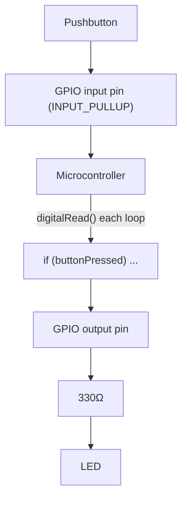

# 12-GPIO Device

An Arduino or ESP32 reading a button and driving an LED entirely through code — the same button-and-LED behavior from Lesson 3, now implemented with `pinMode()`, `digitalRead()`, and `digitalWrite()` instead of dedicated wiring for each function.

- **Difficulty:** Intermediate
- **Prerequisites:** [Lesson 3: Button and LED](../03-button-and-led/README.md), [Lesson 10: Logic Gates](../10-logic-gates/README.md)
- **Approximate time:** 30 to 45 minutes
- **What you'll build:** A microcontroller program that reads a pushbutton on a GPIO pin and lights an LED on another, replicating and then extending Lesson 3's behavior

## Why build this?

Lessons 1 through 11 built every piece of behavior directly in hardware — the "program" was the wiring itself. A microcontroller replaces most of that wiring with code: the same pin can be an input or an output depending on how you configure it, and the logic connecting them lives in software instead of copper traces. This lesson is the hinge point of the repository — everything after it assumes a microcontroller is present, and everything before it explains what's actually happening underneath when that microcontroller reads a pin.

## What you'll learn

- What General Purpose Input/Output (GPIO) means, and how a pin's role is set in software rather than fixed in hardware.
- `pinMode()`, `digitalRead()`, and `digitalWrite()`, and what each does at the electrical level.
- Why internal pull-up resistors exist, and how they replace the external pull-down resistor from Lesson 3.
- Software debouncing, as an alternative to Lesson 11's RC hardware debounce.

## What you need

| Item | Type | Quantity | Purpose |
|---|---|---:|---|
| Arduino Uno or ESP32 dev board | Tool | 1 | Runs the GPIO program |
| LED (5mm) | Component | 1 | Output indicator |
| Resistor, 330Ω | Component | 1 | Current-limits the LED |
| Tactile pushbutton | Component | 1 | Digital input |
| Breadboard | Tool | 1 | Solderless prototyping surface |
| Jumper wires | Tool | 4–5 | Connections |
| USB cable | Tool | 1 | Power and programming connection to the board |
| Computer with Arduino IDE (or PlatformIO) installed | Tool | 1 | For writing and uploading code |

## Before you build

A GPIO pin's role — input or output — isn't fixed by hardware, unlike every pin in Lessons 1 through 11. Calling `pinMode(pin, OUTPUT)` configures the pin's internal driver to actively push it high or low; calling `pinMode(pin, INPUT)` configures it to instead read whatever voltage is presented to it, at high impedance so it doesn't disturb the signal.

This solves Lesson 3's floating-input problem differently. Instead of wiring an external 10kΩ pull-down resistor, most microcontrollers offer an **internal pull-up** resistor, enabled with `pinMode(pin, INPUT_PULLUP)`. With this enabled, an unpressed button reads **high** by default (pulled up internally), and pressing a button that connects the pin to ground pulls it **low** — the logical inverse of Lesson 3's pull-down wiring, and one less external component needed.

`digitalRead(pin)` returns `HIGH` or `LOW` based on the pin's current voltage, sampled once at the instant it's called — not continuously. `digitalWrite(pin, HIGH)` or `digitalWrite(pin, LOW)` sets an output pin's driven voltage.

**Software debounce** replaces Lesson 11's RC network: instead of physically smoothing the button signal, code reads the pin, waits a short delay (typically 20–50ms), and reads again to confirm the change is stable before acting on it — trading hardware complexity for a few lines of code.

## How it works

| Component | Role |
|---|---|
| GPIO input pin | Configured with an internal pull-up, reads the button's state without needing an external resistor |
| Microcontroller | Runs a loop that samples the input pin and decides the output pin's state in software |
| GPIO output pin | Drives current through the 330Ω/LED branch exactly like the transistor's collector did in Lesson 4, but from the chip's own output driver |

Underneath the `digitalRead()`/`digitalWrite()` calls, the microcontroller's GPIO pins are themselves built from the same CMOS logic gates and transistor switches from Lessons 4 and 10 — the code doesn't replace that hardware, it configures and reads it.

## Build it

1. Wire the pushbutton between a GPIO input pin and ground (no external resistor needed if using `INPUT_PULLUP`).
2. Wire the LED's anode through the 330Ω resistor to a GPIO output pin; wire the cathode to ground.
3. In the Arduino IDE, write a sketch that sets the input pin with `pinMode(buttonPin, INPUT_PULLUP)` and the output pin with `pinMode(ledPin, OUTPUT)`.
4. In `loop()`, read the button pin and set the LED pin to match — remembering the pull-up inverts the logic (`LOW` means pressed).
5. Upload the sketch to the board over USB.
6. Press the button and confirm the LED responds.

## Verify it

- Open the Arduino IDE's Serial Monitor and print the button pin's raw state each loop iteration; confirm it reads `HIGH` unpressed and `LOW` pressed, matching the `INPUT_PULLUP` behavior described above.
- Comment out `INPUT_PULLUP` and use plain `INPUT` instead (no pull-up) and observe the same floating-pin instability from Lesson 3 reappear in the Serial Monitor's printed values.
- Add a basic software debounce delay and confirm rapid presses no longer register as multiple events, similar to what Lesson 11's RC network achieved in hardware.

## What should you see?

The LED tracking the button precisely, with the Serial Monitor's printed pin state matching what you'd expect at each moment — pressed reads `LOW`, released reads `HIGH`, when using the internal pull-up.

## Troubleshooting

| Symptom | Possible cause | What to check |
|---|---|---|
| Button reading is inconsistent without `INPUT_PULLUP` | Floating input, same root cause as Lesson 3 | Switch to `INPUT_PULLUP` or wire an external pull-down as in Lesson 3 |
| LED logic seems inverted from what you expect | Forgetting `INPUT_PULLUP` makes "pressed" read `LOW`, not `HIGH` | Check your `if` condition matches the actual pull-up logic |
| Nothing uploads to the board | Wrong board/port selected in the IDE, or a driver issue | Check the IDE's board and port menus match your connected device |
| LED doesn't respond at all | Output pin wired to a pin that doesn't support digital output, or wrong pin number in code | Cross-check your board's pinout diagram against the pin number used in code |

## Common mistakes

- **Forgetting that `INPUT_PULLUP` inverts the expected logic.** Many beginners write `if (digitalRead(pin) == HIGH)` for "pressed," when with a pull-up it should be `LOW`.
- **Using `delay()` for debouncing in a way that blocks the whole program.** This works for a single-button demo but becomes a problem the moment you need to do anything else concurrently — a lesson `millis()`-based timing patterns solve later in more advanced projects.
- **Wiring an LED directly to 5V logic without a current-limiting resistor.** The same rule from Lesson 1 still applies; a GPIO pin can be damaged by excessive current just as easily as a battery can damage an LED.

## Think about it

- Why does moving from hardware pull-down (Lesson 3) to software `INPUT_PULLUP` change which logic level means "pressed"?
- What's actually different, at the hardware level, between a pin configured as `INPUT` and one configured as `OUTPUT`?
- Why is software debouncing a reasonable trade against Lesson 11's hardware RC debounce, and when might you still prefer hardware debounce?
- How many of Lessons 1–11's circuits could, in principle, be replaced by a microcontroller and a few lines of code — and which ones couldn't (hint: think about the amplifier and filter lessons)?

## Experiment with it

- Add a second button and LED, and write logic that only lights the LED when both buttons are pressed — recreating Lesson 10's AND gate in software.
- Use `millis()` instead of `delay()` to debounce without blocking the rest of the program.
- Print the exact timestamp of each button press to the Serial Monitor and measure real switch bounce duration for your specific button.

## Simulation

- [Wokwi](https://wokwi.com) — supports full Arduino/ESP32 simulation with virtual buttons and LEDs, ideal for this lesson specifically.
- [Falstad circuit simulator](https://www.falstad.com/circuit/)

## Further reading

- [Wikipedia: General-purpose input/output](https://en.wikipedia.org/wiki/General-purpose_input/output) — the general concept behind GPIO pins across microcontroller families.
- [Wikipedia: Pull-up resistor](https://en.wikipedia.org/wiki/Pull-up_resistor) — revisit alongside the internal-pull-up option covered here.

## Hardware Atlas resources

### Components
For comparing Arduino, ESP32, and other common dev boards and their GPIO capabilities: [Explore Components](../resources/components.md)

### Tools
For setting up the Arduino IDE or PlatformIO for the first time: [See Tools](../resources/tools.md)

### Help
If your board won't program or the pin logic seems inverted after working through Troubleshooting: [See Hardware Help](../resources/help.md)

## Sourcing

Arduino Uno clones and ESP32 dev boards are widely available and a one-time purchase reused across every remaining lesson in this repository. For India-specific sourcing: [See India Resources](../resources/india.md)

## Going deeper

Every remaining lesson in this repository builds on this exact pattern: configure pins, read or write them in a loop, and layer more sophisticated protocols and peripherals on top. [Lesson 13](../13-temperature-logger/README.md) adds analog input to the mix; [Lesson 14](../14-uart-i2c-device/README.md) adds structured communication.

## Where this fits in Hardware Atlas

Move to [Lesson 13: Temperature Logger](../13-temperature-logger/README.md). You've read a simple two-state button; next you'll read a continuously varying analog voltage from a temperature sensor and turn it into real numbers over time.