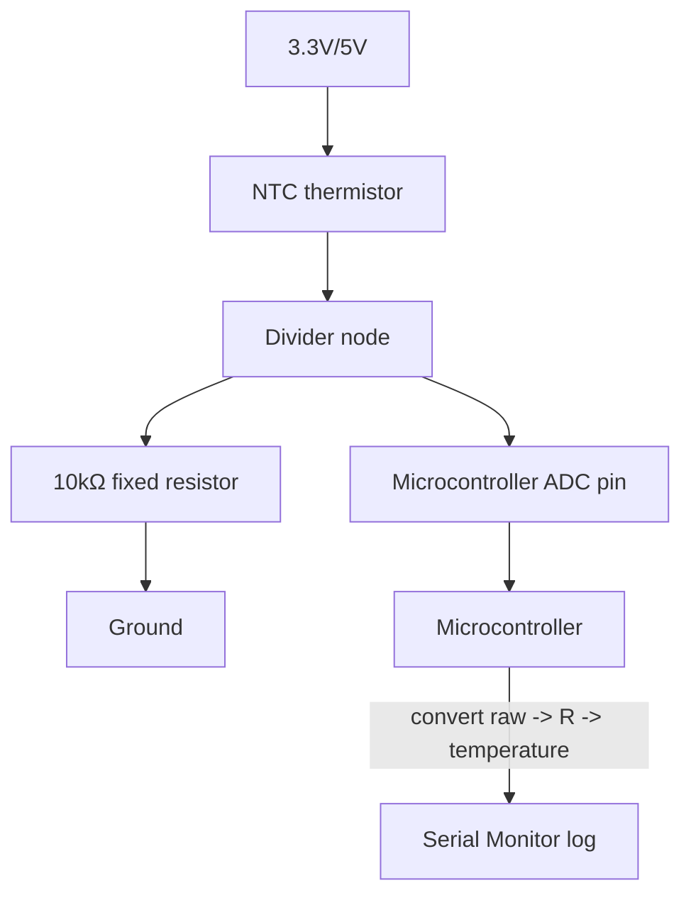

# 13-Temperature Logger

A thermistor voltage divider (the same pattern as Lesson 6's light sensor) read by a microcontroller's analog-to-digital converter, converted to a real temperature in Celsius, and logged over time to the Serial Monitor.

- **Difficulty:** Intermediate
- **Prerequisites:** [Lesson 6: Light Sensor](../06-light-sensor/README.md), [Lesson 12: GPIO Device](../12-gpio-device/README.md)
- **Approximate time:** 45 to 60 minutes
- **What you'll build:** An analog temperature sensor circuit read continuously by a microcontroller and printed as real-time temperature readings over serial

## Why build this?

Lesson 6 turned light into a voltage using an LDR divider, then read that voltage with a transistor threshold. This lesson uses the exact same divider structure with a thermistor instead of an LDR, but reads it properly this time — with the microcontroller's ADC, converting a raw analog voltage into a real, calibrated temperature. This is the first lesson where a "reading" is actually a meaningful physical quantity, not just an on/off state, which is why it needs its own conversion math.

## What you'll learn

- How an analog-to-digital converter (ADC) turns a continuous voltage into a discrete number.
- How to use the NTC thermistor's resistance-temperature relationship (the Beta equation) to convert a voltage reading into degrees Celsius.
- Why ADC resolution and reference voltage together determine measurement precision.
- Basic time-series logging: reading at a fixed interval and printing timestamped values.

## What you need

| Item | Type | Quantity | Purpose |
|---|---|---:|---|
| NTC thermistor (10kΩ at 25°C, common type) | Component | 1 | Resistance changes predictably with temperature |
| Resistor, 10kΩ | Component | 1 | Fixed half of the voltage divider, matched to the thermistor's nominal value |
| Arduino Uno or ESP32 | Tool | 1 | Reads the divider's output via its ADC |
| Breadboard | Tool | 1 | Solderless prototyping surface |
| Jumper wires | Tool | 3–4 | Connections |
| USB cable | Tool | 1 | Power, programming, and Serial Monitor connection |

## Before you build

An NTC (negative temperature coefficient) thermistor's resistance falls as temperature rises — the opposite direction of an LDR's response to light, but the same underlying divider math from Lesson 2 and Lesson 6 applies directly.

Wired as one half of a voltage divider (thermistor on top, fixed 10kΩ resistor to ground, same orientation logic as Lesson 6), the ADC reads a voltage that rises as temperature falls. To get a usable temperature, first convert the ADC's raw reading back to the thermistor's actual resistance, then use the Beta equation to convert resistance to temperature.

An ADC reports a raw integer proportional to the input voltage relative to its reference voltage. A 10-bit ADC (like the Arduino Uno's) reports 0–1023; a 12-bit ADC (like many ESP32 pins) reports 0–4095. Converting the raw value back to voltage:

$$V_{measured} = raw \times \frac{V_{ref}}{ADC_{max}}$$

From that voltage, recover the thermistor's resistance using the divider formula rearranged:

$$R_{thermistor} = R_{fixed} \times \frac{V_{ref} - V_{measured}}{V_{measured}}$$

(assuming the thermistor is the top resistor, closest to the supply)

Then apply the **Beta equation** to convert resistance to temperature in Kelvin:

$$\frac{1}{T} = \frac{1}{T_0} + \frac{1}{\beta} \ln\left(\frac{R}{R_0}\right)$$

where `T0` is 298.15K (25°C), `R0` is the thermistor's nominal resistance at 25°C (10kΩ for this part), and `β` is a datasheet constant, typically around 3950 for common 10kΩ NTC thermistors. Convert the result from Kelvin to Celsius by subtracting 273.15.

## How it works

| Component | Role |
|---|---|
| Thermistor + fixed resistor | Same voltage divider structure as Lesson 2 and Lesson 6, now producing a temperature-dependent voltage |
| ADC pin | Samples the divider's output as a raw digital number |
| Microcontroller | Converts the raw ADC value through voltage, then resistance, then the Beta equation, into a real temperature |

The physical circuit is nearly identical to Lesson 6's; what's different is entirely on the software side — instead of a hard threshold from a transistor, the microcontroller does the full math to recover an actual temperature value, and can log it continuously rather than just switching a load at one fixed point.

## Build it

1. Build the thermistor/10kΩ voltage divider exactly like Lesson 6's LDR divider, with the thermistor on top (toward the supply) and the fixed resistor on the bottom (toward ground).
2. Wire the divider's midpoint to one of the microcontroller's analog input pins.
3. In your sketch, read the analog pin with `analogRead()`, convert to voltage using your board's actual ADC resolution and reference voltage, then apply the resistance and Beta equation formulas above.
4. Print the resulting temperature to the Serial Monitor once per second.
5. Upload and open the Serial Monitor to watch live readings.

## Verify it

- Compare the logged temperature against a known reference (a household thermometer, or simply room temperature you're confident about) — it should be within a couple of degrees.
- Warm the thermistor gently (cup it in your hand, without touching bare wires) and confirm the logged temperature rises smoothly.
- Cross-check your board's actual ADC reference voltage and resolution in the code — using the wrong `V_ref` or `ADC_max` is the most common source of a consistently-offset reading.

## What should you see?

A steady stream of plausible room-temperature readings (roughly 20–25°C indoors) that respond smoothly to deliberate warming or cooling, without wild jumps between consecutive readings.

## Troubleshooting

| Symptom | Possible cause | What to check |
|---|---|---|
| Readings are wildly implausible (e.g. hundreds of degrees, or deeply negative) | Wrong `R0`/`β` constants for your specific thermistor, or divider orientation reversed | Check the thermistor's datasheet for the correct Beta value, and confirm which resistor is on top in the divider |
| Reading is consistently offset by a fixed amount | Wrong ADC reference voltage or resolution assumed in code | Confirm your board's actual `V_ref` (3.3V or 5V) and ADC bit depth |
| Readings jump around noisily between samples | No averaging, and normal ADC noise | Average several consecutive readings before converting to temperature |
| No reading at all / always reads 0 or max | Analog pin not actually connected to the divider midpoint, or wrong pin number in code | Recheck the physical wiring against the pin number used in `analogRead()` |

## Common mistakes

- **Using generic 10kΩ/25°C/β=3950 constants without checking your actual thermistor's datasheet.** These are common values, not universal ones — a mismatched part will produce plausible-looking but wrong readings.
- **Forgetting the divider orientation matters for the resistance-recovery formula.** The formula above assumes the thermistor is the top resistor; if you wired it as the bottom resistor, the formula needs to be inverted, same as the LDR discussion in Lesson 6.
- **Reading and printing every single loop iteration with no delay.** This floods the Serial Monitor faster than it's useful and can make genuine changes harder to see; a fixed interval (e.g. once per second) is more legible.

## Think about it

- Why does the Beta equation use a logarithm rather than a simple linear relationship between resistance and temperature?
- How would averaging multiple ADC readings before converting to temperature reduce noise, and what's the trade-off in doing so?
- Why does getting the ADC's reference voltage wrong shift every reading by roughly the same amount, rather than randomly?
- How would you extend this circuit to log to an SD card or send readings over Wi-Fi instead of just printing to Serial?

## Experiment with it

- Log readings once per second for 10 minutes while the room's temperature is stable, and quantify the reading-to-reading noise.
- Compare this thermistor-based approach against a dedicated digital sensor (like a DS18B20) in terms of wiring complexity versus accuracy.
- Add a rolling average filter in code and compare the smoothed output against the raw readings side by side.

## Simulation

- [Wokwi](https://wokwi.com) — includes thermistor and Arduino/ESP32 ADC simulation suitable for testing this exact circuit.
- [Falstad circuit simulator](https://www.falstad.com/circuit/)

## Further reading

- [Wikipedia: Thermistor](https://en.wikipedia.org/wiki/Thermistor) — covers the Beta equation and NTC/PTC behavior in depth.
- [Wikipedia: Analog-to-digital converter](https://en.wikipedia.org/wiki/Analog-to-digital_converter) — resolution, reference voltage, and quantization error.

## Hardware Atlas resources

### Components
For thermistor types, digital temperature sensor alternatives, and ADC characteristics across common boards: [Explore Components](../resources/components.md)

### Help
If your logged temperature seems implausible after working through Troubleshooting: [See Hardware Help](../resources/help.md)

## Sourcing

10kΩ NTC thermistors are inexpensive and commonly bundled in sensor kits. For India-specific sourcing: [See India Resources](../resources/india.md)

## Going deeper

This resistive-divider-plus-ADC pattern generalizes to any analog sensor a microcontroller can read directly: flex sensors, force sensors, potentiometers, gas sensors, and simplified light meters. [Lesson 14](../14-uart-i2c-device/README.md) covers the alternative: sensors that report digital values directly over a communication protocol instead of a raw analog voltage.

## Where this fits in Hardware Atlas

Move to [Lesson 14: UART/I2C Device](../14-uart-i2c-device/README.md). You've read an analog sensor through a raw voltage; next you'll read a sensor that speaks a structured digital protocol directly, and see why that's often more accurate and more convenient.