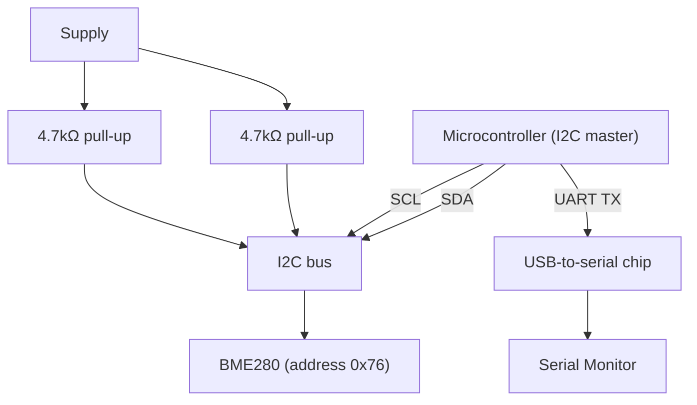

# 14-UART/I2C Device

An I2C sensor (a BME280 temperature/humidity/pressure module) queried by a microcontroller and the results printed over UART serial — two different communication protocols in one lesson, one for talking to a nearby chip, one for talking to your computer.

- **Difficulty:** Intermediate to advanced
- **Prerequisites:** [Lesson 13: Temperature Logger](../13-temperature-logger/README.md)
- **Approximate time:** 45 to 60 minutes
- **What you'll build:** A microcontroller reading temperature, humidity, and pressure from a BME280 over I2C, and printing the results over UART to your computer's Serial Monitor

## Why build this?

Lesson 13 read a sensor as a single raw analog voltage — simple, but limited to one physical quantity per pin, sensitive to noise, and needing manual calibration math. Most real sensors instead contain their own ADC, calibration data, and a digital communication protocol, delivering already-converted, more accurate readings over just two or three wires regardless of how many separate measurements they report. This lesson introduces I2C, the protocol used by the vast majority of hobbyist sensor breakout boards, alongside UART, the protocol you've actually been using since Lesson 12 every time you opened the Serial Monitor, without it being named directly.

## What you'll learn

- What UART is, and that `Serial.print()` has been using it in every lesson since Lesson 12.
- What I2C is: a two-wire bus (clock and data) that lets a microcontroller talk to multiple addressed devices.
- The idea of a device address, and why two I2C devices with the same address can't share a bus without extra wiring.
- Why I2C needs pull-up resistors on its two data lines, and how that connects back to the pull-up concept from Lesson 3 and Lesson 12.

## What you need

| Item | Type | Quantity | Purpose |
|---|---|---:|---|
| BME280 breakout module (I2C) | Component | 1 | Digital temperature/humidity/pressure sensor |
| Arduino Uno or ESP32 | Tool | 1 | Runs the I2C master and UART logging |
| Resistor, 4.7kΩ | Component | 2 | Pull-ups for the I2C SDA and SCL lines (often already included on breakout boards — check before adding your own) |
| Breadboard | Tool | 1 | Solderless prototyping surface |
| Jumper wires | Tool | 4 | Connections (VCC, GND, SDA, SCL) |
| USB cable | Tool | 1 | Power, programming, and UART connection to the computer |

## Before you build

**UART (Universal Asynchronous Receiver-Transmitter)** sends data one bit at a time over a single wire per direction (TX and RX), with both sides agreeing in advance on a baud rate (bits per second) instead of sharing a clock signal. Every `Serial.print()` call you've used since Lesson 12 has been UART, routed over the USB cable through a chip that translates it to your computer's USB protocol. There's no addressing in UART — it's strictly one device talking to one other device.

**I2C (Inter-Integrated Circuit)** is different: it's a shared two-wire bus (SDA for data, SCL for clock) that multiple devices can sit on simultaneously, each with its own fixed address (the BME280 typically uses `0x76` or `0x77`, selectable via a pin on the module). The microcontroller, acting as the **bus master**, initiates every transaction by first sending the target device's address, and only the device matching that address responds.

I2C's data and clock lines are **open-drain**: devices can only pull them low, never actively drive them high. This is why external pull-up resistors (typically 4.7kΩ, tying SDA and SCL to the supply) are required — without them, the bus lines would float whenever no device is actively pulling them low, the same floating-input problem from Lesson 3, now applied to a shared bus instead of a single input pin. Many breakout boards include these pull-ups onboard already; check the module before adding a second, redundant set.

## How it works

| Component | Role |
|---|---|
| BME280 | An I2C slave device that measures temperature, humidity, and pressure internally and reports them digitally on request |
| SDA/SCL pull-ups | Give the open-drain I2C lines a defined high state when no device is actively pulling them low |
| Microcontroller | Acts as I2C master (requesting sensor data) and UART transmitter (reporting results to your computer) simultaneously |

The microcontroller addresses the BME280 over I2C, requests a measurement, and reads back several bytes of raw calibrated data. It then formats that data as human-readable text and sends it out over UART, where a USB-to-serial chip on the board converts it into something your computer's Serial Monitor can display.

## Build it

1. Wire the BME280's VCC and GND to the microcontroller's supply and ground.
2. Wire SDA to the microcontroller's SDA pin and SCL to its SCL pin (check your specific board's pinout — these are fixed pins on most Arduinos, configurable on many ESP32 boards).
3. Add 4.7kΩ pull-up resistors from SDA and SCL to the supply, unless your breakout board already includes them.
4. Install a BME280 library in your IDE, and use an I2C scanner sketch first to confirm the sensor's address is detected on the bus.
5. Write a sketch that initializes the sensor, reads temperature, humidity, and pressure each loop iteration, and prints them over `Serial`.
6. Upload and open the Serial Monitor.

## Verify it

- Run an I2C scanner sketch before writing any sensor-specific code, and confirm it reports a device at the expected address (`0x76` or `0x77`) — this isolates wiring problems from library/code problems.
- Compare the BME280's temperature reading against Lesson 13's thermistor reading side by side; the BME280 should be noticeably more stable and precise.
- Breathe gently near the sensor and confirm the humidity reading responds quickly — a good sign the I2C communication is genuinely live, not a cached or stuck value.

## What should you see?

Continuously updating temperature, humidity, and pressure values printed to the Serial Monitor, each refreshing every loop iteration and responding sensibly to real environmental changes.

## Troubleshooting

| Symptom | Possible cause | What to check |
|---|---|---|
| I2C scanner finds no devices | Missing pull-ups, swapped SDA/SCL, or power not reaching the sensor | Recheck wiring against the pinout, and confirm pull-ups are present somewhere on the bus |
| Scanner finds a device but readings are nonsense | Wrong sensor library, or address mismatch between code and actual wiring | Confirm the library matches your exact sensor part number and configured address |
| Readings freeze at one value | Bus stuck (a device left mid-transaction after a bad reset) | Power-cycle the entire circuit, not just the microcontroller |
| Serial Monitor shows garbled text | Baud rate mismatch between `Serial.begin()` in code and the Serial Monitor's selected baud rate | Match both to the same value (commonly 9600 or 115200) |

## Common mistakes

- **Skipping the I2C scanner step and debugging sensor code blind.** The scanner isolates "is the bus even working" from "is my sensor code correct," which is far faster to debug separately.
- **Forgetting pull-ups when using a bare sensor chip instead of a breakout board.** Breakout boards often include them; bare chips almost never do.
- **Mismatching the UART baud rate between code and the Serial Monitor.** This produces readable-looking but corrupted text, easy to mistake for a sensor problem.

## Think about it

- Why can I2C support multiple devices on the same two wires, while UART (as used here) can only connect two devices directly?
- What would happen if two I2C devices on the same bus were accidentally configured with the same address?
- Why do I2C lines need external pull-ups when a plain GPIO input (Lesson 12) can use an *internal* one instead?
- How does UART avoid needing a shared clock line, unlike I2C?

## Experiment with it

- Add a second I2C device (many boards support multiple sensors on one bus) and confirm both respond to the scanner at their distinct addresses.
- Deliberately remove the pull-up resistors (if using a bare sensor without onboard pull-ups) and observe the bus fail, then restore them.
- Log sensor readings over UART into a spreadsheet by capturing Serial Monitor output over time, building a simple environmental log.

## Simulation

- [Wokwi](https://wokwi.com) — includes I2C sensor simulation (including BME280-family parts) alongside full microcontroller simulation.
- [Falstad circuit simulator](https://www.falstad.com/circuit/)

## Further reading

- [Wikipedia: I²C](https://en.wikipedia.org/wiki/I%C2%B2C) — full protocol description including addressing and open-drain signaling.
- [Wikipedia: Universal asynchronous receiver-transmitter](https://en.wikipedia.org/wiki/Universal_asynchronous_receiver-transmitter) — the UART protocol underlying every Serial Monitor session so far.

## Hardware Atlas resources

### Components
For comparing I2C, SPI, and UART sensor modules, and when each protocol makes sense: [Explore Components](../../resources/components.md)

### Help
If the I2C scanner can't find your sensor after working through Troubleshooting: [See Hardware Help](../../resources/help.md)

## Sourcing

BME280 breakout boards are widely available from hobbyist electronics suppliers, usually with pull-ups already included. For India-specific sourcing: [See India Resources](../../resources/india.md)

## Going deeper

I2C and UART are two of the three protocols you'll meet across most hobbyist projects (SPI being the third, used by faster peripherals like displays and SD cards). [Lesson 15](../15-pwm-motor-controller/README.md) returns to a purely GPIO-driven approach, but with a signal type — PWM — that neither of this lesson's protocols directly produces.

## Where this fits in Hardware Atlas

Move to [Lesson 15: PWM Motor Controller](../15-pwm-motor-controller/README.md). You've read digital sensor data in; next you'll send an analog-*feeling* signal out, controlling a motor's speed from a microcontroller pin that can technically only be fully on or fully off.