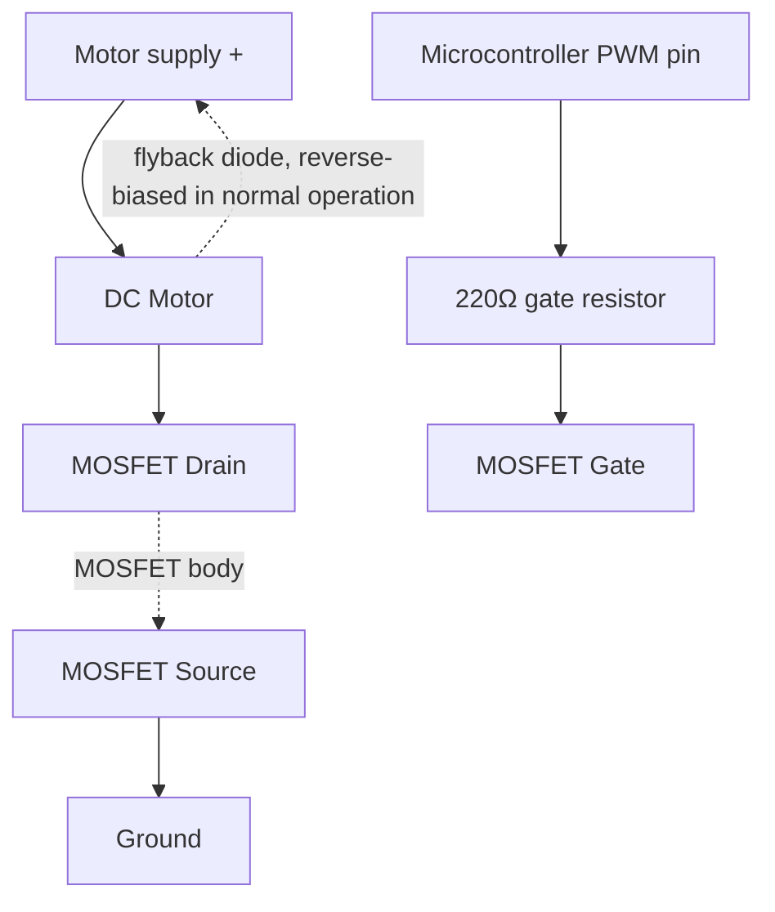

# 15-PWM Motor Controller

A microcontroller controlling a DC motor's speed using PWM (Pulse Width Modulation) through a MOSFET switch, closing the loop back to Lesson 4's transistor switch — now switched fast enough, and with the right duty cycle, to simulate a continuously variable voltage.

- **Difficulty:** Advanced
- **Prerequisites:** [Lesson 4: Transistor Switch](../04-transistor-switch/README.md), [Lesson 12: GPIO Device](../12-gpio-device/README.md)
- **Approximate time:** 45 to 75 minutes
- **What you'll build:** A microcontroller-driven MOSFET circuit that varies a DC motor's speed smoothly using PWM, with a flyback diode protecting the circuit from the motor's inductive kickback

## Why build this?

Lesson 4 established that a transistor can be either fully on or fully off — there was no in-between, and Lesson 7 showed the linear region needed for anything else was fussy to bias correctly. PWM solves the "I want variable power without an analog amplifier" problem a completely different way: by switching fully on and fully off very fast, and controlling the *fraction of time* it spends on. This is the standard technique for controlling motor speed, LED brightness, and heater power from a microcontroller, and it closes the loop on nearly every previous lesson: switching (Lesson 4), timing (Lesson 5), and digital I/O (Lesson 12) all show up here at once.

## What you'll learn

- What PWM is: a fixed-frequency square wave with a variable duty cycle, and how duty cycle relates to average delivered power.
- Why a MOSFET, not a BJT, is the standard choice for switching real motor current, and how it differs from the BJT switch in Lesson 4.
- Why an inductive load (a motor) requires a flyback diode, and what happens electrically without one.
- How `analogWrite()` (despite the name) produces a PWM signal rather than a true analog voltage.

## What you need

| Item | Type | Quantity | Purpose |
|---|---|---:|---|
| Logic-level N-channel MOSFET (e.g. IRLZ44N) | Component | 1 | Switches the motor's current, gate-driven directly from a GPIO pin |
| Small DC motor (5–9V hobby motor) | Component | 1 | The variable-speed load |
| Flyback diode (1N4001 or similar) | Component | 1 | Protects the MOSFET from the motor's inductive voltage spike on switch-off |
| Resistor, 220Ω | Component | 1 | Gate resistor, limits inrush current into the MOSFET's gate capacitance |
| Arduino Uno or ESP32 | Tool | 1 | Generates the PWM signal |
| Breadboard | Tool | 1 | Solderless prototyping surface |
| Jumper wires | Tool | 5–6 | Connections |
| Separate motor power supply (if motor draws more than the board can safely supply) | Component | 1 | Keeps motor current off the microcontroller's own power rail |

## Before you build

**PWM** is a square wave at a fixed frequency where the fraction of each cycle spent "high" — the **duty cycle** — determines the average power delivered to a load, assuming the load responds too slowly to react to individual pulses (a motor's mechanical inertia easily satisfies this). A 50% duty cycle delivers roughly half the full-on power; a 25% duty cycle delivers roughly a quarter.

$$P_{average} \approx P_{full} \times \text{duty cycle}$$

`analogWrite(pin, value)` on most Arduino-family boards takes a value from 0–255 and produces a PWM signal with that value's proportional duty cycle (0 = always off, 255 = always on) — despite the function's name, it is not producing a true continuously variable analog voltage the way a DAC would.

**Why a MOSFET instead of the BJT from Lesson 4?** A BJT is current-controlled: driving it fully on requires continuously supplying base current proportional to the load current, wasting power and complicating high-current switching. A MOSFET is voltage-controlled: once its gate reaches the threshold voltage, it draws almost no continuous gate current to stay on, making it far more efficient for switching real motor currents, especially at PWM frequencies where the gate is being charged and discharged thousands of times per second. A **logic-level** MOSFET is specifically chosen because its gate threshold is low enough to be driven directly from a 3.3V or 5V GPIO pin — a standard power MOSFET may need a higher gate voltage than a microcontroller pin can provide.

**Why the flyback diode is mandatory.** A motor is an inductor as much as it is a mechanical device, and an inductor resists sudden changes in current. The instant the MOSFET switches off, the motor's winding tries to keep current flowing, generating a brief but very high voltage spike in the opposite direction — easily enough to destroy the MOSFET. A diode placed across the motor, oriented to block current during normal operation and conduct only during this reverse spike, gives that current a safe path to dissipate instead of tearing through the switching transistor.

## How it works

| Component | Role |
|---|---|
| MOSFET | Switches the motor's supply current on and off at the PWM frequency, driven by the gate voltage from the microcontroller |
| Gate resistor (220Ω) | Limits inrush current charging the MOSFET's gate capacitance on each switching edge |
| Flyback diode | Gives the motor's inductive current a safe path when the MOSFET switches off, protecting it from voltage spikes |
| Motor | The load; its mechanical inertia averages out the rapid on/off switching into effectively smooth, variable speed |

The microcontroller's PWM pin rapidly toggles the MOSFET's gate. When on, current flows fully through the motor at the supply voltage; when off, no current flows and the flyback diode handles the motor's residual inductive current. The motor itself, mechanically, can't respond to individual pulses — it only "feels" the average power, which is exactly what the duty cycle controls.

## Build it

1. Wire the motor's positive terminal to the motor supply's positive rail, and its negative terminal to the MOSFET's drain.
2. Wire the MOSFET's source to ground (shared with the motor supply's ground — this common ground is essential).
3. Wire the flyback diode across the motor terminals, with its banded (cathode) end toward the motor supply's positive rail.
4. Wire the microcontroller's PWM-capable pin through the 220Ω gate resistor to the MOSFET's gate.
5. If using a separate motor supply, connect its ground to the microcontroller's ground, but keep its power rail separate from the microcontroller's own supply.
6. Write a sketch using `analogWrite(pin, value)` with a few different values (0, 64, 128, 192, 255) held for a few seconds each.
7. Upload and observe the motor's speed change at each step.

## Verify it

- Confirm the motor visibly speeds up as the duty cycle value increases from 0 toward 255, and stops (or nearly stops) at 0.
- If you have an oscilloscope, probe the MOSFET's gate and confirm you see a real square wave at the expected PWM frequency, with a duty cycle matching the `analogWrite()` value you set.
- Briefly disconnect the flyback diode (only if you're comfortable risking the MOSFET) and watch for the MOSFET running unusually hot or behaving erratically at higher speeds — do not run this test for long, and reconnect the diode immediately after observing the effect.

## What should you see?

Smooth, apparently continuous speed control across the tested duty cycle values, with no audible or visible flicker in the motor's rotation — a strong contrast to the visibly discrete on/off states of every switching circuit before Lesson 5's RC smoothing.

## Troubleshooting

| Symptom | Possible cause | What to check |
|---|---|---|
| Motor doesn't spin at any duty cycle | MOSFET gate threshold not reached, or wrong pinout | Confirm you're using a *logic-level* MOSFET rated to switch fully at your GPIO voltage |
| Motor runs at full speed regardless of duty cycle value | PWM pin not actually PWM-capable on your board, defaulting to a plain digital HIGH/LOW | Check your board's pinout for which pins support `analogWrite()`/PWM |
| MOSFET or diode gets hot | Missing or backwards flyback diode, or motor drawing more current than the MOSFET is rated for | Recheck diode orientation and the MOSFET's maximum continuous drain current rating |
| Microcontroller resets or browns out when motor starts | Motor current draw affecting the shared power supply | Use a separate motor supply with only a shared ground, not a shared power rail |

## Common mistakes

- **Omitting the flyback diode "to see what happens."** This risks real, permanent damage to the MOSFET from the motor's inductive spike — this is one of the few places in this repository where skipping a component can destroy an expensive part, not just fail to work.
- **Powering the motor directly from the microcontroller's 5V/3.3V regulator.** Motors can draw current spikes well beyond what an onboard regulator is designed to supply, and can inject electrical noise back into the microcontroller's own supply.
- **Using a standard (non-logic-level) MOSFET and wondering why it barely switches on.** Check the gate threshold voltage on the datasheet against your GPIO pin's actual output voltage before assuming the part is broken.

## Think about it

- Why does a motor's mechanical inertia make PWM feel like continuously variable speed, when the underlying signal is really just fast on/off switching?
- What determines the right PWM frequency for a given application — why not always use the fastest frequency available?
- Why is a MOSFET's gate driven by voltage rather than continuous current, unlike a BJT's base?
- How would you add a rotary potentiometer as a manual speed control input, using the ADC concepts from Lesson 13?

## Experiment with it

- Sweep the duty cycle smoothly from 0 to 255 and back using a loop with small delays, producing a gradual ramp-up and ramp-down instead of discrete steps.
- Read a potentiometer's position with `analogRead()` (as in Lesson 13) and map it directly to the motor's PWM duty cycle, building a manual speed dial.
- Measure the motor's actual current draw at several duty cycles with a multimeter in series, and compare how closely it tracks the expected linear relationship with duty cycle.

## Simulation

- [Wokwi](https://wokwi.com) — supports PWM-driven motor simulation alongside full microcontroller code simulation.
- [Falstad circuit simulator](https://www.falstad.com/circuit/)

## Further reading

- [Wikipedia: Pulse-width modulation](https://en.wikipedia.org/wiki/Pulse-width_modulation) — general theory and applications beyond motor control.
- [Wikipedia: MOSFET](https://en.wikipedia.org/wiki/MOSFET) — voltage-controlled switching behavior in more depth.
- [Wikipedia: Flyback diode](https://en.wikipedia.org/wiki/Flyback_diode) — the inductive kickback problem and its standard solution.

## Hardware Atlas resources

### Components
For choosing between MOSFETs, motor driver ICs (like the L298N or DRV8871), and when a bare MOSFET isn't enough: [Explore Components](../../resources/components.md)

### Help
If your motor doesn't respond smoothly to duty cycle changes after working through Troubleshooting: [See Hardware Help](../../resources/help.md)

## Sourcing

Logic-level MOSFETs, small hobby DC motors, and flyback diodes are all standard stock at any electronics supplier. For India-specific sourcing: [See India Resources](../../resources/india.md)

## Going deeper

PWM motor control is the foundation of motor driver ICs, LED dimming, servo control, and even some power supply designs (switching regulators use the same fast-switching-plus-inductor idea in reverse). This lesson closes the loop on the entire progression in this repository: a single LED and a resistor in Lesson 1 has grown, one idea at a time, into a microcontroller precisely controlling a physical motor's speed.

## Where this fits in Hardware Atlas

This is the final lesson in the core sequence. From here, explore the [Resources](../../resources/components.md) sections for deeper dives into any component category, or revisit earlier lessons and recombine their circuits into your own projects — every technique from Lesson 1 onward is now available to combine freely.