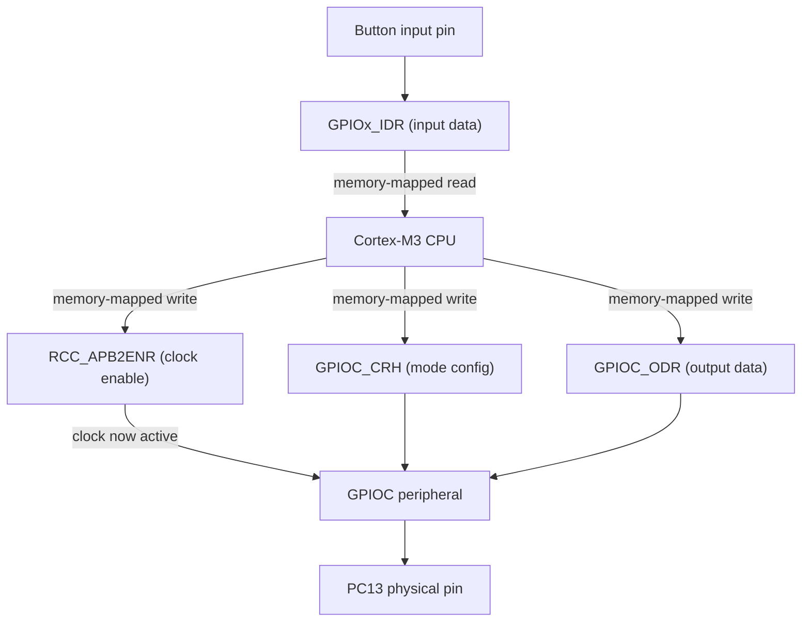

# 16-STM32 Peripheral (Bare-Metal Registers)

Blinking an LED and reading a button on an STM32F103 "Blue Pill" by writing directly to peripheral registers — no `digitalWrite()`, no HAL, no abstraction between your code and the actual hardware.

- **Difficulty:** Advanced
- **Prerequisites:** [Lesson 12: GPIO Device](../12-gpio-device/README.md)
- **Approximate time:** 60 to 90 minutes
- **What you'll build:** A bare-metal C program that toggles an LED and reads a button by writing directly to the STM32's memory-mapped GPIO and clock registers

## Why build this?

Lesson 12's `digitalWrite()` and `digitalRead()` felt almost magical — call a function, a pin changes state. This lesson removes that magic. Underneath every Arduino/ESP32 abstraction is a microcontroller with peripherals controlled by writing specific bits to specific memory addresses, and understanding that layer changes how you debug, how you read a datasheet, and how you eventually write for a chip that doesn't have an Arduino-style library at all. This is also a return to the "why" behind Lesson 10's logic gates and Lesson 11's flip-flops — a microcontroller's GPIO peripheral is built from exactly those elements, just packaged behind a register interface instead of individual pins.

## What you'll learn

- What "memory-mapped I/O" means: peripherals appear as addresses in the CPU's memory space, and reading/writing them reads/writes hardware state directly.
- How a peripheral clock must be explicitly enabled before the peripheral will respond to anything, and why this trips up almost everyone the first time.
- How a GPIO pin's mode (input, output, alternate function) is set via configuration register bits, not a friendly enum.
- Why bare-metal register access is faster and more predictable than HAL/Arduino abstractions, at the cost of needing the reference manual open at all times.

## What you need

| Item | Type | Quantity | Purpose |
|---|---|---:|---|
| STM32F103C8T6 "Blue Pill" board | Tool | 1 | Widely available, well-documented ARM Cortex-M3 dev board |
| ST-Link V2 (or clone) programmer | Tool | 1 | Flashes and debugs the board over SWD |
| LED (5mm) | Component | 1 | Visual output (in addition to the board's onboard LED on PC13) |
| Resistor, 330Ω | Component | 1 | Current-limits the external LED |
| Tactile pushbutton | Component | 1 | Digital input |
| Resistor, 10kΩ | Component | 1 | Pull-down for the button, same role as Lesson 3 |
| Breadboard + jumper wires | Tool | 1 set | Connections for the external LED and button |
| STM32F103 Reference Manual (RM0008) | Reference | — | The authoritative source for every register address and bit used here |
| ARM GCC toolchain + a flashing tool (e.g. `st-flash` or STM32CubeProgrammer) | Tool | 1 | Compiles and uploads bare-metal C code |

## Before you build

Every peripheral on an STM32 lives at a fixed memory address, documented in the reference manual as a set of registers, each a 32-bit word where individual bits or bit-groups control specific behavior. Before any GPIO port will do anything, its clock must be enabled through the **RCC (Reset and Clock Control)** peripheral — this is the single most common first bug for anyone new to bare-metal STM32 programming: writing to a GPIO register whose clock was never enabled silently does nothing.

For the Blue Pill's GPIO port C (which includes the onboard LED on pin PC13), the general sequence is:

1. **Enable the GPIOC clock** by setting the appropriate bit in `RCC_APB2ENR` (the IOP C enable bit).
2. **Configure the pin's mode** in `GPIOC_CRH` (pins 8–15 use the "high" configuration register; pins 0–7 use `CRL`), setting the 4 bits associated with PC13 to select output mode and push-pull configuration.
3. **Set or clear the pin's output** by writing to `GPIOC_ODR` (Output Data Register) — a `1` in the corresponding bit drives the pin high, a `0` drives it low.

Reading an input pin follows the same clock-enable and mode-configuration pattern, but the mode bits select input instead of output, and the pin's live state is read from `GPIOx_IDR` (Input Data Register) instead of written to `ODR`.

**Always consult the exact reference manual for your specific part** — bit positions for clock-enable and configuration registers are consistent within the STM32F1 family documented in RM0008, but differ across other STM32 families (F4, L4, H7, etc.), each with their own reference manual. Treat any specific bit position mentioned here as a starting point to verify, not a universal constant.

## How it works

| Component | Role |
|---|---|
| RCC_APB2ENR | Gates the clock signal to the GPIOC peripheral; without this bit set, GPIOC is effectively powered off |
| GPIOC_CRH | Configures each pin's mode (input/output) and drive characteristics, 4 bits per pin |
| GPIOC_ODR / GPIOx_IDR | The actual output-drive and input-read registers, directly reflecting physical pin voltage |

There is no operating system and no library call chain here — your C code writes a 32-bit value to a fixed memory address, and the CPU's bus fabric routes that write directly to the GPIO peripheral's hardware, which changes the physical pin voltage on the next clock cycle.

## Build it

1. Set up your ARM GCC toolchain and confirm you can compile a minimal C program targeting the Cortex-M3.
2. Write startup code (or use a minimal provided linker script/startup file) that gets the CPU to your `main()` function — for a first bare-metal project, a small existing starter template is reasonable to build from rather than writing a linker script from scratch.
3. In `main()`, write to `RCC_APB2ENR` to enable the GPIOC clock.
4. Write to `GPIOC_CRH` to configure PC13 as a push-pull output.
5. In a loop, write alternating values to `GPIOC_ODR` with a busy-wait delay between them to blink the onboard LED.
6. Extend the same pattern to configure an input pin (with the external pull-down button circuit) and read `GPIOx_IDR`, using the result to control the external LED via another output pin.
7. Flash the compiled binary using the ST-Link programmer.

## Verify it

- Confirm the onboard LED blinks at a rate matching your busy-wait delay's rough timing.
- Skip the RCC clock-enable step deliberately and confirm the GPIO writes have no visible effect — this makes the "peripheral clock gating" concept concrete rather than abstract.
- Read the button's state through `IDR` and print or reflect it via the external LED, confirming it matches physical press/release exactly as in Lesson 12, but now with no library involved.

## What should you see?

A blinking onboard LED and a responsive external LED tied to the button state, functionally identical to Lesson 12's behavior, but produced entirely by direct register writes with no `pinMode()`, `digitalWrite()`, or `digitalRead()` anywhere in the code.

## Troubleshooting

| Symptom | Possible cause | What to check |
|---|---|---|
| Nothing happens, no blink at all | GPIOC clock never enabled in RCC | Confirm the RCC_APB2ENR write happens before any GPIOC register access |
| Blink happens but at the wrong or wildly inconsistent rate | Busy-wait delay not calibrated to actual CPU clock speed, or compiler optimizing the delay loop away | Use a volatile loop counter or a proper timer peripheral instead of a naive delay loop |
| Board won't flash at all | ST-Link wiring or driver issue, or boot pins in the wrong position | Check SWD wiring (SWDIO, SWCLK, GND, 3.3V) and the board's BOOT0 pin state |
| Button reads incorrectly or inconsistently | Pin configured as output instead of input, or missing pull-down | Recheck the CRH/CRL configuration bits for that specific pin |

## Common mistakes

- **Forgetting the peripheral clock enable step.** This is the single most common bare-metal STM32 bug, and it fails silently — no error, no crash, just a peripheral that behaves as if it isn't there.
- **Using the wrong configuration register (CRL vs CRH) for a given pin.** Pins 0–7 and 8–15 on the same port use two entirely separate 32-bit registers; mixing them up configures the wrong pin or does nothing.
- **Assuming register bit positions are the same across STM32 families.** They frequently are not — always check the reference manual for your exact part.

## Think about it

- Why does gating a peripheral's clock separately from powering the chip make sense from a power-consumption standpoint?
- What does an Arduino's `pinMode()`/`digitalWrite()` actually have to do internally to produce the same register writes you did by hand here?
- Why is a busy-wait delay loop an unreliable way to measure real time, and what peripheral (hint: a hardware timer) would fix that?
- How does memory-mapped I/O let the same CPU instructions (simple memory loads/stores) control wildly different kinds of hardware?

## Experiment with it

- Replace the busy-wait delay with a hardware timer peripheral, configuring it via its own registers, and use it to produce an accurately timed blink.
- Configure a second GPIO port (not just GPIOC) and confirm you need to repeat the entire clock-enable and configuration process for it independently.
- Compare your bare-metal binary's size and startup time against an equivalent Arduino-framework STM32 sketch doing the same blink.

## Simulation

- [Wokwi](https://wokwi.com) — has limited STM32 support; check current board coverage before relying on it for this specific lesson.
- Renode or QEMU-based ARM emulation are worth exploring for bare-metal STM32 simulation beyond what a browser-based simulator typically covers.

## Further reading

- [Wikipedia: Memory-mapped I/O](https://en.wikipedia.org/wiki/Memory-mapped_I/O) — the general concept underlying every register access in this lesson.
- [Wikipedia: ARM Cortex-M](https://en.wikipedia.org/wiki/ARM_Cortex-M) — the core architecture family the STM32F1 is built on.
- ST's RM0008 Reference Manual (search "STM32F1 reference manual RM0008") — the authoritative register-level documentation for this exact part.

## Hardware Atlas resources

### Components
For comparing STM32 families, ARM Cortex-M variants, and choosing a dev board for bare-metal work: [Explore Components](../resources/components.md)

### Tools
For setting up an ARM GCC toolchain and ST-Link flashing workflow from scratch: [See Tools](../resources/tools.md)

### Help
If your board won't flash or peripherals won't respond after working through Troubleshooting: [See Hardware Help](../resources/help.md)

## Sourcing

Blue Pill boards and ST-Link clones are inexpensive and widely available from hobbyist electronics suppliers. For India-specific sourcing: [See India Resources](../resources/india.md)

## Going deeper

Bare-metal register access is what every HAL, RTOS driver, and Arduino core is ultimately built from. Understanding it makes [Lesson 18's](../18-rtos-sensor-logger/README.md) RTOS task scheduling far less mysterious — a task switch is, at its core, the same kind of direct register and memory manipulation you just did by hand.

## Where this fits in Hardware Atlas

Move to [Lesson 17: ESP32 Connected Sensor](../17-esp32-connected-sensor/README.md). You've controlled hardware at the lowest practical level; next you'll go the opposite direction, using a high-level networking stack to get sensor data off the board entirely and onto the internet.