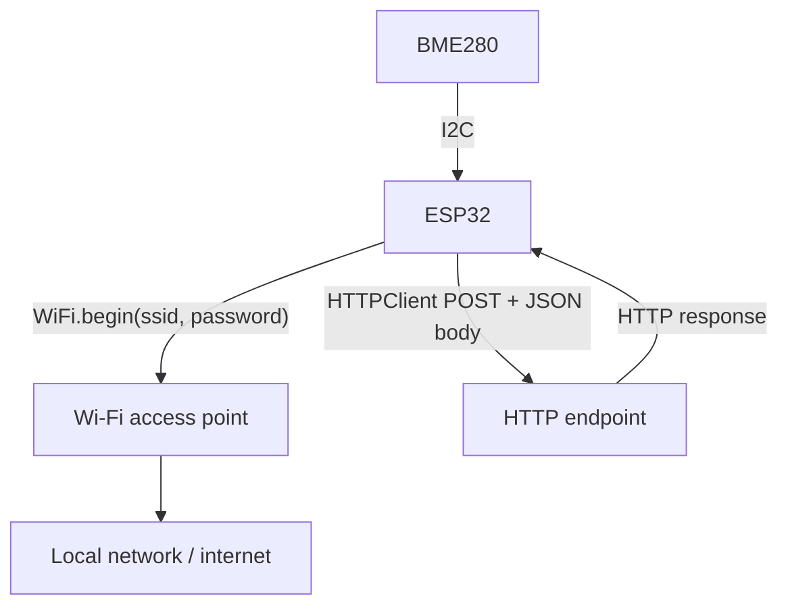
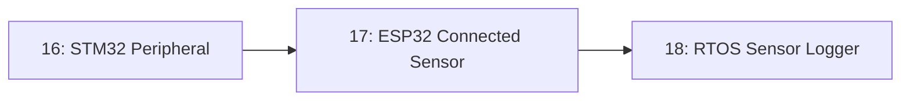

# 17-ESP32 Connected Sensor

The BME280 sensor from Lesson 14, now read by an ESP32 and published over Wi-Fi to a simple HTTP endpoint — taking a reading off the board entirely and onto a network for the first time in this repository.

- **Difficulty:** Advanced
- **Prerequisites:** [Lesson 14: UART/I2C Device](../14-uart-i2c-device/README.md)
- **Approximate time:** 60 to 90 minutes
- **What you'll build:** An ESP32 that joins your Wi-Fi network, reads a BME280 over I2C, and sends each reading as an HTTP POST request to a simple server endpoint

## Why build this?

Every previous lesson kept data on the board — printed to Serial, or expressed as an LED's state. Real embedded projects usually need that data somewhere else: a dashboard, a database, another device. This lesson adds exactly one new capability on top of Lesson 14's sensor reading: a Wi-Fi network stack. It's also the first lesson where "did it work" isn't visible on the breadboard at all — you'll be watching a server log or a phone app instead of an LED, which is its own kind of debugging skill.

## What you'll learn

- How to join a Wi-Fi network from firmware, and what station versus access point mode means.
- The basic shape of an HTTP request, and how to send one from a microcontroller using a lightweight HTTP client library.
- Why credentials shouldn't be hardcoded into source you intend to share or commit, and simple ways to avoid it.
- The difference between "the sensor read successfully" and "the network send succeeded" as two independent failure points.

## What you need

| Item | Type | Quantity | Purpose |
|---|---|---:|---|
| ESP32 dev board | Tool | 1 | Includes Wi-Fi hardware built into the chip |
| BME280 breakout module | Component | 1 | Same sensor and wiring as Lesson 14 |
| Breadboard + jumper wires | Tool | 1 set | Connections, identical to Lesson 14's I2C wiring |
| A Wi-Fi network with known credentials | Infrastructure | — | The ESP32 needs to join an existing network |
| A simple HTTP endpoint to receive readings (a local test server, or a service like a webhook tester) | Infrastructure | 1 | Somewhere for the POST requests to land so you can confirm they arrived |
| Computer with Arduino IDE and ESP32 board support installed | Tool | 1 | For writing and uploading the sketch |

## Before you build

An ESP32 in **station mode** connects to an existing Wi-Fi access point the same way a phone or laptop does, using an SSID and password. Once connected, it's assigned an IP address and can make outbound network requests just like any other device on that network.

**HTTP (HyperText Transfer Protocol)** structures a request as a method (commonly `GET` to retrieve data or `POST` to send data), a target URL, optional headers, and an optional body. Sending a sensor reading typically means issuing a `POST` request with the reading encoded in the body — often as JSON, a simple structured text format:

```json
{"temperature": 23.4, "humidity": 45.2, "pressure": 1013.1}
```

A lightweight HTTP client library (such as `HTTPClient` in the ESP32 Arduino core) handles the low-level details of opening a TCP connection, formatting the request, and reading the response, so your code mainly needs to supply the URL, headers, and body.

**Never hardcode Wi-Fi credentials or API keys into code you intend to share publicly.** A simple mitigation for a hobby project is a separate, gitignored header file (e.g. `secrets.h`) containing just the credentials, included by your main sketch — keeping sensitive values out of version control without complicating the build.

## How it works



| Component | Role |
|---|---|
| BME280 | Provides the raw sensor reading, unchanged from Lesson 14 |
| Wi-Fi radio (built into the ESP32) | Joins the local network in station mode, providing an IP address and internet-capable connectivity |
| HTTPClient library | Packages a sensor reading into an HTTP POST request and handles the underlying TCP/HTTP protocol details |
| HTTP endpoint | Receives and (in this lesson) simply confirms receipt of each reading, standing in for a real dashboard or database |

Each loop iteration performs two largely independent operations: reading the sensor over I2C (exactly as in Lesson 14), and separately sending that reading over Wi-Fi/HTTP. Either can fail without affecting the other — a network outage doesn't stop the sensor from reading correctly, and a failed sensor read shouldn't be sent as if it were valid data.

## Build it

1. Wire the BME280 to the ESP32 exactly as in Lesson 14.
2. Create a `secrets.h` file (or similar) holding your Wi-Fi SSID and password as constants, and add it to `.gitignore` if this project is under version control.
3. In your sketch, call `WiFi.begin(ssid, password)` and wait (with a timeout, not an infinite loop) for `WiFi.status() == WL_CONNECTED`.
4. Read the BME280 exactly as in Lesson 14.
5. Build a small JSON body from the reading and send it via `HTTPClient` as a POST request to your test endpoint.
6. Print the HTTP response code to Serial so you can confirm success or diagnose failure without needing to check the server side first.
7. Repeat on a timed interval (e.g. once every 10 seconds), rather than as fast as possible.

## Verify it

- Confirm `WiFi.status()` reports connected and print the assigned IP address to Serial as a first sanity check, before attempting any HTTP requests.
- Confirm each POST request's response code is what your endpoint expects (commonly `200`), and that the sensor values in the request body match what Lesson 14's direct Serial output would show.
- Temporarily disconnect the Wi-Fi router (or point at a wrong URL) and confirm the sketch handles the failure gracefully — printing an error rather than hanging indefinitely — since network failures are a normal, expected condition in any real deployment.

## What should you see?

Regular Serial output confirming both a successful sensor read and a successful HTTP response, at your chosen interval, alongside matching entries appearing on your test server or endpoint.

## Troubleshooting

| Symptom | Possible cause | What to check |
|---|---|---|
| Never connects to Wi-Fi | Wrong SSID/password, or a 5GHz-only network (most ESP32 boards only support 2.4GHz) | Confirm your network is 2.4GHz and credentials are correct |
| Connects to Wi-Fi but HTTP requests fail | Wrong endpoint URL, firewall blocking outbound requests, or endpoint expecting a different content type | Test the same URL from a computer's browser or a tool like `curl` first, independent of the ESP32 |
| Sensor readings are fine over Serial but never arrive at the endpoint | JSON body malformed, or wrong HTTP method used | Print the exact request body to Serial before sending, and compare against what the endpoint expects |
| Board resets or hangs periodically | Blocking network calls without a timeout, or memory issues from repeated string concatenation | Add explicit timeouts to network calls and check for memory leaks in long-running loops |

## Common mistakes

- **Hardcoding Wi-Fi credentials directly in a sketch you plan to commit or share.** Use a separate, gitignored credentials file even for small hobby projects.
- **Assuming a failed HTTP request means the sensor is broken.** These are two independent systems; always log which stage actually failed.
- **Sending requests as fast as the loop allows.** This can flood a test server and makes debugging harder; a deliberate interval is both more realistic and easier to reason about.

## Think about it

- Why does separating "did the sensor read succeed" from "did the network send succeed" into two distinct checks make debugging easier?
- What would happen to this circuit's behavior on a network with a captive portal (like many public Wi-Fi networks), and why doesn't simple `WiFi.begin()` handle that case?
- Why is JSON a reasonable choice for the request body here, compared to sending raw comma-separated values?
- How would you modify this sketch to buffer readings locally and retry sending them after a temporary network outage, rather than simply dropping them?

## Experiment with it

- Add a second sensor reading (e.g. from Lesson 13's thermistor) to the same JSON payload and confirm the endpoint receives both fields correctly.
- Build a minimal local server (in Python with Flask, for instance) that logs each incoming reading to a file, and watch it grow in real time as the ESP32 sends data.
- Switch from HTTP POST to MQTT (a lighter-weight publish/subscribe protocol common in IoT projects) and compare the code complexity and network overhead of each approach.

## Simulation

- [Wokwi](https://wokwi.com) — supports ESP32 Wi-Fi simulation including virtual network access, suitable for testing this exact lesson without physical Wi-Fi hardware concerns.

## Further reading

- [Wikipedia: Hypertext Transfer Protocol](https://en.wikipedia.org/wiki/HTTP) — the request/response model underlying this lesson's networking.
- [Wikipedia: JSON](https://en.wikipedia.org/wiki/JSON) — the data format used for the sensor payload.
- [Wikipedia: MQTT](https://en.wikipedia.org/wiki/MQTT) — worth reading ahead of the "experiment with it" suggestion above.

## Hardware Atlas resources

### Components
For comparing ESP32 variants and their Wi-Fi/Bluetooth capabilities: [Explore Components](../resources/components.md)

### Help
If your board won't join Wi-Fi or requests never arrive after working through Troubleshooting: [See Hardware Help](../resources/help.md)

## Sourcing

ESP32 dev boards are inexpensive and widely available; no new sensor hardware is needed beyond Lesson 14's BME280. For India-specific sourcing: [See India Resources](../resources/india.md)

## Going deeper

Getting sensor data onto a network is the first step toward real IoT deployments: dashboards, alerting, historical logging, and remote control. [Lesson 18](../18-rtos-sensor-logger/README.md) builds directly on this lesson by moving the sensor-reading and network-sending work into separate concurrent tasks instead of one linear loop.

## Where this fits in Hardware Atlas



Move to [Lesson 18: RTOS Sensor Logger](../18-rtos-sensor-logger/README.md). You've read a sensor and sent it over the network in one linear loop; next you'll split that work into independent concurrent tasks using a real-time operating system, so a slow network call can never stall a sensor reading.