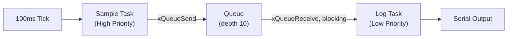
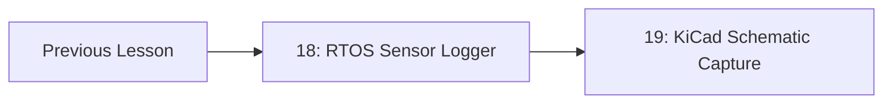

# 18-RTOS Sensor Logger

A sensor is sampled on a timer, the reading is passed through a queue, and a separate task writes it to a log — all running as independent tasks under a real-time operating system instead of one long loop. This is the project where "loop() does everything" stops being good enough.

- **Difficulty:** Intermediate
- **Prerequisites:** Comfort with C, basic microcontroller I/O (digital/analog reads), and ideally having built a bare-metal blink or ADC read without an RTOS first
- **Approximate time:** 2 to 4 hours
- **What you'll build:** A FreeRTOS application with a sampling task, a logging task, and a queue connecting them, running on a single microcontroller (ESP32 or STM32-class part)

## Why build this?

Every project so far in this repository has either been a single circuit or a single-threaded firmware loop. Real embedded systems rarely work that way: a sensor needs sampling on a strict schedule, a display needs updating on its own schedule, and a network stack needs servicing whenever data arrives — all at once, without any one of them blocking the others. An RTOS is how you get that without hand-rolling a scheduler. This project deliberately keeps the *hardware* trivial (one sensor, one log) so the entire lesson is about the *concurrency* pattern: tasks, queues, and priorities.

This also directly sets up [Lesson 27: Memory-Mapped GPIO Peripheral](../27-memory-mapped-gpio-peripheral/README.md) and [Lesson 28: Zephyr Native Sim Peripheral](../28-zephyr-native-sim-peripheral/README.md), where you'll be writing the driver code an RTOS task calls into, rather than just calling someone else's `analogRead()`.

## What you'll learn

- What a task is in an RTOS, and how it differs from a function call or an interrupt handler.
- How a queue safely passes data between tasks running at different priorities without shared-variable race conditions.
- Why a fixed sampling task should never call something as slow as a UART print directly.
- How task priority and stack size are chosen, and what happens when you get either wrong.
- The difference between a hardware timer interrupt and a software RTOS tick.

## What you need

| Item | Type | Quantity | Purpose |
|---|---|---:|---|
| ESP32 dev board (or STM32 Nucleo) | Tool | 1 | Runs FreeRTOS; ESP32 has it built into the SDK, no separate install needed |
| Analog sensor (potentiometer or LM35/thermistor) | Component | 1 | Provides a value worth sampling; a potentiometer is fine if you don't have a real sensor |
| USB cable | Tool | 1 | Programming and serial log output |
| Breadboard + jumper wires | Tool | 1 set | Wiring the sensor to an ADC pin |

## Before you build

A traditional `loop()` runs everything in one thread: read sensor, then log, then repeat. If logging takes 50ms and you need to sample every 10ms, you're stuck — the loop can't do both without careful, brittle timing math.

An RTOS solves this by giving you multiple **tasks**, each with its own stack, and a **scheduler** that decides which task runs when, based on **priority** and whether a task is blocked waiting on something. A task that's waiting for data (on a queue, a semaphore, a timer) uses zero CPU time until that data arrives — it isn't polling.

A **queue** is a fixed-size, thread-safe buffer. One task calls `xQueueSend()` to push a value in; another calls `xQueueReceive()` to pull it out, and blocks (sleeps) if the queue is empty. This is the safe way to move data between tasks — safer than a shared global variable, which can be read by one task while being half-written by another.

The design for this lesson is two tasks and one queue:

```
[Sample Task] --xQueueSend()--> [Queue, depth 10] --xQueueReceive()--> [Log Task]
```

The sample task runs every 100ms (a hard real-time deadline: sensor timing matters). The log task runs whenever data is available and is allowed to take longer, because nothing else is waiting on it.

## How it works



| Component | Role |
|---|---|
| Sample Task | Reads the ADC on a strict schedule and pushes the raw value into the queue; never blocks on I/O |
| Queue | Decouples the two tasks so a slow logger never causes a missed sample |
| Log Task | Waits for queue data, formats it, and writes it out over UART; free to take longer since nothing depends on its timing |
| Scheduler | Runs whichever task is ready and highest priority; puts the Log Task to sleep whenever the queue is empty |

The sample task is *higher priority* than the log task. If both were ready to run at once, the sampler always wins — a missed serial print is harmless, a missed sample skews your data.

## Build it

1. Create a new FreeRTOS project (ESP-IDF `idf.py create-project`, or FreeRTOS on an STM32 via STM32CubeIDE).
2. Create the queue in `app_main()` before starting any tasks: `xQueueCreate(10, sizeof(uint16_t))`.
3. Write `sample_task()`: loop forever, call `adc1_get_raw()` (or your platform's ADC read), then `xQueueSend(queue, &value, 0)`, then `vTaskDelay(pdMS_TO_TICKS(100))`.
4. Write `log_task()`: loop forever, call `xQueueReceive(queue, &value, portMAX_DELAY)` (this blocks until data arrives), then `printf("Sensor: %d\n", value)`.
5. In `app_main()`, create both tasks with `xTaskCreate()`, giving the sample task a higher priority number than the log task.
6. Flash and open a serial monitor. You should see one log line roughly every 100ms.

## Verify it

- Add a `vTaskDelay(2000)` inside `log_task()` right before the print, simulating a slow logger, and confirm in the serial output that sample *timing* (visible if you also log a timestamp) doesn't drift — only the log task's own output is delayed.
- Use `uxQueueMessagesWaiting()` to print the queue's current depth periodically, and watch it grow if you artificially slow the logger further, until it saturates at 10 and `xQueueSend` starts failing.
- If your IDE supports it, use the RTOS-aware debugger view to watch both tasks' states (Running, Blocked, Ready) change live.

## What should you see?

A steady stream of one log line approximately every 100ms, with no missed or duplicated samples, even if you deliberately slow down the log task's formatting work. The two tasks should behave as if they don't know about each other's timing at all.

## Troubleshooting

| Symptom | Possible cause | What to check |
|---|---|---|
| Nothing prints at all | Log task never created, or wrong priority causing starvation | Confirm `xTaskCreate()` return value is `pdPASS` for both tasks |
| Board resets/reboots repeatedly | Stack overflow in a task | Increase the stack size argument in `xTaskCreate()`; enable stack overflow checking |
| Samples arrive late or bunched together | Sample task priority too low, or `vTaskDelay` used incorrectly | Confirm sample task priority is numerically higher than the log task's |
| Queue send silently fails | Queue full because logger can't keep up | Increase queue depth, or reduce logger's per-item work |
| Values look random or garbage | ADC not configured before first read | Ensure ADC init/calibration runs once in `app_main()` before tasks start |

Debug in this order: confirm both tasks actually start, then confirm the queue is being written to (log the send's return value), then confirm the reader side, then look at timing.

## Common mistakes

- **Putting slow work in the sample task.** Any blocking call (a print, a delay longer than the sample period, a slow I2C transaction) in the sample task defeats the whole point of separating it from logging.
- **Using a global variable instead of a queue.** It compiles, and it will work most of the time, which is exactly what makes the occasional torn read so hard to debug later.
- **Same priority for both tasks.** This can starve the logger indefinitely on some schedulers, since a busy sampler at equal priority is never guaranteed to yield.
- **Stack size copy-pasted from an example that does far less work.** A task that calls `printf` with floats or does string formatting needs meaningfully more stack than a bare loop.

## Think about it

- What would happen if the sample task's priority were *lower* than the log task's?
- Why does `xQueueReceive` blocking the log task cost zero CPU, while a `while(queue_empty()) {}` polling loop would not?
- If you needed three consumers of the same sensor data (log, display, network), would you still use one queue?
- What's the actual worst-case latency between a sample being taken and it appearing on the serial console?

## Experiment with it

- Add a second queue and a third task that also consumes the sensor data, independently of the logger, and confirm both consumers get every value.
- Deliberately set the sample task's stack size too small and observe the failure mode on your platform.
- Replace the fixed 100ms `vTaskDelay` with `vTaskDelayUntil` and measure whether long-run timing drift improves.

## Simulation

Wokwi supports ESP32 + FreeRTOS simulation directly in the browser, which is a fast way to test the task/queue structure before touching real hardware:

**ESP32-FreeRTOS-sensor-queue** on Wokwi: [https://wokwi.com/projects/new/esp32](https://wokwi.com/projects/new/esp32) (start from the ESP32 template and add the FreeRTOS code above)

## Recommended viewing

### FreeRTOS queues explained with a producer/consumer example.

A focused walkthrough of exactly the sample/queue/logger pattern used here, with the task states shown as they change.

[Watch on YouTube](https://www.youtube.com/results?search_query=freertos+queue+producer+consumer+esp32)

## Further reading

- **Tutorial:** [FreeRTOS.org, Queue Management](https://www.freertos.org/Embedded-RTOS-Queues.html) — the canonical reference for `xQueueCreate`/`xQueueSend`/`xQueueReceive` semantics.
- **Tutorial:** [Espressif, FreeRTOS SMP on ESP32](https://docs.espressif.com/projects/esp-idf/en/latest/esp32/api-reference/system/freertos.html) — how ESP-IDF's FreeRTOS differs from vanilla FreeRTOS (dual-core scheduling in particular).
- **Reference:** [FreeRTOS.org, Task Priorities](https://www.freertos.org/RTOS-task-priority.html) — how the scheduler actually chooses which ready task runs.

## Hardware Atlas resources

### Components
For sensors and ADC fundamentals beyond a potentiometer: [Explore Components](../resources/components.md)

### Tools
For choosing a dev board and debugger for RTOS work: [See Tools](../resources/tools.md)

### Help
If tasks aren't behaving as expected: [See Hardware Help](../resources/help.md)

## Sourcing

ESP32 dev boards and basic sensors are widely available. For India-specific sourcing: [See India Resources](../resources/india.md)

## Going deeper

The producer/queue/consumer pattern here is the same shape used in USB stacks, network stacks, and industrial control loops — a fast, deterministic producer and a slower, best-effort consumer, decoupled by a buffer. Once this pattern feels natural, most "why is my firmware occasionally glitchy" bugs in more complex systems trace back to somewhere this pattern was skipped.

## Where this fits in Hardware Atlas



Move to [Lesson 19: KiCad Schematic Capture](../19-kicad-schematic-capture/README.md). You've now written firmware with real concurrency; the next step moves away from code entirely and into designing the actual circuit board that firmware would run on.