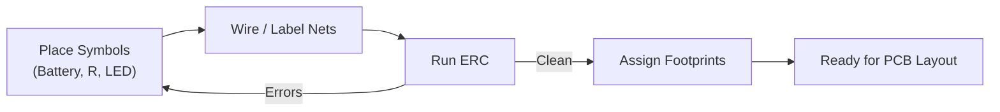
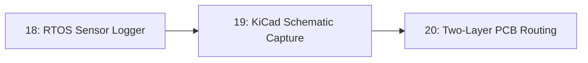

# 19-KiCad Schematic Capture

Every board you've built so far has existed only as wires on a breadboard. This lesson turns one of those circuits — the LED and resistor from Lesson 1 — into a real schematic in KiCad, with proper symbols, a footprint assignment, and an electrical rules check that catches mistakes before they become copper.

- **Difficulty:** Beginner to intermediate
- **Prerequisites:** [Lesson 1: LED Circuit](../01-led-circuit/README.md); no prior EDA tool experience assumed
- **Approximate time:** 1 to 2 hours
- **What you'll build:** A KiCad project containing a schematic sheet for a battery-resistor-LED circuit, with symbols, a hierarchical label, and a clean ERC (Electrical Rules Check) pass

## Why build this?

A breadboard proves an idea works. A schematic is what makes that idea reproducible, shareable, and eventually manufacturable. It's also a discipline: KiCad's Electrical Rules Check will flag things a breadboard never complains about — an unconnected pin, a net with two drivers, a missing power symbol — long before they cost you a fabricated board.

This is also the direct prerequisite for [Lesson 20: Two-Layer PCB Routing](../20-two-layer-pcb-routing/README.md), where this exact schematic becomes physical copper.

## What you'll learn

- The difference between a schematic *symbol* and a PCB *footprint*, and why they're linked but separate.
- How nets and labels connect components without literal drawn wires crossing the whole sheet.
- What a hierarchical or global label is and when to use one instead of a plain wire.
- How to run and interpret an Electrical Rules Check (ERC).
- How to annotate and assign footprints so the design is ready to lay out.

## What you need

| Item | Type | Quantity | Purpose |
|---|---|---:|---|
| KiCad (version 7 or later) | Tool | 1 install | Free, open-source schematic capture and PCB layout suite |
| Computer (Windows/macOS/Linux) | Tool | 1 | Runs KiCad; no hardware required for this lesson |

## Before you build

A schematic symbol is an abstract representation of a part's *pins and electrical behavior* — it knows nothing about physical size or shape. A footprint is the *physical pad layout* that part needs on a PCB. The same symbol (say, a generic resistor) might be linked to many different footprints (0805 SMD, through-hole axial, 1206 SMD) depending on which physical part you actually buy. KiCad keeps these separate on purpose, associating them through each part's footprint field, so you can change the physical package late without re-drawing the schematic.

A **net** is every point in the circuit that is electrically the same node — in Lesson 1's circuit, the battery's positive terminal, one resistor leg, and nothing else form one net. Wires drawn directly between symbols create nets implicitly. **Labels** (plain, hierarchical, or global) let you connect pins on a net *without* a physically drawn wire, which matters once a schematic has more than a handful of parts and drawing every wire across the page becomes unreadable.

An **Electrical Rules Check (ERC)** is a static analysis of the schematic: it flags unconnected pins, conflicting power outputs on the same net, and other classes of connection error, before you've committed to a board. It cannot verify your resistor math — only that the connections you *drew* are internally consistent.

## How it works

| Component | Role |
|---|---|
| Symbol library | Provides the abstract, standardized symbol for each part (battery, resistor, LED) |
| Schematic sheet | Where symbols are placed and connected via wires or labels |
| ERC | Static check that every pin is intentionally connected or intentionally left open |
| Footprint assignment | Links each symbol to the physical package that will actually be soldered down |

## Build it

1. Open KiCad and create a new project; open the Schematic Editor.
2. Place three symbols using the symbol picker: a `Battery_Cell` (or `Battery`), a `R` (resistor), and an `LED`.
3. Wire the battery's positive terminal to one resistor leg, the resistor's other leg to the LED anode, and the LED cathode back to the battery's negative terminal — mirroring the physical circuit from Lesson 1.
4. Double-click the resistor and set its value field to `330`. Double-click the LED and leave its default reference.
5. Add a `GND` power symbol on the return path if you want to model it as a ground-referenced circuit rather than a floating loop (either is valid for this simple case; using GND is closer to how larger designs are drawn).
6. Run **Inspect → Electrical Rules Checker** and resolve every reported error (warnings about unused footprint fields are fine at this stage).
7. Run **Tools → Assign Footprints** and link the resistor to a through-hole `R_Axial_DIN0207` footprint and the LED to a standard 5mm THT LED footprint.
8. Save the project. You now have a schematic ready to lay out as a real board in the next lesson.

## Verify it

- Confirm ERC reports zero errors (0 unconnected pins, 0 conflicting drivers) after your fixes.
- Open the **Symbol Fields Table** and confirm every part has a reference designator (R1, D1, BT1), a value, and a footprint assigned — nothing left blank.
- Use **File → Export → Netlist** and skim the generated file; you should see exactly the three nets you expect (power, the R-to-LED junction, ground/return), nothing extra.

## What should you see?

A clean schematic with no red ERC markers, three properly labeled symbols, and a netlist that lists exactly as many nets as there are distinct electrical connections in the physical LED circuit — no more, no fewer.

## Troubleshooting

| Symptom | Possible cause | What to check |
|---|---:|---|
| ERC reports "pin not connected" | A wire looks connected visually but doesn't share an exact grid point with the pin | Zoom in and confirm the wire endpoint snaps exactly onto the pin, not near it |
| ERC reports conflicting drivers on a net | Two power-output pins tied to the same net | Confirm you haven't accidentally wired two symbols' positive terminals together where only one should drive that net |
| Footprint assignment shows blank for a part | No footprint library associated with that symbol | Manually select a footprint in the Assign Footprints tool rather than relying on the symbol default |
| Netlist has an unexpected extra net | Two wires that look separate are actually touching at a crossing point | Use "Highlight Net" on each wire to confirm which pins it actually includes |

Debug ERC errors top-to-bottom in the report list; fixing the first one often resolves several related ones automatically.

## Common mistakes

- **Drawing a wire close to a pin instead of onto it.** KiCad requires an exact connection point; visually close is not electrically connected.
- **Skipping footprint assignment "for now."** It's tempting to leave it for the layout stage, but layout literally cannot begin without it — do it while the schematic is still fresh in your mind.
- **Not running ERC until the very end.** Running it early and often catches problems while there are only three parts on the sheet, not thirty.
- **Confusing a symbol's reference designator with its value.** `R1` is the designator (a name); `330` is the value — mixing these up makes the schematic unreadable to anyone else.

## Think about it

- Why does KiCad separate the symbol library from the footprint library instead of bundling them?
- What would ERC *not* catch, even in a perfectly clean schematic, that could still make the board not work?
- Why might a large schematic use hierarchical sheets instead of one flat page?
- If you changed the LED's footprint to an SMD package, would anything in the schematic itself need to change?

## Experiment with it

- Redraw the same circuit using a `GND` power symbol and a labeled net instead of a directly drawn return wire, and confirm ERC still passes.
- Add a second LED in parallel (each with its own resistor) and observe how the netlist changes.
- Deliberately leave one pin unconnected and read exactly what ERC reports, so you recognize that message instantly in a larger design later.

## Simulation

KiCad includes a SPICE simulator (via ngspice) that can simulate this schematic directly, without needing an external tool:

**KiCad SPICE simulation of an LED/resistor circuit** — accessible via **Inspect → Simulator** inside KiCad itself once SPICE-compatible models are assigned to the resistor and a simple diode model.

## Recommended viewing

### KiCad schematic capture for absolute beginners.

A guided walkthrough of placing symbols, wiring nets, and running ERC on a first project, useful for seeing the KiCad UI in real time before you touch it yourself.

[Watch on YouTube](https://www.youtube.com/results?search_query=kicad+schematic+capture+beginner+tutorial)

## Further reading

- **Tutorial:** [KiCad Official Documentation, Getting Started](https://docs.kicad.org/) — the canonical reference for every tool used in this lesson.
- **Tutorial:** [SparkFun, How to Read a Schematic](https://learn.sparkfun.com/tutorials/how-to-read-a-schematic) — useful if schematic symbols themselves are still unfamiliar.
- **Reference:** [KiCad Symbol and Footprint Libraries](https://kicad.github.io/) — official libraries used for the parts in this lesson.

## Hardware Atlas resources

### Tools
For a broader comparison of KiCad against other EDA tools: [See Tools](../../resources/tools.md)

### Help
If ERC won't pass no matter what you try: [See Hardware Help](../../resources/help.md)

## Sourcing

KiCad is free and open source; no purchase is required for this lesson. For sourcing the physical LED and resistor if you want to build the board later: [See India Resources](../../resources/india.md)

## Going deeper

Schematic capture discipline — clean labeling, a clean ERC pass, sensible net names — is exactly what separates a design you can hand to someone else (or come back to yourself in a year) from one that only makes sense while it's fresh in your head. Every later PCB lesson in this repository assumes this discipline as a baseline, not an extra step.

## Where this fits in Hardware Atlas

Move to [Lesson 20: Two-Layer PCB Routing](../20-two-layer-pcb-routing/README.md). You now have a clean schematic and assigned footprints; the next step is turning that into physical copper traces on an actual board.