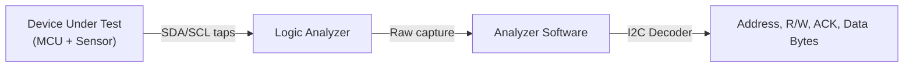
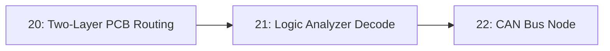

# 21-Logic Analyzer Decode

A microcontroller talking to a sensor over I2C looks like nothing more than two wiggling lines on an oscilloscope. This lesson captures those lines with a logic analyzer and lets software decode them back into the actual bytes being sent — the difference between seeing a signal and understanding what it says.

- **Difficulty:** Intermediate
- **Prerequisites:** Basic familiarity with a microcontroller talking to an I2C or UART peripheral (any prior I2C/UART project, or a simple Arduino sensor example)
- **Approximate time:** 1 to 2 hours
- **What you'll build:** A captured and decoded I2C (or UART) transaction, viewed as both raw digital waveforms and human-readable protocol data in logic analyzer software

## Why build this?

Every digital protocol lesson later in this repository — CAN in [Lesson 22](../22-can-bus-node/README.md), UART FSM design in [Lesson 24](../24-uart-rx-fsm/README.md) — assumes you can independently verify what's actually happening on the wire, rather than trusting that your code is "probably" sending the right thing. A logic analyzer plus a decoder is the tool that turns "the sensor isn't responding" from a guess into a specific, visible fact: wrong address, missing ACK, wrong clock speed, or something else entirely.

## What you'll learn

- The difference between an oscilloscope (analog voltage over time) and a logic analyzer (digital high/low states over time, on many channels at once).
- How sample rate limits what you can correctly capture, and why undersampling a fast signal produces misleading results.
- How a protocol decoder turns raw high/low transitions into bytes, ACKs, and addresses for I2C, or start/stop bits and payload for UART.
- How to read an I2C transaction: start condition, 7-bit address plus read/write bit, ACK/NACK, data bytes, stop condition.
- How to correlate a decoded transaction back to the exact line of firmware that generated it.

## What you need

| Item | Type | Quantity | Purpose |
|---|---|---:|---|
| USB logic analyzer (8-channel, e.g. a Saleae-compatible clone) | Tool | 1 | Captures digital signals from the circuit under test |
| Microcontroller running an I2C or UART example (from an earlier lesson) | Tool | 1 | Provides a real signal to capture; a simple I2C sensor read or UART print loop is enough |
| Logic analyzer software (PulseView, or Saleae Logic if using genuine Saleae hardware) | Tool | 1 install | Captures and decodes the signal |
| Jumper wires | Tool | 2–4 | Tap the SDA/SCL or TX/RX lines without disrupting the circuit |

## Before you build

A logic analyzer only records two states per channel: high or low, relative to a threshold voltage. It says nothing about the exact analog voltage level, unlike an oscilloscope — which is exactly why it's the right tool for digital protocol work: it turns a busy, noisy-looking waveform into a clean stream of ones and zeros suitable for automated decoding.

**Sample rate** determines the shortest pulse you can reliably capture. To decode a signal correctly, the sample rate needs to be comfortably above the Nyquist rate for the signal's fastest transitions — in practice, for something like 100kHz I2C, a sample rate of several megahertz gives a comfortable margin, since a decoder needs to see clean, unambiguous edges, not just the theoretical minimum.

I2C, at the wire level, is two open-drain lines: SDA (data) and SCL (clock), each pulled high by a resistor and driven low by whichever device needs to. A transaction looks like: a **start condition** (SDA falls while SCL is high), a 7-bit **address** plus one **read/write bit**, an **ACK/NACK** bit from the receiver, one or more 8-bit **data** bytes each followed by their own ACK/NACK, and a **stop condition** (SDA rises while SCL is high). A protocol decoder automates exactly this parsing, turning a wall of transitions into a labeled sequence you can read.

## How it works

| Component | Role |
|---|---|
| Device under test | The real circuit generating the signal you want to understand |
| Logic analyzer hardware | Samples the digital lines at high speed and streams the raw capture to a computer |
| Analyzer software | Displays the raw waveform and runs a protocol decoder on top of it |
| Protocol decoder | Translates raw transitions into labeled protocol fields (address, data, ACK) |

## Build it

1. Wire the logic analyzer's channel 0 to the I2C SDA line and channel 1 to SCL, sharing a common ground with the device under test. This is a passive tap — nothing is injected onto the bus.
2. Open PulseView (or your analyzer's software) and set the sample rate to at least 10x the I2C clock speed (e.g., 1MHz+ sample rate for 100kHz I2C).
3. Arm the capture, then trigger the microcontroller's I2C transaction (reset the board, or re-run the sensor-read code).
4. Stop the capture once you see activity on the waveform.
5. Add the I2C protocol decoder in software, assigning SDA and SCL to the correct captured channels.
6. Zoom into the decoded output and read off the address byte, the R/W bit, and each data byte the decoder reports.

## Verify it

- Compare the decoded 7-bit address against the sensor's documented I2C address (from its datasheet) — they should match exactly.
- Confirm every byte in the transaction shows an ACK, not a NACK; a NACK on the address byte specifically means the sensor never responded at all.
- Cross-reference the decoded data bytes against what your firmware printed to the serial console for the same read — they should be the same values, just seen from two different vantage points.

## What should you see?

A clean waveform with sharp, unambiguous transitions, and a decoder output listing a start condition, the correct address with an ACK, one or more data bytes each with an ACK, and a stop condition — matching exactly what the firmware intended to send or receive.

## Troubleshooting

| Symptom | Possible cause | What to check |
|---|---|---|
| No activity captured at all | Wrong channel mapping, or capture not triggered during the actual transaction | Confirm SDA/SCL are wired to the channels you configured in software, and that the capture window overlaps the transaction |
| Decoder shows "no ACK" errors throughout | Wrong I2C address configured, or missing pull-up resistors on the bus | Check the sensor's datasheet address against what firmware is using; confirm pull-ups are present on SDA/SCL |
| Waveform looks noisy or has ambiguous edges | Sample rate too low for the actual clock speed, or a long/unshielded wire acting as an antenna | Increase sample rate; shorten the tap wires |
| Decoded bytes don't match what firmware sent | Decoder channel assignment swapped (SDA/SCL reversed) | Re-check which physical wire is on which analyzer channel and re-map in software |

Debug by first confirming the raw waveform looks like clean digital transitions before trusting any decoded output — a decoder given noisy input will confidently report wrong data.

## Common mistakes

- **Trusting the decoder without checking the raw waveform underneath it.** A misconfigured decoder can produce plausible-looking but entirely wrong output.
- **Sampling too slowly "to save space."** A signal that looks fine at a low sample rate can still hide missed edges that corrupt the decode.
- **Forgetting a common ground between the analyzer and the device under test.** Without it, the analyzer's high/low threshold has no reliable reference.
- **Assuming a NACK always means a broken sensor,** when it's just as often a wrong address or a missing pull-up resistor.

## Think about it

- Why can't a logic analyzer measure whether a "high" signal is actually at the correct voltage level?
- What would an I2C bus with a stuck-low SDA line look like in a captured waveform, and why?
- Why does I2C use open-drain outputs with pull-up resistors instead of each device actively driving both high and low?
- How would you distinguish, from the waveform alone, a sensor that never responds from one that responds but reports it can't fulfill the request (NACK on a later byte)?

## Experiment with it

- Capture and decode a UART transaction instead of I2C, using the UART decoder, and compare how much simpler the protocol structure looks with only one data line.
- Deliberately remove the pull-up resistors from the I2C bus and observe what the captured waveform looks like when the bus can never actually reach a valid high level.
- Try decoding at a deliberately too-low sample rate and note exactly where the decoder starts making mistakes.

## Simulation

PulseView can also decode pre-recorded `.sr` capture files without any hardware attached, useful for practicing decoding on a known-good sample capture before working with real hardware:

Sample I2C capture files are available from the [sigrok project's test capture repository](https://sigrok.org/wiki/Downloads) for practicing decoding without hardware.

## Recommended viewing

### Decoding I2C with a logic analyzer, start to finish.

A practical walkthrough of wiring up a logic analyzer, capturing a real I2C transaction, and reading the decoded output field by field.

[Watch on YouTube](https://www.youtube.com/results?search_query=logic+analyzer+i2c+decode+tutorial)

## Further reading

- **Tutorial:** [SparkFun, I2C Communication Protocol](https://learn.sparkfun.com/tutorials/i2c) — background on the protocol fields this lesson's decoder is parsing.
- **Reference:** [sigrok / PulseView documentation](https://sigrok.org/wiki/PulseView) — the open-source analyzer software used in this lesson.
- **Reference:** [NXP I2C-bus specification](https://www.nxp.com/docs/en/user-guide/UM10204.pdf) — the authoritative source for every timing and signaling detail of the protocol.

## Hardware Atlas resources

### Tools
For choosing a logic analyzer and comparing it against an oscilloscope: [See Tools](../../resources/tools.md)

### Help
If a capture shows nothing or the decoder produces garbage: [See Hardware Help](../../resources/help.md)

## Sourcing

USB logic analyzers compatible with PulseView/sigrok are inexpensive and widely available. For India-specific sourcing: [See India Resources](../../resources/india.md)

## Going deeper

The habit this lesson builds — never trusting that a protocol is working correctly just because the code compiled and something printed — is the single most useful debugging skill for anything that talks over a wire, from I2C sensors here to the CAN bus node in the next lesson to a UART FSM you'll design yourself later.

## Where this fits in Hardware Atlas

Move to [Lesson 22: CAN Bus Node](../22-can-bus-node/README.md). You can now independently verify what's happening on a digital bus; the next lesson builds a node on a more robust, differential, multi-device bus used throughout automotive and industrial systems.