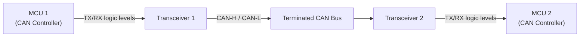
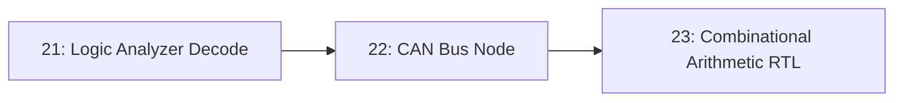

# 22-CAN Bus Node

A single microcontroller sends a message onto a shared, differential two-wire bus, and another microcontroller on the same bus receives it — with the bus's own arbitration and error-checking handling collisions automatically, rather than any code you write. This is the entry point into the network protocol that runs nearly every car and a great deal of industrial equipment.

- **Difficulty:** Intermediate to advanced
- **Prerequisites:** [Lesson 21: Logic Analyzer Decode](../21-logic-analyzer-decode/README.md), basic SPI or UART peripheral experience
- **Approximate time:** 2 to 4 hours
- **What you'll build:** Two microcontrollers, each with a CAN transceiver, exchanging messages over a shared CAN bus, with one acting as sender and one as receiver

## Why build this?

Every protocol earlier in this repository — I2C, UART — assumes exactly two devices, or a simple master/slave relationship. CAN is designed for many devices sharing one bus with no central controller, resolving collisions through **arbitration** rather than avoiding them. It's also built for the electrically noisy environment of a vehicle, which is why it's differential rather than single-ended. Understanding CAN is the bridge between "protocols for a workbench" and "protocols for a system that has to survive being bolted into a car."

## What you'll learn

- Why CAN uses differential signaling (CAN-H, CAN-L) instead of a single-ended line referenced to ground.
- How bus arbitration works: how a lower message ID always wins access to the bus without any node needing to be told to back off.
- The role of the 120Ω termination resistors at each end of the bus, and what happens without them.
- The structure of a standard CAN frame: identifier, data length code, up to 8 data bytes, CRC, ACK slot.
- The difference between the CAN controller (often built into the MCU) and the CAN transceiver (a separate chip that converts logic-level signals to the bus's differential voltage levels).

## What you need

| Item | Type | Quantity | Purpose |
|---|---|---:|---|
| Microcontroller with a CAN controller (e.g., STM32 with bxCAN, or an MCU + external MCP2515 CAN controller) | Tool | 2 | One sender, one receiver |
| CAN transceiver (e.g., TJA1050 or SN65HVD230) | Component | 2 | Converts the controller's logic-level TX/RX into differential CAN-H/CAN-L bus signals |
| 120Ω resistor | Component | 2 | Bus termination at each physical end of the CAN bus |
| Twisted pair wire | Tool | ~0.5m | Carries CAN-H and CAN-L between the two nodes |
| Breadboard + jumper wires | Tool | 1 set | Wiring each node's controller-to-transceiver connections |

## Before you build

CAN transmits over two wires, **CAN-H** and **CAN-L**, as a voltage *difference* between them rather than either line's absolute voltage relative to ground. This makes the bus highly resistant to the electrical noise a vehicle or industrial floor generates, since noise tends to affect both wires equally and cancel out in the difference.

CAN has no bus master. Instead, every node that wants to transmit does so simultaneously with anyone else who also wants to transmit, and **arbitration** resolves the conflict bit by bit: a dominant bit (logical 0) always overrides a recessive bit (logical 1) on the shared bus, so the node sending the numerically lowest identifier wins access without any negotiation protocol, and the losing node automatically retries once the bus is free. Lower identifier numbers are, by this mechanism, higher priority.

A CAN bus needs exactly two 120Ω termination resistors, one at each physical end of the bus, matching the cable's characteristic impedance and preventing signal reflections that would otherwise corrupt the differential signal, especially at higher bus speeds.

A standard CAN frame contains: a start-of-frame bit, an 11-bit identifier (used both for message priority and for arbitration), a control field including the data length code (0–8 bytes), the data field itself, a 15-bit CRC for error detection, and an ACK slot where any receiving node pulls the bus dominant to confirm it received the frame without error — meaning the sender gets confirmation the message was heard, without knowing *which* node heard it.

## How it works

| Component | Role |
|---|---|
| CAN controller (in MCU) | Builds and parses CAN frames, handles arbitration and error detection at the protocol level |
| CAN transceiver | Converts the controller's single-ended logic signals into the bus's differential CAN-H/CAN-L voltages, and back |
| Termination resistors | Match the bus's characteristic impedance at each physical end, preventing signal reflection |
| Shared bus | The two-wire differential medium every node listens to and arbitrates for |

## Build it

1. Wire MCU 1's CAN TX/RX pins to Transceiver 1's TXD/RXD pins, and power the transceiver from the appropriate rail (commonly 3.3V or 5V depending on part).
2. Repeat identically for MCU 2 and Transceiver 2.
3. Connect Transceiver 1's CAN-H to Transceiver 2's CAN-H, and CAN-L to CAN-L, using the twisted pair wire.
4. Place a 120Ω resistor across CAN-H and CAN-L at each physical end of the bus (effectively, one near each transceiver if they represent the two bus ends).
5. Configure both MCUs' CAN controllers for a matching bit rate (500 kbps is a common default) — mismatched bit rates between nodes will look like constant bus errors.
6. On MCU 1, write firmware to periodically transmit a frame with a fixed identifier and a short payload (e.g., an incrementing counter).
7. On MCU 2, write firmware to receive any frame matching that identifier and print the payload over serial.

## Verify it

- Confirm MCU 2's serial output shows the incrementing counter arriving reliably, matching what MCU 1 is sending.
- Use a logic analyzer (from [Lesson 21](../21-logic-analyzer-decode/README.md)) with a CAN decoder on the CAN-H/CAN-L lines to confirm the decoded identifier and data bytes match what firmware intends.
- Temporarily remove one termination resistor and observe increased bus errors or corrupted frames, then replace it and confirm the errors disappear.

## What should you see?

A steady stream of correctly received frames on MCU 2, with no CRC or ACK errors reported by either CAN controller's error counters, and a logic-analyzer capture showing a clean differential waveform on CAN-H/CAN-L.

## Troubleshooting

| Symptom | Possible cause | What to check |
|---|---|---|
| No frames received at all | Bit rate mismatch between the two nodes | Confirm both CAN controllers are configured for the identical bit rate and sample point |
| Frames received but with CRC errors | Missing or incorrect termination resistors | Confirm exactly two 120Ω resistors are present, one at each physical bus end, not more or fewer |
| Bus-off state reported by a controller | Sustained errors have tripped the controller's fault-confinement logic | Check wiring polarity (CAN-H to CAN-H, not swapped) and termination before resetting the controller |
| Transmission never succeeds, controller reports arbitration loss repeatedly | Another node with a lower ID is flooding the bus, or a wiring fault is holding the bus dominant | Check for a shorted or stuck transceiver pin; verify only intended nodes are transmitting |

Debug in this order: confirm transceiver wiring and power first, then bit rate configuration, then termination, then look at frame content.

## Common mistakes

- **Only one termination resistor, or none at all.** A bus with the wrong number of termination resistors can appear to mostly work at low speed and fail unpredictably as data rate or cable length increases.
- **Mismatched bit rate between nodes,** which manifests as constant errors rather than an obvious "nothing happens" failure.
- **Swapping CAN-H and CAN-L between the two ends of the bus,** which can sometimes still communicate depending on transceiver tolerance, masking a real wiring fault.
- **Assuming a received ACK means a specific node got the message,** when CAN's ACK is anonymous — any listening node can supply it.

## Think about it

- Why does a numerically lower CAN identifier win arbitration, rather than a higher one?
- What happens to a message that loses arbitration — is it lost, or retried, and how does the protocol guarantee which?
- Why is differential signaling specifically valuable in a vehicle's electrical environment, more so than in a quiet lab bench setup?
- How does bus termination’s role here compare to what you saw in high-speed PCB trace routing considerations?

## Experiment with it

- Add a third node to the bus and confirm arbitration lets a higher-priority (lower ID) message from the new node win when it collides with the original sender's frame.
- Deliberately mismatch the two nodes' bit rates and observe exactly how the failure presents in both firmware and on the logic analyzer.
- Extend the payload to a full 8 bytes and confirm both size and content survive the round trip correctly.

## Simulation

CAN bus behavior, including arbitration, can be simulated in software-only test environments before committing to real transceivers:

**python-can** virtual bus interface: [https://python-can.readthedocs.io/en/stable/interfaces/virtual.html](https://python-can.readthedocs.io/en/stable/interfaces/virtual.html) lets you prototype frame structure and node logic entirely in software first.

## Recommended viewing

### CAN bus explained: arbitration, termination, and frame structure.

A clear conceptual walkthrough of how CAN resolves bus contention and what a frame actually contains, useful background before wiring real transceivers.

[Watch on YouTube](https://www.youtube.com/results?search_query=can+bus+arbitration+explained)

## Further reading

- **Reference:** [Bosch CAN 2.0 Specification](https://www.bosch-semiconductors.com/products/ip-modules/can-protocols/) — the original, authoritative protocol specification.
- **Tutorial:** [Kvaser, CAN Bus Introduction](https://www.kvaser.com/can-protocol-tutorial/) — an accessible walkthrough of frame structure and bus electrical characteristics.
- **Reference:** [Microchip MCP2515 datasheet](https://www.microchip.com/en-us/product/mcp2515) — a common standalone CAN controller for MCUs without built-in CAN peripherals.

## Hardware Atlas resources

### Components
For CAN transceiver selection and termination guidance: [Explore Components](../../resources/components.md)

### Help
If nodes won't communicate or a controller reports bus-off: [See Hardware Help](../../resources/help.md)

## Sourcing

CAN transceiver breakout boards and MCP2515 modules are widely available from hobbyist electronics suppliers. For India-specific sourcing: [See India Resources](../../resources/india.md)

## Going deeper

Arbitration by dominant/recessive bits, rather than a scheduled or polled access scheme, shows up again anywhere multiple independent actors need to share one resource without a central coordinator — a pattern worth recognizing well beyond CAN itself.

## Where this fits in Hardware Atlas

Move to [Lesson 23: Combinational Arithmetic RTL](../23-combinational-arithmetic-rtl/README.md). You've been working at the board and protocol level throughout this series; the next lesson moves inside the chip itself, designing digital logic in RTL rather than wiring discrete parts together.