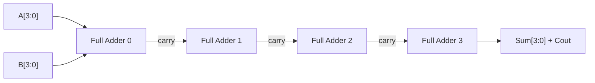
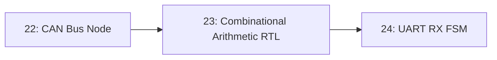

# 23-Combinational Arithmetic RTL

A ripple-carry adder and a small ALU, written in Verilog as pure combinational logic, with no clock and no memory anywhere in the design. This is the first lesson in the repository where you're describing hardware structure directly in a hardware description language, rather than programming a microcontroller that already contains one.

- **Difficulty:** Intermediate
- **Prerequisites:** Basic digital logic (AND/OR/XOR gates, binary addition); no prior HDL experience assumed
- **Approximate time:** 2 to 3 hours
- **What you'll build:** A 4-bit ripple-carry adder and a simple 4-function ALU (add, subtract, AND, OR) written in Verilog and verified in simulation

## Why build this?

Every project before this one either used a microcontroller's existing instruction set or wired discrete components together. RTL (register-transfer level) design is a different discipline entirely: you're describing the actual logic gates and their connections that will exist in silicon, and a simulator (not a physical board) is your primary feedback loop. Starting with purely combinational logic — no clock, no state — isolates the one core idea (describing *structure*, not a sequential *procedure*) before [Lesson 24](../24-uart-rx-fsm/README.md) introduces state and timing.

## What you'll learn

- The difference between combinational logic (output depends only on current inputs) and sequential logic (output depends on history too).
- Why a Verilog `assign` statement describes a *wire*, not a step in a program, even though the syntax looks procedural.
- How a ripple-carry adder's carry chain works, and why it's called "ripple."
- How to structure a simple ALU using a case statement to select between operations.
- How to write and run a basic testbench to check outputs against expected values, without any physical hardware involved.

## What you need

| Item | Type | Quantity | Purpose |
|---|---|---:|---|
| Icarus Verilog (or another open-source Verilog simulator) | Tool | 1 install | Compiles and simulates the RTL and testbench, no hardware required |
| GTKWave (optional) | Tool | 1 install | Views simulation waveforms visually |
| Text editor | Tool | 1 | Writing Verilog source files |

## Before you build

Combinational logic means the output is a pure function of the *current* inputs, with no memory of any previous state — an AND gate, an adder, a multiplexer. In Verilog, an `assign` statement like `assign sum = a ^ b;` describes a wire that is *continuously* driven by that expression; it isn't "executed once," it's true at all times, for all values of `a` and `b`, forever, the same way a real wire connecting real gates behaves.

A 4-bit ripple-carry adder is built from four 1-bit full adders chained together, where each stage's carry-out feeds the next stage's carry-in — the carry "ripples" from the least significant bit toward the most significant bit, one stage at a time. This is simple to describe and understand, but it means the final sum isn't valid until the carry has physically propagated through every stage, which is exactly the kind of delay real digital designers spend a lot of effort optimizing away in faster adder architectures.

An ALU (arithmetic logic unit) is a combinational block that performs one of several operations on its inputs, selected by an opcode input — implemented in RTL as a multiplexer selecting between several parallel computation paths (an adder, a subtractor, an AND gate, an OR gate), all of which are technically computed *simultaneously*; only the selected result is actually used.

## How it works

| Component | Role |
|---|---|
| Full adder (x4) | Computes one bit of the sum plus a carry-out, given two input bits and a carry-in |
| Carry chain | Connects each stage's carry-out to the next stage's carry-in, propagating the addition across all 4 bits |
| ALU mux | Selects which of several parallel-computed results (add, subtract, AND, OR) becomes the module's output, based on an opcode |
| Testbench | A separate, non-synthesizable Verilog file that drives inputs and checks outputs during simulation only |

## Build it

1. Write a `full_adder` module: `output sum, cout; input a, b, cin;` with `assign sum = a ^ b ^ cin;` and `assign cout = (a & b) | (b & cin) | (a & cin);`.
2. Write a `ripple_carry_adder_4bit` module that instantiates four `full_adder` modules, wiring each stage's `cout` to the next stage's `cin`, with the first stage's `cin` tied to an external carry-in.
3. Write an `alu_4bit` module that takes two 4-bit inputs and a 2-bit opcode, computes add/subtract/AND/OR in parallel, and uses a `case` statement on the opcode to select the output.
4. Write a testbench (`tb_alu.v`) that instantiates the ALU, drives a handful of known input/opcode combinations, and uses `$display` to print each result.
5. Compile with `iverilog -o sim tb_alu.v alu_4bit.v full_adder.v ripple_carry_adder_4bit.v`.
6. Run with `vvp sim` and read the printed results.

## Verify it

- Compare every printed testbench result against a value you compute by hand (e.g., `4'b0011 + 4'b0101` should print `1000`).
- Add a case that intentionally causes a carry-out (e.g., `4'b1111 + 4'b0001`) and confirm the 5-bit result correctly shows the overflow bit set.
- If using GTKWave, add `$dumpfile`/`$dumpvars` to the testbench and visually inspect the carry chain propagating stage to stage in the waveform.

## What should you see?

Console output listing each test case's inputs, opcode, and result, with every result matching hand-calculated expected values exactly — including the carry-out bit on cases designed to overflow.

## Troubleshooting

| Symptom | Possible cause | What to check |
|---|---|---|
| Compilation error about undeclared module | Module instantiation name doesn't match the module's actual declared name | Check for typos between `module full_adder(...)` and wherever it's instantiated |
| Sum is always wrong by exactly one carry bit | Carry chain wired in the wrong order (MSB-first instead of LSB-first) | Confirm bit 0 of each input feeds the first full adder, not the last |
| ALU always outputs the same operation regardless of opcode | Case statement missing a `default`, or opcode signal not actually connected | Add a `default` case and print the opcode value in simulation to confirm it's changing |
| Testbench produces no output at all | Missing `$display` calls, or simulation never reaches them due to a stuck `initial` block | Add a `$display` immediately as the first line of the `initial` block to confirm it's running at all |

Debug by isolating: test the single `full_adder` module alone with its own tiny testbench before trusting the 4-bit adder built from it.

## Common mistakes

- **Writing Verilog like a C program.** An `assign` isn't a step that runs once; every line describes a wire that's active continuously — order of statements in the file doesn't imply order of execution.
- **Forgetting the carry-out entirely,** treating the module as if 4-bit addition can never overflow.
- **Missing a `default` case in the ALU's opcode selection,** leaving the output undefined (in simulation, `x`) for unhandled opcodes.
- **Confusing simulation-only constructs (`$display`, `initial` blocks) with synthesizable RTL,** and accidentally putting them in a module meant to become real hardware later.

## Think about it

- Why does the carry chain limit how fast a ripple-carry adder can produce a correct result, compared to other adder architectures?
- What does it mean, physically, for two different computation paths (the ALU's adder and subtractor) to be "computed simultaneously" even though only one is used?
- Why is a testbench never synthesized into real hardware, even though it's written in the same language as the design?
- What would change about this design if it needed to compute results for 32-bit numbers instead of 4-bit?

## Experiment with it

- Extend the adder to 8 bits and confirm the same carry-chain structure scales directly.
- Add a multiply operation to the ALU's opcode set and observe how much more the (still purely combinational) logic actually needs to do.
- Deliberately introduce a bug (swap `&` and `|` in the carry logic) and see whether your testbench catches it — if it doesn't, your test cases weren't thorough enough.

## Simulation

This entire lesson *is* simulation — no physical hardware is involved. For an interactive alternative to writing your own testbench, EDA Playground runs Verilog directly in the browser:

**EDA Playground** (Icarus Verilog backend): [https://edaplayground.com/](https://edaplayground.com/)

## Recommended viewing

### Writing your first Verilog module: combinational logic basics.

A focused introduction to `assign` statements, module structure, and simulating combinational logic with Icarus Verilog.

[Watch on YouTube](https://www.youtube.com/results?search_query=verilog+combinational+logic+adder+tutorial)

## Further reading

- **Tutorial:** [ASIC World, Verilog Tutorial](https://www.asic-world.com/verilog/veritut.html) — a thorough, free reference covering exactly this level of Verilog.
- **Reference:** [Icarus Verilog documentation](https://steveicarus.github.io/iverilog/) — the simulator used in this lesson.
- **Reference:** [nandland, Ripple Carry Adder](https://nandland.com/) — background on adder architectures and their tradeoffs.

## Hardware Atlas resources

### Components
For digital logic fundamentals underlying gates and adders: [Explore Components](../../resources/components.md)

### Simulation
For other free HDL simulators beyond Icarus Verilog: [See Simulation](../../resources/simulation.md)

### Help
If simulation won't compile or results don't match expectations: [See Hardware Help](../../resources/help.md)

## Sourcing

No physical parts are required for this lesson; all tools used are free and open source.

## Going deeper

The habit of describing parallel, simultaneous structure rather than sequential steps is the single hardest mental shift in moving from software to RTL, and it's the foundation everything from [Lesson 24's UART FSM](../24-uart-rx-fsm/README.md) to [Lesson 26's RISC-V datapath](../26-riscv-single-cycle-datapath/README.md) builds on directly.

## Where this fits in Hardware Atlas

Move to [Lesson 24: UART RX FSM](../24-uart-rx-fsm/README.md). You've described logic with no memory of its own; the next step adds a clock and state, building a finite state machine that has to remember where it is in an incoming bit stream.