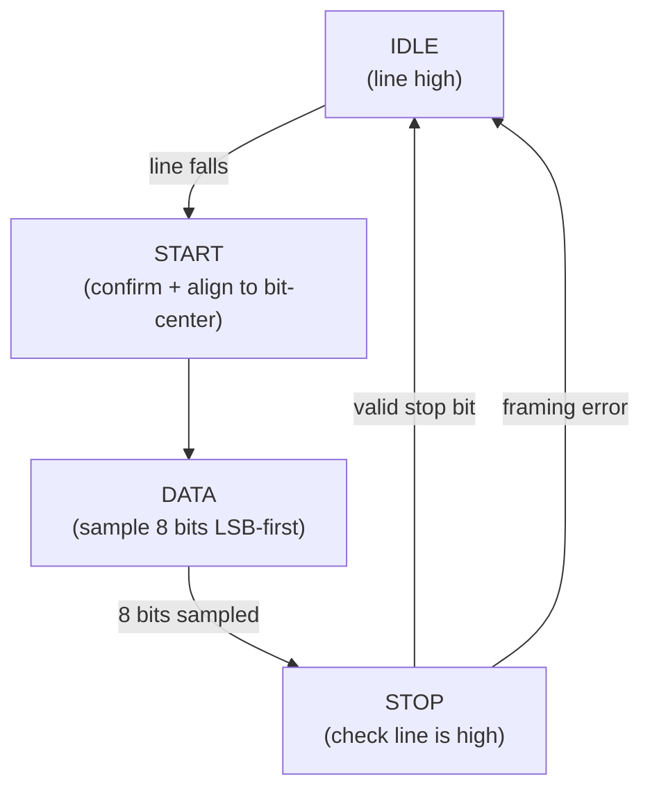
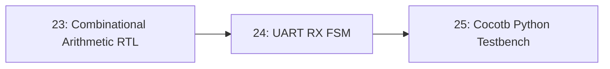

# 24-UART RX FSM

A UART receiver, built as a finite state machine in Verilog, that watches an incoming serial line, finds the start bit, samples each data bit at the right moment, and hands off a complete byte — all clocked sequential logic, the first stateful design in this repository's RTL track.

- **Difficulty:** Intermediate to advanced
- **Prerequisites:** [Lesson 23: Combinational Arithmetic RTL](../23-combinational-arithmetic-rtl/README.md)
- **Approximate time:** 3 to 4 hours
- **What you'll build:** A synthesizable UART receiver (RX only) finite state machine in Verilog, verified against a known serial bit pattern in simulation

## Why build this?

Lesson 23 deliberately avoided a clock. Real digital systems almost never can: a UART receiver has to remember whether it's currently idle, in the middle of a start bit, sampling data bit 3 of 8, or checking a stop bit — and that memory of "where am I in the sequence" is exactly what a finite state machine is for. This is also the first lesson where *timing* matters in a way software abstracts away entirely: sampling a bit at the wrong clock cycle silently corrupts the received byte.

## What you'll learn

- The difference between combinational logic (Lesson 23) and sequential logic: registers that hold state across clock edges.
- How a Mealy or Moore finite state machine is structured in Verilog: a state register, a next-state combinational block, and an output block.
- Why UART sampling happens in the *middle* of each bit period, not at its edge, and why that matters for reliability.
- How a baud-rate generator divides a fast system clock down to the correct sampling rate for a much slower serial line.
- How to write a self-checking testbench that generates a known UART bit pattern and verifies the FSM decodes it correctly.

## What you need

| Item | Type | Quantity | Purpose |
|---|---|---:|---|
| Icarus Verilog (or another open-source Verilog simulator) | Tool | 1 install | Compiles and simulates the FSM and testbench |
| GTKWave | Tool | 1 install | Essential here (more so than Lesson 23) for visually confirming state transitions line up with the incoming bit stream |
| Text editor | Tool | 1 | Writing Verilog source files |

## Before you build

UART sends a byte as a fixed sequence on a single wire: an idle line held high, a **start bit** (line pulled low for one bit period), 8 **data bits** (least significant bit first, for standard UART), an optional parity bit, and a **stop bit** (line returns high for at least one bit period). There is no separate clock line — the receiver has to derive timing purely from the start bit's falling edge.

A finite state machine (FSM) formalizes "what should happen next depends on what state I'm currently in." This UART receiver needs at least these states: `IDLE` (waiting for the line to fall), `START` (confirming the falling edge is real and not noise, then waiting to align to bit-center), `DATA` (sampling 8 bits, one per bit period, tracking which bit index it's on), `STOP` (checking the stop bit is actually high), and back to `IDLE`.

Because there's no shared clock, the receiver oversamples: it runs its own clock much faster than the baud rate (commonly 16x) and counts local clock ticks to find the *center* of each bit period, rather than sampling right at the start bit's edge, where line noise or slight timing mismatch between sender and receiver would be most likely to cause an error. Sampling at bit-center gives the most timing margin against small clock mismatches accumulating over 8 bits.

## How it works

| Component | Role |
|---|---|
| Baud tick generator | Divides the system clock down to 16x the baud rate, providing the FSM's sampling clock |
| State register | Holds the current FSM state (`IDLE`, `START`, `DATA`, `STOP`) across clock edges |
| Bit counter | Tracks which of the 8 data bits is currently being sampled |
| Shift register | Accumulates sampled bits into a complete byte as they arrive |
| Data-valid output | Pulses once, for one clock cycle, when a complete byte has been correctly received |

## Build it

1. Write a `baud_tick_gen` module that counts system clock cycles and pulses once every `(clk_freq / (baud_rate * 16))` cycles.
2. Write the `uart_rx` module's state register using a Verilog `always @(posedge clk)` block with a `case` statement over the current state.
3. In the `IDLE` state, transition to `START` the cycle after the input line is sampled low.
4. In the `START` state, wait for 8 baud ticks (half of the 16x oversample count) to align to the center of the start bit, then confirm the line is still low (a real start bit, not noise) before proceeding.
5. In the `DATA` state, wait 16 baud ticks per bit, sampling the line and shifting it into a register, incrementing a bit counter until 8 bits have been captured.
6. In the `STOP` state, wait 16 more baud ticks, check the line is high, and assert a one-cycle `rx_valid` output along with the completed byte if so; otherwise assert a `framing_error` output.
7. Write a testbench that bit-bangs a known byte (e.g., `8'hA5`) onto the RX line with correct start/stop framing at the configured baud rate, and checks that `rx_valid` fires with the correct byte value.

## Verify it

- Confirm the testbench's received byte exactly matches the byte it transmitted, for at least a few different byte values including `0x00` and `0xFF` (edge cases with no bit transitions at all).
- In GTKWave, visually confirm each data bit is sampled at roughly the center of its bit period on the waveform, not right at an edge.
- Deliberately shorten the stop bit in the testbench's generated waveform and confirm `framing_error` asserts instead of `rx_valid`.

## What should you see?

The testbench reporting every transmitted byte received correctly, waveforms showing state transitions aligned exactly with bit boundaries, and framing errors correctly detected when you intentionally corrupt the stop bit.

## Troubleshooting

| Symptom | Possible cause | What to check |
|---|---|---|
| Received byte is shifted or reversed | Bits shifted into the register in the wrong order or direction | Confirm LSB-first sampling matches how the testbench transmits, and that the shift direction in the register matches |
| Receiver never leaves IDLE | Baud tick generator never pulses, or line-low detection logic is wrong | Confirm the tick generator's counter actually reaches its target value; check polarity of the idle-line assumption |
| Occasional bit errors that aren't consistent | Sampling too close to a bit edge instead of bit-center | Recheck the oversampling count and where in that count each bit is actually sampled |
| Framing error on every single byte | Stop bit timing miscounted, sampling one tick too early or late | Recount exactly how many baud ticks separate the last data bit's sample point from the stop bit's sample point |

Debug using the waveform first: confirm the state register is actually changing states before suspecting the data itself.

## Common mistakes

- **Sampling at a bit's edge instead of its center,** which works in a perfect simulation with zero clock mismatch but fails on real hardware with any timing skew at all.
- **Forgetting that a real UART's start bit needs confirming, not just detecting** — a single glitch on an idle line shouldn't be treated as a valid start bit.
- **Off-by-one errors in the bit counter,** sampling 7 or 9 bits instead of 8.
- **Not handling the framing error case at all,** silently accepting a corrupted byte as if it were valid.

## Think about it

- Why does oversampling at 16x specifically give a good balance of timing margin versus implementation complexity, rather than a much higher or lower factor?
- What happens to this design if the sender and receiver's clocks differ by a small percentage — how much mismatch can 8 data bits tolerate before it causes an error?
- Why is a Moore-style output (registered, one clock late) sometimes preferred over a Mealy-style output (combinational, immediate) for something like `rx_valid`?
- How would this design need to change to also support a parity bit?

## Experiment with it

- Add parity bit checking as an additional state between `DATA` and `STOP`.
- Reduce the oversampling factor to 4x and see at what point the testbench (or a deliberately clock-skewed testbench) starts producing errors.
- Build a matching `uart_tx` FSM and connect it to this `uart_rx` in the same testbench, verifying byte round-trips entirely within simulation.

## Simulation

EDA Playground supports the multi-file Verilog projects (FSM plus testbench) this lesson needs, entirely in the browser:

**EDA Playground** (Icarus Verilog backend): [https://edaplayground.com/](https://edaplayground.com/)

## Recommended viewing

### Designing a UART receiver FSM in Verilog.

A structured walkthrough of exactly this state machine — IDLE/START/DATA/STOP — built up state by state with waveform verification at each step.

[Watch on YouTube](https://www.youtube.com/results?search_query=verilog+uart+receiver+fsm+tutorial)

## Further reading

- **Tutorial:** [nandland, UART Verilog and VHDL](https://nandland.com/uart-serial-port-module/) — a widely used reference implementation and explanation of this exact design.
- **Tutorial:** [ASIC World, Verilog FSM Coding](https://www.asic-world.com/verilog/veritut.html) — background on Moore vs. Mealy FSM coding styles in Verilog.
- **Reference:** [Sparkfun, Serial Communication](https://learn.sparkfun.com/tutorials/serial-communication) — background on the UART protocol this FSM implements.

## Hardware Atlas resources

### Simulation
For waveform viewers and simulators beyond GTKWave/Icarus: [See Simulation](../../resources/simulation.md)

### Help
If the FSM won't decode a byte correctly: [See Hardware Help](../../resources/help.md)

## Sourcing

No physical parts required; this lesson is entirely simulation-based, using free and open-source tools.

## Going deeper

Every stateful hardware design — a bus arbiter, a memory controller, the datapath in [Lesson 26](../26-riscv-single-cycle-datapath/README.md) — is built from the same core idea as this UART receiver: a state register, a next-state function, and outputs that depend on state. Getting comfortable with FSM design here pays off directly later.

## Where this fits in Hardware Atlas

Move to [Lesson 25: Cocotb Python Testbench](../25-cocotb-python-testbench/README.md). You've hand-written a Verilog testbench for this FSM already; the next lesson replaces that style entirely with a Python-based verification framework capable of much more thorough, randomized testing.