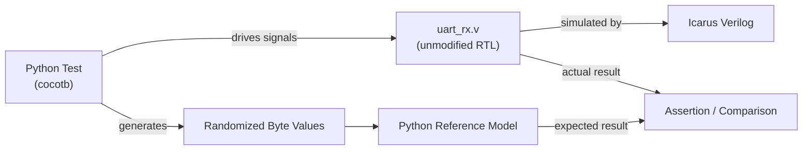
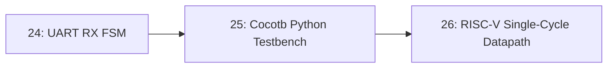

# 25-Cocotb Python Testbench

The UART receiver from Lesson 24 gets a completely new testbench — this time written in Python using cocotb, driving the same Verilog RTL with randomized inputs, coverage tracking, and assertions that would be painful to hand-write in Verilog itself.

- **Difficulty:** Advanced
- **Prerequisites:** [Lesson 24: UART RX FSM](../24-uart-rx-fsm/README.md), basic Python
- **Approximate time:** 2 to 3 hours
- **What you'll build:** A cocotb-based Python testbench that drives the Lesson 24 UART RX FSM with a mix of directed and randomized byte values, checking every result automatically

## Why build this?

The Verilog testbench in Lesson 24 hand-picked a handful of byte values. That's enough to catch an obviously broken design, but it's exactly the kind of testing that lets subtle edge-case bugs (a specific bit pattern that trips up the shift register, a byte value that happens to expose an off-by-one) slip through untested. Cocotb lets you drive the *same* RTL, unmodified, from Python — a language far better suited to generating randomized test data, tracking coverage, and building reusable test infrastructure than Verilog's own testbench constructs.

## What you'll learn

- How cocotb connects a Python test to an unmodified Verilog (or VHDL) design under test, without changing a single line of the RTL.
- The difference between a directed test (specific, hand-picked values) and a randomized test (many generated values, checked against a reference model).
- How cocotb's `async`/`await` coroutines model waiting for clock edges and signal changes.
- How to build a simple Python reference model and compare the RTL's actual behavior against it automatically.
- Why randomized testing tends to find bugs that directed testing misses, and what it still can't guarantee.

## What you need

| Item | Type | Quantity | Purpose |
|---|---|---:|---|
| Python 3.8+ | Tool | 1 install | Runs cocotb and the test code itself |
| cocotb (`pip install cocotb`) | Tool | 1 install | The Python-based verification framework |
| Icarus Verilog | Tool | 1 install | The simulator backend cocotb drives underneath |
| The `uart_rx` module from Lesson 24 | File | 1 | The design under test; unmodified from the previous lesson |

## Before you build

Cocotb works by starting a normal HDL simulator (Icarus Verilog here) on your unmodified RTL, then attaching a Python process to it that can read and write the design's signals and advance simulation time — from Python's perspective, the RTL becomes an object whose signals you can access as attributes, and time advances only when you explicitly await a clock edge or a delay.

A **directed test** picks specific input values chosen because they're known edge cases — `0x00`, `0xFF`, alternating bit patterns. A **randomized test** instead generates many pseudo-random input values across a run, and checks each one against a **reference model**: a separate, simpler (often much slower) implementation of the same logic, written in plain Python, that's used purely as a source of truth. If the RTL and the reference model ever disagree, that's a bug — in either the RTL or the model, which is itself a useful distinction to make quickly.

Cocotb tests are written as Python `async def` coroutines decorated with `@cocotb.test()`. Inside a test, `await RisingEdge(dut.clk)` waits for exactly one clock edge in the simulation before continuing — this is what lets a linear-looking Python function correctly describe a sequence of events that unfold over simulated clock cycles.

## How it works

| Component | Role |
|---|---|
| DUT (device under test) | The unmodified Lesson 24 Verilog RTL, run by Icarus Verilog underneath cocotb |
| Cocotb test | Python coroutine driving the DUT's input pins and awaiting clock edges |
| Reference model | A simple Python function computing the expected output for a given input, independent of the RTL |
| Randomized data generator | Produces a stream of pseudo-random byte values across many test iterations |
| Assertion / comparison | Fails the test the instant the DUT's actual output disagrees with the reference model |

## Build it

1. Install cocotb and confirm Icarus Verilog is on your `PATH`.
2. Create a `test_uart_rx.py` file alongside the Lesson 24 RTL.
3. Write an `async def send_byte(dut, byte_value, baud_ticks)` helper coroutine that bit-bangs a start bit, 8 data bits (LSB first), and a stop bit onto `dut.rx_line`, awaiting the correct number of clock edges for each bit period.
4. Write a `reference_uart_decode(byte_value)` plain-Python function that simply returns the same byte — the point here isn't a complex model, it's establishing the pattern of comparing DUT output against an independent expectation.
5. Write `@cocotb.test() async def test_directed_bytes(dut)`, sending `0x00`, `0xFF`, and `0xA5`, awaiting `dut.rx_valid` after each, and asserting `dut.rx_data.value == expected`.
6. Write a second `@cocotb.test() async def test_randomized_bytes(dut)` that loops 100 times, generating a random byte with Python's `random.randint(0, 255)` each iteration, sending it, and asserting the result matches.
7. Create a `Makefile` (cocotb provides a standard template) pointing at the RTL sources and this test file, with `SIM = icarus`.
8. Run `make` and read cocotb's pass/fail summary.

## Verify it

- Confirm both the directed and randomized tests report `PASS` for all 100+ iterations.
- Deliberately reintroduce a bug into a copy of the RTL (e.g., flip the bit-sampling order) and confirm cocotb's randomized test catches it — ideally on the very first or second random iteration, not after many.
- Check cocotb's generated log for the specific failing byte value when a bug is present, and confirm it's enough information to reproduce the failure deterministically (note the random seed cocotb reports).

## What should you see?

A cocotb summary reporting all directed and randomized tests passed, and — when you intentionally break the RTL to check the test's sensitivity — a clear failure report naming the exact input value and expected-versus-actual result that exposed the bug.

## Troubleshooting

| Symptom | Possible cause | What to check |
|---|---|---|
| cocotb can't find the simulator | Icarus Verilog not installed or not on `PATH` | Run `iverilog -V` directly in a terminal to confirm it's accessible outside cocotb |
| Test hangs indefinitely | An `await RisingEdge(...)` waiting on a clock that was never started | Confirm a clock-generating coroutine (`cocotb.start_soon(Clock(...).start())`) is running before the test awaits any edges |
| Random test occasionally fails, directed test always passes | An edge-case byte value (e.g., `0x00` reached only by chance) exposes a bug directed tests didn't happen to hit | Note the failing value from the log and add it as a new directed test case going forward |
| Signal access raises an error (`AttributeError`) | Signal name in the test doesn't exactly match the RTL's port name | Check the exact port names in the Verilog module declaration |

Debug a hang by adding `print()` statements (or `dut._log.info()`) immediately before each `await`, to see exactly which wait the coroutine is stuck on.

## Common mistakes

- **Writing a reference model that's just a copy of the RTL's logic,** which can reproduce the same bug in both places and never catch it. A reference model should be built independently, from the specification, not from reading the RTL.
- **Not fixing the random seed during debugging,** making a failing test impossible to reproduce reliably once you start investigating it.
- **Forgetting to start the clock coroutine,** which causes every `await RisingEdge` to hang forever with no clear error message.
- **Treating one passing randomized run as proof of correctness.** More iterations and a wider range of inputs increase confidence; they don't constitute a formal guarantee.

## Think about it

- Why might a randomized test with 100 iterations still miss a bug that only manifests for one specific input value out of 256 possible bytes?
- What's actually being tested when the reference model is nearly as simple as the RTL itself — and where would a *more* elaborate reference model add real value?
- Why does cocotb let you keep the RTL completely unmodified, and why does that matter for trusting the test results?
- How would you extend this testbench to also inject a deliberately corrupted stop bit and verify the framing-error path?

## Experiment with it

- Add a directed test specifically for the framing-error case (corrupted stop bit) and confirm `dut.framing_error` asserts correctly.
- Increase the randomized test to 1000 iterations and see whether that surfaces anything the 100-iteration run didn't.
- Add basic coverage tracking (a Python `set()` recording which byte values have been tested) and report, at the end of the randomized run, what fraction of the full 0–255 range was actually exercised.

## Simulation

This entire lesson runs in simulation via cocotb and Icarus Verilog; no separate simulation step is needed beyond what's already described in "Build it."

## Recommended viewing

### Verifying Verilog with cocotb and Python.

An introduction to cocotb's coroutine model and a walkthrough of writing a first directed-then-randomized test against real RTL.

[Watch on YouTube](https://www.youtube.com/results?search_query=cocotb+python+verilog+testbench+tutorial)

## Further reading

- **Tutorial:** [cocotb Official Documentation](https://docs.cocotb.org/) — the canonical reference for coroutines, clock generation, and the Makefile-based test runner.
- **Tutorial:** [cocotb, Quickstart Guide](https://docs.cocotb.org/en/stable/quickstart.html) — a minimal working example to compare directly against this lesson's structure.
- **Reference:** [ChipVerify, Cocotb Tutorials](https://www.chipverify.com/cocotb/cocotb-tutorial) — additional worked examples across different DUT types.

## Hardware Atlas resources

### Simulation
For simulator backends cocotb supports beyond Icarus Verilog: [See Simulation](../../resources/simulation.md)

### Help
If cocotb can't locate the simulator or a test hangs indefinitely: [See Hardware Help](../../resources/help.md)

## Sourcing

No physical parts required; this lesson is entirely software- and simulation-based.

## Going deeper

Reference-model-based, randomized verification is exactly how real ASIC and FPGA teams gain confidence in designs far too complex to exhaustively test by hand — the same pattern used here on an 8-bit UART receiver scales, with more sophisticated coverage tracking, to the multi-million-gate designs professional verification engineers work on.

## Where this fits in Hardware Atlas

Move to [Lesson 26: RISC-V Single-Cycle Datapath](../26-riscv-single-cycle-datapath/README.md). You now have a rigorous verification method; the next lesson gives you a substantially larger design worth verifying thoroughly — a working single-cycle RISC-V CPU datapath.