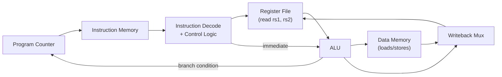

# 26-RISC-V Single-Cycle Datapath

A working, if deliberately simple, RISC-V CPU: a program counter, register file, ALU, and instruction decoder wired together so a real RV32I instruction executes fully within a single clock cycle. This is where every earlier RTL lesson's pieces — combinational logic, sequential FSMs, verification — combine into one substantial design.

- **Difficulty:** Advanced
- **Prerequisites:** [Lesson 23: Combinational Arithmetic RTL](../23-combinational-arithmetic-rtl/README.md), [Lesson 24: UART RX FSM](../24-uart-rx-fsm/README.md), and ideally [Lesson 25: Cocotb Python Testbench](../25-cocotb-python-testbench/README.md) for verification
- **Approximate time:** 6 to 10 hours
- **What you'll build:** A single-cycle RV32I datapath in Verilog supporting a useful subset of instructions (arithmetic, load/store, branch), executing a short hand-assembled test program correctly in simulation

## Why build this?

Every earlier RTL lesson built one small, self-contained piece: an adder, a UART FSM. A CPU datapath is where those pieces have to be *composed* — an ALU built the same way as Lesson 23's, feeding a register file, gated by control signals decoded from the instruction itself, all updating together on the same clock edge. Understanding this datapath from the inside is also what makes every abstraction above it (a C compiler, an assembler, an RTOS scheduler) stop being a black box.

## What you'll learn

- The five classic stages of instruction execution — fetch, decode, execute, memory access, writeback — and why "single-cycle" means all five happen within one clock period for every instruction.
- How the RV32I instruction encoding (opcode, funct3/funct7, rd/rs1/rs2, immediate fields) is decoded into control signals.
- Why different instruction types need different immediate-extraction logic, and how that's implemented as a small combinational block.
- How a register file is built as sequential logic with combinational read ports and a clocked write port.
- Why single-cycle design's clock period is limited by its *slowest* instruction, and why that motivates the pipelined designs used in real CPUs.

## What you need

| Item | Type | Quantity | Purpose |
|---|---|---:|---|
| Icarus Verilog | Tool | 1 install | Simulates the datapath |
| GTKWave | Tool | 1 install | Essential for tracing execution instruction-by-instruction |
| RISC-V RV32I reference (the base ISA manual) | Reference | — | Authoritative source for instruction encoding and semantics |
| A RISC-V assembler or hand-encoding spreadsheet | Tool | 1 | Converts your test program's assembly into the raw 32-bit instruction words this datapath consumes |

## Before you build

RV32I instructions are 32 bits wide and come in a handful of encoding formats (R-type for register-register ops, I-type for immediate/loads, S-type for stores, B-type for branches), each placing the opcode, register fields, and immediate bits in specific, fixed positions. Decoding an instruction means extracting these fields combinationally and using the opcode (plus, for some instructions, funct3/funct7) to generate control signals: which ALU operation to perform, whether to write a register, whether to access memory, and so on.

A **single-cycle datapath** commits to finishing every instruction — however different its needs — within one clock period. A register-register add and a memory load take fundamentally different amounts of "real work" (the load needs to traverse the ALU *and* memory *and* the register file write, sequentially, within that one cycle), but the clock period has to be long enough for the *slowest* instruction, which means every instruction runs at that same, worst-case speed. This is a deliberate, known limitation single-cycle designs accept in exchange for conceptual simplicity — real CPUs address it with pipelining, which is out of scope here but is exactly what this design makes the *motivation* for concrete.

The **register file** holds 32 general-purpose registers. In RV32I, register x0 is hardwired to zero and writes to it are discarded — a detail that's easy to forget and produces confusing bugs (an add that appears to silently do nothing) if missed. Reads are combinational (a register's value is available on the same cycle it's read, no clock edge needed) while writes are synchronous (they take effect on the next clock edge), which is what allows an instruction to read its source registers and, later in the same cycle, compute a result destined for a *different* cycle's write.

## How it works

| Component | Role |
|---|---|
| Program counter | Holds the address of the current instruction; updates every cycle to the next instruction or a branch target |
| Instruction memory | A simple ROM holding the program, addressed by the PC |
| Decode / control logic | Extracts opcode/funct fields and immediate values, generates every downstream control signal |
| Register file | 32 x 32-bit registers, combinational read, synchronous write, x0 hardwired to zero |
| ALU | Performs the arithmetic/logic operation the current instruction needs, reused from Lesson 23's design pattern |
| Data memory | A simple RAM for load/store instructions |
| Writeback mux | Selects whether the register file's write data comes from the ALU result or a memory load |

## Build it

1. Define the instruction and data memories as simple Verilog arrays, pre-loaded via `$readmemh` from a hex file you'll generate from your test program.
2. Write the instruction decode block: combinationally extract `opcode`, `rd`, `funct3`, `rs1`, `rs2`, `funct7`, and the correctly-formatted immediate for whichever instruction type the opcode indicates.
3. Write the control unit: a `case` statement on `opcode` (and `funct3`/`funct7` where needed) producing signals like `alu_op`, `reg_write`, `mem_read`, `mem_write`, `mem_to_reg`, and `branch`.
4. Write the register file: combinational reads on `rs1`/`rs2`, a synchronous write on the clock edge gated by `reg_write`, and an explicit check that writes to register 0 are discarded.
5. Reuse (or extend) Lesson 23's ALU design, adding the additional operations RV32I needs (shifts, comparisons for branches).
6. Wire the PC update logic: normally `PC + 4`, or a computed branch target when `branch` is asserted and the ALU's comparison result indicates the branch is taken.
7. Hand-assemble (or use a RISC-V toolchain to assemble) a short test program — a handful of `addi`, `add`, a `beq`, and a `lw`/`sw` pair — into hex, and load it via `$readmemh`.
8. Simulate and, in GTKWave, step through instruction by instruction, confirming the PC, register values, and memory contents change exactly as the program dictates.

## Verify it

- Confirm the register file's contents after the test program finishes match hand-calculated expected values for every instruction executed.
- Specifically test a write to `x0` and confirm the register file's value for `x0` remains zero afterward.
- Confirm the branch instruction actually changes program flow: verify in the waveform that the PC jumps to the branch target when the condition is true, and falls through to `PC + 4` when it's false.
- If you completed Lesson 25, adapt the cocotb approach here: build a Python reference model that executes the same test program's semantics in software and compare final register state against the RTL's.

## What should you see?

A waveform showing the PC advancing correctly instruction by instruction (including one deliberate branch), register file contents updating on exactly the cycles you expect, and a final register state that matches what the test program should produce by hand calculation.

## Troubleshooting

| Symptom | Possible cause | What to check |
|---|---|---|
| All instructions appear to execute as NOPs | Control signals never asserted, likely a decode or opcode-matching bug | Print (or waveform-trace) the decoded opcode and confirm it matches the expected value for your test instructions |
| Register values are correct except x0 keeps changing | Missing the explicit x0-write-discard check in the register file | Add an explicit `if (write_addr != 0)` guard around the synchronous write |
| Branch never taken even when it should be | ALU comparison result or immediate sign-extension for the branch offset is wrong | Recheck B-type immediate bit extraction — it's one of the more error-prone encodings in RV32I |
| Load/store reads or writes the wrong memory address | ALU not computing `rs1 + immediate` correctly for the memory address calculation | Confirm the ALU's operand selection mux correctly routes the immediate (not `rs2`) into the address calculation for loads/stores |

Debug one instruction type at a time: get `addi` fully correct and verified before adding branches, and get branches correct before adding loads/stores.

## Common mistakes

- **Forgetting register x0 must always read as zero and discard writes,** a detail easy to miss that causes confusing, intermittent-looking bugs.
- **Getting immediate sign-extension wrong for one instruction format** (B-type and J-type immediates in RV32I have unusually scrambled bit orderings specifically to simplify hardware elsewhere) — always double-check against the ISA manual's exact bit diagram, not memory.
- **Conflating combinational register reads with the synchronous write,** leading to a design that either reads stale data or writes on the wrong edge.
- **Trying to build all instruction types at once.** This design has enough moving parts that verifying incrementally, one instruction type at a time, is dramatically faster than debugging everything simultaneously.

## Think about it

- Why must the clock period for a single-cycle design accommodate the *slowest* instruction, even though most instructions could finish much faster?
- What would need to change structurally (not just in timing) to convert this into a multi-cycle or pipelined design?
- Why is combinational (not clocked) register file read essential to this design working within a single cycle at all?
- What's the actual hardware cost of hardwiring x0 to zero, compared to the debugging cost of not doing so correctly?

## Experiment with it

- Extend the supported instruction set to include `jal`/`jalr` and verify subroutine-call-style control flow works correctly.
- Measure (by counting logic levels conceptually, or by running the design through a synthesis tool if you've completed [Lesson 29](../29-yosys-rtl-synthesis/README.md)) which instruction actually determines the critical path length.
- Write a slightly longer test program — a small loop using a branch — and confirm it terminates correctly after the expected number of iterations.

## Simulation

The full toolchain (Icarus Verilog plus GTKWave) is sufficient for this lesson; larger multi-file Verilog projects like this one may also be organized and run via EDA Playground for convenience:

**EDA Playground**: [https://edaplayground.com/](https://edaplayground.com/)

## Recommended viewing

### Building a single-cycle RISC-V CPU in Verilog.

A structured, stage-by-stage walkthrough of exactly this datapath — decode, register file, ALU, memory, writeback — built incrementally with waveform verification.

[Watch on YouTube](https://www.youtube.com/results?search_query=single+cycle+risc-v+cpu+verilog+datapath)

## Further reading

- **Reference:** [The RISC-V Instruction Set Manual, Volume I: Unprivileged ISA](https://riscv.org/technical/specifications/) — the authoritative source for every instruction encoding used in this lesson.
- **Tutorial:** Patterson & Hennessy, *Computer Organization and Design RISC-V Edition* — the standard textbook treatment of exactly this single-cycle datapath design.
- **Reference:** [RISC-V Green Card](https://inst.eecs.berkeley.edu/~cs61c/resources/RISCV_Green_Card.pdf) — a compact quick-reference for instruction encodings while decoding by hand.

## Hardware Atlas resources

### Simulation
For simulator options suited to a project this size: [See Simulation](../../resources/simulation.md)

### Help
If a specific instruction type won't execute correctly: [See Hardware Help](../../resources/help.md)

## Sourcing

No physical parts required; this lesson is entirely simulation-based, using free and open-source tools.

## Going deeper

This single-cycle datapath is the direct conceptual ancestor of every real CPU, including the ones in your phone and the microcontrollers used throughout this repository's earlier lessons — pipelining, caching, and out-of-order execution are all optimizations layered on top of exactly this fetch-decode-execute-memory-writeback structure, not replacements for it.

## Where this fits in Hardware Atlas

Move to [Lesson 27: Memory-Mapped GPIO Peripheral](../27-memory-mapped-gpio-peripheral/README.md). You've built a CPU's core datapath; the next lesson builds the kind of peripheral a CPU like this one would actually talk to over its memory bus.