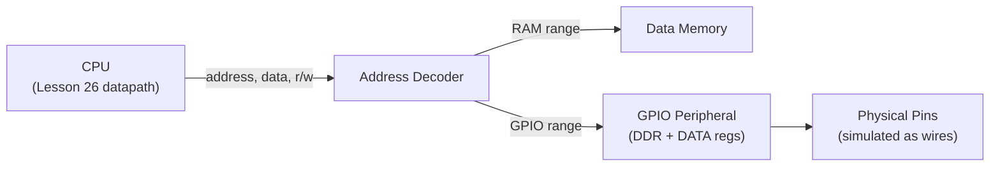
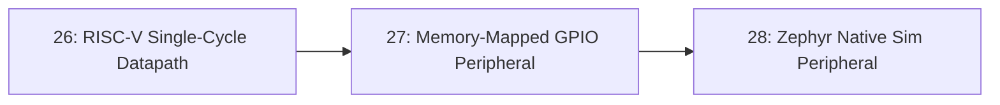

# 27-Memory-Mapped GPIO Peripheral

A small GPIO peripheral, written in Verilog, that a CPU talks to by reading and writing ordinary memory addresses — no special instructions, no separate bus protocol, just load and store, decoded by an address range. This is the piece that turns the RISC-V datapath from Lesson 26 into something that could actually control real pins.

- **Difficulty:** Advanced
- **Prerequisites:** [Lesson 26: RISC-V Single-Cycle Datapath](../26-riscv-single-cycle-datapath/README.md)
- **Approximate time:** 3 to 5 hours
- **What you'll build:** A memory-mapped GPIO peripheral in Verilog with data-direction and data-output registers, integrated onto the Lesson 26 datapath's memory bus and exercised by a short test program

## Why build this?

Lesson 26 built a CPU that can read and write a data memory, but nothing that CPU does yet reaches outside the simulation into anything resembling the real world. Memory-mapped I/O is how nearly every real microcontroller peripheral — GPIO, UART, timers — actually works from software's perspective: writing to a specific address doesn't store a value in RAM, it changes a physical pin or configuration register instead. Understanding this from the hardware side demystifies what a peripheral driver in C is actually doing underneath `digitalWrite()`.

## What you'll learn

- What memory-mapped I/O means at the hardware level: address decoding routing certain addresses to peripheral registers instead of RAM.
- The standard GPIO register pattern: a data-direction register (input vs. output per pin) and a data register (the actual pin values).
- How address decoding is implemented combinationally, and how it must avoid overlapping with the CPU's existing data memory range.
- Why some peripheral registers need read-modify-write semantics from software, and how that interacts with the hardware register design.
- How to integrate a new peripheral onto an existing bus without modifying the CPU core itself.

## What you need

| Item | Type | Quantity | Purpose |
|---|---|---:|---|
| Icarus Verilog | Tool | 1 install | Simulates the integrated design |
| GTKWave | Tool | 1 install | Tracing bus transactions between CPU and peripheral |
| The RISC-V datapath from Lesson 26 | File | 1 | The CPU this peripheral will be attached to |

## Before you build

A memory-mapped peripheral occupies a specific range of the address space that the CPU's existing data memory does not use. When the CPU issues a load or store, an **address decoder** — simple combinational logic comparing the address against known ranges — determines whether the access should go to RAM or to the peripheral's registers, and routes the read/write signals accordingly. From the CPU's perspective, nothing changes: it's still just executing `lw`/`sw` instructions.

A GPIO peripheral conventionally exposes at least two registers: a **data-direction register (DDR)**, where each bit configures the corresponding pin as input (0) or output (1), and a **data register (DATA)**, where writing a bit drives that pin (if configured as output) and reading a bit returns the pin's current logic level (whether input or output). This two-register pattern is the same shape used by real microcontrollers' GPIO peripherals, just simplified.

Some peripheral operations are naturally **read-modify-write**: setting a single pin high without disturbing the others requires software to read the current DATA register, OR in the new bit, and write the result back — the hardware register itself doesn't need special logic for this, but it's worth understanding because a real driver in C almost always looks like exactly this three-step pattern rather than a single write.

## How it works

| Component | Role |
|---|---|
| Address decoder | Combinationally determines whether a given address targets RAM or the GPIO peripheral, and asserts the correct chip-select |
| Data-direction register (DDR) | Configures each GPIO bit as input or output |
| Data register (DATA) | Holds the value driven onto output-configured pins, and reflects the sampled value of input-configured pins |
| Pin interface | The simulated (or, on real hardware, physical) top-level wires the peripheral actually drives or samples |

## Build it

1. Choose a base address for the GPIO peripheral that doesn't overlap the existing data memory range from Lesson 26 (e.g., data memory at `0x0000`–`0x0FFF`, GPIO registers starting at `0x1000`).
2. Write the address decoder as a combinational block: `assign gpio_sel = (addr[15:12] == 4'h1);`, using the appropriate bits for your chosen memory map.
3. Write the `gpio_peripheral` module with a `ddr_reg` and `data_reg`, each written synchronously when the CPU performs a store to the corresponding address and `gpio_sel` is asserted.
4. Wire the module's pin outputs combinationally: `assign pin[i] = ddr_reg[i] ? data_reg[i] : 1'bz;` (driven when configured as output, high-impedance otherwise).
5. Wire the module's pin inputs: when reading the DATA register on a pin configured as input, return the sampled external value instead of the internally stored one.
6. Modify the top-level module connecting the CPU and this peripheral: route the CPU's memory read/write signals through the address decoder to either the data memory or the GPIO peripheral, and mux the read-data path back to the CPU accordingly.
7. Write a short test program: configure a few pins as outputs via a store to the DDR address, then write a pattern to the DATA address, and configure a different pin as input, reading it back.
8. Simulate, driving the input pin externally in the testbench, and confirm the CPU's read of that pin reflects the externally driven value.

## Verify it

- Confirm a store to the DDR address correctly changes which pins are treated as outputs in the waveform (check the `pin` bus's driven/high-impedance state, not just the register's stored value).
- Confirm a store to the DATA address correctly drives the expected logic level on output-configured pins.
- Drive an input-configured pin externally in the testbench to a known value and confirm the CPU's subsequent load from the DATA address returns that same value.
- Confirm the address decoder never asserts both `gpio_sel` and the data-memory's own select signal simultaneously for any address.

## What should you see?

A waveform showing the CPU's store instructions correctly updating the DDR and DATA registers, output pins driving to the values software wrote, and input pins correctly reflecting externally applied values back through a load instruction — all without any change to the Lesson 26 CPU core itself.

## Troubleshooting

| Symptom | Possible cause | What to check |
|---|---|---|
| GPIO writes appear to do nothing | Address decoder never asserts `gpio_sel` for the address software is using | Double-check the exact address bits compared in the decoder against the address the test program actually issues |
| Both RAM and GPIO seem to respond to the same address | Overlapping address ranges in the decoder | Recheck the memory map and widen the address bits compared so ranges are mutually exclusive |
| Output pin never changes despite writing DATA | DDR register was never configured for that pin, defaulting to input | Confirm the test program writes DDR before DATA, and that the DDR bit for that pin is actually set to output |
| Reading an input pin always returns 0 | Read-data mux not correctly routing the peripheral's sampled input value back to the CPU | Trace the read-data path explicitly in the waveform from the pin, through the peripheral, through the mux, to the CPU's load result |

Debug by first confirming the address decoder itself in isolation (a small standalone testbench, borrowing the cocotb approach from Lesson 25 if useful) before trusting the full CPU-to-peripheral integration.

## Common mistakes

- **Overlapping the GPIO address range with existing data memory,** which can silently corrupt RAM contents or make GPIO unreliable, since both might respond to the same store.
- **Forgetting that an output pin should be high-impedance when configured as input,** rather than continuing to drive whatever stale value happens to be in the DATA register.
- **Wiring the DDR and DATA registers with the same address by mistake,** making it impossible for software to configure direction and value independently.
- **Not distinguishing, on a read, between the DATA register's internally stored value and the pin's actual externally sampled value** for input-configured pins — these are conceptually different things that happen to share one register in this simplified design.

## Think about it

- Why must the address decoder guarantee mutually exclusive address ranges, rather than just "mostly" avoiding overlap?
- What would happen, functionally, if a pin were read while configured as an output — should it return the driven value, or something else?
- Why do real microcontrollers often add a third register (an interrupt-enable or pin-change-detect register) beyond just DDR and DATA?
- How does this address-decode-and-route pattern generalize to adding a second, different peripheral (say, a UART) onto the same bus?

## Experiment with it

- Add a second peripheral (a simple memory-mapped LED-blink timer) at a different address range and confirm both peripherals and RAM coexist correctly on the same bus.
- Add a read-only status register reporting the actual pin states regardless of DDR configuration, independent of the DATA register.
- Port the test program's logic to explicitly demonstrate the read-modify-write pattern: set one bit high in DATA without disturbing the others already set.

## Simulation

The Icarus Verilog and GTKWave toolchain used throughout this RTL track is sufficient here as well; no additional simulation tooling is required for this lesson.

## Recommended viewing

### Memory-mapped I/O explained: how software controls hardware pins.

A conceptual walkthrough of address decoding and the DDR/DATA register pattern, connecting the hardware-level view to what a C GPIO driver actually does.

[Watch on YouTube](https://www.youtube.com/results?search_query=memory+mapped+io+gpio+verilog+explained)

## Further reading

- **Reference:** Any mainstream microcontroller's GPIO chapter (e.g., the STM32 reference manual's GPIO section) — real-world examples of this exact DDR/DATA register pattern, with additional features layered on.
- **Tutorial:** [nandland, Memory-Mapped I/O](https://nandland.com/) — background on address decoding and bus integration patterns.
- **Reference:** [RISC-V memory map conventions](https://riscv.org/technical/specifications/) — how real RISC-V systems typically partition address space between RAM and peripherals.

## Hardware Atlas resources

### Simulation
For toolchain setup shared across this RTL track: [See Simulation](../../resources/simulation.md)

### Help
If the peripheral doesn't respond, or RAM and GPIO seem to conflict: [See Hardware Help](../../resources/help.md)

## Sourcing

No physical parts required; this lesson is entirely simulation-based, extending the Lesson 26 RTL.

## Going deeper

This address-decode-and-route pattern is exactly how a real system-on-chip integrates dozens of peripherals onto one CPU without modifying the CPU core for each new device — it's also directly relevant to [Lesson 28](../28-zephyr-native-sim-peripheral/README.md), where you'll model an analogous peripheral from the software driver's side instead of the hardware side.

## Where this fits in Hardware Atlas

Move to [Lesson 28: Zephyr Native Sim Peripheral](../28-zephyr-native-sim-peripheral/README.md). You've built a peripheral from the hardware side; the next lesson flips perspective, writing and testing a driver for a simulated peripheral entirely within a real RTOS, without any physical board.