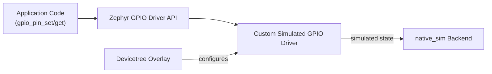

# 28-Zephyr Native Sim Peripheral

A Zephyr RTOS application, built and run entirely as a native binary on your own computer — no board, no flashing, no serial cable — talking to a simulated GPIO-like peripheral through a real Zephyr driver and devicetree binding. This is where the hardware-side peripheral design from Lesson 27 meets the software-side driver model a real embedded operating system expects.

- **Difficulty:** Advanced
- **Prerequisites:** [Lesson 18: RTOS Sensor Logger](../18-rtos-sensor-logger/README.md), [Lesson 27: Memory-Mapped GPIO Peripheral](../27-memory-mapped-gpio-peripheral/README.md) (conceptually; no shared code between them is required)
- **Approximate time:** 3 to 5 hours
- **What you'll build:** A Zephyr application running on the `native_sim` board target, using a devicetree overlay and a minimal custom driver to control a simulated peripheral, entirely on your development machine

## Why build this?

Lesson 18 used FreeRTOS directly against real hardware registers. Zephyr takes a different, more structured approach: peripherals are described declaratively in a **devicetree**, and application code talks to a **driver API**, not raw registers — the same application code can then run against real hardware or, as in this lesson, entirely in simulation via `native_sim`, Zephyr's build target that compiles your whole application as an ordinary executable for your host OS. This matters practically: it means driver logic and application logic can be developed and tested for hours before a physical board is even in the room.

## What you'll learn

- What a devicetree is, and why hardware description lives outside application C code in Zephyr rather than as `#define`s.
- How Zephyr's driver model separates the driver (talks to devicetree-described hardware) from the application (calls a stable API regardless of what's underneath).
- What `native_sim` actually is: a Zephyr board target that compiles the RTOS and application as a native host binary, with simulated rather than real peripherals.
- How to write a devicetree overlay describing a simple simulated peripheral.
- How to write a minimal Zephyr driver implementing a small subset of a standard driver API (e.g., the GPIO API) against that simulated peripheral.

## What you need

| Item | Type | Quantity | Purpose |
|---|---|---:|---|
| Zephyr SDK and `west` build tool | Tool | 1 install | Builds and runs Zephyr applications, including the `native_sim` target |
| A Linux, macOS, or WSL environment | Tool | 1 | `native_sim` compiles a native host binary; Windows without WSL is not directly supported |
| A Zephyr application skeleton (`west init` from the Zephyr example repo) | Tool | 1 | The standard starting point for any Zephyr application |

## Before you build

A **devicetree** is a structured, declarative description of hardware: what peripherals exist, at what addresses, with what properties — entirely separate from the C code that uses them. Zephyr uses devicetree at *build time*, generating C macros and constants from it, which is why changing a devicetree overlay can change which driver gets compiled in and how it's configured without touching application code at all.

Zephyr's **driver model** separates three layers: the devicetree (what hardware exists and its configuration), the driver (translates a standard API, like the GPIO API, into whatever specific register or simulated operations that hardware actually needs), and the application (calls `gpio_pin_set()` or equivalent, never caring what's underneath). This is the same separation of concerns that lets the exact same application binary — unmodified — run against a real STM32's GPIO driver or against a `native_sim` simulated one.

`native_sim` (formerly `native_posix`) compiles Zephyr, its kernel, and your application into a normal executable for your host operating system, using host OS features to stand in for hardware behavior that would otherwise require real silicon — timers, for instance, are backed by host wall-clock time rather than a hardware timer peripheral. It is not a full instruction-level hardware simulator; it's a native build target with simulated peripheral backends, which is why it's fast enough to run and debug directly, with ordinary host tools like GDB, without an emulator in between.

## How it works

| Component | Role |
|---|---|
| Devicetree overlay | Declares the simulated peripheral, its properties, and which driver binds to it |
| Driver | Implements the standard GPIO API's functions against the simulated peripheral's internal state |
| Application | Calls the same GPIO API a real-hardware application would, unaware anything underneath is simulated |
| native_sim | The board target compiling everything into a native host executable |

## Build it

1. Set up a Zephyr workspace: `west init ~/zephyrproject && cd ~/zephyrproject && west update`.
2. Create a new application directory with a minimal `CMakeLists.txt`, `prj.conf`, and `src/main.c`.
3. Write a devicetree overlay (`boards/native_sim.overlay`) declaring a custom node: `sim_gpio0: sim-gpio@0 { compatible = "hardwareatlas,sim-gpio"; ngpios = <8>; };`.
4. Write a minimal out-of-tree driver in `drivers/gpio/gpio_sim_hwatlas.c` implementing at least `pin_configure`, `port_set_bits_raw`, and `port_get_raw` from Zephyr's GPIO driver API, backed by a plain internal `uint8_t` state variable rather than any real register.
5. Register the driver with `DEVICE_DT_INST_DEFINE` and the appropriate GPIO API struct, following an existing in-tree GPIO driver as a structural reference.
6. In `src/main.c`, get the device with `DEVICE_DT_GET(DT_NODELABEL(sim_gpio0))`, configure a pin as output with `gpio_pin_configure()`, and toggle it periodically with `gpio_pin_set()` inside a simple loop or a Zephyr thread.
7. Build for the simulated target: `west build -b native_sim .`
8. Run the resulting native binary directly: `./build/zephyr/zephyr.exe`, and observe your driver's logging (via Zephyr's logging subsystem) showing the pin state toggling.

## Verify it

- Add `LOG_INF()` calls inside the driver's `port_set_bits_raw` implementation and confirm the log output shows the expected pin state changes as the application toggles the pin.
- Use GDB directly against the native binary (`gdb ./build/zephyr/zephyr.exe`) to set a breakpoint inside your driver and confirm it's actually being called with the arguments you expect — a debugging workflow that would be far more involved on real hardware.
- Modify the devicetree overlay's `ngpios` property and confirm the driver correctly reports the new pin count via `gpio_get_pending_int()` or an equivalent API query, showing the devicetree value actually reached the running driver.

## What should you see?

Log output from the native binary showing the simulated GPIO pin's state toggling on the schedule your application code specifies, with no board, cable, or flashing step involved anywhere in the process — just a compiled executable running directly on your development machine.

## Troubleshooting

| Symptom | Possible cause | What to check |
|---|---|---|
| Build fails, driver not found | Driver not registered in `CMakeLists.txt`/`Kconfig` for the out-of-tree driver directory | Confirm the driver source file is included in the build and its `Kconfig` symbol is enabled in `prj.conf` |
| Devicetree overlay seems to have no effect | Overlay file not named or placed correctly for the `native_sim` board target | Confirm the overlay filename matches `native_sim.overlay` exactly and sits in the application's `boards/` directory |
| Application compiles but device pointer is `NULL` at runtime | `DEVICE_DT_GET` referencing a devicetree node that was never actually instantiated as a device | Confirm `DEVICE_DT_INST_DEFINE` in the driver correctly matches the `compatible` string used in the overlay |
| No log output appears at all | Logging subsystem not enabled | Confirm `CONFIG_LOG=y` is set in `prj.conf` |

Debug in this order: confirm the build succeeds and the binary runs at all, then confirm the device pointer resolves correctly, then confirm the driver's functions are actually being invoked.

## Common mistakes

- **Treating `native_sim` as a full hardware emulator.** It's a native build target with simulated peripheral backends — it will not catch bugs that depend on real hardware timing, memory-mapped register quirks, or interrupt latency.
- **Mismatched `compatible` strings between the devicetree overlay and the driver's `DEVICE_DT_INST_DEFINE` macro,** which silently results in the device never being instantiated at all.
- **Forgetting to enable the relevant Kconfig options in `prj.conf`** (logging, the driver subsystem itself), leading to code that compiles but produces no visible output.
- **Copying an in-tree driver too literally** without adjusting it for the fact that this simulated peripheral has no real register interface underneath it — the internal state should be a plain variable, not an address you read/write.

## Think about it

- Why does Zephyr separate hardware description (devicetree) from driver logic (C code) instead of hardcoding configuration into the driver directly?
- What categories of bugs can `native_sim` never catch, precisely because it isn't simulating real hardware timing or electrical behavior?
- Why is it valuable that the exact same application code, unmodified, could run against this simulated driver or a real one for actual hardware?
- How does this driver/devicetree separation compare to the address-decoder pattern from Lesson 27, conceptually?

## Experiment with it

- Extend the simulated driver to support GPIO interrupts, and have the application register a callback that fires when a simulated pin changes state.
- Build the same application for a real supported board (if you have one) with a real devicetree overlay for its actual GPIO peripheral, and confirm the application code needs zero changes.
- Add a second simulated peripheral (a simple counter/timer) alongside the GPIO one and confirm both coexist in the same devicetree and application.

## Simulation

`native_sim` itself *is* the simulation environment for this lesson — there's no additional simulator needed beyond the Zephyr SDK and `west` toolchain described above.

## Recommended viewing

### Zephyr devicetree and driver model, explained with native_sim.

A walkthrough of writing a devicetree overlay and a minimal driver, building and running entirely on a host machine with no physical board.

[Watch on YouTube](https://www.youtube.com/results?search_query=zephyr+native_sim+devicetree+driver+tutorial)

## Further reading

- **Tutorial:** [Zephyr Project, Devicetree Guide](https://docs.zephyrproject.org/latest/build/dts/index.html) — the canonical reference for devicetree syntax and semantics in Zephyr.
- **Tutorial:** [Zephyr Project, Device Driver Model](https://docs.zephyrproject.org/latest/kernel/drivers/index.html) — background on the driver API layering this lesson relies on.
- **Reference:** [Zephyr Project, native_sim Board Documentation](https://docs.zephyrproject.org/latest/boards/native/native_sim/doc/index.html) — details on exactly what native_sim does and doesn't simulate.

## Hardware Atlas resources

### Tools
For setting up the Zephyr SDK and `west` across different host platforms: [See Tools](../../resources/tools.md)

### Help
If the build fails to find the driver or the devicetree overlay has no effect: [See Hardware Help](../../resources/help.md)

## Sourcing

No physical board is required for this lesson; a supported board can optionally be added later using the same application code, as suggested in "Experiment with it."

## Going deeper

The devicetree-plus-driver-API pattern this lesson teaches is exactly how Linux and most modern embedded operating systems handle hardware diversity — the same application or driver-writing skills transfer directly to real board bring-up work once you move beyond `native_sim`.

## Where this fits in Hardware Atlas

Move to [Lesson 29: Yosys RTL Synthesis](../29-yosys-rtl-synthesis/README.md). You've worked with peripherals from both the hardware and software driver sides; the next lesson goes back to the RTL designs from earlier lessons and asks what it actually takes to turn them into a real gate-level circuit.