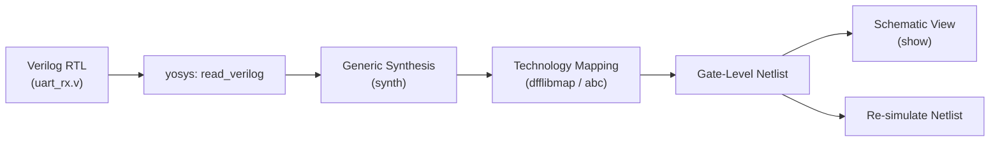
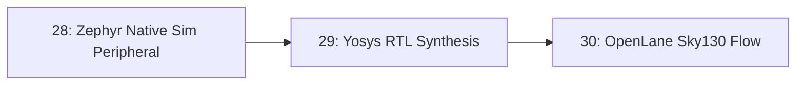

# 29-Yosys RTL Synthesis

The UART receiver from Lesson 24 gets synthesized for the first time — converted from behavioral Verilog into an actual network of standard logic gates and flip-flops, using the open-source Yosys synthesis tool. This is the step between "the simulator says this design works" and "this is a real circuit that could be built."

- **Difficulty:** Advanced
- **Prerequisites:** [Lesson 24: UART RX FSM](../24-uart-rx-fsm/README.md)
- **Approximate time:** 2 to 3 hours
- **What you'll build:** A gate-level synthesized netlist of the UART RX FSM, produced with Yosys, inspected as a schematic, and verified to still simulate correctly against the original testbench

## Why build this?

Every RTL lesson so far has stopped at simulation: the design behaves correctly in a simulator, but a simulator's `always` block and `case` statement don't physically exist anywhere. Synthesis is the process that turns that behavioral description into an actual netlist of real logic gates and flip-flops, mapped to a specific target technology. This is a necessary, mechanical step no design skips before it becomes silicon or an FPGA bitstream, and it's also where certain Verilog constructs (like a `case` statement missing a `default`) can silently produce different hardware than the simulator's behavior suggested.

## What you'll learn

- The difference between simulation (behavioral, for verification) and synthesis (structural, produces something that could be physically built).
- What a **netlist** is: a list of gate instances and the wires connecting them, with no behavioral abstraction left at all.
- How Yosys's `synth` command flow works at a high level: reading RTL, generic technology-independent optimization, and technology mapping to a specific cell library.
- Why some RTL that simulates correctly can synthesize into unexpectedly different (or larger, or slower) hardware — the classic case being inferred latches from incomplete `if`/`case` statements.
- How to view a synthesized design as a gate-level schematic and sanity-check it against your mental model of the design.

## What you need

| Item | Type | Quantity | Purpose |
|---|---|---:|---|
| Yosys | Tool | 1 install | Open-source RTL synthesis tool |
| The UART RX FSM from Lesson 24 | File | 1 | The design being synthesized |
| A schematic viewer (`xdot`, or Yosys's built-in `show` command with Graphviz) | Tool | 1 | Visualizing the resulting gate-level netlist |
| Icarus Verilog | Tool | 1 install | Re-simulating the synthesized netlist to confirm behavior is preserved |

## Before you build

**Simulation** answers "does this design behave correctly, given these inputs, according to the simulator's model of Verilog semantics?" **Synthesis** answers an entirely different question: "what actual network of gates and flip-flops, from a specific available cell library, implements this same behavior?" A design can simulate perfectly and still synthesize into something subtly different from what you assumed, because Verilog has constructs (initial values, certain non-blocking assignment idioms, incomplete conditionals) that simulators and synthesis tools are permitted to interpret slightly differently, since synthesis is only required to match simulated behavior for synthesizable constructs used correctly.

A **netlist** is the output of synthesis: a flat (or hierarchical) list of specific gate and flip-flop instances — from a cell library like Yosys's built-in generic cells, or a real fabrication process's standard cell library — and the wires connecting their pins. Nothing behavioral remains; every `assign` and `always` block has been replaced by actual AND/OR/NOT/DFF instances.

One of the most common and consequential synthesis surprises is the **inferred latch**: if a combinational `always` block's `if`/`case` statement doesn't assign a value to a signal on every possible path (missing an `else` or a `default`), the synthesis tool must infer memory (a latch) to hold the signal's previous value on the unhandled path — because otherwise the signal's value would be genuinely undefined there. This usually simulates as if nothing is wrong, because the simulator just keeps whatever value was already there too, but it produces a very different (and usually unwanted) circuit.

## How it works

| Component | Role |
|---|---|
| RTL source | The behavioral Verilog design being synthesized, unchanged from Lesson 24 |
| Generic synthesis pass | Yosys's technology-independent optimization: constant folding, don't-care simplification, coarse-grain logic reduction |
| Technology mapping | Converts generic logic into instances of a specific cell library's actual gates and flip-flops |
| Gate-level netlist | The final structural output: real gate instances and their interconnecting wires |
| Schematic viewer | Renders the netlist visually so it can be sanity-checked by eye |

## Build it

1. Launch Yosys interactively: `yosys`.
2. Read the design: `read_verilog uart_rx.v`.
3. Set the top module: `hierarchy -top uart_rx`.
4. Run generic synthesis: `synth -top uart_rx`.
5. View the resulting netlist as a schematic: `show -format svg -prefix uart_rx_synth`, then open the generated SVG.
6. Write the synthesized netlist out to a new Verilog file: `write_verilog uart_rx_synth.v`.
7. Re-run the Lesson 24 testbench, but instantiate `uart_rx_synth.v` instead of the original behavioral RTL, and confirm it still passes with `iverilog`/`vvp`.
8. Run `stat` in Yosys before exiting to see a cell-count summary: how many flip-flops, how many of each gate type the design actually needs.

## Verify it

- Confirm the re-simulated, synthesized netlist produces identical `rx_valid` and `rx_data` outputs to the original behavioral simulation, for the same testbench stimulus.
- Read the `stat` output and sanity-check the flip-flop count against what you'd expect by hand: a state register (a handful of bits for 4 states), a bit counter, and an 8-bit shift register should roughly account for the reported total.
- Inspect the schematic view for anything unexpected — most importantly, any inferred latch Yosys's synthesis log may have warned about, which would show up as an unexpected non-clocked storage element.

## What should you see?

An identical pass/fail result from the testbench whether it's run against the original RTL or the synthesized netlist, a `stat` summary with flip-flop and gate counts that roughly match hand-calculated expectations, and a schematic that — while much harder to read at a glance than the original RTL — reflects the same state machine structure underneath.

## Troubleshooting

| Symptom | Possible cause | What to check |
|---|---|---|
| Yosys reports "latch inferred" during synthesis | An `always` block's conditional doesn't assign every signal on every path | Add a `default` case or an `else` branch explicitly assigning a value in every reachable path |
| Synthesized netlist simulation disagrees with the original RTL | An unsynthesizable construct (e.g., a delay `#10` used as if it were real timing) was relied on for correctness in the original testbench | Remove or account for simulation-only timing constructs; re-check the RTL uses only synthesizable constructs |
| `show` command produces no output or errors | Graphviz not installed on the system Yosys is running on | Install Graphviz (`dot`) separately; Yosys's `show` command depends on it for rendering |
| Cell count in `stat` seems far larger than expected | Unintended additional logic from an incomplete case statement, or the design wasn't properly flattened for the summary | Re-check the synthesis log for warnings; try `flatten` before `stat` for a clearer top-level count |

Debug synthesis warnings immediately as they're printed — an inferred-latch warning ignored at synthesis time is far harder to trace back to its source once you're looking at a raw gate-level netlist.

## Common mistakes

- **Ignoring synthesis warnings because "the simulation passed."** Simulation and synthesis can disagree in exactly the cases synthesis warnings exist to catch.
- **Assuming a `case` statement is complete just because it feels like it covers everything.** Missing a `default` is one of the most common sources of accidental inferred latches, even in designs that look thorough at a glance.
- **Comparing cell counts across totally different tools or synthesis settings** and drawing conclusions about efficiency — cell count depends heavily on the target cell library and optimization settings, not just the RTL's inherent complexity.
- **Never re-simulating the synthesized netlist.** A design that synthesizes without errors hasn't been shown to behave identically to the original RTL — only that Yosys was able to convert it into gates.

## Think about it

- Why can the same behaviorally-correct Verilog produce different netlists depending on the target technology library?
- Why is an inferred latch specifically dangerous, compared to, say, an inefficient but still correct piece of combinational logic?
- What does re-simulating the synthesized netlist actually prove, and what does it *not* prove, about the design's correctness?
- How does the flip-flop count reported by `stat` relate back to the state machine design decisions made in Lesson 24?

## Experiment with it

- Deliberately remove the `default` case from the ALU or FSM's case statement, re-run synthesis, and read Yosys's resulting warning about the inferred latch it now needs to add.
- Try synthesizing with a different target library (Yosys supports several built-in generic libraries) and compare the resulting cell counts.
- Run `opt` explicitly between `synth`'s stages and observe, via `stat`, how much the design shrinks from optimization alone.

## Simulation

The re-simulation step in "Build it" uses the same Icarus Verilog toolchain from earlier RTL lessons, now pointed at the synthesized netlist rather than the original behavioral source.

## Recommended viewing

### RTL synthesis with Yosys: from Verilog to gates.

A walkthrough of the `read_verilog`/`synth`/`show` flow on a small design, including what an inferred latch warning looks like and why it matters.

[Watch on YouTube](https://www.youtube.com/results?search_query=yosys+rtl+synthesis+tutorial+verilog)

## Further reading

- **Tutorial:** [Yosys Manual](https://yosyshq.readthedocs.io/) — the canonical reference for every command used in this lesson.
- **Tutorial:** [YosysHQ, Getting Started with Yosys](https://yosyshq.readthedocs.io/projects/yosys/en/latest/getting_started/) — practical, worked examples of synthesizing real designs with Yosys.
- **Reference:** [Clifford Wolf, Yosys and the Open-Source Silicon Flow](https://yosyshq.net/yosys/) — background on the broader open-source ASIC toolchain this lesson feeds directly into.

## Hardware Atlas resources

### Simulation
For synthesis and simulation tool setup across this RTL track: [See Simulation](../../resources/simulation.md)

### Help
If synthesis produces unexpected warnings or the netlist won't re-simulate: [See Hardware Help](../../resources/help.md)

## Sourcing

No physical parts required; this lesson uses free and open-source tools exclusively.

## Going deeper

Synthesis is the bridge between every RTL design in this repository and the physical world — the next two lessons, [OpenLane Sky130 Flow](../30-openlane-sky130-flow/README.md) and [Magic DRC/LVS Verification](../31-magic-drc-lvs-verification/README.md), take this exact synthesized netlist further, through place-and-route and physical verification, to something that could genuinely be fabricated as a real chip.

## Where this fits in Hardware Atlas

Move to [Lesson 30: OpenLane Sky130 Flow](../30-openlane-sky130-flow/README.md). You now have a gate-level netlist; the next lesson takes it through a complete open-source place-and-route flow targeting a real, fabricable silicon process.