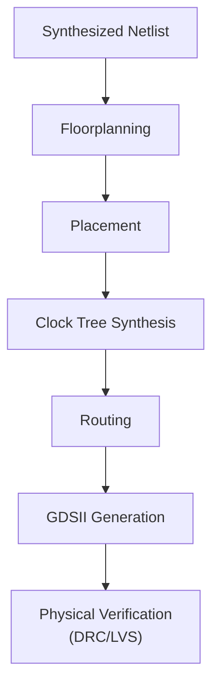

# 30-OpenLane Sky130 Flow

The synthesized netlist from Lesson 29 goes all the way through place-and-route, targeting SkyWater's open-source 130nm process (Sky130), using OpenLane — the same class of automated flow real chip design teams use, applied here to the small UART receiver design that's run through most of this repository's RTL track.

- **Difficulty:** Advanced
- **Prerequisites:** [Lesson 29: Yosys RTL Synthesis](../29-yosys-rtl-synthesis/README.md)
- **Approximate time:** 4 to 8 hours (including tool setup and flow runtime)
- **What you'll build:** A complete GDSII layout of the UART RX FSM, taken through OpenLane's automated RTL-to-GDSII flow targeting the Sky130 open PDK, ready for physical verification in the next lesson

## Why build this?

Lesson 29 produced a netlist — a list of gates and their connections, with no physical location for anything. A real chip needs every one of those gates placed at an actual X/Y coordinate on silicon, and every connection routed as actual metal, exactly like Lesson 20's PCB routing but at a vastly smaller scale and with far more automated constraint-driven decision-making. OpenLane automates this entire flow end to end, against SkyWater's Sky130 process — the first fully open-source PDK (process design kit) that makes it possible to run this whole pipeline without a proprietary tool license or NDA.

## What you'll learn

- What a PDK (process design kit) is, and why Sky130 being open-source matters for being able to run this lesson at all.
- The stages of an RTL-to-GDSII flow: synthesis, floorplanning, placement, clock tree synthesis, routing, and GDSII generation.
- What a floorplan defines (die area, core area, I/O pin placement) before any gate placement happens.
- Why timing closure (meeting setup/hold constraints) is a central concern of the placement and routing stages, not an afterthought.
- What a GDSII file actually is: the industry-standard format describing every physical layer of a chip's layout, the same format sent to a real fabrication facility.

## What you need

| Item | Type | Quantity | Purpose |
|---|---|---:|---|
| OpenLane (via Docker, or the newer OpenLane 2 Python/Nix-based install) | Tool | 1 install | The automated RTL-to-GDSII flow orchestrator |
| Sky130 open PDK | Tool | 1 install | Provides the standard cell library, design rules, and process layers OpenLane targets |
| The synthesized UART RX FSM netlist from Lesson 29 (or the original RTL, since OpenLane can also run synthesis itself) | File | 1 | The design being taken through the flow |
| A machine with reasonable disk space and RAM (Docker-based flows can be resource-intensive) | Tool | 1 | Running the flow itself |

## Before you build

A **PDK (process design kit)** is everything a design tool needs to know about a specific silicon fabrication process: the physical and electrical rules for every layer, the standard cell library (pre-designed, pre-characterized logic gates ready to be placed), and timing/power models for those cells. Sky130 is SkyWater Technology's 130-nanometer process, made available as a fully open PDK — meaning, unlike most commercial fabrication processes, its design rules and cell libraries can be used and studied without a non-disclosure agreement, which is exactly why an open-source flow like OpenLane can exist and be run by anyone.

OpenLane's flow runs, broadly, in this order: **synthesis** (Yosys, as in Lesson 29, if not already done), **floorplanning** (deciding the chip's overall die and core area dimensions and where I/O pins go around its perimeter), **placement** (assigning every standard cell an actual physical location within the core area, optimizing for wire length and timing), **clock tree synthesis** (building a balanced distribution network so the clock signal reaches every flip-flop with minimal skew), **routing** (connecting every placed cell's pins with actual metal, across multiple metal layers), and finally **GDSII generation** — the physical layout file format that is the actual deliverable a fabrication facility consumes.

**Timing closure** means every path in the design meets its setup and hold timing constraints — a signal must arrive at a flip-flop's input early enough before the clock edge (setup) and must not change too soon after the clock edge (hold). Placement and routing decisions directly affect wire length, and wire length directly affects propagation delay, which is why these traditionally "physical" stages are deeply intertwined with timing analysis rather than a separate, later concern.

## How it works

| Component | Role |
|---|---|
| Sky130 PDK | Supplies the standard cell library, layer stack, and design rules the entire flow targets |
| Floorplanning | Defines the chip's die/core area and I/O pin placement before any cells are placed |
| Placement | Assigns every standard cell instance a physical location, optimizing wire length and timing |
| Clock tree synthesis | Builds a balanced clock distribution network to minimize skew across the design |
| Routing | Connects every cell's pins with actual metal traces across the process's available metal layers |
| GDSII output | The final physical layout file, ready for physical verification and, ultimately, fabrication |

## Build it

1. Install OpenLane and the Sky130 PDK following the official installation guide for your platform (Docker-based install is the most consistent across operating systems).
2. Create an OpenLane design directory for the UART RX FSM, with a `config.json` (or `config.tcl`) specifying the design name, source Verilog files, clock port name, and clock period target.
3. Set a reasonable initial clock period target in the config — start conservatively (a longer period, i.e., a slower target clock) to get a first successful run before trying to push for a faster design.
4. Run the flow: `./flow.tcl -design uart_rx_fsm` (OpenLane 1) or the equivalent `openlane` CLI invocation (OpenLane 2).
5. Watch the flow progress through synthesis, floorplanning, placement, CTS, and routing, reviewing the log output at each stage for warnings.
6. Once the flow completes, locate the generated GDSII file in the design's `results/final/gds/` directory.
7. Open the GDSII file in KLayout (a free GDSII viewer) to visually inspect the completed layout.
8. Review the flow's summary report for timing slack, area utilization, and any DRC violations flagged during the automated flow itself (a full DRC pass is the subject of the next lesson).

## Verify it

- Confirm the flow completes all stages without a fatal error, and that a GDSII file was actually produced in the results directory.
- Check the timing report for negative slack (a timing violation) on any path; if present, note which path and consider whether a longer clock period target resolves it.
- Open the layout in KLayout and visually confirm the die area contains what looks like a small, densely packed block of standard cells with routed metal connecting them — a stark visual contrast to the abstract Verilog and gate-level schematic from earlier lessons.
- Compare the reported core area utilization against your floorplan's target utilization setting, to understand how much of the allotted area the placer actually used.

## What should you see?

A completed flow run reporting positive timing slack at your chosen clock period, a reasonable core utilization percentage, and a GDSII file that, opened in KLayout, shows a physically coherent block of placed and routed standard cells — the same UART receiver design that's existed only as Verilog and simulation waveforms until this point, now as an actual physical layout.

## Troubleshooting

| Symptom | Possible cause | What to check |
|---|---|---|
| Flow fails during synthesis | Verilog source uses a construct Yosys (inside OpenLane) can't synthesize, or the top module name in config doesn't match the actual RTL | Confirm the design synthesizes cleanly standalone in Yosys first, as in Lesson 29, before running the full flow |
| Flow fails during placement with a "cannot fit" or overflow error | Core area set too small in the floorplan for the number of cells the design actually needs | Increase the core area or reduce target utilization percentage in the config |
| Routing stage reports unrouted nets | Congestion from too aggressive a utilization target, or too few available metal layers configured | Lower the target utilization percentage, or check the configured metal layer count against the PDK's actual stack |
| Timing report shows significant negative slack | Clock period target set too aggressively for this design's actual critical path | Increase the clock period (slow the target clock down) and re-run; timing closure at a tighter period requires this and other lessons' techniques together |

Debug the flow stage by stage: a failure in placement usually traces back to floorplan constraints, and a failure in routing usually traces back to placement density, not to the original RTL itself.

## Common mistakes

- **Targeting an unrealistically fast clock period on the first attempt.** Start conservative, get a complete, clean flow run, and only then try tightening the timing constraint.
- **Setting core utilization too high,** leaving the placer and router too little room to work with, which shows up as placement or routing failures that look unrelated to the actual setting that caused them.
- **Not reviewing intermediate stage logs,** and only discovering a warning (that later became a hard failure) by scrolling back through a much longer log after the fact.
- **Assuming a completed flow run with no fatal errors means the design is fully verified.** A successful OpenLane run produces a layout; it does not replace the dedicated DRC and LVS verification covered in the next lesson.

## Think about it

- Why does floorplanning have to happen before placement, rather than letting the placer freely choose the die size too?
- What's the actual physical reason wire length affects timing, connecting this lesson back to basic electrical concepts from Lesson 1?
- Why might a design that met timing easily in Yosys's abstract synthesis stage still fail timing after real routing delay is accounted for?
- What tradeoffs does increasing target utilization introduce, beyond just "using less area"?

## Experiment with it

- Re-run the flow with a tighter clock period target and observe exactly which stage first reports a problem.
- Re-run with a smaller die area and lower target utilization, and compare the resulting layout's aspect ratio and cell density visually in KLayout.
- Try running the full flow on the Lesson 23 combinational adder/ALU design instead, and compare how much simpler (fewer flip-flops, likely less routing congestion) that flow run looks compared to the stateful UART FSM.

## Simulation

OpenLane itself is the automated flow tool for this lesson rather than a simulator; KLayout serves as the primary visualization tool for inspecting the resulting GDSII output:

**KLayout**: [https://www.klayout.de/](https://www.klayout.de/)

## Recommended viewing

### RTL to GDSII with OpenLane and Sky130, start to finish.

A complete walkthrough of configuring and running the OpenLane flow on a small design, including reading the timing and utilization reports along the way.

[Watch on YouTube](https://www.youtube.com/results?search_query=openlane+sky130+rtl+to+gdsii+tutorial)

## Further reading

- **Tutorial:** [OpenLane Documentation](https://openlane.readthedocs.io/) — the canonical reference for flow configuration and every stage's options.
- **Reference:** [SkyWater Sky130 Open PDK](https://skywater-pdk.readthedocs.io/) — the process design kit this entire flow targets.
- **Tutorial:** [Efabless / ChipIgnite, OpenLane Tutorials](https://efabless.com/) — practical guides oriented toward actually submitting a design for fabrication using this exact flow.

## Hardware Atlas resources

### Simulation
For toolchain and environment setup shared with the rest of the RTL track: [See Simulation](../../resources/simulation.md)

### Help
If a flow stage fails or timing closure can't be reached: [See Hardware Help](../../resources/help.md)

## Sourcing

No physical parts required; this lesson uses free and open-source tools, including a genuinely open, no-NDA silicon process design kit.

## Going deeper

Everything from Lesson 1's resistor calculation to this point has been building toward the same underlying idea: a design constrained by real physical limits (current, timing, area, manufacturability) rather than an abstract, idealized one. OpenLane makes that constraint explicit and automatic at the scale of an entire chip — the next lesson closes the loop with the physical verification step that confirms this generated layout is actually correct and manufacturable.

## Where this fits in Hardware Atlas

Move to [Lesson 31: Magic DRC/LVS Verification](../31-magic-drc-lvs-verification/README.md). You have a complete GDSII layout; the final lesson in this track verifies it's actually correct — geometrically manufacturable and electrically equivalent to the netlist it was built from.