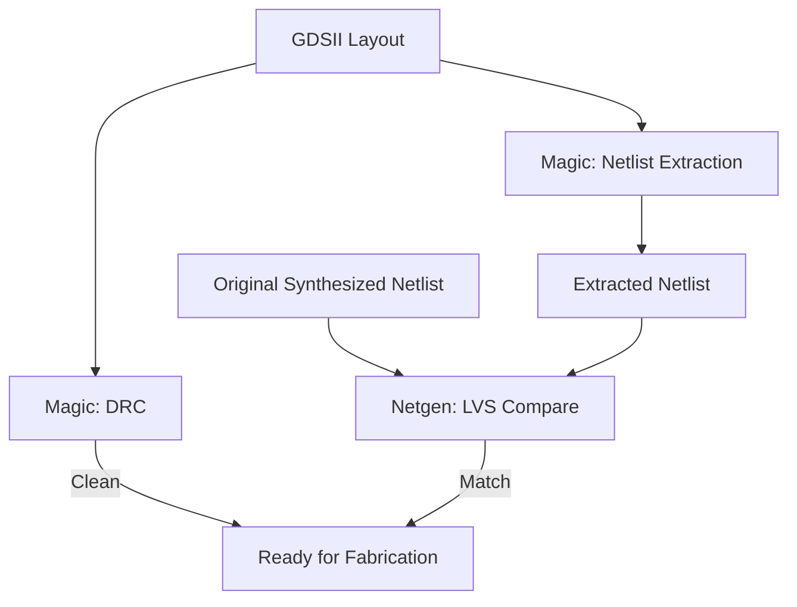

# 31-Magic DRC/LVS Verification

The GDSII layout produced by OpenLane in the previous lesson gets checked against two independent questions: is it geometrically legal to manufacture (Design Rule Check), and does its actual layout still match the netlist it was supposed to implement (Layout Versus Schematic)? Both checks run here in Magic, the venerable open-source VLSI layout tool. This is the last gate a chip design passes through before anyone would trust it enough to send to fabrication.

- **Difficulty:** Advanced
- **Prerequisites:** [Lesson 30: OpenLane Sky130 Flow](../30-openlane-sky130-flow/README.md)
- **Approximate time:** 2 to 4 hours
- **What you'll build:** A clean DRC report and a clean LVS match confirming the UART RX FSM's Sky130 layout is both physically manufacturable and electrically equivalent to its source netlist

## Why build this?

OpenLane's automated flow already runs its own internal checks, but treating those as sufficient is exactly the kind of shortcut that leads to expensive mistakes once real money and fabrication time are on the line. DRC and LVS are the two independent, dedicated verification steps every real chip design goes through regardless of how trusted the tool that generated the layout is — DRC asks "can this physically be manufactured correctly," and LVS asks "does this physical layout actually implement the circuit I intended," which are genuinely different questions that a layout can fail independently.

## What you'll learn

- What a Design Rule Check (DRC) verifies at the physical layout level: minimum widths, spacings, and overlaps for every layer in the process.
- What a Layout Versus Schematic (LVS) check verifies: that the physical layout's extracted transistor-level netlist matches the intended schematic/netlist.
- Why DRC and LVS are complementary rather than redundant — a layout can pass one and fail the other.
- How Magic extracts a netlist directly from a physical layout, and why that extracted netlist is the thing LVS actually compares.
- What an LVS mismatch report looks like, and how to trace it back to a specific layout error.

## What you need

| Item | Type | Quantity | Purpose |
|---|---|---:|---|
| Magic VLSI layout tool | Tool | 1 install | Runs DRC and layout-level netlist extraction for LVS |
| Netgen (or another open-source LVS comparison tool) | Tool | 1 install | Performs the actual schematic-versus-extracted-layout comparison |
| The Sky130 PDK's Magic technology file | File | 1 | Provides Magic with the process's design rules |
| The GDSII layout and original synthesized netlist from Lessons 29–30 | File | 1 each | The two things being checked against each other and against the process rules |

## Before you build

A **Design Rule Check (DRC)** verifies that a physical layout obeys every geometric constraint the fabrication process requires: minimum feature width on each layer, minimum spacing between features, minimum overlap where one layer must extend past another (like a contact needing to be fully covered by the layer above it). These rules exist because a fabrication process has real physical limits — a wire etched too thin might not reliably conduct, two features placed too close together might short during manufacturing. DRC is purely geometric: it doesn't know or care what the circuit is supposed to do, only whether the shapes obey the rules.

A **Layout Versus Schematic (LVS)** check answers a completely different question: does the physical layout, if you extracted its actual transistor-level connectivity purely from its geometry, implement the same circuit as the netlist it was supposed to be built from? LVS works by having the tool (Magic here) extract a netlist directly from the layout's shapes — inferring transistors from where polysilicon crosses diffusion, inferring connections from where metal layers overlap and connect via contacts — and then a separate comparison tool (Netgen) checks that extracted netlist against the original schematic/synthesized netlist for equivalence, reporting any mismatched device count, connectivity, or missing/extra nets.

A layout can pass DRC while failing LVS: every shape might be perfectly legal geometrically, while two nets that were supposed to be separate are accidentally connected (or two that were supposed to connect aren't), because a spacing violation isn't the only way connectivity can go wrong — a routing tool bug, a library cell error, or a manual layout edit can each break connectivity without breaking any individual design rule. This is precisely why both checks are run, independently, rather than treating one as a stand-in for the other.

## How it works

| Component | Role |
|---|---|
| Magic DRC engine | Checks every shape in the layout against the Sky130 process's geometric design rules |
| Magic extraction | Derives a transistor-level netlist purely from the physical layout's geometry |
| Netgen | Compares the extracted netlist against the original synthesized netlist for exact equivalence |
| DRC report | Lists every geometric violation, if any, with its location and rule violated |
| LVS report | Lists any mismatch between the two netlists: extra/missing devices, extra/missing nets, or differing connectivity |

## Build it

1. Launch Magic with the Sky130 technology file: `magic -T sky130A`.
2. Load the GDSII layout produced by OpenLane: `gds read uart_rx_fsm.gds`.
3. Run the DRC check: `drc check`, then `drc why` on any flagged region to see the specific rule violated.
4. Resolve any reported violations if present (for a clean OpenLane-generated layout at conservative settings, this is often already clean, which is itself worth confirming rather than assuming).
5. Extract a netlist from the layout: `extract all`, then `ext2spice lvs`, then `ext2spice` to produce a SPICE-level netlist file.
6. Launch Netgen and run the LVS comparison: `netgen -batch lvs "uart_rx_fsm_extracted.spice uart_rx_fsm" "uart_rx_fsm_synth.v uart_rx_fsm" sky130A_setup.tcl lvs_report.txt`.
7. Open `lvs_report.txt` and confirm it reports a clean match — same device count, same net count, same connectivity — between the extracted layout and the original netlist.

## Verify it

- Confirm Magic's DRC report shows zero violations across every layer.
- Confirm Netgen's LVS report explicitly states the two netlists match (device counts and net counts equal, no unmatched nets reported).
- If either check fails, deliberately introduce a known-bad test case (a manually edited copy of the layout with one intentional spacing violation, or one intentionally cut trace) to confirm the tools correctly flag a problem you know is there, validating that a clean report on the real design is meaningful and not just a tool misconfiguration.

## What should you see?

A DRC report with zero violations across the full Sky130 layer set, and an LVS report confirming exact equivalence between the physical layout's extracted netlist and the synthesized netlist that started this entire flow back in Lesson 29 — the final confirmation that everything from Lesson 23's combinational logic through Lesson 30's automated place-and-route actually produced a coherent, correct, manufacturable design.

## Troubleshooting

| Symptom | Possible cause | What to check |
|---|---|---|
| DRC reports violations despite a clean OpenLane run | Technology file mismatch, or a manual post-processing step on the GDSII introduced an issue | Confirm the exact same Sky130 PDK version was used for both the OpenLane flow and this Magic check |
| LVS reports a device count mismatch | Extraction settings didn't correctly recognize a standard cell's internal structure | Confirm Magic's extraction is using the correct Sky130 standard cell extraction rules, not a generic default |
| LVS reports matching device counts but mismatched connectivity | A net got merged or split incorrectly somewhere in the flow, often at routing | Use Netgen's detailed mismatch output to identify the specific net, then trace it back to the layout region in Magic |
| Netgen fails to run at all | Missing or misconfigured `sky130A_setup.tcl` comparison rules file | Confirm the setup file path is correct and matches the PDK version installed |

Debug LVS mismatches by starting from Netgen's specific reported net or device name — it points directly at the discrepancy rather than requiring you to compare the entire design by eye.

## Common mistakes

- **Treating a clean OpenLane run as equivalent to a passed DRC/LVS check.** OpenLane's internal checks are a good sign, not a substitute for an independent verification pass.
- **Running DRC and LVS against mismatched PDK versions** between the synthesis/place-and-route stage and this verification stage, producing spurious failures unrelated to the actual design.
- **Assuming an LVS device-count match alone means the design is correct,** without also confirming net connectivity matches — two designs can have identical device counts and still be wired completely differently.
- **Not validating the checks themselves against a known-bad case,** which is the only way to be confident a "clean" report reflects a genuinely correct design rather than a misconfigured or silently-skipped check.

## Think about it

- Why can a layout pass DRC (every shape geometrically legal) while still failing LVS (wrong circuit)?
- What does it mean, precisely, for Magic to "extract" a netlist from pure geometry — what physical/geometric cues indicate a transistor versus a plain wire?
- Why is validating your verification tools against a deliberately broken test case a meaningful step, rather than an unnecessary extra?
- Looking back across this entire RTL-to-GDSII arc (Lessons 23 through 31), which stage do you think is most likely to introduce a subtle bug that only DRC or LVS would catch?

## Experiment with it

- Deliberately edit a copy of the GDSII layout in Magic to create a spacing violation, and confirm DRC catches it with the exact location and rule reported.
- Deliberately cut one net's connection in a copy of the layout and confirm LVS reports the resulting connectivity mismatch clearly.
- Run the full DRC/LVS check against the Lesson 23 combinational ALU design (taken through Lessons 29–30 first) and compare how much faster and simpler the verification is for a purely combinational design versus the stateful UART FSM.

## Simulation

DRC and LVS in Magic and Netgen are static verification tools rather than simulators — they check geometry and connectivity, not timing behavior; timing itself was addressed separately during the OpenLane flow in the previous lesson.

## Recommended viewing

### DRC and LVS verification with Magic and Netgen.

A practical walkthrough of running both checks against a Sky130 layout, including what a real DRC violation and a real LVS mismatch look like in their respective reports.

[Watch on YouTube](https://www.youtube.com/results?search_query=magic+netgen+drc+lvs+sky130+tutorial)

## Further reading

- **Tutorial:** [Magic VLSI Layout Tool Documentation](http://opencircuitdesign.com/magic/) — the canonical reference for every Magic command used in this lesson.
- **Tutorial:** [Netgen LVS Documentation](http://opencircuitdesign.com/netgen/) — background on netlist comparison methodology and reading mismatch reports.
- **Reference:** [SkyWater Sky130 Open PDK, Design Rules](https://skywater-pdk.readthedocs.io/) — the authoritative source for every geometric rule Magic's DRC checks against.

## Hardware Atlas resources

### Simulation
For the broader open-source silicon toolchain this lesson concludes: [See Simulation](../../resources/simulation.md)

### Help
If DRC or LVS won't pass, or the tools won't run against your PDK version: [See Hardware Help](../../resources/help.md)

## Sourcing

No physical parts required; this lesson uses free and open-source tools exclusively, concluding a fully open-source path from RTL to a verified, fabrication-ready layout.

## Going deeper

This lesson closes the loop opened all the way back in [Lesson 1](../01-led-circuit/README.md): a resistor value calculated from Ohm's law, verified against a real measurement, is the same fundamental discipline as a chip layout checked against physical design rules and its own intended netlist — trust nothing that hasn't been independently verified, at every scale from a single LED to a fabricable chip.

## Where this fits in Hardware Atlas

This is the final lesson in the RTL-to-silicon arc that began at [Lesson 23: Combinational Arithmetic RTL](../23-combinational-arithmetic-rtl/README.md). From here, consider looping back to apply this full flow — synthesis through DRC/LVS — to a design of your own, or revisiting the [RISC-V datapath](../26-riscv-single-cycle-datapath/README.md) with an eye toward what it would take to carry that larger design through the same pipeline.