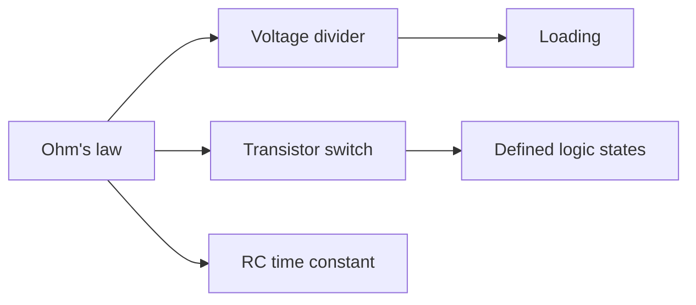

# Level 01 : Basic Circuits

Ohm's law, polarity, switches, charge and discharge, and time constants: the vocabulary every other level reuses.

> [!NOTE]
> If you can already predict the current through a resistor from the drop across it, this level will go fast. Read the lesson you are missing and move on.

## What this level covers

- Ohm's law as a working tool, not a formula to memorise
- Voltage dividers, and why a load changes the number you measure
- Pull-up and pull-down resistors for defined logic states
- A BJT as a low-side switch, with the base resistor sized on purpose
- RC charge and discharge, and the tau = RC relation

## Lessons

| # | Lesson | What it builds |
|---|---|---|
| 01 | [LED circuit](../../lessons/01-led-circuit/README.md) | Current limiting and polarity in the first safe build |
| 02 | [Voltage divider](../../lessons/02-voltage-divider/README.md) | Node voltage, and what a load does to it |
| 03 | [Button and LED](../../lessons/03-button-and-led/README.md) | Switches, pull-ups, defined logic states |
| 04 | [Transistor switch](../../lessons/04-transistor-switch/README.md) | Low-side switching with a sized base resistor |
| 05 | [RC circuit](../../lessons/05-rc-circuit/README.md) | Time constants and charge/discharge curves |

## How the pieces connect

## Common mistakes

- Measuring a divider with a meter that loads it harder than the circuit you are testing
- Leaving a button input floating with no pull-up
- Sizing the base resistor right up against the absolute maximum, or skipping it entirely
- Reading tau as the time to fully charge instead of ~63%

## Where to go from here

- [Level 02](../02-analog-electronics/README.md) for sensors, amplifiers, and filters.
- [Level 03](../03-digital-electronics/README.md) if digital logic pulls harder.

## Resources

- [Simulation](../../resources/simulation.md) to check a circuit before you build it.
- [Tools](../../resources/tools.md) for the meter and power source you will use here.
