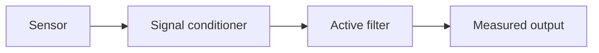

# Level 02 -- Analog Electronics

Bias, gain, loading, clipping, noise, and bandwidth. This is where ideal circuit models start showing their limits.

> [!TIP]
> Keep the meter on the bench for this whole level. An amplifier that "should" give 10x gain giving 6x is information, not failure.

## Prerequisites

Finish [Level 01](../01-basic-circuits/README.md) or be comfortable reading a resistor network and biasing a simple LED. You will see the divider and the BJT switch return in every circuit here, wearing better clothes.

## Core concepts

- Turning a physical quantity into a measurable voltage
- BJT small-signal amplification: bias, gain, and clipping
- Bias stability across temperature, and what happens when you set it by luck instead of design
- Op-amp feedback, and the rails the output actually lives between
- First-order active filters: cutoff frequency and the response you measure

AICTE's *Analog Circuits* (EC08/EC10) teaches the rest of this family: multistage and cascode amplifiers, frequency response, feedback topologies, oscillators, differential amplifiers and common-mode rejection (CMRR), and the week of op-amp applications beyond conditioning — comparators, Schmitt triggers, integrators, differentiators. This level stops at one gain stage and one filter on purpose; when your project outgrows that, the syllabus list is the reading list. ADC and DAC data converters show up when you start sampling in [Level 04](../04-microcontrollers/README.md).

## Lessons

| # | Lesson | What it builds |
|---|---|---|
| 06 | [Light sensor](../../lessons/06-light-sensor/README.md) | Light into a measurable voltage |
| 07 | [Transistor amplifier](../../lessons/07-transistor-amplifier/README.md) | Bias, gain, clipping |
| 08 | [Op-amp signal conditioner](../../lessons/08-op-amp-conditioner/README.md) | Feedback and supply limits |
| 09 | [Active filter](../../lessons/09-active-filter/README.md) | Cutoff frequency and measured response |

## Signal chain

## Common mistakes

- Driving an op-amp output into a rail and calling the resulting flat line "gain"
- Measuring gain at one frequency and assuming it holds everywhere
- Forgetting that your meter probe itself loads a high-impedance node
- Diagnosing a part as broken when the circuit is simply biased wrong

## Resources

- [Simulation](../../resources/simulation.md) is worth more here than anywhere else in the early levels.
- [Tools](../../resources/tools.md) if an oscilloscope is one of the purchases you are planning.
- [Opportunities](../../opportunities/README.md) for mixed-signal and analog roles that assume this grounding.
- The [AICTE ECE Model Curriculum](https://www.aicte.gov.in/sites/default/files/Final_ECE.pdf) lists the full *Analog Circuits* unit this level maps to.

## Where to go from here

- [Level 03](../03-digital-electronics/README.md) if you want logic next.
- [Level 06](../06-pcb-design/README.md) once you want an analog circuit that stops being a pile of jumper wires.
- Back to [Level 01](../01-basic-circuits/README.md) to revisit the circuit theorems this level leans on.