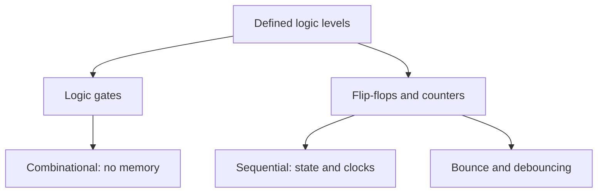

# Level 03 -- Digital Electronics

Truth tables, reset behaviour, timing, defined logic levels, and switch bounce. All of this before it hides inside a microcontroller and you stop thinking about it.

> [!NOTE]
> If you can explain why a floating input is a bad idea and what a flip-flop remembers, you can start here and only read the lesson you need.

## What this level covers

- 74HC logic families and the voltages they call high and low
- Combinational logic: gates, truth tables, where the current actually flows
- Sequential logic: flip-flops, clocks, reset, and what remembers
- Switch bounce, and the debouncing that nobody believes is necessary until it isn't

## Lessons

| # | Lesson | What it builds | Status |
|---|---|---|---|
| 10 | [Logic gates](../../lessons/10-logic-gates/README.md) | 74HC logic, truth tables, pull resistors | ✅ |
| 11 | [Flip-flop and counter](../../lessons/11-flip-flop-counter/README.md) | State, clocks, reset, bounce | ✅ |
| -- | 555 timer oscillator | Clock generation, frequency, duty cycle | 🚧 planned |
| -- | Simple digital clock | Clock + counters + display, no MCU shortcuts | 🚧 planned |

## Combinational and sequential

## Common mistakes

- Floating inputs, which are not "off" so much as "at whatever charge they happen to hold"
- Forgetting a reset state exists, and then wondering why the counter starts somewhere odd
- Ignoring bounce because the LED seemed fine, until a real counter mis-counts
- Assuming all logic families tolerate the same input voltages

## Where to go from here

- [Level 04](../04-microcontrollers/README.md) applies the same ideas in firmware, where the bounce is now someone else's problem to solve in software.
- [Level 08](../08-fpga-and-rtl/README.md) if you want to keep designing logic directly.

## Resources

- [Simulation](../../resources/simulation.md) if you want to see a counter race before you wire it.
- [Tools](../../resources/tools.md) once tick-reading a clock becomes a reason to own an oscilloscope.