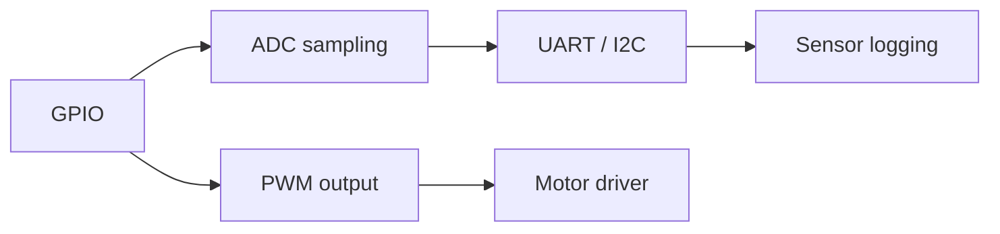

# Level 04 -- Microcontrollers

Arduino, ESP32, and Pico boards as practical platforms before you go bare-metal. Verify with serial logs, sensor comparisons, and current measurements, not just a blinking LED.

> [!NOTE]
> Each lesson here is self-contained. If all you want is PWM motor control, you do not need to build the temperature logger first.

## What this level covers

- GPIO as firmware: inputs, outputs, and why the pull-up is still your problem
- ADC sampling: resolution, reference, and noise on the reading
- UART and I2C as things you can see on pins, not just library calls
- PWM for motor speed, and the current and back-EMF that come with it

## Lessons

| # | Lesson | What it builds |
|---|---|---|
| 12 | [GPIO device](../../lessons/12-gpio-device/README.md) | Firmware inputs, outputs, debouncing |
| 13 | [Temperature logger](../../lessons/13-temperature-logger/README.md) | Sampling and recorded measurements |
| 14 | [UART and I2C device](../../lessons/14-uart-i2c-device/README.md) | Serial protocols and error handling |
| 15 | [PWM motor controller](../../lessons/15-pwm-motor-controller/README.md) | Drivers, current, motor noise |

## How the peripherals fit

## Common mistakes

- Sinking too much current from a GPIO pin and letting the magic smoke out
- Forgetting a common ground between the board and whatever you wired it to
- Believing the serial log report over a meter reading of the actual pin
- Ignoring back-EMF across a motor and wondering why the board resets

## Where to go from here

- [Level 05](../05-embedded-systems/README.md) when you want firmware that has to keep working when things fail.
- [Level 06](../06-pcb-design/README.md) to move a prototype off the breadboard.

## Resources

- [Components](../../resources/components.md) for choosing a development board.
- [Wokwi](https://wokwi.com/) lets you sketch and simulate firmware before you own the hardware.