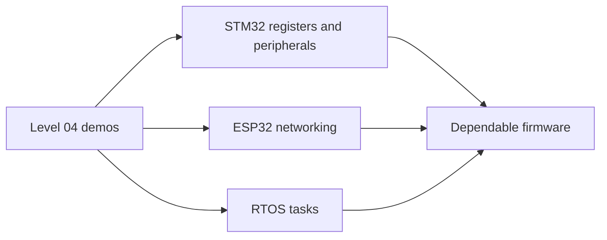

# Level 05 -- Embedded Systems

Moving from working demos to dependable firmware. STM32 peripherals, ESP32 networking, RTOS task scheduling, and the debugging that catches problems before they become product failures.

## Prerequisites

[Level 04](../04-microcontrollers/README.md) or comfortable hands with GPIO and serial on a microcontroller. The timers and interrupts you noted there are the ones this level schedules. You do not need to finish every Level 04 lesson first — start here if the demos already feel easy.

## Core concepts

- Vendor registers versus the HAL that hides them, and when to care
- Wi-Fi and MQTT, including the failure paths nobody puts on the slide
- RTOS primitives: tasks, queues, semaphores, and timing
- Fault recovery and the kind of logging that survives a crash

AICTE's *Embedded Systems* (EC20) frames the same material from the product side: embedded memories, analog-digital signal conditioning at the interface, user interfacing, and the design trade-offs a fixed process and a thermal budget force on you. MQTT and the failure-path work here are the applied half of the *Computer Networks* (EC22) application layer. Interrupt-driven scheduling is the thread that runs through all of it — a queue exists precisely because an ISR outlived its use of a shared buffer.

## Lessons

| # | Lesson | What it builds | Status |
|---|---|---|---|
| 16 | [STM32 peripheral project](../../lessons/16-stm32-peripheral/README.md) | Timers, ADC, UART, debugging | ✅ |
| 17 | [ESP32 connected sensor](../../lessons/17-esp32-connected-sensor/README.md) | Networking and failure paths | ✅ |
| 18 | [RTOS sensor logger](../../lessons/18-rtos-sensor-logger/README.md) | Tasks, queues, timing, recovery | ✅ |
| -- | Custom peripheral | Register-based device over I2C/SPI/UART, both ends | 🚧 planned |
| -- | Bootloader exercise | Image validation, versioning, recoverable update | 🚧 planned |

## From demos to dependable firmware

## Common mistakes

- Blocking the network task forever and calling it a timeout
- Sharing a buffer between tasks with no queue, then chasing corruption
- Using the watchdog to hide a missing recovery path
- Copying a HAL init sequence without checking which register did what

## Resources

- [Components](../../resources/components.md) for STM32 and ESP32 board choices.
- [Help](../../resources/help.md) when a bug has you looking at real-time code at 2am.
- [Opportunities](../../opportunities/README.md) for embedded and IoT roles at this depth.
- [Zephyr's native_sim board](https://docs.zephyrproject.org/latest/boards/native/native_sim/doc/index.html) for running RTOS code on the host before hardware exists.

## Where to go from here

- [Level 06](../06-pcb-design/README.md) to move dependable firmware onto a dependable board.
- [Level 07](../07-hardware-interfaces/README.md) when "the protocol is fine" stops being a guess.
- Back to [Level 04](../04-microcontrollers/README.md) to wire the interrupts this level schedules.
- **Related in [Opportunities](../../opportunities/README.md):** MITRE eCTF and CSAW Embedded Security Challenge (ESC) put secure-embedded design and attack on a team; ISEA-ISAP CTF is the national Indian equivalent.