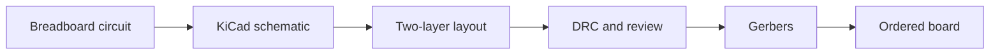

# Level 06 -- PCB Design

Converting a tested breadboard circuit into a schematic and a real two-layer board. Footprints, design rules, decoupling, return paths, Gerbers, and revision control.

## Prerequisites

Start from a circuit you have already built and measured in [Level 01](../01-basic-circuits/README.md) through [Level 05](../05-embedded-systems/README.md). The goal is to make the reliable thing reproducible, not to debug electronics while learning a CAD tool at the same time.

## Core concepts

- Schematic capture: symbols, nets, and a schematic that reads like a design document
- Footprints, and the packages they must match exactly
- Signed-off design rules: DRC for geometry, ERC for connectivity
- Decoupling placement and the return path under every trace
- Gerber generation and the review you do before ordering

None of this maps to a single AICTE course; board design sits between the curriculum's *Digital System Design* (EC03) and *VLSI Design* (EC24), and the concrete work here is what its project courses (EC-P1 micro and EC-P2 mini projects) are for. It is the only level where the deliverable ships to a factory, so the discipline is review, not just routing.

## Lessons

| # | Lesson | What it builds |
|---|---|---|
| 19 | [KiCad schematic capture](../../lessons/19-kicad-schematic-capture/README.md) | Design the regulated microcontroller schematic |
| 20 | [Two-layer PCB routing](../../lessons/20-two-layer-pcb-routing/README.md) | Route, run DRC, generate Gerbers |

## From breadboard to board

## Common mistakes

- A footprint for one package variant while the part on hand is another
- Decoupling capacitor placed on the wrong side of the pin it is meant to protect
- Routing every trace first and remembering only later that there is a return path
- Shipping Gerbers without a final visual pass over every layer

## Resources

- [Tools](../../resources/tools.md) for soldering kit and test gear.
- [Phil's Lab](https://www.youtube.com/@PhilsLab/playlists?app=desktop) and [Robert Feranec](https://www.youtube.com/@RobertFeranec/videos) show professional layout workflow end to end.
- [Opportunities](../../opportunities/README.md) for PCB and hardware engineering roles.
- [Projects](../../projects/README.md) if a made-and-ordered board is your entry point for a contribution.

## Where to go from here

- [Level 07](../07-hardware-interfaces/README.md) for bus-level debugging on something you actually routed.
- [Level 08](../08-fpga-and-rtl/README.md) to design the silicon side of the same tables.
- Back to [Level 05](../05-embedded-systems/README.md) for the firmware the board is about to run.