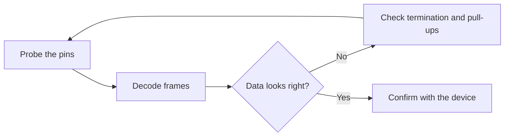

# Level 07 -- Hardware Interfaces

Framing, addressing, timing, termination, pull-ups, error handling, and recovery. Verify with a logic analyzer, not vibes.

## What this level covers

- What is actually on the wire, as opposed to what the library says should be there
- SPI, I2C, and CAN at the electrical level: idle states, clock, and acknowledge
- Termination and pull-ups, and what the bus sees when they are wrong
- Error handling and recovery on links that drop bits anyway

## Lessons

| # | Lesson | What it builds |
|---|---|---|
| 21 | [Logic analyzer decode](../../lessons/21-logic-analyzer-decode/README.md) | Debug SPI or I2C timing and data |
| 22 | [CAN bus node](../../lessons/22-can-bus-node/README.md) | Terminated CAN link and error inspection |

## The debug loop

## Common mistakes

- Decoding at a baud rate that is close but not the actual one
- Treating missing pull-ups as a firmware problem, when it is a wiring problem
- Leaving bus termination off and calling the reflections interference
- Trusting "it mostly works" when acknowledge bits are being dropped

## Where to go from here

- [Level 08](../08-fpga-and-rtl/README.md) to implement an interface as RTL instead of reading one.
- [Level 09](../09-computer-architecture/README.md) once you want to see the CPU that lives behind the bus.

## Resources

- [Tools](../../resources/tools.md) for logic analyzer choices.
- [Help](../../resources/help.md) when a frame looks right on screen and is still rejected on the wire.