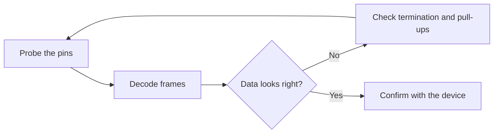

# Level 07 -- Hardware Interfaces

Framing, addressing, timing, termination, pull-ups, error handling, and recovery. Verify with a logic analyzer, not vibes.

## Prerequisites

[Level 04](../04-microcontrollers/README.md) for the firmware side and [Level 06](../06-pcb-design/README.md) for the board side are the ideal run-in. If you can drive I2C and UART from firmware but have never looked at the pins, this is the level that connects the two.

## Core concepts

- What is actually on the wire, as opposed to what the library says should be there
- SPI, I2C, and CAN at the electrical level: idle states, clock, and acknowledge
- Termination and pull-ups, and what the bus sees when they are wrong
- Error handling and recovery on links that drop bits anyway

The AICTE curriculum touches board-level buses only lightly: EC12 lists serial I/O among microcontroller peripherals, and EC20 covers sub-system interfacing at a systems level. So SPI, I2C, and CAN live here as built hardware instead — the applied layer under the *Analog and Digital Communication* noise analysis, and the link-layer reality under *Computer Networks* (EC22). Termination math and acknowledge timing are the transferable skills.

## Lessons

| # | Lesson | What it builds |
|---|---|---|
| 21 | [Logic analyzer decode](../../lessons/21-logic-analyzer-decode/README.md) | Debug SPI or I2C timing and data |
| 22 | [CAN bus node](../../lessons/22-can-bus-node/README.md) | Terminated CAN link and error inspection |

## The debug loop

## Common mistakes

- Decoding at a baud rate that is close but not the actual one
- Treating missing pull-ups as a firmware problem, when it is a wiring problem
- Leaving bus termination off and calling the reflections interference
- Trusting "it mostly works" when acknowledge bits are being dropped

## Resources

- [Tools](../../resources/tools.md) for logic analyzer choices.
- [Help](../../resources/help.md) when a frame looks right on screen and is still rejected on the wire.
- [Opportunities](../../opportunities/README.md) for validation and interface engineering roles.

## Where to go from here

- [Level 08](../08-fpga-and-rtl/README.md) to implement an interface as RTL instead of reading one.
- [Level 09](../09-computer-architecture/README.md) once you want to see the CPU that lives behind the bus.
- Back to [Level 06](../06-pcb-design/README.md) when the fix turns out to be a missing resistor after all.