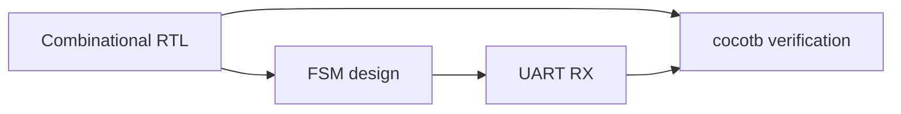

# Level 08 -- FPGA and RTL

Synchronous RTL for counters, UART receivers, and memory-mapped peripherals. Verified with simulation, assertions, and synthesis reports, not just "it compiled."

> [!WARNING]
> "It compiled" means your syntax is fine. It says nothing about whether the design is right. The simulation and the synthesis report are where the design gets checked.

## Prerequisites

[Level 03](../03-digital-electronics/README.md) for the logic and state-machine intuition, and [Level 07](../07-hardware-interfaces/README.md) for the serial signals you will re-implement. Comfort with a C-like language helps for the testbench work.

## Core concepts

- Combinational versus sequential RTL, and why the distinction shows up in silicon
- Finite state machines in Verilog, including the states nobody planned
- Clock crossing and synchronisation for asynchronous inputs
- Automated verification with cocotb testbenches
- Synthesis reports: the area and timing that the simulator never told you

AICTE covers this half of *Digital System Design* (EC03) — HDL modelling, FSM and algorithmic state machine design, synthesis and simulation — and the design-flow half of *VLSI Design* (EC24). The adders and ALU from the EC03 combinational list are exactly what [Lesson 23](../../lessons/23-combinational-arithmetic-rtl/README.md) rebuilds in Verilog, so the breadboard logic you did in Level 03 stops being a memory and becomes a synthesizable module.

## Lessons

| # | Lesson | What it builds |
|---|---|---|
| 23 | [Combinational arithmetic RTL](../../lessons/23-combinational-arithmetic-rtl/README.md) | Build and simulate a synthesizable ALU |
| 24 | [UART RX FSM](../../lessons/24-uart-rx-fsm/README.md) | Synchronize and receive asynchronous serial data |
| 25 | [cocotb Python testbench](../../lessons/25-cocotb-python-testbench/README.md) | Automate RTL verification |

## How the pieces connect

## Common mistakes

- Writing combinational logic inside a clocked block and getting latches you did not ask for
- No reset, then wondering why the board powers up in an unknown state
- Feeding an asynchronous input at a flip-flop without a synchroniser
- Running the testbench once, seeing green, and calling it verified

## Resources

- [HDLBits](https://hdlbits.01xz.net/wiki/Main_Page) for interactive Verilog practice.
- [ChipVerify](https://www.chipverify.com/) for SystemVerilog and UVM reference.
- [Opportunities](../../opportunities/README.md) for FPGA, RTL, and verification roles.

## Where to go from here

- [Level 09](../09-computer-architecture/README.md) builds a RISC-V datapath out of the same RTL habits.
- [Level 10](../10-asic-design/README.md) takes that RTL toward silicon.
- Back to [Level 07](../07-hardware-interfaces/README.md) to re-probe the interface you just re-implemented.
- **Related in [Opportunities](../../opportunities/README.md):** CHIPS Alliance (F4PGA) and FOSSi Foundation are recurring GSoC mentors for open FPGA and RTL tooling; Hardwired runs an FPGA-implementation hackathon.