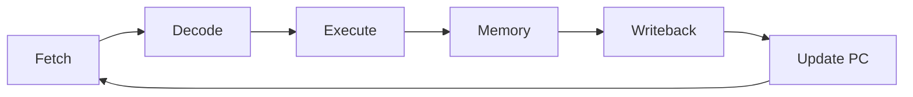

# Level 09 -- Computer Architecture

From an ALU and register file toward a CPU, a memory system, and a simulated peripheral. Verify with reference models and waveforms, not assumptions.

## Prerequisites

[Level 08](../08-fpga-and-rtl/README.md) for the RTL habits, plus enough C to read and write a simple driver. The datapath you build here is a bigger version of the FSMs you already tested.

## Core concepts

- RISC-V RV32I in a single cycle: fetch, decode, execute, memory, writeback
- The register file, ALU, and the control path, one decision at a time
- Memory-mapped I/O and the line where the CPU ends and the peripheral begins
- A C driver talking to RTL registers
- Host-based simulation without target hardware

AICTE's *Computer Architecture* (EC18) covers this level's territory and then keeps going: instruction sets and formats, ALU design and IEEE 754 floating point, hardwired versus microprogrammed control, cache and virtual memory, DMA and interrupts, pipelining, and parallel processing. This roadmap stays deliberately single-cycle — pipelining, the memory hierarchy, and floating point are the natural extensions when you revisit the core in [Level 13](../13-advanced-hardware/README.md). The C driver here is the same wear pattern you will put on real silicon in Level 10.

## Lessons

| # | Lesson | What it builds |
|---|---|---|
| 26 | [RISC-V single-cycle datapath](../../lessons/26-riscv-single-cycle-datapath/README.md) | Implement and trace a small RV32I core |
| 27 | [Memory-mapped GPIO peripheral](../../lessons/27-memory-mapped-gpio-peripheral/README.md) | Connect RTL registers to a C driver |
| 28 | [Zephyr native-sim peripheral](../../lessons/28-zephyr-native-sim-peripheral/README.md) | Test a simulated peripheral and driver on the host |

## One cycle, end to end

## Common mistakes

- Two units trying to write the register file in the same cycle
- Control signals that conflict because they were designed one instruction at a time
- Writing a driver against register offsets and skipping the hardware header
- Trusting a simulated peripheral to have the timing of the real silicon

## Resources

- [Nand2Tetris](https://www.nand2tetris.org/) and [MIT Computation Structures (6.004)](https://computationstructures.org) for the full systems view.
- [Opportunities](../../opportunities/README.md) for CPU, architecture, and systems roles.
- [Ripes](https://github.com/mortbopet/Ripes) to watch a RISC-V datapath, pipeline, and cache run visually.

## Where to go from here

- [Level 10](../10-asic-design/README.md) synthesizes and lays out the same RTL.
- Back to [Level 08](../08-fpga-and-rtl/README.md) for the module-level habits this core stacks on top of.
- **Related in [Opportunities](../../opportunities/README.md):** FOSSi Foundation (CVA6/Ariane, OpenPiton) and RISC-V International mentor the exact open cores this level builds; the ACM SIGDA SRC at DAC/ICCAD takes architecture research posters.