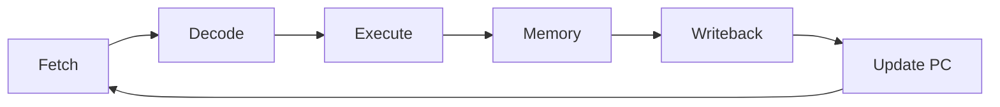

# Level 09 -- Computer Architecture

From an ALU and register file toward a CPU, a memory system, and a simulated peripheral. Verify with reference models and waveforms, not assumptions.

## What this level covers

- RISC-V RV32I in a single cycle: fetch, decode, execute, memory, writeback
- The register file, ALU, and the control path, one decision at a time
- Memory-mapped I/O and the line where the CPU ends and the peripheral begins
- A C driver talking to RTL registers
- Host-based simulation without target hardware

## Lessons

| # | Lesson | What it builds |
|---|---|---|
| 26 | [RISC-V single-cycle datapath](../../lessons/26-riscv-single-cycle-datapath/README.md) | Implement and trace a small RV32I core |
| 27 | [Memory-mapped GPIO peripheral](../../lessons/27-memory-mapped-gpio-peripheral/README.md) | Connect RTL registers to a C driver |
| 28 | [Zephyr native-sim peripheral](../../lessons/28-zephyr-native-sim-peripheral/README.md) | Test a simulated peripheral and driver on the host |

## One cycle, end to end

## Common mistakes

- Two units trying to write the register file in the same cycle
- Control signals that conflict because they were designed one instruction at a time
- Writing a driver against register offsets and skipping the hardware header
- Trusting a simulated peripheral to have the timing of the real silicon

## Where to go from here

- [Level 10](../10-asic-design/README.md) synthesizes and lays out the same RTL.

## Resources

- [Nand2Tetris](https://www.nand2tetris.org/) and [MIT Computation Structures (6.004)](https://computationstructures.org) for the full systems view.