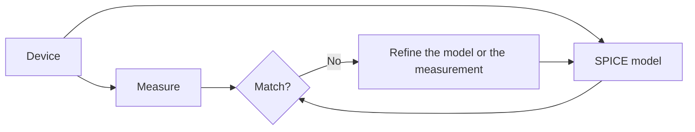

# Level 11 -- Semiconductor Devices

Diode, BJT, and MOSFET behaviour through controlled measurements, small-signal models, SPICE, and temperature variation. This is where the physics meets the circuits you have already built.

> [!NOTE]
> This level is theory and simulation-driven. There are no dedicated lesson files yet. See [Simulation](../../resources/simulation.md) for SPICE tools.

## What this level covers

- Diode I-V behaviour and the Shockley relation behind it
- BJT regions of operation, small-signal models, and temperature drift
- MOSFET threshold, channel behaviour, and the SPICE models that approximate them
- Measurement discipline: record the uncertainty every time

## Device by device

| Device | What you measure | What SPICE shows you |
|---|---|---|
| Diode | Forward voltage at several currents | Shockley model fit, temperature coefficient |
| BJT | Bias point and gain | Small-signal model, Early effect |
| MOSFET | Threshold and I_D vs V_GS | Channel behaviour, process corners |

## Measure, model, compare

## Common mistakes

- Reading one I-V point and calling it "the" characteristic
- Treating absolute maximum ratings as a suggested operating range
- Pushing a part far enough to self-heat during a sweep, then reading a drift as physics
- Trusting a simulator model over the datasheet you actually have

## Where to go from here

- [Level 12](../12-semiconductor-fabrication/README.md) covers how the devices are actually made.
- [Level 10](../10-asic-design/README.md) connects device behaviour to standard-cell design.

## Resources

- [Simulation](../../resources/simulation.md) is the lab bench for this level.
- [MIT OpenCourseWare 6.002](https://ocw.mit.edu/courses/6-002-circuits-and-electronics-spring-2007/) for the full university treatment.