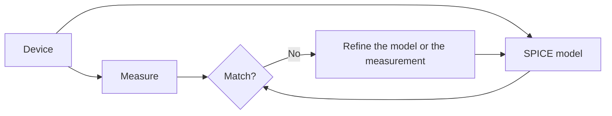

# Level 11 -- Semiconductor Devices

Diode, BJT, and MOSFET behaviour through controlled measurements, small-signal models, SPICE, and temperature variation. This is where the physics meets the circuits you have already built.

> [!NOTE]
> This level is theory and simulation-driven. There are no dedicated lesson files yet. See [Simulation](../../resources/simulation.md) for SPICE tools.

## Prerequisites

[Level 02](../02-analog-electronics/README.md) for the bias points and gains you will now explain, and [Level 10](../10-asic-design/README.md) if you want to see what the PDK models actually sit on. If this is your first pass at device physics, read the sections in order — each device section leans on the physics primer below. The diode equation, the BJT model, and the MOSFET equations are all the same drift-diffusion story told from a different angle.

## Table of contents

- [Core concepts](#core-concepts)
- [A five-minute physics primer](#a-five-minute-physics-primer)
- [The diode](#the-diode)
- [The BJT](#the-bjt)
- [The MOSFET](#the-mosfet)
- [Devices the syllabus adds](#devices-the-syllabus-adds)
- [Device by device (quick reference)](#device-by-device-quick-reference)
- [Measure, model, compare](#measure-model-compare)
- [Common mistakes](#common-mistakes)
- [Resources](#resources)
- [Where to go from here](#where-to-go-from-here)

## Core concepts

- Diode I–V behaviour and the Shockley relation behind it
- BJT regions of operation, small-signal models, and temperature drift
- MOSFET threshold, channel behaviour, and the SPICE models that approximate them
- Measurement discipline: record the uncertainty every time

## Lessons

No numbered lesson files yet; this level is theory and simulation-driven. The hands-on work lives inside each device section: measure the part, fit a SPICE model, compare. Start with the [Simulation resource](../../resources/simulation.md) for the toolchain before you buy a part or trust a curve.

---

## A five-minute physics primer

Every device in this level is built from the same raw material story, so it's worth having it straight before you touch a diode, a BJT, or a MOSFET.

**Bands and the gap.** In a crystal, electrons can only occupy certain energy ranges, called *bands*, separated by forbidden *gaps*. The **valence band** is mostly full; the **conduction band** is mostly empty. The size of the gap between them, $E_g$, is what makes a material a conductor, an insulator, or a semiconductor. Silicon's $E_g \approx 1.12\ \text{eV}$ at room temperature, small enough that a modest amount of thermal energy or doping can push carriers across it. An insulator's $E_g$ is several eV, so nothing moves.

**Intrinsic carrier concentration.** Even undoped ("intrinsic") silicon has some free electrons and holes, created purely by thermal energy knocking electrons across the gap:

$$
n_i = \sqrt{N_c N_v}\; e^{-E_g / (2kT)}
$$

where $N_c$ and $N_v$ are the effective densities of states in the conduction and valence bands, $k$ is Boltzmann's constant, and $T$ is absolute temperature. Note the exponential: $n_i$ roughly doubles every 8–10 °C for silicon. That single fact is why diode leakage current, BJT $\beta$, and MOSFET subthreshold current all drift with temperature. It is not three separate quirks. It is one exponential showing up three times.

**Doping.** Add a controlled trace of impurity atoms and you can flood the crystal with one carrier type on purpose:

- **n-type**: donor atoms (e.g. phosphorus in silicon) contribute extra electrons, which become the *majority carrier*.
- **p-type**: acceptor atoms (e.g. boron) create *holes*, missing electrons that behave like mobile positive charge. Holes become the majority carrier.

**Two transport mechanisms.** Once you have free carriers, they move in exactly two ways:

$$
J_{\text{drift}} = q\,(n\mu_n + p\mu_p)\,E
\qquad\qquad
J_{\text{diffusion}} = qD_n \frac{dn}{dx} - qD_p \frac{dp}{dx}
$$

*Drift* is carriers pushed by an electric field, which dominates in a MOSFET's channel and a BJT's collector-base region. *Diffusion* is carriers spreading from where they are concentrated to where they are not, which dominates transport across a BJT's base and a forward-biased diode's junction. The **Einstein relation**, $D = \mu kT/q$, ties the two together, so mobility $\mu$ and diffusivity $D$ are really the same underlying number.

**Generation and recombination.** Carriers come into existence in pairs (thermal generation) and annihilate in pairs (recombination). Recombination inside a depletion region adds a current component no junction is free of, and recombination in the base is the physical limit on BJT current gain. Both show up as extra terms in the equations below, and as the parameters SPICE fits.

Keep those ideas, exponential thermal sensitivity, doping asymmetry, drift versus diffusion, and generation-recombination, in your back pocket. Every equation below is a specific consequence of them.

---

## The diode

A diode is what you get when you push a p-type region up against an n-type region and let the carriers sort themselves out.

Electrons diffuse from the n-side into the p-side and holes diffuse the other way, until the resulting charge imbalance creates an internal electric field strong enough to stop further net diffusion. What remains is a **depletion region**, depleted of free carriers, and a **built-in potential**:

$$
V_0 = \frac{kT}{q}\ln\!\left(\frac{N_A N_D}{n_i^2}\right)
$$

which for a typical silicon diode sits around 0.6–0.7 V.

### The Shockley equation

Apply an external voltage $V$ across the junction and the current that flows is:

$$
I = I_0\left(e^{\,V / (nV_T)} - 1\right)
$$

- $I_0$ is the **reverse saturation current**, tiny (pA–nA range), and exponentially temperature-dependent because it inherits $n_i^2$'s sensitivity.
- $V_T = kT/q$ is the **thermal voltage**, about 25.85 mV at 300 K. Rule of thumb: 26 mV at room temperature.
- $n$ is the **ideality factor**: 1.0 for an "ideal" diode, closer to 1.5–2 for real silicon diodes where recombination inside the depletion region adds a second current component.

A few consequences you will lean on:

- **Forward region** ($V > 0$): current rises exponentially. Because it is an exponential, the forward voltage barely moves even as current changes by orders of magnitude. That is why "diode drop ≈ 0.6–0.7 V" is such a durable approximation, and also why it is an approximation, not a law.
- **Reverse region** ($V < 0$): current saturates at $-I_0$, small and roughly constant, until you push far enough negative to hit breakdown.
- **Breakdown**: at large enough reverse voltage, either **avalanche multiplication** (carriers gain enough energy to knock loose new carrier pairs) or, in heavily doped junctions, **Zener tunnelling** drives current up sharply. Zener diodes exploit this on purpose as a voltage reference.
- **Temperature coefficient**: $V_F$ for a silicon diode drops by roughly **−2 mV/°C** at constant current, because $I_0$ rises faster with temperature than the exponential term compensates at fixed $I$.
- **Small-signal resistance**: linearize the exponential around a bias point $I_D$ and you get a dynamic resistance $r_d = \dfrac{n V_T}{I_D}$, useful the moment you treat a diode as a small AC element rather than a nonlinear one.

### What SPICE actually fits

A SPICE diode model (`.model D1 D(...)`) is not solving Poisson's equation from scratch. It is fitting a handful of parameters to your measured curve: `IS` ($I_0$), `N` (ideality factor), `RS` (series resistance, which rounds off the exponential's sharp knee at high current), `TT` (transit time, relevant for switching speed), and `BV`/`IBV` (breakdown voltage and current). Measure your own diode and fit these parameters, rather than trusting the default `.model` values; that measure-versus-model loop is exactly what this level is about.

---

## The BJT

A Bipolar Junction Transistor is two PN junctions back to back, sharing a thin middle region. The middle region's thinness and doping asymmetry let a small current at one terminal control a much larger current between the other two.

### Regions of operation

| Region | Junction states | What it means physically |
|---|---|---|
| **Cutoff** | Both junctions reverse-biased | Essentially no carrier injection; transistor is "off" |
| **Active (forward)** | Base-Emitter forward, Base-Collector reverse | Carriers injected at the emitter diffuse across the thin base and get swept into the collector. This is the useful amplifying region |
| **Saturation** | Both junctions forward-biased | Collector can no longer pull carriers away fast enough; $V_{CE}$ collapses to a small value; transistor behaves like a closed switch |
| **Breakdown** | Excessive reverse bias at BC or BE junction | Avalanche multiplication takes over; usually a region to avoid, not use |

### Current gain and the Ebers–Moll picture

In the active region, most of the current injected at the emitter survives the trip across the thin base and is collected:

$$
\alpha = \frac{I_C}{I_E} \quad(\text{close to 1}), \qquad
\beta = \frac{I_C}{I_B} = \frac{\alpha}{1-\alpha} \quad(\text{often 50–300})
$$

The full **Ebers–Moll model** treats the BJT as two coupled diode equations, one per junction, plus the coupling terms that describe carriers making it across the base. Read it once so $\beta$ stops feeling like a magic constant. The rest of this level mostly uses the simpler large-signal relation $I_C \approx \beta I_B$ plus the small-signal model below.

### The Early effect

In a real transistor, $I_C$ is not perfectly independent of $V_{CE}$. As $V_{CE}$ increases, the collector-base depletion region widens slightly and encroaches into the base, effectively narrowing it and letting a bit more current through:

$$
I_C = I_{C0}\left(1 + \frac{V_{CE}}{V_A}\right)
$$

$V_A$, the **Early voltage**, is typically tens to hundreds of volts. This is the BJT's version of a MOSFET's finite output resistance. Extrapolate the $I_C$–$V_{CE}$ lines backwards and they all meet at $V_{CE} = -V_A$.

### Small-signal (hybrid-π) model

Once you bias a BJT into its active region and perturb it with a small AC signal, it linearizes into three key parameters:

$$
g_m = \frac{I_C}{V_T}, \qquad
r_\pi = \frac{\beta}{g_m}, \qquad
r_o = \frac{V_A}{I_C}
$$

$g_m$ (transconductance) tells you how much collector current you get per volt of base-emitter swing. $r_\pi$ is the small-signal input resistance looking into the base. $r_o$ is the output resistance set by the Early effect. Nearly every BJT amplifier gain formula you will meet later is just Ohm's law applied to combinations of these three numbers.

### Temperature drift, concretely

- $V_{BE}$ at fixed $I_C$ drops by about **−2 mV/°C**, the same mechanism as the diode's $V_F$ drift, because the base-emitter junction *is* a diode.
- Leakage and $I_{C0}$ roughly double every **10 °C**, tracking $n_i^2$.
- $\beta$ typically rises with temperature, which is part of why thermal runaway is a real failure mode in poorly biased BJT circuits: hotter → more current → more self-heating → hotter.

---

## The MOSFET

A MOSFET controls current with an electric field across an insulating layer rather than by injecting carriers across a junction, which is why its gate draws (ideally) no DC current at all, unlike a BJT's base.

### Threshold and the inversion channel

Below a certain gate-source voltage, no conducting path exists between source and drain; the body underneath the gate is the "wrong" doping type. Above the **threshold voltage** $V_{TH}$, the gate's electric field pulls enough minority carriers to the surface to invert it into a thin conducting channel of the *opposite* type to the body. For an NMOS device, a p-type body inverts into an n-type surface channel once $V_{GS} > V_{TH}$.

### Regions of operation

| Region | Condition | Behaviour |
|---|---|---|
| **Cutoff** | $V_{GS} < V_{TH}$ | No channel; $I_D \approx 0$ (ignoring subthreshold leakage) |
| **Triode / linear** | $V_{GS} > V_{TH}$, $V_{DS} < V_{GS}-V_{TH}$ | Channel exists along the full length; behaves roughly like a voltage-controlled resistor |
| **Saturation** | $V_{GS} > V_{TH}$, $V_{DS} \geq V_{GS}-V_{TH}$ | Channel "pinches off" near the drain; current becomes almost independent of $V_{DS}$ |

The governing equations, with $\mu_n$ the channel mobility, $C_{ox}$ the oxide capacitance per unit area, and $W/L$ the transistor's width-to-length ratio:

$$
\text{Triode:}\quad I_D = \mu_n C_{ox}\frac{W}{L}\left[(V_{GS}-V_{TH})V_{DS} - \frac{V_{DS}^2}{2}\right]
$$

$$
\text{Saturation:}\quad I_D = \frac{1}{2}\mu_n C_{ox}\frac{W}{L}(V_{GS}-V_{TH})^2\,(1+\lambda V_{DS})
$$

The $(1+\lambda V_{DS})$ term is the MOSFET's analogue of the BJT's Early effect. Real channels shorten slightly as $V_{DS}$ rises past pinch-off, letting a bit more current through than the idealized square law predicts.

### Small-signal parameters

$$
g_m = \sqrt{2\mu_n C_{ox}\frac{W}{L}I_D} = \frac{2I_D}{V_{GS}-V_{TH}}, \qquad
r_o = \frac{1}{\lambda I_D}
$$

Note the square-root dependence of $g_m$ on bias current. A MOSFET is intrinsically less transconductance-efficient per unit of bias current than a BJT, whose $g_m$ scales linearly with $I_C$. That is a large part of why analog designers reach for BJTs when they need gain from limited current, and MOSFETs when they need near-zero gate current and easy scaling.

### What "process corners" means in the SPICE table

MOSFET SPICE models (BSIM3, BSIM4, and their descendants for modern nodes) fit dozens of parameters, from $V_{TH}$ and mobility degradation to short-channel effects and velocity saturation, against real fabrication data. "Process corners" (`TT`, `FF`, `SS`, `FS`, `SF`, the typical/fast/slow combinations of NMOS and PMOS speed) exist because no two fabricated chips are identical. A design has to work across the *range* SPICE predicts, not just at the nominal fit.

---

## Devices the syllabus adds

AICTE's *Electronic Devices* (EC01) covers the three devices above and four more worth adding to the same mental map: the Schottky diode, the MOS capacitor, and the optoelectronic trio.

**Schottky diode.** A metal-semiconductor junction, with the metal replacing one doped region. It is a majority-carrier device, so no stored charge is injected and it switches far faster than a PN diode, at the cost of a lower forward drop around 0.2–0.4 V. You will meet it in high-frequency rectifiers and as a clamp diode guarding converter inputs.

**MOS capacitor (C–V).** A MOSFET without source and drain regions. Sweep gate bias and the surface underneath the oxide goes through three regimes: **accumulation** (majority carriers pile up at the surface), **depletion** (the region is swept of mobile carriers), and **inversion** (a minority-carrier channel forms, which is how a MOSFET's channel appears). The C–V curve is how process engineers extract oxide thickness and fixed charge, the physical numbers behind the $V_{TH}$ you took for granted above.

**Optoelectronics.** Same junctions, run in different directions:

- **LED**: forward current becomes recombination, and that recombination radiates a photon of energy roughly $E_g$. The colour comes from the bandgap.
- **Photodiode**: an absorbed photon generates an electron-hole pair, read as a small reverse current. Reverse leakage becomes a sensor.
- **Solar cell**: the same pair generation run in the fourth quadrant, where absorbed light pushes the junction voltage forward and current leaves the cell.

**Sheet resistance.** IC resistors are drawn as rectangles of doped silicon, and the resistance of a rectangle depends only on the sheet resistance $\rho/t$ (in ohms per square), not its absolute size. Every square contributes the same resistance, which is why a 10×10 µm square and a 100×100 µm square of the same sheet read identically. That is the design rule behind every integrated resistor.

---

## Device by device (quick reference)

| Device | What you measure | What SPICE shows you |
|---|---|---|
| Diode | Forward voltage at several currents | Shockley model fit, temperature coefficient |
| BJT | Bias point and gain | Small-signal model, Early effect |
| MOSFET | Threshold and $I_D$ vs. $V_{GS}$ | Channel behaviour, process corners |

---

## Measure, model, compare

A measurement without an uncertainty attached is a rumor, not data. When you record a diode's $V_F$ at a given $I_D$, or a MOSFET's $V_{TH}$ from an $I_D$–$V_{GS}$ sweep, propagate your instrument's error through whatever formula you used to extract the parameter:

$$
\delta f = \sqrt{\left(\frac{\partial f}{\partial x_1}\delta x_1\right)^2 + \left(\frac{\partial f}{\partial x_2}\delta x_2\right)^2 + \cdots}
$$

If your extracted $V_{TH}$ moves by more than its own uncertainty between two "identical" measurements, that is not noise to average away. That is a sign either your measurement setup or your model assumptions need attention before you trust the number.

## Common mistakes

- Reading one I–V point and calling it "the" characteristic
- Treating absolute maximum ratings as a suggested operating range
- Pushing a part far enough to self-heat during a sweep, then reading a drift as physics
- Trusting a simulator model over the datasheet you actually have
- Forgetting that $V_T$, $n_i$, and every leakage current in this level are all exponential in temperature, so a "small" temperature change is rarely small in its effect
- Quoting a $\beta$ or $g_m$ without stating the bias point it was measured at; these parameters are functions of bias, not fixed constants
- Assuming a MOSFET's square-law equation holds exactly at short channel lengths, where velocity saturation and the rest of the short-channel effects bend the curve well before SPICE's simplest models would predict

## Resources

### Lab bench

- [Simulation](../../resources/simulation.md), the SPICE tools referenced throughout this level.

### Foundational reading

- [Semiconductor device — Wikipedia](https://en.wikipedia.org/wiki/Semiconductor_device): a broad overview and a good jumping-off point into linked articles on specific devices.
- [MIT OpenCourseWare 6.002 (Circuits and Electronics)](https://ocw.mit.edu/courses/6-002-circuits-and-electronics-spring-2007/): the full university treatment, from first principles to op-amps.
- Streetman & Banerjee, *Solid State Electronic Devices*, and Neamen, *Semiconductor Physics and Devices*, are the two texts behind AICTE's EC01 unit.

### Video courses & lectures

- **NPTEL / IIT Bombay — Semiconductor Device Modeling** (Prof. Yogesh Singh Chauhan): a comprehensive academic series covering carrier transport physics through advanced MOSFET electrostatics.
- **MIT 6.012 — Microelectronic Devices and Circuits** (Prof. Jesús del Alamo): an older archived course, still widely regarded for building carrier-level physical intuition about how transistors actually work.
- **All About Circuits / EE Video Library**: bite-sized, practical walkthroughs of diode, BJT, and MOSFET behaviour under different bias conditions.

### Interactive simulators & reference sites

- **[Falstad Circuit Simulator](https://www.falstad.com/circuit/)**: browser-based; build a circuit with diodes, BJTs, or MOSFETs and watch voltages and currents animate in real time.
- **PVEducation.org**: photovoltaics-focused, but the interactive modules on band gaps, recombination, and carrier generation are some of the clearest on the web.
- **HyperPhysics** (Georgia State University): concept-map style reference for drift, diffusion, and Fermi-level relationships when a formula slips your mind.

### Blogs & industry analysis

- **SemiAnalysis**: semiconductor industry and fab-economics analysis, with occasional deep dives into transistor scaling (FinFET vs. GAA nanosheet architectures).
- **Chipstrat** and **Less Than Dot**: independent technical blogs tracking microelectronics engineering and layout design concepts.
- **IEEE Solid-State Circuits Magazine / IEEE Spectrum**: accessible articles on device architectures and future-node physics.

### Open-source simulation & TCAD tools

| Tool | What it's for |
|---|---|
| [Ngspice](https://ngspice.sourceforge.io/) | The open-source descendant of Berkeley SPICE, the standard circuit-level simulator for taking device parameters into real circuits |
| [DEVSIM](https://devsim.org/) | TCAD in Python: define Poisson and drift-diffusion equations yourself and solve them over 1D/2D/3D meshes |
| Charon (Sandia National Labs) | Massively parallel, open-source finite-element device simulator, used for advanced carrier transport and radiation-effect studies |
| GSS (General-purpose Semiconductor Simulator) | Classic open-source 2D simulator with drift-diffusion and hydrodynamic models; links to Ngspice for mixed device-circuit simulation |

### Commercial / industry-standard tools

| Tool | What it's for |
|---|---|
| Synopsys Sentaurus TCAD | The dominant foundry-grade suite for simulating fabrication processes and device physics at leading-edge nodes |
| Silvaco Victory / Atlas | Synopsys's primary competitor; heavily used for power electronics, optoelectronics, and CMOS scaling studies |
| Silvaco SmartSpice / Keysight ADS | High-end circuit simulators for extracting device models and simulating precision analog/RF behaviour |

> [!NOTE]
> The open-source tools above are genuinely capable but have a real learning curve. They are worth exploring once the equations in this README feel familiar, not as a replacement for working through the diode/BJT/MOSFET fundamentals first.

## Where to go from here

- [Level 12](../12-semiconductor-fabrication/README.md) covers how the devices are actually made.
- [Level 10](../10-asic-design/README.md) connects device behaviour to standard-cell design.
- Back to [Level 02](../02-analog-electronics/README.md) to re-derive an amplifier with the small-signal model now behind it.
- [Opportunities](../../opportunities/README.md) for semiconductor, device, and process roles built on this material.
- **Related in [Opportunities](../../opportunities/README.md):** MITRE eCTF and CSAW ESC exercise device-level probing and side channels; IEEE HOST and CHES publish exactly that research.